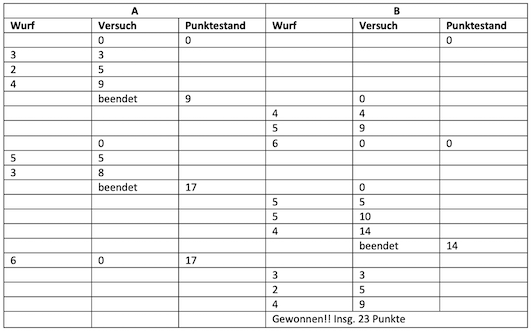

# Aufgaben

##### Aufgabe 1 (Würfelspiel)

??? "Aufgabe 1"

	**Vorbereitung (siehe [Einstieg](einstieg.md#einstieg))**

	1. Informieren Sie sich über die Klasse `JOptionPane` aus dem Paket `javax.swing` (z.B. [hier](https://docs.oracle.com/javase/10/docs/api/javax/swing/JOptionPane.html) oder [hier](https://www.java-tutorial.org/joptionpane.html) oder [hier](https://de.wikibooks.org/wiki/Java_Standard:_Grafische_Oberfl%C3%A4chen_mit_Swing:_Top_Level_Container:_javax_swing_JOptionPane)) <br/>
	*Sollten Sie mit dem Java-Modulsystem arbeiten, d.h. sollten Sie in Ihrem Java-Projekt eine Datei `module-info.java` haben, dann müssen Sie in diese Datei (in den Anweisungsblock) die Anweisung `requires java.desktop;` einfügen - das ist das Modul, in dem sich das Paket `javax.swing` befindet.* 
	3. Erstellen Sie insbesondere folgenden Dialog (in den Buttons kann auch `Yes` und `No` stehen) und prüfen Sie, ob der `Nein`- oder der `Ja`-Button gedrückt wurde (im Beispiel steht `A` für den Namen eines Spielers – siehe Aufgabe unten):
		

	**Aufgabe**

	1. Implementieren Sie folgendes Würfelspiel:
		- An dem Spiel können beliebig viele Spieler teilnehmen.
		- Die Spieler sind nacheinander an der Reihe.
		- Wenn ein Spieler an der Reihe ist, dann befindet er sich in einem *Versuch*.
		- In einem *Versuch* kann der Spieler so lange würfeln, bis er entweder
			- eine 6 würfelt oder er
			- den Versuch freiwillig beendet.  
		- Hat der Spieler eine 6 gewürfelt, wird der gesamte *Versuch* mit `0` Punkten bewertet.
		- Hat der Spieler den Versuch freiwillig beendet, wird die in dem *Versuch* erzielte Summe aus sein Punktekonto addiert (gespeichert).
	2. Der Spieler, der zuerst eine bestimmte Punktzahl (z.B. `20`) erreicht hat, hat gewonnen. <br/>
		Beispiel mit zwei Spielern `A` und `B` bis Gesamtpunktzahl `20`:
		
	3. Laden Sie Ihr Lösung in Moodle hoch! Viel Spaß und viel Erfolg!


##### Aufgabe 2 (MyInteger)

??? "Aufgabe 2"

	**Vorbereitung (Selbstudium)**

	1. Eine *statische* Variable wird mit dem Schlüsselwort `static` deklariert, also z.B. `static int myVariable = 0;`. Der Zugriff auf eine solche statische Variable erfolgt nicht über eine Referenzvariable, sondern über den Klassennamen. Angenommen, die Variable `myVariable` wurde in der Klasse `MyClass` deklariert, dann erfolgt der Zugriff auf die Variable über `MyClass.myVariable`. Für Objektvariablen gilt, dass jedes Objekt seine eigene(n) Objektvariable(n) hat. Statische Variablen gibt es in der Klasse genau einmal. Alle Objekte "teilen" sich eine statische Variable. Eine statische Variable heißt deshalb auch *Klassenvariable*.

	2. Eine *statische* Methode wird ebenfalls mit dem Schlüsselwort `static` deklariert, also z.B. `public static void myMethod() {}`. Der Zugriff auf eine solche statische Methode erfolgt nicht über eine Referenzvariable, sondern über den Klassennamen. Angenommen, die Methode `myMethod()` wurde in der Klasse `MyClass` deklariert, dann erfolgt der Zugriff auf die Methode über `MyClass.myMethod()`. Wir kennen solche Methoden bereits, z.B. sind alle Methoden aus der Klasse `Math` statisch und wir können sie z.B. mit `Math.sqrt(value)` oder `Math.abs(value)` aufrufen.

	3. siehe z.B. [hier](https://javabeginners.de/Grundlagen/Modifikatoren/static.php) oder [hier](https://www.programmierenlernenhq.de/statische-variablen-konstanten-und-methoden-in-java/) oder [hier](http://www.gailer-net.de/tutorials/java/Notes/chap25/ch25_12.html)

	**Aufgabe** 

	Die Klasse `MyInteger` ist eine sogenannte *Wrapper*-Klasse. Die Idee ist, dass `MyInteger` eine objektorientierte Hülle um den `int`-Typ darstellt. Implementieren Sie die Klasse `MyInteger`. Diese Klasse hat folgende Eigenschaften:


	1.	Statische Konstanten vom Typ `int` `MAX_VALUE` und `MIN_VALUE`, welche als Wert die größte bzw. kleinste `int`-Zahl enthalten.
	2.	Eine private Objektvariable `value` vom Typ `int`. (Dieser `value` hat jetzt eine "objektorientierte" Hülle: `MyInteger`).
	3.	Eine statische Methode `parseInt(String s)`, die den übergebenen `String s` als `int`-Zahl zurückgibt, wenn `s` einer Zahl entspricht. Wenn nicht, wirft die Methode eine `IllegalArgumentException`. Beachten Sie:

		1.	`s` kann mit `+` oder `–` beginnen,
		2.	`s` kann führende Nullen aufweisen,
		3.	die Länge von `s` kann mit `s.length()` ermittelt und jedes einzelne Zeichen aus `s` kann mit `s.charAt(index)` betrachtet werden. 
		4.	Ist `s` leer, wird eine `IllegalArgumentException` geworfen und wenn `s` keiner Zahl entspricht auch.
		5.	Die Exception wird nur weitergereicht, nicht hier behandelt.

	4.	Zwei Konstruktoren `MyInteger(int value)` und `MyInteger(String s)`, die jeweils die Objektvariable `value` initialisieren. Der zweite Konstruktor verwendet `parseInt(String)` und kann ebenfalls eine `IllegalArgumentException` werfen (reicht die Exception von `parseInt(String)` weiter). 
	5.	Eine Objektmethode `intValue()`, die den Wert von `value` zurückgibt.
	6.	Eine Objektmethode `doubleValue()`, die den Wert von `value` als `double` zurückgibt.
	7.	Eine statische Methode `valueOf(String s)`, die ein Objekt von `MyInteger` erzeugt und zurückgibt (und evtl. eine `IllegalArgumentException` wirft).
	8.	Eine statische Methode `valueOf(int value)`, die ein Objekt von `MyInteger` erzeugt und zurückgibt.
	9.	Überschreiben Sie außerdem die Methoden `equals()` und `toString()` (*Zusatz:*  auch `hashCode()` überschreiben).
	10. Testen Sie Ihre Klasse ausführlich in einer `Testklasse` mit `main()`-Methode.
	11. Laden Sie Ihr Lösung in Moodle hoch! Viel Spaß und viel Erfolg!


##### Aufgabe 3 (Solitaire)

??? "Aufgabe 3"

 	**Information und Vorbereitung**

 	Wir wenden [Aufzählungstypen](enum.md#aufzahlungstypen-enum) und mehrdimensionale Arrays an. 

 	Wir beginnen, ein [Englisches Solitär](https://de.wikipedia.org/wiki/Solit%C3%A4r_(Brettspiel)) zu programmieren. Einige kennen es auch als Steckhalma. Ziel des Spiels ist, alle Steine bis auf einen (der am besten in der Mitte übrig bleibt), zu entfernen. Ein Zug ist wie folgt: ein Stein springt über einen anderen Stein und der übersprungene Stein wird entfernt. Es gibt viele [Lösungen](https://github.com/Clg9100/Peg-Puzzle) dafür. 

 	Teil der Aufgabe ist es auch, "fremden" Code zu lesen und zu verstehen, denn einige Klassen sind bereits gegeben:

 	??? "Klasse Point.java"
 		```java
 		package aufgaben.aufgabe3;

		/*
		 * ein Point repreasentiert eine Position
		 * im Spielfeld, bestehend aus der Nummer 
		 * fuer die Zeile (row) und der Nummer
		 * fuer die Spalte (col)
		 */
		public class Point {
			private int row;
			private int col;
			
			/*
			 * Konstruktor zur Erzeugung einer 
			 * Position bestehend aus row und col
			 */
			public Point(int row, int col)
			{
				this.row = row;
				this.col = col;
			}
			
			public int getRow() {
				return this.row;
			}

			public int getCol() {
				return this.col;
			}
			
			@Override
			public String toString()
			{
				return "("+ this.row + "," + this.col + ")";
			}
		}
 		```

 	??? "Klasse Move.java"
 		```java
		package aufgaben.aufgabe3;

		/*
		 * diese Klasse repraesentiert einen Zug
		 * Variablen sind Point from
		 * und Point to
		 * es wird nicht geprueft, ob der Zug ueberhaupt
		 * moeglich ist
		 */
		public class Move {
			private Point from;
			private Point to;
			
			/*
			 * ein Zug von dem from-Point (fromRow,fromCol)
			 * zum to-Point (toRow,toCol)
			 */
			public Move(int fromRow, int fromCol, int toRow, int toCol)
			{
				this.from = new Point(fromRow, fromCol);
				this.to = new Point(toRow, toCol);
			}
			
			/*
			 * in dem Konstruktor werden in this.from und this.to nicht einfach
			 * die Referenzen von from und to gespeichert, sondern davon Kopien
			 * erstellt, damit das Programm robuster gegen das Aendern von
			 * Referenzen ist
			 */
			public Move(Point from, Point to)
			{
				this.from = new Point(from.getRow(), from.getCol());
				this.to = new Point(to.getRow(), to.getCol());
			}
			
			/*
			 * der Getter fuer den Point from gibt keine Referenz auf
			 * den Point from zurueck, sondern eine Kopie (einen Klon)
			 * von from --> Referenzen koennen "verbogen" werden, aber
			 * die Kopien bleiben unveraendert
			 */
			public Point getFrom()
			{
				return new Point(this.from.getRow(), this.from.getCol());
			}
			
			/*
			 * der Getter fuer den Point to gibt keine Referenz auf
			 * den Point to zurueck, sondern eine Kopie (einen Klon)
			 * von to --> Referenzen koennen "verbogen" werden, aber
			 * die Kopien bleiben unveraendert
			 */
			public Point getTo()
			{
				return new Point(this.to.getRow(), this.to.getCol());
			}

		}
		```
 
 	??? "Klasse Moves.java"
 		```java
		package aufgaben.aufgabe3;

		/*
		 * diese Klasse repraesentiert eine Folge 
		 * von Zuegen (Move), die in einem Array
		 * moves gespeichert sind
		 */
		public class Moves {
			private Move[] moves;
			
			/*
			 * der Konstruktor erstellt ein leeres moves-Array
			 * (d.h. noch keine Zuege (Moves) gespeichert)
			 */
			public Moves()
			{
				this.moves = new Move[0];
			}
			
			/*
			 * der Konstruktor erstellt ein moves-Array mit einem
			 * Move - dem erste Zug (firstMove) 
			 */
			public Moves(Move firstMove)
			{
				this.moves = new Move[1];
				this.moves[0] = firstMove;
			}
			
			/*
			 * Anzahl der bisher gespeicherten Zuege
			 */
			public int getLength()
			{
				return this.moves.length;
			}
			
			/*
			 * fuegt einen Zug (nextMove) zum moves-Array hinzu
			 * dazu muss das moves-Array um 1 laenger sein als zuvor
			 * es wird eine Kopie aller Zuege erstellt und dann
			 * der nextMove hinzugefuegt
			 */
			public void addMove(Move nextMove)
			{
				Move[] newMoves = new Move[this.moves.length + 1];
				for (int index = 0; index < this.moves.length; index++) {
					newMoves[index] = this.moves[index];
				}
				newMoves[newMoves.length - 1] = new Move(nextMove.getFrom(), nextMove.getTo());
				this.moves = newMoves;
			}
			
			/*
			 * gibt den Move zurueck, der im moves-Array unter dem Index index
			 * gespeichert ist;
			 * kann sein, dass index kein korrekter Index im moves-Array ist, 
			 * dann wird eine IllegalArgumentException geworfen
			 */
			public Move getMoveAtIndex(int index) throws IllegalArgumentException
			{
				try {
					return this.moves[index];
				}
				catch(ArrayIndexOutOfBoundsException e)
				{
					throw new IllegalArgumentException("kein gueltiger Index!");
				}
			}
			
			/*
			 * Ausgabe aller im moves-Array gespeicherten Zuege
			 * wird nur zum Debuggen benoetigt
			 */
			public void printMoves()
			{
				System.out.printf("%n---%n");
				for (int index = 0; index < this.moves.length; index++) {
					Move move = this.moves[index];
					Point from = move.getFrom();
					Point to = move.getTo();
					System.out.println(from.toString() + " --> " + to.toString());
				}
				System.out.printf("%n---%n%n");
			}
		}
		```
 
 	??? "enum State.java"
 		```java
		package aufgaben.aufgabe3;

		/*
		 * FREE - der Platz ist ein Spielfeld, aber kein Spielstein drauf
		 * USED - der Platz ist ein Spielfeld mit Spielstein drauf
		 * NOT  - der Platz gehoert nicht zum Spielfeld
		 */
		public enum State {
			FREE, USED, NOT
		}		
		```

 	**Aufgabe**

 	Befüllen Sie die Klasse `Solitaire.java`, wie in den Kommentaren beschrieben:
 
 	??? "Klasse Solitaire.java"
 		```java
		package aufgaben.aufgabe3.loesung;

		public class Solitaire {
			private Moves game;
			private State[][] field;
			
			public Solitaire()
			{
				this.game = new Moves();
				this.field = new State[7][7];
				for(int row = 0; row < this.field.length; row++)
				{
					for(int col = 0; col < this.field[row].length; col++)
					{
						if((row < 2 || row > 4) && (col < 2 || col > 4))
						{
							this.field[row][col] = State.NOT;
						}
						else
						{
							this.field[row][col] = State.USED;
						}
					}
				}
				this.field[3][3] = State.FREE;
			}
			
			/*
			 * Geben Sie das Spielfeld aus! Am Anfang sollte auf der
			 * Konsole so ein Bild erscheinen:
			 *     o o o     
			 *     o o o     
			 * o o o o o o o 
			 * o o o   o o o 
			 * o o o o o o o 
			 *     o o o     
			 *     o o o 
			 * 
			 */
			public void print()
			{

			}
			
			/*
			 * diese Methode gibt ein true zurueck, wenn von der
			 * uebergebenen Position (row,col) ein Zug moeglich ist
			 * d.h. 
			 * 1. auf der angegebenen Position muss ein Stein sein
			 * 2. zwei Steine weiter (oben, unten, rechts oder links)
			 * 		darf kein Stein sein
			 * 3. dazwischen muss ein Stein sein
			 */
			public boolean possibleFrom(int row, int col)
			{

				return false;
			}
			
			/*
			 * diese Methode gibt alle Positionen (Point) zurueck,
			 * AUF die von (fromRow,fromCol) aus gesprungen werden
			 * kann
			 */
			public Point[] possibleTo(int fromRow, int fromCol)
			{
				if(!possibleFrom(fromRow, fromCol)) return new Point[0];
				
				/* 
				 * naechste Zeile muss entfernt werden!
				 * sttatdessen muessen Sie alle Point-Objekte ermitteln AUF die
				 * gesprungen werden kann. Diese Point-Objekte werden in einem 
				 * Point-Array gespeichert, welches zurückgegeben wird.
				 */
				return null;
			}
			
			/* 
			 * diese Methode erzeugt ein Moves-Objekt
			 * in dieses Moves-Objekt werden mithilfe der
			 * Objektmethode addMove() (aus Moves) alle
			 * moeglichen Zuege hinzugefuegt
			 * (moeglich im aktuellen Zustand von field[][])
			 */
			public Moves possibleMoves()
			{
				Moves possibleMoves = new Moves();

				// next line for debugging
				possibleMoves.printMoves();
				return possibleMoves;
			}
				
			/*
			 * gibt ein true zurueck, wenn im aktuellen Zustand 
			 * von field[][] ueberhaupt noch ein Zug moeglich ist
			 * sonst false
			 */
			public boolean movePossible()
			{

				return false;
			}
			
			/*
			 * ruft die Methode move(Move move) auf,
			 * wenn ein Zug moeglich ist (dann true zurueck)
			 * sonst false
			 */
			public boolean moveFirstPossible()
			{
				if(!movePossible()) return false;
				/*
				 *  hier einen moeglichen Zug ausfuehren
				 *  den ersten, den Sie finden (siehe
				 *  possibleMoves() )
				 */
				return true;
			}
			
			/*
			 * hier wird der Zug Move move ausgefuehrt
			 * nach dem Zug ist 
			 * 1. die from-Position leer
			 * 2. die to-Position mit einem Stein besetzt
			 * 3. dazwischen leer (Stein wird "entfernt")
			 * falls Zug nicht moeglich, wird eine 
			 * IllegalArgumentException geworfen 
			 */
			public void move(Move move) throws IllegalArgumentException
			{

			}

		}
		```

		Sie können selbstverständlich beliebig viele weitere (Hilfs-)Methoden hinzufügen. 

		Testen Sie Ihr Spiel in einer `Testklasse`. Führen Sie einige Züge aus und geben danach immer das Spielfeld auf die Konsole aus. Die Konsole könnte z.B. dann so aussehen:
 
 	??? "mögliche Konsolenausgaben"
		```bash
		    o o o     
		    o o o     
		o o o o o o o 
		o o o   o o o 
		o o o o o o o 
		    o o o     
		    o o o     


		---
		(1,3) --> (3,3)
		(3,1) --> (3,3)
		(3,5) --> (3,3)
		(5,3) --> (3,3)

		---

		    o o o     
		    o   o     
		o o o   o o o 
		o o o o o o o 
		o o o o o o o 
		    o o o     
		    o o o     


		---
		(2,1) --> (2,3)
		(2,5) --> (2,3)
		(4,3) --> (2,3)

		---

		    o o o     
		    o   o     
		o     o o o o 
		o o o o o o o 
		o o o o o o o 
		    o o o     
		    o o o     


		---
		(0,2) --> (2,2)
		(2,4) --> (2,2)
		(3,3) --> (1,3)
		(4,1) --> (2,1)
		(4,2) --> (2,2)

		---

		      o o     
		        o     
		o   o o o o o 
		o o o o o o o 
		o o o o o o o 
		    o o o     
		    o o o     


		---
		(0,4) --> (0,2)
		(2,3) --> (2,1)
		(3,2) --> (1,2)
		(3,3) --> (1,3)
		(4,1) --> (2,1)

		---

		    o         
		        o     
		o   o o o o o 
		o o o o o o o 
		o o o o o o o 
		    o o o     
		    o o o     


		---
		(2,3) --> (2,1)
		(2,4) --> (0,4)
		(3,2) --> (1,2)
		(3,3) --> (1,3)
		(4,1) --> (2,1)

		---

		    o         
		        o     
		o o     o o o 
		o o o o o o o 
		o o o o o o o 
		    o o o     
		    o o o     


		---
		(2,0) --> (2,2)
		(2,4) --> (0,4)
		(2,5) --> (2,3)
		(4,2) --> (2,2)
		(4,3) --> (2,3)

		---

		    o         
		        o     
		    o   o o o 
		o o o o o o o 
		o o o o o o o 
		    o o o     
		    o o o     


		---
		(2,4) --> (0,4)
		(2,5) --> (2,3)
		(3,2) --> (1,2)
		(4,0) --> (2,0)
		(4,1) --> (2,1)
		(4,3) --> (2,3)

		---

		    o   o     
		              
		    o     o o 
		o o o o o o o 
		o o o o o o o 
		    o o o     
		    o o o     


		---
		(2,6) --> (2,4)
		(3,2) --> (1,2)
		(4,0) --> (2,0)
		(4,1) --> (2,1)
		(4,3) --> (2,3)
		(4,4) --> (2,4)

		---

		    o   o     
		              
		    o   o     
		o o o o o o o 
		o o o o o o o 
		    o o o     
		    o o o     


		---
		(3,2) --> (1,2)
		(3,4) --> (1,4)
		(4,0) --> (2,0)
		(4,1) --> (2,1)
		(4,3) --> (2,3)
		(4,5) --> (2,5)
		(4,6) --> (2,6)

		---

		    o   o     
		    o         
		        o     
		o o   o o o o 
		o o o o o o o 
		    o o o     
		    o o o     


		---
		(0,2) --> (2,2)
		(3,0) --> (3,2)
		(3,4) --> (1,4)
		(3,4) --> (3,2)
		(4,0) --> (2,0)
		(4,1) --> (2,1)
		(4,3) --> (2,3)
		(4,5) --> (2,5)
		(4,6) --> (2,6)
		(5,2) --> (3,2)

		---

		        o     
		              
		    o   o     
		o o   o o o o 
		o o o o o o o 
		    o o o     
		    o o o     


		---
		(3,0) --> (3,2)
		(3,4) --> (1,4)
		(3,4) --> (3,2)
		(4,0) --> (2,0)
		(4,1) --> (2,1)
		(4,3) --> (2,3)
		(4,5) --> (2,5)
		(4,6) --> (2,6)
		(5,2) --> (3,2)

		---

		        o     
		              
		    o   o     
		    o o o o o 
		o o o o o o o 
		    o o o     
		    o o o     


		---
		(3,2) --> (1,2)
		(3,3) --> (3,1)
		(3,4) --> (1,4)
		(4,3) --> (2,3)
		(4,5) --> (2,5)
		(4,6) --> (2,6)

		---

		        o     
		    o         
		        o     
		      o o o o 
		o o o o o o o 
		    o o o     
		    o o o     


		---
		(3,4) --> (1,4)
		(3,4) --> (3,2)
		(4,3) --> (2,3)
		(4,5) --> (2,5)
		(4,6) --> (2,6)
		(5,2) --> (3,2)

		---

		        o     
		    o   o     
		              
		      o   o o 
		o o o o o o o 
		    o o o     
		    o o o     


		---
		(0,4) --> (2,4)
		(3,6) --> (3,4)
		(4,3) --> (2,3)
		(4,5) --> (2,5)
		(4,6) --> (2,6)
		(5,2) --> (3,2)
		(5,4) --> (3,4)

		---

		              
		    o         
		        o     
		      o   o o 
		o o o o o o o 
		    o o o     
		    o o o     


		---
		(3,6) --> (3,4)
		(4,3) --> (2,3)
		(4,5) --> (2,5)
		(4,6) --> (2,6)
		(5,2) --> (3,2)
		(5,4) --> (3,4)

		---

		              
		    o         
		        o     
		      o o     
		o o o o o o o 
		    o o o     
		    o o o     


		---
		(3,3) --> (3,5)
		(3,4) --> (1,4)
		(3,4) --> (3,2)
		(4,3) --> (2,3)
		(5,2) --> (3,2)

		---

		              
		    o         
		        o     
		          o   
		o o o o o o o 
		    o o o     
		    o o o     


		---
		(4,5) --> (2,5)
		(5,2) --> (3,2)
		(5,3) --> (3,3)
		(5,4) --> (3,4)

		---

		              
		    o         
		        o o   
		              
		o o o o o   o 
		    o o o     
		    o o o     


		---
		(2,4) --> (2,6)
		(2,5) --> (2,3)
		(4,3) --> (4,5)
		(5,2) --> (3,2)
		(5,3) --> (3,3)
		(5,4) --> (3,4)

		---

		              
		    o         
		            o 
		              
		o o o o o   o 
		    o o o     
		    o o o     


		---
		(4,3) --> (4,5)
		(5,2) --> (3,2)
		(5,3) --> (3,3)
		(5,4) --> (3,4)

		---

		              
		    o         
		            o 
		              
		o o o     o o 
		    o o o     
		    o o o     


		---
		(4,1) --> (4,3)
		(4,6) --> (4,4)
		(5,2) --> (3,2)
		(6,3) --> (4,3)
		(6,4) --> (4,4)

		---

		              
		    o         
		            o 
		              
		o     o   o o 
		    o o o     
		    o o o     


		---
		(4,6) --> (4,4)
		(5,3) --> (3,3)
		(6,2) --> (4,2)
		(6,4) --> (4,4)

		---

		              
		    o         
		            o 
		              
		o     o o     
		    o o o     
		    o o o     


		---
		(4,3) --> (4,5)
		(4,4) --> (4,2)
		(5,3) --> (3,3)
		(5,4) --> (3,4)
		(6,2) --> (4,2)

		---

		              
		    o         
		            o 
		              
		o         o   
		    o o o     
		    o o o     


		---
		(6,2) --> (4,2)
		(6,3) --> (4,3)
		(6,4) --> (4,4)

		---

		              
		    o         
		            o 
		              
		o   o     o   
		      o o     
		      o o     


		---
		(5,4) --> (5,2)
		(6,3) --> (4,3)
		(6,4) --> (4,4)
		(6,4) --> (6,2)

		---

		              
		    o         
		            o 
		              
		o   o     o   
		    o         
		      o o     


		---
		(4,2) --> (6,2)
		(5,2) --> (3,2)
		(6,4) --> (6,2)

		---

		              
		    o         
		            o 
		              
		o         o   
		              
		    o o o     

		              
		    o         
		            o 
		              
		o         o   
		              
		    o o o     

		```

	 	Dabei steht z.B. 
	 	```bash

			---
			(1,3) --> (3,3)
			(3,1) --> (3,3)
			(3,5) --> (3,3)
			(5,3) --> (3,3)

			---
		```
		für die in dem Zustand darüber möglichen Züge.	

##### Aufgabe 4 (Operationen über Mengen)

??? "Aufgabe 4"
	Implementieren Sie eine Klasse `SetOperations`. 

	1. Erstellen Sie drei Objektvariablen (z.B. `numbers1`, `numbers2` und `both`) vom Typ `Set<Integer>`. Erzeugen Sie für diese Objektvariablen `TreeSet`-Objekte.
	2. Erstellen Sie eine Objektmethode `fill()`. In dieser Methode sollen die beiden Sets `numbers1` und `numbers2` mit Zufallszahlen aus dem Wertebereich `0..99` befüllt werden. Erzeugen Sie jeweils `100` Zufallszahlen (die `number`s-Sets werden dann aber jeweils weniger als 100 Einträge haben, da doppelte Elemente nicht aufgenommen werden.) <br>
	Beachten Sie, dass die `nextInt()`-Methode ein `int` zurückliefert. Dieses int muss zunächst in ein `Integer`-Objekt umgewandelt werden (`Integer.valueOf(int)`) und dieses `Integer`-Objekt wird dann dem Set hinzugefügt (wenn es nicht schon enthalten ist).
	3. Erstellen Sie eine Objektmethode `fillBothUnion()`. In dieser Methode wird die `both`-Menge derart befüllt, dass `both` einer **Vereinigung** der Mengen `numbers1` und `numbers2` entspricht. Für Methoden auf Mengen siehe z.B. [https://docs.oracle.com/en/java/javase/11/docs/api/java.base/java/util/Set.html](https://docs.oracle.com/en/java/javase/11/docs/api/java.base/java/util/Set.html).
	4. Erstellen Sie eine Objektmethode `fillBothIntersection()`. In dieser Methode wird die `both`-Menge derart befüllt, dass `both` einem **Schnitt** der Mengen `numbers1` und `numbers2` entspricht. 
	5.	Erstellen Sie eine Objektmethode `fillBothDifference()`. In dieser Methode wird die `both`-Menge derart befüllt, dass `both` der **Differenz** der Menge `numbers1` minus der Menge `numbers2` entspricht. 
	6. Schreiben Sie eine Methode `print()` so, dass jede Menge als ein Quadrat (10x10) aus Punkten auf der Konsole erscheint. Es wird ein Punkt gezeichnet, wenn die entsprechende Zahl (die 100 Punkte bilden die Zahlen 0..99 ab) in der Menge enthalten ist und es wird kein Punkt gezeichnet, wenn die Zahl nicht vorhanden ist. (Anstelle von Punkten können Sie auch jedes beliebige Zeichen (`o, *, #, x, ...`) verwenden). <br>
	Gestalten Sie die Ausgabe so, dass die drei Mengen `numbers1`, `numbers2` und `both` nebeneinander auf der Konsole erscheinen. 
	7. Testen Sie alle drei Methoden `fillBothUnion()`, `fillBothIntersection()` und `fillBothDifference()`. Die Ausgabe könnte wie folgt sein (`A` stellt die Menge `numbers1` dar, `B` die Menge `numbers2` und rechts ist jeweils die `both`-Menge dargestellt): 

		

		

		

	**Tipps**: 

	- Für die schwarzen Punkte habe ich das Character `'\u25cf'` verwendet (ein passendes Leerzeichen dazu ist `'\u2009'`). Das Zeichen für die Vereinigung ist `'\u222a'` und für den Schnitt `'\u2229'`. 
	- Schauen Sie sich auch im Skript [Mengenoperationen](collections.md#mengenoperationen) an. 


##### Aufgabe 5 (Maps)

??? "Aufgabe 5"


	1. Gegeben ist die Datei [pi.txt](files/pi.txt) ([download pi.txt.zip](files/pi.txt.zip)). Sie enthält π mit den ersten `100.000` Nachkommastellen. Entpacken Sie die Datei `pi.txt.zip` und kopieren oder bewegen Sie die Datei `pi.txt` in einen `assets`-Ordner, der sich in Ihrem Workspace neben dem `src` und dem `out`-Ordner befindet (also direkt in dem Ordner Ihres Java-Projektes. Die folgende Abbildung zeigt, wie es z.B. bei mir aussieht (siehe auch [Übung 5](uebungen.md#ubung-5-try-with-resource-und-eigene-exception-klassen)):

		{ width="100" }

	2. Erstellen Sie sich Klasse `StringPI` mit folgendem Inhalt:

		??? "Klasse StringPi mit der Konstanten PI"
			```java
			import java.io.IOException;
			import java.nio.file.Files;
			import java.nio.file.Paths;

			public class StringPI
			{
			    public static final String PI;

			    static {
			        try {
			            String fileContent = new String(Files.readAllBytes(Paths.get("assets/pi.txt")));
			            PI = fileContent.replace("\n", "").replace("\r", "");
			        } catch (IOException e) {
			            throw new RuntimeException(e);
			        }
			    }

			    public static void main(String[] args)
			    {
			        System.out.println(PI.substring(0, 100));
			    }
			}
			```

			Die Ausführung der Klasse sollte folgende Ausgabe ergeben:

			```bash
			3.14159265358979323846264338327950288419716939937510582097494459230781640628620899862803482534211706
			```

	2. Die Zahl π ist eine irrationale Zahl, d.h. sie kann nicht als Bruch dargestellt werden. Außerdem ist sie nicht periodisch, d.h. es gibt keine immer wiederkehrende Folge von Ziffern im Nachkommabereich. Die Zahl π hat unendlich viele Nachkommastellen und da sie nicht periodisch ist, kommen alle möglichen Ziffernfolge in π vor. Beispielsweise kommt die Ziffernfolge `123456` allein in den ersten 200 Millionen Nachkommastellen 208 Mal vor.

	3. Erstellen Sie eine `TreeMap`, in der die Schlüssel vom Typ `String` und die Werte vom Typ `Integer` sind. Als Schlüssel nutzen Sie alle 4-stelligen Zifferkombinationen `"0000"`, `"0001"` bis `"9999"`. Als Werte sollen dazu jeweils die Anzahl der Vorkommen dieser Ziffernkombinationen in dem obigen `String PI` gespeichert werden. 

	4. Erstellen Sie eine `ArrayList`, in der die Ziffernkombinationen gespeichert sind, die am häufigsten in dem obigen `String PI` gespeichert sind. Wieviele und welche Ziffernkombinationen sind das?

		??? "Tipps"

			- Schauen Sie sich dazu die Klasse [String](https://docs.oracle.com/javase/8/docs/api/java/lang/String.html) genauer an!

			- Überlegen Sie sich, wie Sie am besten alle möglichen Kombinationen aus 4-stelligen Zahlen als String erzeugen können (also `"0000", "0001", "0002", ... "9999"`).  

			- Schreiben Sie sich eine Methode `int nrOfOccurences(String sub, String str)`, die die Anzahl des Vorkommens von `sub` in `str` zählt. Sie können diese Methode z.B. testen, indem Sie `sub="0000"` setzen und `str=pi` --> `"0000"` kommt 9 Mal in `pi` vor. Testen Sie auch `sub="2541"` und `str=pi`, denn `"2541"` ist der allerletzte `substring` in unserem `pi` und kommt 8 Mal vor. 

			


##### Aufgabe 6 (Interfaces)

??? "Aufgabe 6"

	1. Das [*Observer*-Entwurfsmuster](https://de.wikipedia.org/wiki/Beobachter_(Entwurfsmuster)) gehört zu den am meisten verwendeten *Designmustern/Designpattern/Pattern* in der Programmierung. Es wird auch *Beobachter*-Muster oder *Publisher*-Pattern genannt. Wir werden dieses Muster in Kürze sehr häufig anwenden, wenn wir *Nutzerereignisse*  in grafischen Oberflächen behandeln. Man kann sich dieses Pattern so vorstellen, dass der *Publisher* eine Zeitung oder auch Slack ist und dass *Listener* diese Zeitung (oder Slack) "abonnieren". Immer, wenn eine Nachricht veröffentlicht wird, dann erfahren alle Abonnenten davon. Wir werden eine (einfache) Implementierung dieses Entwurfsmusters durchführen.

	2. Erstellen Sie ein Interface `Publisher` mit folgenden (abstrakten) Methoden:

		- `public boolean register(Listener listener);`
		- `public boolean unregister(Listener listener);`
		- `public void notifyListeners();` 
		- `public String getUpdate(Listener listener);`

	3. Erstellen Sie ein weiteres Interface `Listener` mit folgenden (abstrakten) Methoden:

		- `public void update();`
		- `public void setPublisher(Publisher publisher);`
		- `public void removePublisher(Publisher publisher);`

	4. Erstellen Sie eine Klasse `Slack`, die das `Publisher`-Interface implementiert. Objektvariablen der Klasse sind

		- `private Set<Listener> listeners;` (speichert alle "Abonnenten"; kann gerne auch eine Liste sein)
		- `private int nrOfMessages;` (speichert die aktuelle Nummer einer veröffentlichten Nachricht - die Nachrichten, die veröffentlicht werden, sollen fortlaufend nummeriert werden) 

		- Im parameterlosen Konstruktor werden die Menge (oder Liste) erzeugt und die `nrOfMessages` auf `0` gesetzt. 

		- In der Methode `register(Listener listener)` wird der `listener` in die Set `listeners` eingefügt. Geben Sie ein `true` zurück, wenn `listener` tatsächlich eingefügt wurde und `false` sonst (falls er schon in der Menge (oder Liste) war.

		- In der Methode `unregister(Listener listener)` wird der `listener` wieder aus der Set `listeners` gelöscht. Geben Sie ein `true` zurück, wenn `listener` tatsächlich gelöscht wurde und `false` sonst (falls er nicht in der Menge (oder Liste) war.

		- In der Methode `notifyListeners()` wird für alle `listener` aus der Menge `listeners` die `update()`-Methode aufgerufen (siehe `Listener` und `Student`). 

		- Die Methode `getUpdate(Listener obj)` liefert einfach folgenden String zurück: `"Breaking News " + this.nrOfMessages`.

		- Erstellen Sie eine Methode `public void publishNews()`, in der die `nrOfMessages` um 1 erhöht und die 
		Methode `notifyListeners()` aufgerufen wird. 

	5. Erstellen Sie eine Klasse `Student`, die das `Listener`-Interface implementiert. Objektvariablen der Klasse sind

		- `private String name;` (speichert den Namen von `Student`)
		- `private Publisher publisher;` (speichert den `Publisher`, an den sich `Student` anmeldet) 

		- Im parametrisierten Konstruktor `public Student(String name)` wird der Name initalisiert. 

		- In der Methode `setPublisher(Publisher publisher)` wird die `register()`-Methode des `publisher` aufgerufen und der Wert der Objektvariable `publisher` gesetzt. Geben Sie bei erfolgreicher Anmeldung an den `publisher` auf die Konsole `this.name + " registered!"` aus. 

		- In der Methode `removePublisher(Publisher publisher)` meldet sich `Student` wieder vom `publisher` ab (Aufruf von `unregister()` und Ausgabe auf die Konsole `this.name + " deregistered!"`.

		- In der Methode `update()` wird die `getUpdate()`-Methode des `publisher` aufgerufen und die zurückgegebene Nachricht `msg` wie folgt auf die Konsole ausgegben: `this.name + " received " + msg`. 

		- Implementieren Sie für `Student` auch die Methoden `equals()` und `hashCode()`. 

	6. Wenn Sie Ihre Implementierung mit folgender Klasse testen:

		```java
		public class Testklasse {

			public static void main(String[] args) 
			{		
				final int NR_OF_STUDENTS = 5;
				Slack slack = new Slack();
				
				Student[] students = new Student[NR_OF_STUDENTS];
				Character c = 'A';
				for(int index=0; index < students.length; index++)
				{
					students[index] = new Student(c.toString());
					c++;
					students[index].setPublisher(slack);
				}
				slack.publishNews();
				
				System.out.println();
				students[1].removePublisher(slack);
				students[3].removePublisher(slack);
				System.out.println();
				slack.publishNews();
				
				System.out.println();
				students[1].setPublisher(slack);
				students[2].removePublisher(slack);
				students[4].removePublisher(slack);	
				System.out.println();
				slack.publishNews();
				
				System.out.println();
				students[0].removePublisher(slack);
				students[1].removePublisher(slack);
				students[3].setPublisher(slack);
				System.out.println();
				slack.publishNews();
			}

		}
		```

		dann sollte die Ausgabe ungefähr so sein: 

		```bash
		A registered!
		B registered!
		C registered!
		D registered!
		E registered!
		D received Breaking News 1
		C received Breaking News 1
		B received Breaking News 1
		A received Breaking News 1
		E received Breaking News 1

		B deregistered!
		D deregistered!

		C received Breaking News 2
		A received Breaking News 2
		E received Breaking News 2

		B registered!
		C deregistered!
		E deregistered!

		B received Breaking News 3
		A received Breaking News 3

		A deregistered!
		B deregistered!
		D registered!

		D received Breaking News 4
		```

