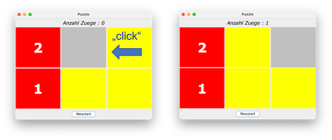
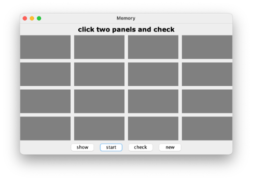
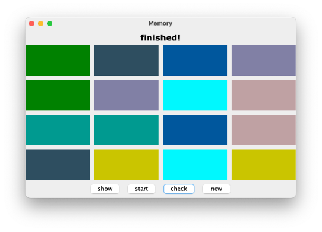
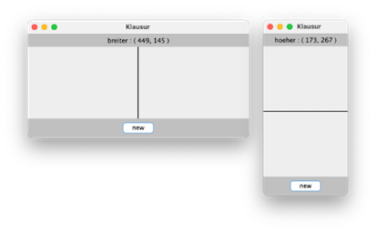
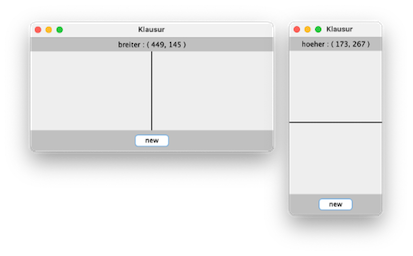
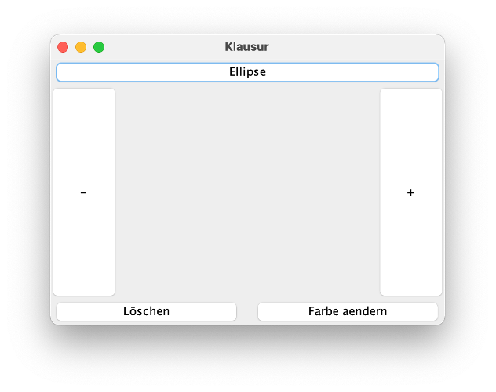
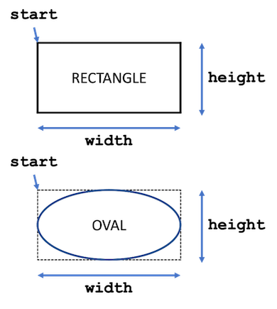
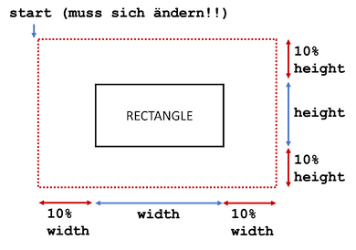
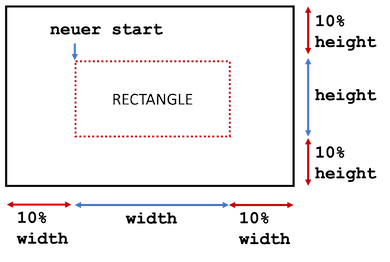

# Aufgaben

##### Aufgabe 1 (Würfelspiel)

??? "Aufgabe 1"

	**Vorbereitung (siehe [Einstieg](einstieg.md#einstieg))**

	1. Informieren Sie sich über die Klasse `JOptionPane` aus dem Paket `javax.swing` (z.B. [hier](https://docs.oracle.com/javase/10/docs/api/javax/swing/JOptionPane.html) oder [hier](https://www.java-tutorial.org/joptionpane.html) oder [hier](https://de.wikibooks.org/wiki/Java_Standard:_Grafische_Oberfl%C3%A4chen_mit_Swing:_Top_Level_Container:_javax_swing_JOptionPane)) <br/>
	*Sollten Sie mit dem Java-Modulsystem arbeiten, d.h. sollten Sie in Ihrem Java-Projekt eine Datei `module-info.java` haben, dann müssen Sie in diese Datei (in den Anweisungsblock) die Anweisung `requires java.desktop;` einfügen - das ist das Modul, in dem sich das Paket `javax.swing` befindet.* 
	3. Erstellen Sie insbesondere folgenden Dialog (in den Buttons kann auch `Yes` und `No` stehen) und prüfen Sie, ob der `Nein`- oder der `Ja`-Button gedrückt wurde (im Beispiel steht `A` für den Namen eines Spielers – siehe Aufgabe unten):
		

	**Aufgabe**

	1. Implementieren Sie folgendes Würfelspiel:
		- An dem Spiel können beliebig viele Spieler teilnehmen.
		- Die Spieler sind nacheinander an der Reihe.
		- Wenn ein Spieler an der Reihe ist, dann befindet er sich in einem *Versuch*.
		- In einem *Versuch* kann der Spieler so lange würfeln, bis er entweder
			- eine 6 würfelt oder er
			- den Versuch freiwillig beendet.  
		- Hat der Spieler eine 6 gewürfelt, wird der gesamte *Versuch* mit `0` Punkten bewertet.
		- Hat der Spieler den Versuch freiwillig beendet, wird die in dem *Versuch* erzielte Summe aus sein Punktekonto addiert (gespeichert).
	2. Der Spieler, der zuerst eine bestimmte Punktzahl (z.B. `20`) erreicht hat, hat gewonnen. <br/>
		Beispiel mit zwei Spielern `A` und `B` bis Gesamtpunktzahl `20`:
		
	3. Laden Sie Ihr Lösung in Moodle hoch! Viel Spaß und viel Erfolg!


##### Aufgabe 2 (MyInteger)

??? "Aufgabe 2"

	**Vorbereitung (Selbstudium)**

	1. Eine *statische* Variable wird mit dem Schlüsselwort `static` deklariert, also z.B. `static int myVariable = 0;`. Der Zugriff auf eine solche statische Variable erfolgt nicht über eine Referenzvariable, sondern über den Klassennamen. Angenommen, die Variable `myVariable` wurde in der Klasse `MyClass` deklariert, dann erfolgt der Zugriff auf die Variable über `MyClass.myVariable`. Für Objektvariablen gilt, dass jedes Objekt seine eigene(n) Objektvariable(n) hat. Statische Variablen gibt es in der Klasse genau einmal. Alle Objekte "teilen" sich eine statische Variable. Eine statische Variable heißt deshalb auch *Klassenvariable*.
	2. Eine *statische* Methode wird ebenfalls mit dem Schlüsselwort `static` deklariert, also z.B. `public static void myMethod() {}`. Der Zugriff auf eine solche statische Methode erfolgt nicht über eine Referenzvariable, sondern über den Klassennamen. Angenommen, die Methode `myMethod()` wurde in der Klasse `MyClass` deklariert, dann erfolgt der Zugriff auf die Methode über `MyClass.myMethod()`. Wir kennen solche Methoden bereits, z.B. sind alle Methoden aus der Klasse `Math` statisch und wir können sie z.B. mit `Math.sqrt(value)` oder `Math.abs(value)` aufrufen. 
	3. siehe z.B. [hier](https://javabeginners.de/Grundlagen/Modifikatoren/static.php) oder [hier](https://www.programmierenlernenhq.de/statische-variablen-konstanten-und-methoden-in-java/) oder [hier](http://www.gailer-net.de/tutorials/java/Notes/chap25/ch25_12.html)

	**Info**: Die Klasse `MyInteger` ist eine sogenannte *Wrapper*-Klasse. Die Idee ist, dass `MyInteger` eine objektorientierte Hülle um den `int`-Typ darstellt. Implementieren Sie die Klasse `MyInteger`. Diese Klasse hat folgende Eigenschaften:

	1.	Statische Konstanten vom Typ `int` `MAX_VALUE` und `MIN_VALUE`, welche als Wert die größte bzw. kleinste `int`-Zahl enthalten.
	2.	Eine private Objektvariable `value` vom Typ `int`. (Dieser `value` hat jetzt eine "objektorientierte" Hülle: `MyInteger`).
	3.	Eine statische Methode `parseInt(String s)`, die den übergebenen `String s` als `int`-Zahl zurückgibt, wenn `s` einer Zahl entspricht. Wenn nicht, wirft die Methode eine `IllegalArgumentException`. Beachten Sie:
		a.	`s` kann mit `+` oder `–` beginnen,
		b.	`s` kann führende Nullen aufweisen,
		c.	die Länge von `s` kann mit `s.length()` ermittelt und jedes einzelne Zeichen aus `s` kann mit `s.charAt(index)` betrachtet werden. 
		d.	Ist `s` leer, wird eine `IllegalArgumentException` geworfen und wenn `s` keiner Zahl entspricht auch.
		e.	Die Exception wird nur weitergereicht, nicht hier behandelt.
	4.	Zwei Konstruktoren `MyInteger(int value)` und `MyInteger(String s)`, die jeweils die Objektvariable `value` initialisieren. Der zweite Konstruktor verwendet `parseInt(String)` und kann ebenfalls eine `IllegalArgumentException` werfen (reicht die Exception von `parseInt(String)` weiter). 
	5.	Eine Objektmethode `intValue()`, die den Wert von `value` zurückgibt.
	6.	Eine Objektmethode `doubleValue()`, die den Wert von `value` als `double` zurückgibt.
	7.	Eine statische Methode `valueOf(String s)`, die ein Objekt von `MyInteger` erzeugt und zurückgibt (und evtl. eine `IllegalArgumentException` wirft).
	8.	Eine statische Methode `valueOf(int value)`, die ein Objekt von `MyInteger` erzeugt und zurückgibt.
	9.	Überschreiben Sie außerdem die Methoden `equals()` und `toString()` (*Zusatz:*  auch `hashCode()` überschreiben).
	10. Testen Sie Ihre Klasse ausführlich in einer `Testklasse` mit `main()`-Methode.
	11. Laden Sie Ihr Lösung in Moodle hoch! Viel Spaß und viel Erfolg!


##### Aufgabe 3 (Solitaire)

??? "Aufgabe 3"

 	**Information und Vorbereitung**

 	Wir wenden [Aufzählungstypen](enum.md#aufzahlungstypen-enum) und mehrdimensionale Arrays an. 

 	Wir beginnen, ein [Englisches Solitär](https://de.wikipedia.org/wiki/Solit%C3%A4r_(Brettspiel)) zu programmieren. Einige kennen es auch als Steckhalma. Ziel des Spiels ist, alle Steine bis auf einen (der am besten in der Mitte übrig bleibt), zu entfernen. Ein Zug ist wie folgt: ein Stein springt über einen anderen Stein und der übersprungene Stein wird entfernt. Es gibt viele [Lösungen](https://github.com/Clg9100/Peg-Puzzle) dafür. 

 	Teil der Aufgabe ist es auch, "fremden" Code zu lesen und zu verstehen, denn einige Klassen sind bereits gegeben:

 	??? "Klasse Point.java"
 		```java
 		package aufgaben.aufgabe3;

		/*
		 * ein Point repreasentiert eine Position
		 * im Spielfeld, bestehend aus der Nummer 
		 * fuer die Zeile (row) und der Nummer
		 * fuer die Spalte (col)
		 */
		public class Point {
			private int row;
			private int col;
			
			/*
			 * Konstruktor zur Erzeugung einer 
			 * Position bestehend aus row und col
			 */
			public Point(int row, int col)
			{
				this.row = row;
				this.col = col;
			}
			
			public int getRow() {
				return this.row;
			}

			public int getCol() {
				return this.col;
			}
			
			@Override
			public String toString()
			{
				return "("+ this.row + "," + this.col + ")";
			}
		}
 		```

 	??? "Klasse Move.java"
 		```java
		package aufgaben.aufgabe3;

		/*
		 * diese Klasse repraesentiert einen Zug
		 * Variablen sind Point from
		 * und Point to
		 * es wird nicht geprueft, ob der Zug ueberhaupt
		 * moeglich ist
		 */
		public class Move {
			private Point from;
			private Point to;
			
			/*
			 * ein Zug von dem from-Point (fromRow,fromCol)
			 * zum to-Point (toRow,toCol)
			 */
			public Move(int fromRow, int fromCol, int toRow, int toCol)
			{
				this.from = new Point(fromRow, fromCol);
				this.to = new Point(toRow, toCol);
			}
			
			/*
			 * in dem Konstruktor werden in this.from und this.to nicht einfach
			 * die Referenzen von from und to gespeichert, sondern davon Kopien
			 * erstellt, damit das Programm robuster gegen das Aendern von
			 * Referenzen ist
			 */
			public Move(Point from, Point to)
			{
				this.from = new Point(from.getRow(), from.getCol());
				this.to = new Point(to.getRow(), to.getCol());
			}
			
			/*
			 * der Getter fuer den Point from gibt keine Referenz auf
			 * den Point from zurueck, sondern eine Kopie (einen Klon)
			 * von from --> Referenzen koennen "verbogen" werden, aber
			 * die Kopien bleiben unveraendert
			 */
			public Point getFrom()
			{
				return new Point(this.from.getRow(), this.from.getCol());
			}
			
			/*
			 * der Getter fuer den Point to gibt keine Referenz auf
			 * den Point to zurueck, sondern eine Kopie (einen Klon)
			 * von to --> Referenzen koennen "verbogen" werden, aber
			 * die Kopien bleiben unveraendert
			 */
			public Point getTo()
			{
				return new Point(this.to.getRow(), this.to.getCol());
			}

		}
		```
 
 	??? "Klasse Moves.java"
 		```java
		package aufgaben.aufgabe3;

		/*
		 * diese Klasse repraesentiert eine Folge 
		 * von Zuegen (Move), die in einem Array
		 * moves gespeichert sind
		 */
		public class Moves {
			private Move[] moves;
			
			/*
			 * der Konstruktor erstellt ein leeres moves-Array
			 * (d.h. noch keine Zuege (Moves) gespeichert)
			 */
			public Moves()
			{
				this.moves = new Move[0];
			}
			
			/*
			 * der Konstruktor erstellt ein moves-Array mit einem
			 * Move - dem erste Zug (firstMove) 
			 */
			public Moves(Move firstMove)
			{
				this.moves = new Move[1];
				this.moves[0] = firstMove;
			}
			
			/*
			 * Anzahl der bisher gespeicherten Zuege
			 */
			public int getLength()
			{
				return this.moves.length;
			}
			
			/*
			 * fuegt einen Zug (nextMove) zum moves-Array hinzu
			 * dazu muss das moves-Array um 1 laenger sein als zuvor
			 * es wird eine Kopie aller Zuege erstellt und dann
			 * der nextMove hinzugefuegt
			 */
			public void addMove(Move nextMove)
			{
				Move[] newMoves = new Move[this.moves.length + 1];
				for (int index = 0; index < this.moves.length; index++) {
					newMoves[index] = this.moves[index];
				}
				newMoves[newMoves.length - 1] = new Move(nextMove.getFrom(), nextMove.getTo());
				this.moves = newMoves;
			}
			
			/*
			 * gibt den Move zurueck, der im moves-Array unter dem Index index
			 * gespeichert ist;
			 * kann sein, dass index kein korrekter Index im moves-Array ist, 
			 * dann wird eine IllegalArgumentException geworfen
			 */
			public Move getMoveAtIndex(int index) throws IllegalArgumentException
			{
				try {
					return this.moves[index];
				}
				catch(ArrayIndexOutOfBoundsException e)
				{
					throw new IllegalArgumentException("kein gueltiger Index!");
				}
			}
			
			/*
			 * Ausgabe aller im moves-Array gespeicherten Zuege
			 * wird nur zum Debuggen benoetigt
			 */
			public void printMoves()
			{
				System.out.printf("%n---%n");
				for (int index = 0; index < this.moves.length; index++) {
					Move move = this.moves[index];
					Point from = move.getFrom();
					Point to = move.getTo();
					System.out.println(from.toString() + " --> " + to.toString());
				}
				System.out.printf("%n---%n%n");
			}
		}
		```
 
 	??? "enum State.java"
 		```java
		package aufgaben.aufgabe3;

		/*
		 * FREE - der Platz ist ein Spielfeld, aber kein Spielstein drauf
		 * USED - der Platz ist ein Spielfeld mit Spielstein drauf
		 * NOT  - der Platz gehoert nicht zum Spielfeld
		 */
		public enum State {
			FREE, USED, NOT
		}		
		```

 	**Aufgabe**

 	Befüllen Sie die Klasse `Solitaire.java`, wie in den Kommentaren beschrieben:
 
 	??? "Klasse Solitaire.java"
 		```java
		package aufgaben.aufgabe3.loesung;

		public class Solitaire {
			private Moves game;
			private State[][] field;
			
			public Solitaire()
			{
				this.game = new Moves();
				this.field = new State[7][7];
				for(int row = 0; row < this.field.length; row++)
				{
					for(int col = 0; col < this.field[row].length; col++)
					{
						if((row < 2 || row > 4) && (col < 2 || col > 4))
						{
							this.field[row][col] = State.NOT;
						}
						else
						{
							this.field[row][col] = State.USED;
						}
					}
				}
				this.field[3][3] = State.FREE;
			}
			
			/*
			 * Geben Sie das Spielfeld aus! Am Anfang sollte auf der
			 * Konsole so ein Bild erscheinen:
			 *     o o o     
			 *     o o o     
			 * o o o o o o o 
			 * o o o   o o o 
			 * o o o o o o o 
			 *     o o o     
			 *     o o o 
			 * 
			 */
			public void print()
			{

			}
			
			/*
			 * diese Methode gibt ein true zurueck, wenn von der
			 * uebergebenen Position (row,col) ein Zug moeglich ist
			 * d.h. 
			 * 1. auf der angegebenen Position muss ein Stein sein
			 * 2. zwei Steine weiter (oben, unten, rechts oder links)
			 * 		darf kein Stein sein
			 * 3. dazwischen muss ein Stein sein
			 */
			public boolean possibleFrom(int row, int col)
			{

				return false;
			}
			
			/*
			 * diese Methode gibt alle Positionen (Point) zurueck,
			 * AUF die von (fromRow,fromCol) aus gesprungen werden
			 * kann
			 */
			public Point[] possibleTo(int fromRow, int fromCol)
			{
				if(!possibleFrom(fromRow, fromCol)) return new Point[0];
				
				/* 
				 * naechste Zeile muss entfernt werden!
				 * sttatdessen muessen Sie alle Point-Objekte ermitteln AUF die
				 * gesprungen werden kann. Diese Point-Objekte werden in einem 
				 * Point-Array gespeichert, welches zurückgegeben wird.
				 */
				return null;
			}
			
			/* 
			 * diese Methode erzeugt ein Moves-Objekt
			 * in dieses Moves-Objekt werden mithilfe der
			 * Objektmethode addMove() (aus Moves) alle
			 * moeglichen Zuege hinzugefuegt
			 * (moeglich im aktuellen Zustand von field[][])
			 */
			public Moves possibleMoves()
			{
				Moves possibleMoves = new Moves();

				// next line for debugging
				possibleMoves.printMoves();
				return possibleMoves;
			}
				
			/*
			 * gibt ein true zurueck, wenn im aktuellen Zustand 
			 * von field[][] ueberhaupt noch ein Zug moeglich ist
			 * sonst false
			 */
			public boolean movePossible()
			{

				return false;
			}
			
			/*
			 * ruft die Methode move(Move move) auf,
			 * wenn ein Zug moeglich ist (dann true zurueck)
			 * sonst false
			 */
			public boolean moveFirstPossible()
			{
				if(!movePossible()) return false;
				/*
				 *  hier einen moeglichen Zug ausfuehren
				 *  den ersten, den Sie finden (siehe
				 *  possibleMoves() )
				 */
				return true;
			}
			
			/*
			 * hier wird der Zug Move move ausgefuehrt
			 * nach dem Zug ist 
			 * 1. die from-Position leer
			 * 2. die to-Position mit einem Stein besetzt
			 * 3. dazwischen leer (Stein wird "entfernt")
			 * falls Zug nicht moeglich, wird eine 
			 * IllegalArgumentException geworfen 
			 */
			public void move(Move move) throws IllegalArgumentException
			{

			}

		}
		```

		Sie können selbstverständlich beliebig viele weitere (Hilfs-)Methoden hinzufügen. 

		Testen Sie Ihr Spiel in einer `Testklasse`. Führen Sie einige Züge aus und geben danach immer das Spielfeld auf die Konsole aus. Die Konsole könnte z.B. dann so aussehen:
 
 	??? "mögliche Konsolenausgaben"
		```bash
		    o o o     
		    o o o     
		o o o o o o o 
		o o o   o o o 
		o o o o o o o 
		    o o o     
		    o o o     


		---
		(1,3) --> (3,3)
		(3,1) --> (3,3)
		(3,5) --> (3,3)
		(5,3) --> (3,3)

		---

		    o o o     
		    o   o     
		o o o   o o o 
		o o o o o o o 
		o o o o o o o 
		    o o o     
		    o o o     


		---
		(2,1) --> (2,3)
		(2,5) --> (2,3)
		(4,3) --> (2,3)

		---

		    o o o     
		    o   o     
		o     o o o o 
		o o o o o o o 
		o o o o o o o 
		    o o o     
		    o o o     


		---
		(0,2) --> (2,2)
		(2,4) --> (2,2)
		(3,3) --> (1,3)
		(4,1) --> (2,1)
		(4,2) --> (2,2)

		---

		      o o     
		        o     
		o   o o o o o 
		o o o o o o o 
		o o o o o o o 
		    o o o     
		    o o o     


		---
		(0,4) --> (0,2)
		(2,3) --> (2,1)
		(3,2) --> (1,2)
		(3,3) --> (1,3)
		(4,1) --> (2,1)

		---

		    o         
		        o     
		o   o o o o o 
		o o o o o o o 
		o o o o o o o 
		    o o o     
		    o o o     


		---
		(2,3) --> (2,1)
		(2,4) --> (0,4)
		(3,2) --> (1,2)
		(3,3) --> (1,3)
		(4,1) --> (2,1)

		---

		    o         
		        o     
		o o     o o o 
		o o o o o o o 
		o o o o o o o 
		    o o o     
		    o o o     


		---
		(2,0) --> (2,2)
		(2,4) --> (0,4)
		(2,5) --> (2,3)
		(4,2) --> (2,2)
		(4,3) --> (2,3)

		---

		    o         
		        o     
		    o   o o o 
		o o o o o o o 
		o o o o o o o 
		    o o o     
		    o o o     


		---
		(2,4) --> (0,4)
		(2,5) --> (2,3)
		(3,2) --> (1,2)
		(4,0) --> (2,0)
		(4,1) --> (2,1)
		(4,3) --> (2,3)

		---

		    o   o     
		              
		    o     o o 
		o o o o o o o 
		o o o o o o o 
		    o o o     
		    o o o     


		---
		(2,6) --> (2,4)
		(3,2) --> (1,2)
		(4,0) --> (2,0)
		(4,1) --> (2,1)
		(4,3) --> (2,3)
		(4,4) --> (2,4)

		---

		    o   o     
		              
		    o   o     
		o o o o o o o 
		o o o o o o o 
		    o o o     
		    o o o     


		---
		(3,2) --> (1,2)
		(3,4) --> (1,4)
		(4,0) --> (2,0)
		(4,1) --> (2,1)
		(4,3) --> (2,3)
		(4,5) --> (2,5)
		(4,6) --> (2,6)

		---

		    o   o     
		    o         
		        o     
		o o   o o o o 
		o o o o o o o 
		    o o o     
		    o o o     


		---
		(0,2) --> (2,2)
		(3,0) --> (3,2)
		(3,4) --> (1,4)
		(3,4) --> (3,2)
		(4,0) --> (2,0)
		(4,1) --> (2,1)
		(4,3) --> (2,3)
		(4,5) --> (2,5)
		(4,6) --> (2,6)
		(5,2) --> (3,2)

		---

		        o     
		              
		    o   o     
		o o   o o o o 
		o o o o o o o 
		    o o o     
		    o o o     


		---
		(3,0) --> (3,2)
		(3,4) --> (1,4)
		(3,4) --> (3,2)
		(4,0) --> (2,0)
		(4,1) --> (2,1)
		(4,3) --> (2,3)
		(4,5) --> (2,5)
		(4,6) --> (2,6)
		(5,2) --> (3,2)

		---

		        o     
		              
		    o   o     
		    o o o o o 
		o o o o o o o 
		    o o o     
		    o o o     


		---
		(3,2) --> (1,2)
		(3,3) --> (3,1)
		(3,4) --> (1,4)
		(4,3) --> (2,3)
		(4,5) --> (2,5)
		(4,6) --> (2,6)

		---

		        o     
		    o         
		        o     
		      o o o o 
		o o o o o o o 
		    o o o     
		    o o o     


		---
		(3,4) --> (1,4)
		(3,4) --> (3,2)
		(4,3) --> (2,3)
		(4,5) --> (2,5)
		(4,6) --> (2,6)
		(5,2) --> (3,2)

		---

		        o     
		    o   o     
		              
		      o   o o 
		o o o o o o o 
		    o o o     
		    o o o     


		---
		(0,4) --> (2,4)
		(3,6) --> (3,4)
		(4,3) --> (2,3)
		(4,5) --> (2,5)
		(4,6) --> (2,6)
		(5,2) --> (3,2)
		(5,4) --> (3,4)

		---

		              
		    o         
		        o     
		      o   o o 
		o o o o o o o 
		    o o o     
		    o o o     


		---
		(3,6) --> (3,4)
		(4,3) --> (2,3)
		(4,5) --> (2,5)
		(4,6) --> (2,6)
		(5,2) --> (3,2)
		(5,4) --> (3,4)

		---

		              
		    o         
		        o     
		      o o     
		o o o o o o o 
		    o o o     
		    o o o     


		---
		(3,3) --> (3,5)
		(3,4) --> (1,4)
		(3,4) --> (3,2)
		(4,3) --> (2,3)
		(5,2) --> (3,2)

		---

		              
		    o         
		        o     
		          o   
		o o o o o o o 
		    o o o     
		    o o o     


		---
		(4,5) --> (2,5)
		(5,2) --> (3,2)
		(5,3) --> (3,3)
		(5,4) --> (3,4)

		---

		              
		    o         
		        o o   
		              
		o o o o o   o 
		    o o o     
		    o o o     


		---
		(2,4) --> (2,6)
		(2,5) --> (2,3)
		(4,3) --> (4,5)
		(5,2) --> (3,2)
		(5,3) --> (3,3)
		(5,4) --> (3,4)

		---

		              
		    o         
		            o 
		              
		o o o o o   o 
		    o o o     
		    o o o     


		---
		(4,3) --> (4,5)
		(5,2) --> (3,2)
		(5,3) --> (3,3)
		(5,4) --> (3,4)

		---

		              
		    o         
		            o 
		              
		o o o     o o 
		    o o o     
		    o o o     


		---
		(4,1) --> (4,3)
		(4,6) --> (4,4)
		(5,2) --> (3,2)
		(6,3) --> (4,3)
		(6,4) --> (4,4)

		---

		              
		    o         
		            o 
		              
		o     o   o o 
		    o o o     
		    o o o     


		---
		(4,6) --> (4,4)
		(5,3) --> (3,3)
		(6,2) --> (4,2)
		(6,4) --> (4,4)

		---

		              
		    o         
		            o 
		              
		o     o o     
		    o o o     
		    o o o     


		---
		(4,3) --> (4,5)
		(4,4) --> (4,2)
		(5,3) --> (3,3)
		(5,4) --> (3,4)
		(6,2) --> (4,2)

		---

		              
		    o         
		            o 
		              
		o         o   
		    o o o     
		    o o o     


		---
		(6,2) --> (4,2)
		(6,3) --> (4,3)
		(6,4) --> (4,4)

		---

		              
		    o         
		            o 
		              
		o   o     o   
		      o o     
		      o o     


		---
		(5,4) --> (5,2)
		(6,3) --> (4,3)
		(6,4) --> (4,4)
		(6,4) --> (6,2)

		---

		              
		    o         
		            o 
		              
		o   o     o   
		    o         
		      o o     


		---
		(4,2) --> (6,2)
		(5,2) --> (3,2)
		(6,4) --> (6,2)

		---

		              
		    o         
		            o 
		              
		o         o   
		              
		    o o o     

		              
		    o         
		            o 
		              
		o         o   
		              
		    o o o     

		```

	 	Dabei steht z.B. 
	 	```bash

			---
			(1,3) --> (3,3)
			(3,1) --> (3,3)
			(3,5) --> (3,3)
			(5,3) --> (3,3)

			---
		```
		für die in dem Zustand darüber möglichen Züge.	

##### Aufgabe 4 (Operationen über Mengen)

??? "Aufgabe 4"
	Implementieren Sie eine Klasse `SetOperations`. 

	1. Erstellen Sie drei Objektvariablen (z.B. `numbers1`, `numbers2` und `both`) vom Typ `Set<Integer>`. Erzeugen Sie für diese Objektvariablen `TreeSet`-Objekte.
	2. Erstellen Sie eine Objektmethode `fill()`. In dieser Methode sollen die beiden Sets `numbers1` und `numbers2` mit Zufallszahlen aus dem Wertebereich `0..99` befüllt werden. Erzeugen Sie jeweils `100` Zufallszahlen (die `number`s-Sets werden dann aber jeweils weniger als 100 Einträge haben, da doppelte Elemente nicht aufgenommen werden.) <br>
	Beachten Sie, dass die `nextInt()`-Methode ein `int` zurückliefert. Dieses int muss zunächst in ein `Integer`-Objekt umgewandelt werden (`Integer.valueOf(int)`) und dieses `Integer`-Objekt wird dann dem Set hinzugefügt (wenn es nicht schon enthalten ist).
	3. Erstellen Sie eine Objektmethode `fillBothUnion()`. In dieser Methode wird die `both`-Menge derart befüllt, dass `both` einer **Vereinigung** der Mengen `numbers1` und `numbers2` entspricht. Für Methoden auf Mengen siehe z.B. [https://docs.oracle.com/en/java/javase/11/docs/api/java.base/java/util/Set.html](https://docs.oracle.com/en/java/javase/11/docs/api/java.base/java/util/Set.html).
	4. Erstellen Sie eine Objektmethode `fillBothIntersection()`. In dieser Methode wird die `both`-Menge derart befüllt, dass `both` einem **Schnitt** der Mengen `numbers1` und `numbers2` entspricht. 
	5.	Erstellen Sie eine Objektmethode `fillBothDifference()`. In dieser Methode wird die `both`-Menge derart befüllt, dass `both` der **Differenz** der Menge `numbers1` minus der Menge `numbers2` entspricht. 
	6. Schreiben Sie eine Methode `print()` so, dass jede Menge als ein Quadrat (10x10) aus Punkten auf der Konsole erscheint. Es wird ein Punkt gezeichnet, wenn die entsprechende Zahl (die 100 Punkte bilden die Zahlen 0..99 ab) in der Menge enthalten ist und es wird kein Punkt gezeichnet, wenn die Zahl nicht vorhanden ist. (Anstelle von Punkten können Sie auch jedes beliebige Zeichen (`o, *, #, x, ...`) verwenden). <br>
	Gestalten Sie die Ausgabe so, dass die drei Mengen `numbers1`, `numbers2` und `both` nebeneinander auf der Konsole erscheinen. 
	7. Testen Sie alle drei Methoden `fillBothUnion()`, `fillBothIntersection()` und `fillBothDifference()`. Die Ausgabe könnte wie folgt sein (`A` stellt die Menge `numbers1` dar, `B` die Menge `numbers2` und rechts ist jeweils die `both`-Menge dargestellt): 

		

		

		

	**Tipps**: 

	- Für die schwarzen Punkte habe ich das Character `'\u25cf'` verwendet (ein passendes Leerzeichen dazu ist `'\u2009'`). Das Zeichen für die Vereinigung ist `'\u222a'` und für den Schnitt `'\u2229'`. 
	- Schauen Sie sich auch im Skript [Mengenoperationen](collections.md#mengenoperationen) an. 


##### Aufgabe 5 (Maps)

??? "Aufgabe 5"


	1. Gegeben ist die Klasse `StringPi`. Sie enthält nur eine einzige Konstante `PI` vom Typ `String`. Dieser String enthält die ersten `100 000` Nachkommastellen von π. Die Klasse `StringPi.java` können Sie <a href="files/StringPi.java" download > hier herunterladen</a>. Sie können den Wert der Variable in Ihrer IDE an der linken Seite "zuklappen" (wie Methoden). Dann stört er sie nicht die ganze Zeit. 

		??? "Klasse StringPi mit der Konstanten PI"
			```java
			public class StringPi 
			{
				public static final String PI = new StringBuilder("3" + 
						"141592653589793238462643383279502884197169399375105820974944592307816406286" +
						"208998628034825342117067982148086513282306647093844609550582231725359408128481" +
						"117450284102701938521105559644622948954930381964428810975665933446128475648233" +
						"786783165271201909145648566923460348610454326648213393607260249141273724587006" +
						"606315588174881520920962829254091715364367892590360011330530548820466521384146" +
						"951941511609433057270365759591953092186117381932611793105118548074462379962749" +
						"567351885752724891227938183011949129833673362440656643086021394946395224737190" +
						"702179860943702770539217176293176752384674818467669405132000568127145263560827" +
						"785771342757789609173637178721468440901224953430146549585371050792279689258923" +
						"542019956112129021960864034418159813629774771309960518707211349999998372978049" +
						"951059731732816096318595024459455346908302642522308253344685035261931188171010" +
						"003137838752886587533208381420617177669147303598253490428755468731159562863882" +
						"353787593751957781857780532171226806613001927876611195909216420198938095257201" +
						"065485863278865936153381827968230301952035301852968995773622599413891249721775" +
						"283479131515574857242454150695950829533116861727855889075098381754637464939319" +
						"255060400927701671139009848824012858361603563707660104710181942955596198946767" +
						"837449448255379774726847104047534646208046684259069491293313677028989152104752" +
						"162056966024058038150193511253382430035587640247496473263914199272604269922796" +
						"782354781636009341721641219924586315030286182974555706749838505494588586926995" +
						"690927210797509302955321165344987202755960236480665499119881834797753566369807" +
						"426542527862551818417574672890977772793800081647060016145249192173217214772350" +
						"141441973568548161361157352552133475741849468438523323907394143334547762416862" +
						"518983569485562099219222184272550254256887671790494601653466804988627232791786" +
						"085784383827967976681454100953883786360950680064225125205117392984896084128488" +
						"626945604241965285022210661186306744278622039194945047123713786960956364371917" +
						"287467764657573962413890865832645995813390478027590099465764078951269468398352" +
						"595709825822620522489407726719478268482601476990902640136394437455305068203496" +
						"252451749399651431429809190659250937221696461515709858387410597885959772975498" +
						"930161753928468138268683868942774155991855925245953959431049972524680845987273" +
						"644695848653836736222626099124608051243884390451244136549762780797715691435997" +
						"700129616089441694868555848406353422072225828488648158456028506016842739452267" +
						"467678895252138522549954666727823986456596116354886230577456498035593634568174" +
						"324112515076069479451096596094025228879710893145669136867228748940560101503308" +
						"617928680920874760917824938589009714909675985261365549781893129784821682998948" +
						"722658804857564014270477555132379641451523746234364542858444795265867821051141" +
						"354735739523113427166102135969536231442952484937187110145765403590279934403742" +
						"007310578539062198387447808478489683321445713868751943506430218453191048481005" +
						"370614680674919278191197939952061419663428754440643745123718192179998391015919" +
						"561814675142691239748940907186494231961567945208095146550225231603881930142093" +
						"762137855956638937787083039069792077346722182562599661501421503068038447734549" +
						"202605414665925201497442850732518666002132434088190710486331734649651453905796" +
						"268561005508106658796998163574736384052571459102897064140110971206280439039759" +
						"515677157700420337869936007230558763176359421873125147120532928191826186125867" +
						"321579198414848829164470609575270695722091756711672291098169091528017350671274" +
						"858322287183520935396572512108357915136988209144421006751033467110314126711136" +
						"990865851639831501970165151168517143765761835155650884909989859982387345528331" +
						"635507647918535893226185489632132933089857064204675259070915481416549859461637" +
						"180270981994309924488957571282890592323326097299712084433573265489382391193259" +
						"746366730583604142813883032038249037589852437441702913276561809377344403070746" +
						"921120191302033038019762110110044929321516084244485963766983895228684783123552" +
						"658213144957685726243344189303968642624341077322697802807318915441101044682325" +
						"271620105265227211166039666557309254711055785376346682065310989652691862056476" +
						"931257058635662018558100729360659876486117910453348850346113657686753249441668" +
						"039626579787718556084552965412665408530614344431858676975145661406800700237877" +
						"659134401712749470420562230538994561314071127000407854733269939081454664645880" +
						"797270826683063432858785698305235808933065757406795457163775254202114955761581" +
						"400250126228594130216471550979259230990796547376125517656751357517829666454779" +
						"174501129961489030463994713296210734043751895735961458901938971311179042978285" +
						"647503203198691514028708085990480109412147221317947647772622414254854540332157" +
						"185306142288137585043063321751829798662237172159160771669254748738986654949450" +
						"114654062843366393790039769265672146385306736096571209180763832716641627488880" +
						"078692560290228472104031721186082041900042296617119637792133757511495950156604" +
						"963186294726547364252308177036751590673502350728354056704038674351362222477158" +
						"915049530984448933309634087807693259939780541934144737744184263129860809988868" +
						"741326047215695162396586457302163159819319516735381297416772947867242292465436" +
						"680098067692823828068996400482435403701416314965897940924323789690706977942236" +
						"250822168895738379862300159377647165122893578601588161755782973523344604281512" +
						"627203734314653197777416031990665541876397929334419521541341899485444734567383" +
						"162499341913181480927777103863877343177207545654532207770921201905166096280490" +
						"926360197598828161332316663652861932668633606273567630354477628035045077723554" +
						"710585954870279081435624014517180624643626794561275318134078330336254232783944" +
						"975382437205835311477119926063813346776879695970309833913077109870408591337464" +
						"144282277263465947047458784778720192771528073176790770715721344473060570073349" +
						"243693113835049316312840425121925651798069411352801314701304781643788518529092" +
						"854520116583934196562134914341595625865865570552690496520985803385072242648293" +
						"972858478316305777756068887644624824685792603953527734803048029005876075825104" +
						"747091643961362676044925627420420832085661190625454337213153595845068772460290" +
						"161876679524061634252257719542916299193064553779914037340432875262888963995879" +
						"475729174642635745525407909145135711136941091193932519107602082520261879853188" +
						"770584297259167781314969900901921169717372784768472686084900337702424291651300" +
						"500516832336435038951702989392233451722013812806965011784408745196012122859937" +
						"162313017114448464090389064495444006198690754851602632750529834918740786680881" +
						"833851022833450850486082503930213321971551843063545500766828294930413776552793" +
						"975175461395398468339363830474611996653858153842056853386218672523340283087112" +
						"328278921250771262946322956398989893582116745627010218356462201349671518819097" +
						"303811980049734072396103685406643193950979019069963955245300545058068550195673" +
						"022921913933918568034490398205955100226353536192041994745538593810234395544959" +
						"778377902374216172711172364343543947822181852862408514006660443325888569867054" +
						"315470696574745855033232334210730154594051655379068662733379958511562578432298" +
						"827372319898757141595781119635833005940873068121602876496286744604774649159950" +
						"549737425626901049037781986835938146574126804925648798556145372347867330390468" +
						"838343634655379498641927056387293174872332083760112302991136793862708943879936" +
						"201629515413371424892830722012690147546684765357616477379467520049075715552781" +
						"965362132392640616013635815590742202020318727760527721900556148425551879253034" +
						"351398442532234157623361064250639049750086562710953591946589751413103482276930" +
						"624743536325691607815478181152843667957061108615331504452127473924544945423682" +
						"886061340841486377670096120715124914043027253860764823634143346235189757664521" +
						"641376796903149501910857598442391986291642193994907236234646844117394032659184" +
						"044378051333894525742399508296591228508555821572503107125701266830240292952522" +
						"011872676756220415420516184163484756516999811614101002996078386909291603028840" +
						"026910414079288621507842451670908700069928212066041837180653556725253256753286" +
						"129104248776182582976515795984703562226293486003415872298053498965022629174878" +
						"820273420922224533985626476691490556284250391275771028402799806636582548892648" +
						"802545661017296702664076559042909945681506526530537182941270336931378517860904" +
						"070866711496558343434769338578171138645587367812301458768712660348913909562009" +
						"939361031029161615288138437909904231747336394804575931493140529763475748119356" +
						"709110137751721008031559024853090669203767192203322909433467685142214477379393" +
						"751703443661991040337511173547191855046449026365512816228824462575916333039107" +
						"225383742182140883508657391771509682887478265699599574490661758344137522397096" +
						"834080053559849175417381883999446974867626551658276584835884531427756879002909" +
						"517028352971634456212964043523117600665101241200659755851276178583829204197484" +
						"423608007193045761893234922927965019875187212726750798125547095890455635792122" +
						"103334669749923563025494780249011419521238281530911407907386025152274299581807" +
						"247162591668545133312394804947079119153267343028244186041426363954800044800267" +
						"049624820179289647669758318327131425170296923488962766844032326092752496035799" +
						"646925650493681836090032380929345958897069536534940603402166544375589004563288" +
						"225054525564056448246515187547119621844396582533754388569094113031509526179378" +
						"002974120766514793942590298969594699556576121865619673378623625612521632086286" +
						"922210327488921865436480229678070576561514463204692790682120738837781423356282" +
						"360896320806822246801224826117718589638140918390367367222088832151375560037279" +
						"839400415297002878307667094447456013455641725437090697939612257142989467154357" +
						"846878861444581231459357198492252847160504922124247014121478057345510500801908" +
						"699603302763478708108175450119307141223390866393833952942578690507643100638351" +
						"983438934159613185434754649556978103829309716465143840700707360411237359984345" +
						"225161050702705623526601276484830840761183013052793205427462865403603674532865" +
						"105706587488225698157936789766974220575059683440869735020141020672358502007245" +
						"225632651341055924019027421624843914035998953539459094407046912091409387001264" +
						"560016237428802109276457931065792295524988727584610126483699989225695968815920" +
						"560010165525637567856672279661988578279484885583439751874454551296563443480396" +
						"642055798293680435220277098429423253302257634180703947699415979159453006975214" +
						"829336655566156787364005366656416547321704390352132954352916941459904160875320" +
						"186837937023488868947915107163785290234529244077365949563051007421087142613497" +
						"459561513849871375704710178795731042296906667021449863746459528082436944578977" +
						"233004876476524133907592043401963403911473202338071509522201068256342747164602" +
						"433544005152126693249341967397704159568375355516673027390074972973635496453328" +
						"886984406119649616277344951827369558822075735517665158985519098666539354948106" +
						"887320685990754079234240230092590070173196036225475647894064754834664776041146" +
						"323390565134330684495397907090302346046147096169688688501408347040546074295869" +
						"913829668246818571031887906528703665083243197440477185567893482308943106828702" +
						"722809736248093996270607472645539925399442808113736943388729406307926159599546" +
						"262462970706259484556903471197299640908941805953439325123623550813494900436427" +
						"852713831591256898929519642728757394691427253436694153236100453730488198551706" +
						"594121735246258954873016760029886592578662856124966552353382942878542534048308" +
						"330701653722856355915253478445981831341129001999205981352205117336585640782648" +
						"494276441137639386692480311836445369858917544264739988228462184490087776977631" +
						"279572267265556259628254276531830013407092233436577916012809317940171859859993" +
						"384923549564005709955856113498025249906698423301735035804408116855265311709957" +
						"089942732870925848789443646005041089226691783525870785951298344172953519537885" +
						"534573742608590290817651557803905946408735061232261120093731080485485263572282" +
						"576820341605048466277504500312620080079980492548534694146977516493270950493463" +
						"938243222718851597405470214828971117779237612257887347718819682546298126868581" +
						"705074027255026332904497627789442362167411918626943965067151577958675648239939" +
						"176042601763387045499017614364120469218237076488783419689686118155815873606293" +
						"860381017121585527266830082383404656475880405138080163363887421637140643549556" +
						"186896411228214075330265510042410489678352858829024367090488711819090949453314" +
						"421828766181031007354770549815968077200947469613436092861484941785017180779306" +
						"810854690009445899527942439813921350558642219648349151263901280383200109773868" +
						"066287792397180146134324457264009737425700735921003154150893679300816998053652" +
						"027600727749674584002836240534603726341655425902760183484030681138185510597970" +
						"566400750942608788573579603732451414678670368809880609716425849759513806930944" +
						"940151542222194329130217391253835591503100333032511174915696917450271494331515" +
						"588540392216409722910112903552181576282328318234254832611191280092825256190205" +
						"263016391147724733148573910777587442538761174657867116941477642144111126358355" +
						"387136101102326798775641024682403226483464176636980663785768134920453022408197" +
						"278564719839630878154322116691224641591177673225326433568614618654522268126887" +
						"268445968442416107854016768142080885028005414361314623082102594173756238994207" +
						"571362751674573189189456283525704413354375857534269869947254703165661399199968" +
						"262824727064133622217892390317608542894373393561889165125042440400895271983787" +
						"386480584726895462438823437517885201439560057104811949884239060613695734231559" +
						"079670346149143447886360410318235073650277859089757827273130504889398900992391" +
						"350337325085598265586708924261242947367019390772713070686917092646254842324074" +
						"855036608013604668951184009366860954632500214585293095000090715105823626729326" +
						"453738210493872499669933942468551648326113414611068026744663733437534076429402" +
						"668297386522093570162638464852851490362932019919968828517183953669134522244470" +
						"804592396602817156551565666111359823112250628905854914509715755390024393153519" +
						"090210711945730024388017661503527086260253788179751947806101371500448991721002" +
						"220133501310601639154158957803711779277522597874289191791552241718958536168059" +
						"474123419339842021874564925644346239253195313510331147639491199507285843065836" +
						"193536932969928983791494193940608572486396883690326556436421664425760791471086" +
						"998431573374964883529276932822076294728238153740996154559879825989109371712621" +
						"828302584811238901196822142945766758071865380650648702613389282299497257453033" +
						"283896381843944770779402284359883410035838542389735424395647555684095224844554" +
						"139239410001620769363684677641301781965937997155746854194633489374843912974239" +
						"143365936041003523437770658886778113949861647874714079326385873862473288964564" +
						"359877466763847946650407411182565837887845485814896296127399841344272608606187" +
						"245545236064315371011274680977870446409475828034876975894832824123929296058294" +
						"861919667091895808983320121031843034012849511620353428014412761728583024355983" +
						"003204202451207287253558119584014918096925339507577840006746552603144616705082" +
						"768277222353419110263416315714740612385042584598841990761128725805911393568960" +
						"143166828317632356732541707342081733223046298799280490851409479036887868789493" +
						"054695570307261900950207643349335910602454508645362893545686295853131533718386" +
						"826561786227363716975774183023986006591481616404944965011732131389574706208847" +
						"480236537103115089842799275442685327797431139514357417221975979935968525228574" +
						"526379628961269157235798662057340837576687388426640599099350500081337543245463" +
						"596750484423528487470144354541957625847356421619813407346854111766883118654489" +
						"377697956651727966232671481033864391375186594673002443450054499539974237232871" +
						"249483470604406347160632583064982979551010954183623503030945309733583446283947" +
						"630477564501500850757894954893139394489921612552559770143685894358587752637962" +
						"559708167764380012543650237141278346792610199558522471722017772370041780841942" +
						"394872540680155603599839054898572354674564239058585021671903139526294455439131" +
						"663134530893906204678438778505423939052473136201294769187497519101147231528932" +
						"677253391814660730008902776896311481090220972452075916729700785058071718638105" +
						"496797310016787085069420709223290807038326345345203802786099055690013413718236" +
						"837099194951648960075504934126787643674638490206396401976668559233565463913836" +
						"318574569814719621084108096188460545603903845534372914144651347494078488442377" +
						"217515433426030669883176833100113310869042193903108014378433415137092435301367" +
						"763108491351615642269847507430329716746964066653152703532546711266752246055119" +
						"958183196376370761799191920357958200759560530234626775794393630746305690108011" +
						"494271410093913691381072581378135789400559950018354251184172136055727522103526" +
						"803735726527922417373605751127887218190844900617801388971077082293100279766593" +
						"583875890939568814856026322439372656247277603789081445883785501970284377936240" +
						"782505270487581647032458129087839523245323789602984166922548964971560698119218" +
						"658492677040395648127810217991321741630581055459880130048456299765112124153637" +
						"451500563507012781592671424134210330156616535602473380784302865525722275304999" +
						"883701534879300806260180962381516136690334111138653851091936739383522934588832" +
						"255088706450753947395204396807906708680644509698654880168287434378612645381583" +
						"428075306184548590379821799459968115441974253634439960290251001588827216474500" +
						"682070419376158454712318346007262933955054823955713725684023226821301247679452" +
						"264482091023564775272308208106351889915269288910845557112660396503439789627825" +
						"001611015323516051965590421184494990778999200732947690586857787872098290135295" +
						"661397888486050978608595701773129815531495168146717695976099421003618355913877" +
						"781769845875810446628399880600616229848616935337386578773598336161338413385368" +
						"421197893890018529569196780455448285848370117096721253533875862158231013310387" +
						"766827211572694951817958975469399264219791552338576623167627547570354699414892" +
						"904130186386119439196283887054367774322427680913236544948536676800000106526248" +
						"547305586159899914017076983854831887501429389089950685453076511680333732226517" +
						"566220752695179144225280816517166776672793035485154204023817460892328391703275" +
						"425750867655117859395002793389592057668278967764453184040418554010435134838953" +
						"120132637836928358082719378312654961745997056745071833206503455664403449045362" +
						"756001125018433560736122276594927839370647842645676338818807565612168960504161" +
						"139039063960162022153684941092605387688714837989559999112099164646441191856827" +
						"700457424343402167227644558933012778158686952506949936461017568506016714535431" +
						"581480105458860564550133203758645485840324029871709348091055621167154684847780" +
						"394475697980426318099175642280987399876697323769573701580806822904599212366168" +
						"902596273043067931653114940176473769387351409336183321614280214976339918983548" +
						"487562529875242387307755955595546519639440182184099841248982623673771467226061" +
						"633643296406335728107078875816404381485018841143188598827694490119321296827158" +
						"884133869434682859006664080631407775772570563072940049294030242049841656547973" +
						"670548558044586572022763784046682337985282710578431975354179501134727362577408" +
						"021347682604502285157979579764746702284099956160156910890384582450267926594205" +
						"550395879229818526480070683765041836562094555434613513415257006597488191634135" +
						"955671964965403218727160264859304903978748958906612725079482827693895352175362" +
						"185079629778514618843271922322381015874445052866523802253284389137527384589238" +
						"442253547265309817157844783421582232702069028723233005386216347988509469547200" +
						"479523112015043293226628272763217790884008786148022147537657810581970222630971" +
						"749507212724847947816957296142365859578209083073323356034846531873029302665964" +
						"501371837542889755797144992465403868179921389346924474198509733462679332107268" +
						"687076806263991936196504409954216762784091466985692571507431574079380532392523" +
						"947755744159184582156251819215523370960748332923492103451462643744980559610330" +
						"799414534778457469999212859999939961228161521931488876938802228108300198601654" +
						"941654261696858678837260958774567618250727599295089318052187292461086763995891" +
						"614585505839727420980909781729323930106766386824040111304024700735085782872462" +
						"713494636853181546969046696869392547251941399291465242385776255004748529547681" +
						"479546700705034799958886769501612497228204030399546327883069597624936151010243" +
						"655535223069061294938859901573466102371223547891129254769617600504797492806072" +
						"126803922691102777226102544149221576504508120677173571202718024296810620377657" +
						"883716690910941807448781404907551782038565390991047759414132154328440625030180" +
						"275716965082096427348414695726397884256008453121406593580904127113592004197598" +
						"513625479616063228873618136737324450607924411763997597461938358457491598809766" +
						"744709300654634242346063423747466608043170126005205592849369594143408146852981" +
						"505394717890045183575515412522359059068726487863575254191128887737176637486027" +
						"660634960353679470269232297186832771739323619200777452212624751869833495151019" +
						"864269887847171939664976907082521742336566272592844062043021411371992278526998" +
						"469884770232382384005565551788908766136013047709843861168705231055314916251728" +
						"373272867600724817298763756981633541507460883866364069347043720668865127568826" +
						"614973078865701568501691864748854167915459650723428773069985371390430026653078" +
						"398776385032381821553559732353068604301067576083890862704984188859513809103042" +
						"359578249514398859011318583584066747237029714978508414585308578133915627076035" +
						"639076394731145549583226694570249413983163433237897595568085683629725386791327" +
						"505554252449194358912840504522695381217913191451350099384631177401797151228378" +
						"546011603595540286440590249646693070776905548102885020808580087811577381719174" +
						"177601733073855475800605601433774329901272867725304318251975791679296996504146" +
						"070664571258883469797964293162296552016879730003564630457930884032748077181155" +
						"533090988702550520768046303460865816539487695196004408482065967379473168086415" +
						"645650530049881616490578831154345485052660069823093157776500378070466126470602" +
						"145750579327096204782561524714591896522360839664562410519551052235723973951288" +
						"181640597859142791481654263289200428160913693777372229998332708208296995573772" +
						"737566761552711392258805520189887620114168005468736558063347160373429170390798" +
						"639652296131280178267971728982293607028806908776866059325274637840539769184808" +
						"204102194471971386925608416245112398062011318454124478205011079876071715568315" +
						"407886543904121087303240201068534194723047666672174986986854707678120512473679" +
						"247919315085644477537985379973223445612278584329684664751333657369238720146472" +
						"367942787004250325558992688434959287612400755875694641370562514001179713316620" +
						"715371543600687647731867558714878398908107429530941060596944315847753970094398" +
						"839491443235366853920994687964506653398573888786614762944341401049888993160051" +
						"207678103588611660202961193639682134960750111649832785635316145168457695687109" +
						"002999769841263266502347716728657378579085746646077228341540311441529418804782" +
						"543876177079043000156698677679576090996693607559496515273634981189641304331166" +
						"277471233881740603731743970540670310967676574869535878967003192586625941051053" +
						"358438465602339179674926784476370847497833365557900738419147319886271352595462" +
						"518160434225372996286326749682405806029642114638643686422472488728343417044157" +
						"348248183330164056695966886676956349141632842641497453334999948000266998758881" +
						"593507357815195889900539512085351035726137364034367534714104836017546488300407" +
						"846416745216737190483109676711344349481926268111073994825060739495073503169019" +
						"731852119552635632584339099822498624067031076831844660729124874754031617969941" +
						"139738776589986855417031884778867592902607004321266617919223520938227878880988" +
						"633599116081923535557046463491132085918979613279131975649097600013996234445535" +
						"014346426860464495862476909434704829329414041114654092398834443515913320107739" +
						"441118407410768498106634724104823935827401944935665161088463125678529776973468" +
						"430306146241803585293315973458303845541033701091676776374276210213701354854450" +
						"926307190114731848574923318167207213727935567952844392548156091372812840633303" +
						"937356242001604566455741458816605216660873874804724339121295587776390696903707" +
						"882852775389405246075849623157436917113176134783882719416860662572103685132156" +
						"647800147675231039357860689611125996028183930954870905907386135191459181951029" +
						"732787557104972901148717189718004696169777001791391961379141716270701895846921" +
						"434369676292745910994006008498356842520191559370370101104974733949387788598941" +
						"743303178534870760322198297057975119144051099423588303454635349234982688362404" +
						"332726741554030161950568065418093940998202060999414021689090070821330723089662" +
						"119775530665918814119157783627292746156185710372172471009521423696483086410259" +
						"288745799932237495519122195190342445230753513380685680735446499512720317448719" +
						"540397610730806026990625807602029273145525207807991418429063884437349968145827" +
						"337207266391767020118300464819000241308350884658415214899127610651374153943565" +
						"721139032857491876909441370209051703148777346165287984823533829726013611098451" +
						"484182380812054099612527458088109948697221612852489742555551607637167505489617" +
						"301680961380381191436114399210638005083214098760459930932485102516829446726066" +
						"613815174571255975495358023998314698220361338082849935670557552471290274539776" +
						"214049318201465800802156653606776550878380430413431059180460680083459113664083" +
						"488740800574127258670479225831912741573908091438313845642415094084913391809684" +
						"025116399193685322555733896695374902662092326131885589158083245557194845387562" +
						"878612885900410600607374650140262782402734696252821717494158233174923968353013" +
						"617865367376064216677813773995100658952887742766263684183068019080460984980946" +
						"976366733566228291513235278880615776827815958866918023894033307644191240341202" +
						"231636857786035727694154177882643523813190502808701857504704631293335375728538" +
						"660588890458311145077394293520199432197117164223500564404297989208159430716701" +
						"985746927384865383343614579463417592257389858800169801475742054299580124295810" +
						"545651083104629728293758416116253256251657249807849209989799062003593650993472" +
						"158296517413579849104711166079158743698654122234834188772292944633517865385673" +
						"196255985202607294767407261676714557364981210567771689348491766077170527718760" +
						"119990814411305864557791052568430481144026193840232247093924980293355073184589" +
						"035539713308844617410795916251171486487446861124760542867343670904667846867027" +
						"409188101424971114965781772427934707021668829561087779440504843752844337510882" +
						"826477197854000650970403302186255614733211777117441335028160884035178145254196" +
						"432030957601869464908868154528562134698835544456024955666843660292219512483091" +
						"060537720198021831010327041783866544718126039719068846237085751808003532704718" +
						"565949947612424811099928867915896904956394762460842406593094862150769031498702" +
						"067353384834955083636601784877106080980426924713241000946401437360326564518456" +
						"679245666955100150229833079849607994988249706172367449361226222961790814311414" +
						"660941234159359309585407913908720832273354957208075716517187659944985693795623" +
						"875551617575438091780528029464200447215396280746360211329425591600257073562812" +
						"638733106005891065245708024474937543184149401482119996276453106800663118382376" +
						"163966318093144467129861552759820145141027560068929750246304017351489194576360" +
						"789352855505317331416457050499644389093630843874484783961684051845273288403234" +
						"520247056851646571647713932377551729479512613239822960239454857975458651745878" +
						"771331813875295980941217422730035229650808917770506825924882232215493804837145" +
						"478164721397682096332050830564792048208592047549985732038887639160199524091893" +
						"894557676874973085695595801065952650303626615975066222508406742889826590751063" +
						"756356996821151094966974458054728869363102036782325018232370845979011154847208" +
						"761821247781326633041207621658731297081123075815982124863980721240786887811450" +
						"165582513617890307086087019897588980745664395515741536319319198107057533663373" +
						"803827215279884935039748001589051942087971130805123393322190346624991716915094" +
						"854140187106035460379464337900589095772118080446574396280618671786101715674096" +
						"766208029576657705129120990794430463289294730615951043090222143937184956063405" +
						"618934251305726829146578329334052463502892917547087256484260034962961165413823" +
						"007731332729830500160256724014185152041890701154288579920812198449315699905918" +
						"201181973350012618772803681248199587707020753240636125931343859554254778196114" +
						"293516356122349666152261473539967405158499860355295332924575238881013620234762" +
						"466905581643896786309762736550472434864307121849437348530060638764456627218666" +
						"170123812771562137974614986132874411771455244470899714452288566294244023018479" +
						"120547849857452163469644897389206240194351831008828348024924908540307786387516" +
						"591130287395878709810077271827187452901397283661484214287170553179654307650453" +
						"432460053636147261818096997693348626407743519992868632383508875668359509726557" +
						"481543194019557685043724800102041374983187225967738715495839971844490727914196" +
						"584593008394263702087563539821696205532480321226749891140267852859967340524203" +
						"109179789990571882194939132075343170798002373659098537552023891164346718558290" +
						"685371189795262623449248339249634244971465684659124891855662958932990903523923" +
						"333364743520370770101084388003290759834217018554228386161721041760301164591878" +
						"053936744747205998502358289183369292233732399948043710841965947316265482574809" +
						"948250999183300697656936715968936449334886474421350084070066088359723503953234" +
						"017958255703601693699098867113210979889707051728075585519126993067309925070407" +
						"024556850778679069476612629808225163313639952117098452809263037592242674257559" +
						"989289278370474445218936320348941552104459726188380030067761793138139916205806" +
						"270165102445886924764924689192461212531027573139084047000714356136231699237169" +
						"484813255420091453041037135453296620639210547982439212517254013231490274058589" +
						"206321758949434548906846399313757091034633271415316223280552297297953801880162" +
						"859073572955416278867649827418616421878988574107164906919185116281528548679417" +
						"363890665388576422915834250067361245384916067413734017357277995634104332688356" +
						"950781493137800736235418007061918026732855119194267609122103598746924117283749" +
						"312616339500123959924050845437569850795704622266461900010350049018303415354584" +
						"283376437811198855631877779253720116671853954183598443830520376281944076159410" +
						"682071697030228515225057312609304689842343315273213136121658280807521263154773" +
						"060442377475350595228717440266638914881717308643611138906942027908814311944879" +
						"941715404210341219084709408025402393294294549387864023051292711909751353600092" +
						"197110541209668311151632870542302847007312065803262641711616595761327235156666" +
						"253667271899853419989523688483099930275741991646384142707798870887422927705389" +
						"122717248632202889842512528721782603050099451082478357290569198855546788607946" +
						"280537122704246654319214528176074148240382783582971930101788834567416781139895" +
						"475044833931468963076339665722672704339321674542182455706252479721997866854279" +
						"897799233957905758189062252547358220523642485078340711014498047872669199018643" +
						"882293230538231855973286978092225352959101734140733488476100556401824239219269" +
						"506208318381454698392366461363989101210217709597670490830508185470419466437131" +
						"229969235889538493013635657618610606222870559942337163102127845744646398973818" +
						"856674626087948201864748767272722206267646533809980196688368099415907577685263" +
						"986514625333631245053640261056960551318381317426118442018908885319635698696279" +
						"503673842431301133175330532980201668881748134298868158557781034323175306478498" +
						"321062971842518438553442762012823457071698853051832617964117857960888815032960" +
						"229070561447622091509473903594664691623539680920139457817589108893199211226007" +
						"392814916948161527384273626429809823406320024402449589445612916704950823581248" +
						"739179964864113348032475777521970893277226234948601504665268143987705161531702" +
						"669692970492831628550421289814670619533197026950721437823047687528028735412616" +
						"639170824592517001071418085480063692325946201900227808740985977192180515853214" +
						"739265325155903541020928466592529991435379182531454529059841581763705892790690" +
						"989691116438118780943537152133226144362531449012745477269573939348154691631162" +
						"492887357471882407150399500944673195431619385548520766573882513963916357672315" +
						"100555603726339486720820780865373494244011579966750736071115935133195919712094" +
						"896471755302453136477094209463569698222667377520994516845064362382421185353488" +
						"798939567318780660610788544000550827657030558744854180577889171920788142335113" +
						"866292966717964346876007704799953788338787034871802184243734211227394025571769" +
						"081960309201824018842705704609262256417837526526335832424066125331152942345796" +
						"556950250681001831090041124537901533296615697052237921032570693705109083078947" +
						"999900499939532215362274847660361367769797856738658467093667958858378879562594" +
						"646489137665219958828693380183601193236857855855819555604215625088365020332202" +
						"451376215820461810670519533065306060650105488716724537794283133887163139559690" +
						"583208341689847606560711834713621812324622725884199028614208728495687963932546" +
						"428534307530110528571382964370999035694888528519040295604734613113826387889755" +
						"178856042499874831638280404684861893818959054203988987265069762020199554841265" +
						"000539442820393012748163815853039643992547020167275932857436666164411096256633" +
						"730540921951967514832873480895747777527834422109107311135182804603634719818565" +
						"557295714474768255285786334934285842311874944000322969069775831590385803935352" +
						"135886007960034209754739229673331064939560181223781285458431760556173386112673" +
						"478074585067606304822940965304111830667108189303110887172816751957967534718853" +
						"722930961614320400638132246584111115775835858113501856904781536893813771847281" +
						"475199835050478129771859908470762197460588742325699582889253504193795826061621" +
						"184236876851141831606831586799460165205774052942305360178031335726326705479033" +
						"840125730591233960188013782542192709476733719198728738524805742124892118347087" +
						"662966720727232565056512933312605950577772754247124164831283298207236175057467" +
						"387012820957554430596839555568686118839713552208445285264008125202766555767749" +
						"596962661260456524568408613923826576858338469849977872670655519185446869846947" +
						"849573462260629421962455708537127277652309895545019303773216664918257815467729" +
						"200521266714346320963789185232321501897612603437368406719419303774688099929687" +
						"758244104787812326625318184596045385354383911449677531286426092521153767325886" +
						"672260404252349108702695809964759580579466397341906401003636190404203311357933" +
						"654242630356145700901124480089002080147805660371015412232889146572239314507607" +
						"167064355682743774396578906797268743847307634645167756210309860409271709095128" +
						"086309029738504452718289274968921210667008164858339553773591913695015316201890" +
						"888748421079870689911480466927065094076204650277252865072890532854856143316081" +
						"269300569378541786109696920253886503457718317668688592368148847527649846882194" +
						"973972970773718718840041432312763650481453112285099002074240925585925292610302" +
						"106736815434701525234878635164397623586041919412969769040526483234700991115424" +
						"260127343802208933109668636789869497799400126016422760926082349304118064382913" +
						"834735467972539926233879158299848645927173405922562074910530853153718291168163" +
						"721939518870095778818158685046450769934394098743351443162633031724774748689791" +
						"820923948083314397084067308407958935810896656477585990556376952523265361442478" +
						"023082681183103773588708924061303133647737101162821461466167940409051861526036" +
						"009252194721889091810733587196414214447865489952858234394705007983038853886083" +
						"103571930600277119455802191194289992272235345870756624692617766317885514435021" +
						"828702668561066500353105021631820601760921798468493686316129372795187307897263" +
						"735371715025637873357977180818487845886650433582437700414771041493492743845758" +
						"710715973155943942641257027096512510811554824793940359768118811728247215825010" +
						"949609662539339538092219559191818855267806214992317276316321833989693807561685" +
						"591175299845013206712939240414459386239880938124045219148483164621014738918251" +
						"010909677386906640415897361047643650006807710565671848628149637111883219244566" +
						"394581449148616550049567698269030891118568798692947051352481609174324301538368" +
						"470729289898284602223730145265567989862776796809146979837826876431159883210904" +
						"371561129976652153963546442086919756737000573876497843768628768179249746943842" +
						"746525631632300555130417422734164645512781278457777245752038654375428282567141" +
						"288583454443513256205446424101103795546419058116862305964476958705407214198521" +
						"210673433241075676757581845699069304604752277016700568454396923404171108988899" +
						"341635058515788735343081552081177207188037910404698306957868547393765643363197" +
						"978680367187307969392423632144845035477631567025539006542311792015346497792906" +
						"624150832885839529054263768766896880503331722780018588506973623240389470047189" +
						"761934734430843744375992503417880797223585913424581314404984770173236169471976" +
						"571535319775499716278566311904691260918259124989036765417697990362375528652637" +
						"573376352696934435440047306719886890196814742876779086697968852250163694985673" +
						"021752313252926537589641517147955953878427849986645630287883196209983049451987" +
						"439636907068276265748581043911223261879405994155406327013198989570376110532360" +
						"629867480377915376751158304320849872092028092975264981256916342500052290887264" +
						"692528466610466539217148208013050229805263783642695973370705392278915351056888" +
						"393811324975707133102950443034671598944878684711643832805069250776627450012200" +
						"352620370946602341464899839025258883014867816219677519458316771876275720050543" +
						"979441245990077115205154619930509838698254284640725554092740313257163264079293" +
						"418334214709041254253352324802193227707535554679587163835875018159338717423606" +
						"155117101312352563348582036514614187004920570437201826173319471570086757853933" +
						"607862273955818579758725874410254207710547536129404746010009409544495966288148" +
						"691590389907186598056361713769222729076419775517772010427649694961105622059250" +
						"242021770426962215495872645398922769766031052498085575947163107587013320886146" +
						"326641259114863388122028444069416948826152957762532501987035987067438046982194" +
						"205638125583343642194923227593722128905642094308235254408411086454536940496927" +
						"149400331978286131818618881111840825786592875742638445005994422956858646048103" +
						"301538891149948693543603022181094346676400002236255057363129462629609619876056" +
						"425996394613869233083719626595473923462413459779574852464783798079569319865081" +
						"597767535055391899115133525229873611277918274854200868953965835942196333150286" +
						"956119201229888988700607999279541118826902307891310760361763477948943203210277" +
						"335941690865007193280401716384064498787175375678118532132840821657110754952829" +
						"497493621460821558320568723218557406516109627487437509809223021160998263303391" +
						"546949464449100451528092508974507489676032409076898365294065792019831526541065" +
						"813682379198409064571246894847020935776119313998024681340520039478194986620262" +
						"400890215016616381353838151503773502296607462795291038406868556907015751662419" +
						"298724448271942933100485482445458071889763300323252582158128032746796200281476" +
						"243182862217105435289834820827345168018613171959332471107466222850871066611770" +
						"346535283957762599774467218571581612641114327179434788599089280848669491413909" +
						"771673690027775850268664654056595039486784111079011610400857274456293842549416" +
						"759460548711723594642910585090995021495879311219613590831588262068233215615308" +
						"683373083817327932819698387508708348388046388478441884003184712697454370937329" +
						"836240287519792080232187874488287284372737801782700805878241074935751488997891" +
						"173974612932035108143270325140903048746226294234432757126008664250833318768865" +
						"075642927160552528954492153765175149219636718104943531785838345386525565664065" +
						"725136357506435323650893679043170259787817719031486796384082881020946149007971" +
						"513771709906195496964007086766710233004867263147551053723175711432231741141168" +
						"062286420638890621019235522354671166213749969326932173704310598722503945657492" +
						"461697826097025335947502091383667377289443869640002811034402608471289900074680" +
						"776484408871134135250336787731679770937277868216611786534423173226463784769787" +
						"514433209534000165069213054647689098505020301504488083426184520873053097318949" +
						"291642532293361243151430657826407028389840984160295030924189712097160164926561" +
						"341343342229882790992178604267981245728534580133826099587717811310216734025656" +
						"274400729683406619848067661580502169183372368039902793160642043681207990031626" +
						"444914619021945822969099212278855394878353830564686488165556229431567312827439" +
						"082645061162894280350166133669782405177015521962652272545585073864058529983037" +
						"918035043287670380925216790757120406123759632768567484507915114731344000183257" +
						"034492090971243580944790046249431345502890068064870429353403743603262582053579" +
						"011839564908935434510134296961754524957396062149028872893279252069653538639644" +
						"322538832752249960598697475988232991626354597332444516375533437749292899058117" +
						"578635555562693742691094711700216541171821975051983178713710605106379555858890" +
						"556885288798908475091576463907469361988150781468526213325247383765119299015610" +
						"918977792200870579339646382749068069876916819749236562422608715417610043060890" +
						"437797667851966189140414492527048088197149880154205778700652159400928977760133" +
						"075684796699295543365613984773806039436889588764605498387147896848280538470173" +
						"087111776115966350503997934386933911978988710915654170913308260764740630571141" +
						"109883938809548143782847452883836807941888434266622207043872288741394780101772" +
						"139228191199236540551639589347426395382482960903690028835932774585506080131798" +
						"840716244656399794827578365019551422155133928197822698427863839167971509126241" +
						"054872570092407004548848569295044811073808799654748156891393538094347455697212" +
						"891982717702076661360248958146811913361412125878389557735719498631721084439890" +
						"142394849665925173138817160266326193106536653504147307080441493916936326237376" +
						"777709585031325599009576273195730864804246770121232702053374266705314244820816" +
						"813030639737873664248367253983748769098060218278578621651273856351329014890350" +
						"988327061725893257536399397905572917516009761545904477169226580631511102803843" +
						"601737474215247608515209901615858231257159073342173657626714239047827958728150" +
						"509563309280266845893764964977023297364131906098274063353108979246424213458374" +
						"090116939196425045912881340349881063540088759682005440836438651661788055760895" +
						"689672753153808194207733259791727843762566118431989102500749182908647514979400" +
						"316070384554946538594602745244746681231468794344161099333890899263841184742525" +
						"704457251745932573898956518571657596148126602031079762825416559050604247911401" +
						"695790033835657486925280074302562341949828646791447632277400552946090394017753" +
						"633565547193100017543004750471914489984104001586794617924161001645471655133707" +
						"407395026044276953855383439755054887109978520540117516974758134492607943368954" +
						"378322117245068734423198987884412854206474280973562580706698310697993526069339" +
						"213568588139121480735472846322778490808700246777630360555123238665629517885371" +
						"967303463470122293958160679250915321748903084088651606111901149844341235012464" +
						"692802880599613428351188471544977127847336176628506216977871774382436256571177" +
						"945006447771837022199910669502165675764404499794076503799995484500271066598781" +
						"360380231412683690578319046079276529727769404361302305178708054651154246939526" +
						"512710105292707030667302444712597393995051462840476743136373997825918454117641" +
						"332790646063658415292701903027601733947486696034869497654175242930604072700505" +
						"903950314852292139257559484507886797792525393176515641619716844352436979444735" +
						"596426063339105512682606159572621703669850647328126672452198906054988028078288" +
						"142979633669674412480598219214633956574572210229867759974673812606936706913408" +
						"155941201611596019023775352555630060624798326124988128819293734347686268921923" +
						"977783391073310658825681377717232831532908252509273304785072497713944833389255" +
						"208117560845296659055394096556854170600117985729381399825831929367910039184409" +
						"928657560599359891000296986446097471471847010153128376263114677420914557404181" +
						"590880006494323785583930853082830547607679952435739163122188605754967383224319" +
						"565065546085288120190236364471270374863442172725787950342848631294491631847534" +
						"753143504139209610879605773098720135248407505763719925365047090858251393686346" +
						"386336804289176710760211115982887553994012007601394703366179371539630613986365" +
						"549221374159790511908358829009765664730073387931467891318146510931676157582135" +
						"142486044229244530411316065270097433008849903467540551864067734260358340960860" +
						"553374736276093565885310976099423834738222208729246449768456057956251676557408" +
						"841032173134562773585605235823638953203853402484227337163912397321599544082842" +
						"166663602329654569470357718487344203422770665383738750616921276801576618109542" +
						"009770836360436111059240911788954033802142652394892968643980892611463541457153" +
						"519434285072135345301831587562827573389826889852355779929572764522939156747756" +
						"667605108788764845349363606827805056462281359888587925994094644604170520447004" +
						"631513797543173718775603981596264750141090665886616218003826698996196558058720" +
						"863972117699521946678985701179833244060181157565807428418291061519391763005919" +
						"431443460515404771057005433900018245311773371895585760360718286050635647997900" +
						"413976180895536366960316219311325022385179167205518065926351803625121457592623" +
						"836934822266589557699466049193811248660909979812857182349400661555219611220720" +
						"309227764620099931524427358948871057662389469388944649509396033045434084210246" +
						"240104872332875008174917987554387938738143989423801176270083719605309438394006" +
						"375611645856094312951759771393539607432279248922126704580818331376416581826956" +
						"210587289244774003594700926866265965142205063007859200248829186083974373235384" +
						"908396432614700053242354064704208949921025040472678105908364400746638002087012" +
						"666420945718170294675227854007450855237772089058168391844659282941701828823301" +
						"497155423523591177481862859296760504820386434310877956289292540563894662194826" +
						"871104282816389397571175778691543016505860296521745958198887868040811032843273" +
						"986719862130620555985526603640504628215230615459447448990883908199973874745296" +
						"981077620148713400012253552224669540931521311533791579802697955571050850747387" +
						"475075806876537644578252443263804614304288923593485296105826938210349800040524" +
						"840708440356116781717051281337880570564345061611933042444079826037795119854869" +
						"455915205196009304127100727784930155503889536033826192934379708187432094991415" +
						"959339636811062755729527800425486306005452383915106899891357882001941178653568" +
						"214911852820785213012551851849371150342215954224451190020739353962740020811046" +
						"553020793286725474054365271759589350071633607632161472581540764205302004534018" +
						"357233829266191530835409512022632916505442612361919705161383935732669376015691" +
						"442994494374485680977569630312958871916112929468188493633864739274760122696415" +
						"884890096571708616059814720446742866420876533479985822209061980217321161423041" +
						"947775499073873856794118982466091309169177227420723336763503267834058630193019" +
						"324299639720444517928812285447821195353089891012534297552472763573022628138209" +
						"180743974867145359077863353016082155991131414420509144729353502223081719366350" +
						"934686585865631485557586244781862010871188976065296989926932817870557643514338" +
						"206014107732926106343152533718224338526352021773544071528189813769875515757454" +
						"693972715048846979361950047772097056179391382898984532742622728864710888327017" +
						"372325881824465843624958059256033810521560620615571329915608489206434030339526" +
						"226345145428367869828807425142256745180618414956468611163540497189768215422772" +
						"247947403357152743681940989205011365340012384671429655186734415374161504256325" +
						"671343024765512521921803578016924032669954174608759240920700466934039651017813" +
						"485783569444076047023254075555776472845075182689041829396611331016013111907739" +
						"863246277821902365066037404160672496249013743321724645409741299557052914243820" +
						"807609836482346597388669134991978401310801558134397919485283043673901248208244" +
						"481412809544377389832005986490915950532285791457688496257866588599917986752055" +
						"455809900455646117875524937012455321717019428288461740273664997847550829422802" +
						"023290122163010230977215156944642790980219082668986883426307160920791408519769" +
						"523555348865774342527753119724743087304361951139611908003025587838764420608504" +
						"473063129927788894272918972716989057592524467966018970748296094919064876469370" +
						"275077386643239191904225429023531892337729316673608699622803255718530891928440" +
						"380507103006477684786324319100022392978525537237556621364474009676053943983823" +
						"576460699246526008909062410590421545392790441152958034533450025624410100635953" +
						"003959886446616959562635187806068851372346270799732723313469397145628554261546" +
						"765063246567662027924520858134771760852169134094652030767339184114750414016892" +
						"412131982688156866456148538028753933116023229255561894104299533564009578649534" +
						"093511526645402441877594931693056044868642086275720117231952640502309977456764" +
						"783848897346431721598062678767183800524769688408498918508614900343240347674268" +
						"624595239589035858213500645099817824463608731775437885967767291952611121385919" +
						"472545140030118050343787527766440276261894101757687268042817662386068047788524" +
						"288743025914524707395054652513533945959878961977891104189029294381856720507096" +
						"460626354173294464957661265195349570186001541262396228641389779673332907056737" +
						"696215649818450684226369036784955597002607986799626101903933126376855696876702" +
						"929537116252800554310078640872893922571451248113577862766490242516199027747109" +
						"033593330930494838059785662884478744146984149906712376478958226329490467981208" +
						"998485716357108783119184863025450162092980582920833481363840542172005612198935" +
						"366937133673339246441612522319694347120641737549121635700857369439730597970971" +
						"972666664226743111776217640306868131035189911227133972403688700099686292254646" +
						"500638528862039380050477827691283560337254825579391298525150682996910775425764" +
						"748832534141213280062671709400909822352965795799780301828242849022147074811112" +
						"401860761341515038756983091865278065889668236252393784527263453042041880250844" +
						"236319038331838455052236799235775292910692504326144695010986108889991465855188" +
						"187358252816430252093928525807796973762084563748211443398816271003170315133440" +
						"230952635192958868069082135585368016100021374085115448491268584126869589917414" +
						"913382057849280069825519574020181810564129725083607035685105533178784082900004" +
						"155251186577945396331753853209214972052660783126028196116485809868458752512999" +
						"740409279768317663991465538610893758795221497173172813151793290443112181587102" +
						"351874075722210012376872194474720934931232410706508061856237252673254073332487" +
						"575448296757345001932190219911996079798937338367324257610393898534927877747398" +
						"050808001554476406105352220232540944356771879456543040673589649101761077594836" +
						"454082348613025471847648518957583667439979150851285802060782055446299172320202" +
						"822291488695939972997429747115537185892423849385585859540743810488262464878805" +
						"330427146301194158989632879267832732245610385219701113046658710050008328517731" +
						"177648973523092666123458887310288351562644602367199664455472760831011878838915" +
						"114934093934475007302585581475619088139875235781233134227986650352272536717123" +
						"075686104500454897036007956982762639234410714658489578024140815840522953693749" +
						"971066559489445924628661996355635065262340533943914211127181069105229002465742" +
						"360413009369188925586578466846121567955425660541600507127664176605687427420032" +
						"957716064344860620123982169827172319782681662824993871499544913730205184366907" +
						"672357740005393266262276032365975171892590180110429038427418550789488743883270" +
						"306328327996300720069801224436511639408692222074532024462412115580435454206421" +
						"512158505689615735641431306888344318528085397592773443365538418834030351782294" +
						"625370201578215737326552318576355409895403323638231921989217117744946940367829" +
						"618592080340386757583411151882417743914507736638407188048935825686854201164503" +
						"135763335550944031923672034865101056104987272647213198654343545040913185951314" +
						"518127643731043897250700498198705217627249406521461995923214231443977654670835" +
						"171474936798618655279171582408065106379950018429593879915835017158075988378496" +
						"225739851212981032637937621832245659423668537679911314010804313973233544909082" +
						"491049914332584329882103398469814171575601082970658306521134707680368069532297" +
						"199059990445120908727577622535104090239288877942463048328031913271049547859918" +
						"019696783532146444118926063152661816744319355081708187547705080265402529410921" +
						"826485821385752668815558411319856002213515888721036569608751506318753300294211" +
						"868222189377554602722729129050429225978771066787384000061677215463844129237119" +
						"352182849982435092089180168557279815642185819119749098573057033266764646072875" +
						"743056537260276898237325974508447964954564803077159815395582777913937360171742" +
						"299602735310276871944944491793978514463159731443535185049141394155732938204854" +
						"212350817391254974981930871439661513294204591938010623142177419918406018034794" +
						"988769105155790555480695387854006645337598186284641990522045280330626369562649" +
						"091082762711590385699505124652999606285544383833032763859980079292284665950355" +
						"121124528408751622906026201185777531374794936205549640107300134885315073548735" +
						"390560290893352640071327473262196031177343394367338575912450814933573691166454" +
						"128178817145402305475066713651825828489809951213919399563324133655677709800308" +
						"191027204099714868741813466700609405102146269028044915964654533010775469541308" +
						"871416531254481306119240782118869005602778182423502269618934435254763357353648" +
						"561936325441775661398170393063287216690572225974520919291726219984440964615826" +
						"945638023950283712168644656178523556516412771282691868861557271620147493405227" +
						"694659571219831494338162211400693630743044417328478610177774383797703723179525" +
						"543410722344551255558999864618387676490397246116795901810003509892864120419516" +
						"355110876320426761297982652942588295114127584126273279079880755975185157684126" +
						"474220947972184330935297266521001566251455299474512763155091763673025946213293" +
						"019040283795424632325855030109670692272022707486341900543830265068121414213505" +
						"715417505750863990767394633514620908288893493837643939925690060406731142209331" +
						"219593620298297235116325938677224147791162957278075239505625158160313335938231" +
						"150051862689053065836812998810866326327198061127154885879809348791291370749823" +
						"057592909186293919501472119758606727009254771802575033773079939713453953264619" +
						"526999659638565491759045833358579910201271320458390320085387888163363768518208" +
						"372788513117522776960978796214237216254521459128183179821604411131167140691482" +
						"717098101545778193920231156387195080502467972579249760577262591332855972637121" +
						"120190572077140914864507409492671803581515757151405039761096384675556929897038" +
						"354731410022380258346876735012977541327953206097115450648421218593649099791776" +
						"687477448188287063231551586503289816422828823274686610659273219790716238464215" +
						"348985247621678905026099804526648392954235728734397768049577409144953839157556" +
						"548545905897649519851380100795801078375994577529919670054760225255203445398871" +
						"253878017196071816407812484784725791240782454436168234523957068951427226975043" +
						"187363326301110305342333582160933319121880660826834142891041517324721605335584" +
						"999322454873077882290525232423486153152097693846104258284971496347534183756200" +
						"301491570327968530186863157248840152663983568956363465743532178349319982554211" +
						"730846774529708583950761645822963032442432823773745051702856069806788952176819" +
						"815671078163340526675953942492628075696832610749532339053622309080708145591983" +
						"735537774874202903901814293731152933464446815121294509759653430628421531944572" +
						"711861490001765055817709530246887526325011970520947615941676872778447200019278" +
						"913725184162285778379228443908430118112149636642465903363419454065718354477191" +
						"244662125939265662030688852005559912123536371822692253178145879259375044144893" +
						"398160865790087616502463519704582889548179375668104647461410514249887025213993" +
						"687050937230544773411264135489280684105910771667782123833281026218558775131272" +
						"117934444820144042574508306394473836379390628300897330624138061458941422769474" +
						"793166571762318247216835067807648757342049155762821758397297513447899069658953" +
						"254894033561561316740327647246921250575911625152965456854463349811431767025729" +
						"566184477548746937846423373723898192066204851189437886822480727935202250179654" +
						"534375727416391079197295295081294292220534771730418447791567399173841831171036" +
						"252439571615271466900581470000263301045264354786590329073320546833887207873544" +
						"476264792529769017091200787418373673508771337697768349634425241994995138831507" +
						"487753743384945825976556099655595431804092017849718468549737069621208852437701" +
						"385375768141663272241263442398215294164537800049250726276515078908507126599703" +
						"670872669276430837722968598516912230503746274431085293430527307886528397733524" +
						"601746352770320593817912539691562106363762588293757137384075440646896478310070" +
						"458061344673127159119460843593582598778283526653115106504162329532904777217408" +
						"355934972375855213804830509000964667608830154061282430874064559443185341375522" +
						"016630581211103345312074508682433943215904359443031243122747138584203039010607" +
						"094031523555617276799416002039397509989762933532585557562480899669182986422267" +
						"750236019325797472674257821111973470940235745722227121252685238429587427350156" +
						"366009318804549333898974157149054418255973808087156528143010267046028431681923" +
						"039253529779576586241439270154974087927313105163611913757700892956482332364829" +
						"826302460797587576774537716010249080462430185652416175665560016085912153455626" +
						"760219268998285537787258314514408265458348440947846317877737479465358016996077" +
						"940556870119232860804113090462935087182712593466871276669487389982459852778649" +
						"956916546402945893506496433580982476596516514209098675520380830920323048734270" +
						"346828875160407154665383461961122301375945157925269674364253192739003603860823" +
						"645076269882749761872357547676288995075211480485252795084503395857083813047693" +
						"788132112367428131948795022806632017002246033198967197064916374117585485187848" +
						"401205484467258885140156272501982171906696081262778548596481836962141072171421" +
						"498636191877475450965030895709947093433785698167446582826791194061195603784539" +
						"785583924076127634410576675102430755981455278616781594965706255975507430652108" +
						"530159790807334373607943286675789053348366955548680391343372015649883422089339" +
						"997164147974693869690548008919306713805717150585730714881564992071408675825960" +
						"287605645978242377024246980532805663278704192676846711626687946348695046450742" +
						"021937394525926266861355294062478136120620263649819999949840514386828525895634" +
						"226432870766329930489172340072547176418868535137233266787792173834754148002280" +
						"339299735793615241275582956927683723123479898944627433045456679006203242051639" +
						"628258844308543830720149567210646053323853720314324211260742448584509458049408" +
						"182092763914000854042202355626021856434899414543995041098059181794888262805206" +
						"644108631900168856815516922948620301073889718100770929059048074909242714101893" +
						"354281842999598816966099383696164438152887721408526808875748829325873580990567" +
						"075581701794916190611400190855374488272620093668560447559655747648567400817738" +
						"170330738030547697360978654385938218722058390234444350886749986650604064587434" +
						"600533182743629617786251808189314436325120510709469081358644051922951293245007" +
						"883339878842933934243512634336520438581291283434529730865290978330067126179813" +
						"031679438553572629699874035957045845223085639009891317947594875212639707837594" +
						"486113945196028675121056163897600888009274611586080020780334159145179707303683" +
						"519697776607637378533301202412011204698860920933908536577322239241244905153278" +
						"095095586645947763448226998607481329730263097502881210351772312446509534965369" +
						"309001863776409409434983731325132186208021480992268550294845466181471555744470" +
						"966953017769043427203189277060471778452793916047228153437980353967986142437095" +
						"668322149146543801459382927739339603275404800955223181666738035718393275707714" +
						"204672383862461780397629237713120958078936384144792980258806552212926209362393" +
						"063731349664018661951081158347117331202580586672763999276357907806381881306915" +
						"636627412543125958993611964762610140556350339952314032311381965623632719896183" +
						"725484533370206256346422395276694356837676136871196292181875457608161705303159" +
						"072882870071231366630872275491866139577373054606599743781098764980241401124214" +
						"277366808275139095931340415582626678951084677611866595766016599817808941498575" +
						"497628438785610026379654317831363402513581416115190209649913354873313111502270" +
						"068193013592959597164019719605362503355847998096348871803911161281359596856547" +
						"886832585643789617315976200241962155289629790481982219946226948713746244472909" +
						"345647002853769495885959160678928249105441251599630078136836749020937491573289" +
						"627002865682934443134234735123929825916673950342599586897069726733258273590312" +
						"128874666045146148785034614282776599160809039865257571726308183349444182019353" +
						"338507129234577437557934406217871133006310600332405399169368260374617663856575" +
						"887758020122936635327026710068126182517291460820254189288593524449107013820621" +
						"155382779356529691457650204864328286555793470720963480737269214118689546732276" +
						"775133569019015372366903686538916129168888787640752549349424973342718117889275" +
						"993159671935475898809792452526236365903632007085444078454479734829180208204492" +
						"667063442043755532505052752283377888704080403353192340768563010934777212563908" +
						"864041310107381785333831603813528082811904083256440184205374679299262203769871" +
						"801806112262449090924264198582086175117711378905160914038157500336642415609521" +
						"632819712233502316742260056794128140621721964184270578432895980288233505982820" +
						"819666624903585778994033315227481777695284368163008853176969478369058067106482" +
						"808359804669884109813515865490693331952239436328792399053481098783027450017206" +
						"543369906611778455436468772363184446476806914282800455107468664539280539940910" +
						"875493916609573161971503316696830992946634914279878084225722069714887558063748" +
						"030886299511847318712477729191007022758889348693945628951580296537215040960310" +
						"776128983126358996489341024703603664505868728758905140684123812424738638542790" +
						"828273382797332688550493587430316027474906312957234974261122151741715313361862" +
						"241091386950068883589896234927631731647834007746088665559873338211382992877691" +
						"149549218419208777160606847287467368188616750722101726110383067178785669481294" +
						"878504894306308616994879870316051588410828235127415353851336589533294862949449" +
						"506186851477910580469603906937266267038651290520113781085861618888694795760741" +
						"358553458515176805197333443349523012039577073962377131603024288720053732099825" +
						"300897761897312981788194467173116064723147624845755192873278282512718244680782" +
						"421521646956781929409823892628494376024885227900362021938669648221562809360537" +
						"317804086372726842669642192994681921490870170753336109479138180406328738759384" +
						"826953558307739576144799727000347288018278528138950321798634521611106660883931" +
						"405322694490545552786789441757920244002145078019209980446138254780585804844241" +
						"640477503153605490659143007815837243012313751156228401583864427089071828481675" +
						"752712384678245953433444962201009607105137060846180118754312072549133499424761" +
						"711563332140893460915656155060031738421870157022610310191660388706466143889773" +
						"631878094071152752817468957640158104701696524755774089164456867771715850058326" +
						"994340167720215676772406812836656526412298243946513319735919970940327593850266" +
						"955747023181320324371642058614103360652453693916005064495306016126782264894243" +
						"739716671766123104897503188573216555498834212180284691252908610148552781527762" +
						"562375045637576949773433684601560772703550962904939248708840628106794362241870" +
						"474700836884267102255830240359984164595112248527263363264511401739524808619463" +
						"584078375355688562231711552094722306543709260679735100056554938122457548372854" +
						"571179739361575616764169289580525729752233855861138832217110736226581621884244" +
						"317885748879810902665379342666421699091405653643224930133486798815488662866505" +
						"234699723557473842483059042367714327879231642240387776433019260019228477831383" +
						"763253612102533693581262408686669973827597736568222790721583247888864236934639" +
						"616436330873013981421143030600873066616480367898409133592629340230432497492688" +
						"783164360268101130957071614191283068657732353263965367739031766136131596555358" +
						"499939860056515592193675997771793301974468814837110320650369319289452140265091" +
						"546518430993655349333718342529843367991593941746622390038952767381333061774762" +
						"957494386871697845376721949350659087571191772087547710718993796089477451265475" +
						"750187119487073873678589020061737332107569330221632062843206567119209695058576" +
						"117396163232621770894542621460985841023781321581772760222273813349541048100307" +
						"327510779994899197796388353073444345753297591426376840544226478421606312276964" +
						"696715647399904371590332390656072664411643860540483884716191210900870101913072" +
						"607104411414324197679682854788552477947648180295973604943970047959604029274629" +
						"920357209976195014034831538094771460105633344699882082212058728151072918297121" +
						"191787642488035467231691654185225672923442918712816323259696541354858957713320" +
						"833991128877591722611527337901034136208561457799239877832508355073019981845902" +
						"595835598926055329967377049172245493532968330000223018151722657578752405883224" +
						"908582128008974790932610076257877042865600699617621217684547899644070506624171" +
						"021332748679623743022915535820078014116534806564748823061500339206898379476625" +
						"503654982280532966286211793062843017049240230198571997894883689718304380518217" +
						"441914766042975243725168343541121703863137941142209529588579806015293875275379" +
						"903093887168357209576071522190027937929278630363726876582268124199338480816602" +
						"160372215471014300737753779269906958712128928801905203160128586182549441335382" +
						"078488346531163265040764242839087012101519423196165226842200371123046430067344" +
						"206474771802135307012409886035339915266792387110170622186588357378121093517977" +
						"560442563469499978725112544085452227481091487430725986960204027594117894258128" +
						"188215995235965897918114407765335432175759525553615812800116384672031934650729" +
						"680799079396371496177431211940202129757312516525376801735910155733815377200195" +
						"244454362007184847566341540744232862106099761324348754884743453966598133871746" +
						"609302053507027195298394327142537115576660002578442303107342955153394506048622" +
						"276496668762407932435319299263925373107689213535257232108088981933916866827894" +
						"828117047262450194840970097576092098372409007471797334078814182519584259809624" +
						"174761013825264395513525931188504563626418830033853965243599741693132289471987" +
						"830842760040136807470390409723847394583489618653979059411859931035616843686921" +
						"948538205578039577388136067954990008512325944252972448666676683464140218991594" +
						"456530942344065066785194841776677947047204195882204329538032631053749488312218" +
						"039127967844610013972675389219511911783658766252808369005324900459741094706877" +
						"291232821430463533728351995364827432583311914445901780960778288358373011185754" +
						"365995898272453192531058811502630754257149394302445393187017992360816661130542" +
						"625399583389794297160207033876781503301028012009599725222228080142357109476035" +
						"192554443492998676781789104555906301595380976187592035893734197896235893112598" +
						"390259831026719330418921510968915622506965911982832345550305908173073519550372" +
						"166587028805399213857603703537710517802128012956684198414036287272562321442875" +
						"430221090947272107347413497551419073704331827662617727599688882602722524713368" +
						"335345281669277959132886138176634985772893690096574956228710302436259077241221" +
						"909430087175569262575806570991201665962243608024287002454736203639484125595488" +
						"172727247365346778364720191830399871762703751572464992228946793232269361917764" +
						"161461879561395669956778306829031658969943076733350823499079062410020250613405" +
						"734430069574547468217569044165154063658468046369262127421107539904218871612761" +
						"778701425886482577522388918459952337629237791558574454947736129552595222657863" +
						"646211837759847370034797140820699414558071908021359073226923310083175951065901" +
						"912129479540860364075735875020589020870457967000705526250581142066390745921527" +
						"330940682364944159089100922029668052332526619891131184201629163107689408472356" +
						"436680818216865721968826835840278550078280404345371018365109695178233574303050" +
						"485265373807353107418591770561039739506264035544227515610110726177937063472380" +
						"499066692216197119425912044508464174638358993823994651739550900085947999013602" +
						"667426149429006646711506717542217703877450767356374215478290591101261915755587" +
						"023895700140511782264698994491790830179547587676016809410013583761357859135692" +
						"445564776446417866711539195135769610486492249008344671548638305447791433009768" +
						"048687834818467273375843689272431044740680768527862558516509208826381323362314" +
						"873333671476452045087662761495038994950480956046098960432912335834885999029452" +
						"640028499428087862403981181488476730121675416110662999555366819312328742570206" +
						"373835202008686369131173346973174121915363324674532563087134730279217495622701" +
						"468732586789173455837996435135880095935087755635624881049385299900767513551352" +
						"779241242927748856588856651324730251471021057535251651181485090275047684551825" +
						"209633189906852761443513821366215236889057878669943228881602837748203550601602" +
						"989400911971385017987168363374413927597364401700701476370665570350433812111357" +
						"641501845182141361982349515960106475271257593518530433287553778305750956742544" +
						"268471221961870917856078393614451138333564910325640573389866717812397223751931" +
						"643061701385953947436784339267098671245221118969084023632741149660124348309892" +
						"994173803058841716661307304006758838043211155537944060549772170594282151488616" +
						"567277124090338772774562909711013488518437411869565544974573684521806698291104" +
						"505800429988795389902780438359628240942186055628778842880212755388480372864001" +
						"944161425749990427200959520465417059810498996750451193647117277222043610261407" +
						"975080968697517660023718774834801612031023468056711264476612374762785219024120" +
						"256994353471622666089367521983311181351114650385489502512065577263614547360442" +
						"685949807439693233129712737715734709971395229118265348515558713733662912024271" +
						"430250376326950135091161295299378586468130722648600827088133353819370368259886" +
						"789332123832705329762585738279009782646054559855513183668884462826513379849166" +
						"783940976135376625179825824966345877195012438404035914084920973375464247448817" +
						"618407002356958017741017769692507781489338667255789856458985105689196092439884" +
						"156928069698335224022563457049731224526935419383700484318335719651662672157552" +
						"419340193309901831930919658292096965624766768365964701959575473934551433741370" +
						"876151732367720422738567427917069820454995309591887243493952409444167899884631" +
						"984550485239366297207977745281439941825678945779571255242682608994086331737153" +
						"889626288962940211210888442737656862452761213037101730078513571540453304150795" +
						"944777614359743780374243664697324713841049212431413890357909241603640631403814" +
						"983148190525172093710396402680899483257229795456404270175772290417323479607361" +
						"878788991331830584306939482596131871381642346721873084513387721908697510494284" +
						"376932502498165667381626061594176825250999374167288395174406693254965340310145" +
						"222531618900923537648637848288134420987004809622717122640748957193900291857330" +
						"746010436072919094576799461492929042798168772942648772995285843464777538690695" +
						"014898413392454039414468026362540211861431703125111757764282991464453340892097" +
						"696169909837265236176874560589470496817013697490952307208268288789073019001825" +
						"342580534342170592871393173799314241085264739094828459641809361413847583113613" +
						"057610846236683723769591349261582451622155213487924414504175684806412063652017" +
						"038633012953277769902311864802006755690568229501635493199230591424639621702532" +
						"974757311409422018019936803502649563695586642590676268568737211033915679383989" +
						"576556519317788300024161353956243777784080174881937309502069990089089932808839" +
						"743036773659552489130015663329407790713961546453408879151030065132193448667324" +
						"827590794680787981942501958262232039513125201410996053126069655540424867054998" +
						"678692302174698900954785072567297879476988883109348746442640071818316033165551" +
						"153427615562240547447337804924621495213325852769884733626918264917433898782478" +
						"927846891882805466998230368993978341374758702580571634941356843392939606819206" +
						"177333179173820856243643363535986349449689078106401967407443658366707158692452" +
						"118299789380407713750129085864657890577142683358276897855471768718442772612050" +
						"926648610205153564284063236848180728794071712796682006072755955590404023317874" +
						"944734645476062818954151213916291844429765106694796935401686601005519607768733" +
						"539651161493093757096855455938151378956903925101495326562814701199832699220006" +
						"639287537471313523642158926512620407288771657835840521964605410543544364216656" +
						"224456504299901025658692727914275293117208279393775132610605288123537345106837" +
						"293989358087124386938593438917571337630072031976081660446468393772580690923729" +
						"752348670291691042636926209019960520412102407764819031601408586355842760953708" +
						"655816427399534934654631450404019952853725200495780525465625115410925243799132" +
						"626271360909940290226206283675213230506518393405745011209934146491843332364656" +
						"937172591448932415900624202061288573292613359680872650004562828455757459659212" +
						"053034131011182750130696150983551563200431078460190656549380654252522916199181" +
						"995960275232770224985573882489988270746593635576858256051806896428537685077201" +
						"222034792099393617926820659014216561592530673794456894907085326356819683186177" +
						"226824991147261573203580764629811624401331673789278868922903259334986179702199" +
						"498192573961767307583441709855922217017182571277753449150820527843090461946083" +
						"521740200583867284970941102326695392144546106621500641067474020700918991195137" +
						"646690448126725369153716229079138540393756007783515337416774794210038400230895" +
						"185099454877903934612222086506016050035177626483161115332558770507354127924990" +
						"985937347378708119425305512143697974991495186053592040383023571635272763087469" +
						"321962219006426088618367610334600225547747781364101269190656968649501268837629" +
						"690723396127628722304114181361006026404403003599698891994582739762411461374480" +
						"405969706257676472376606554161857469052722923822827518679915698339074767114610" +
						"302277660602006124687647772881909679161335401988140275799217416767879923160396" +
						"356949285151363364721954061117176738737255572852294005436178517650230754469386" +
						"930787349911035218253292972604455321079788771144989887091151123725060423875373" +
						"484125708606406905205845212275453384800820530245045651766951857691320004281675" +
						"805492481178051983264603244579282973012910531838563682120621553128866856495651" +
						"261389226136706409395333457052698695969235035309422454386527867767302754040270" +
						"224638448355323991475136344104405009233036127149608135549053153902100229959575" +
						"658370538126196568314428605795669662215472169562087001372776853696084070483332" +
						"513279311223250714863020695124539500373572334680709465648308920980153487870563" +
						"349109236605755405086411152144148143463043727327104502776866195310785832333485" +
						"784029716092521532609255893265560067212435946425506599677177038844539618163287" +
						"961446081778927217183690888012677820743010642252463480745430047649288555340906" +
						"218515365435547412547615276977266776977277705831580141218568801170502836527554" +
						"321480348800444297999806215790456416195721278450892848980642649742709057912906" +
						"921780729876947797511244730599140605062994689428093103421641662993561482813099" +
						"887074529271604843363081840412646963792584309418544221635908457614607855856247" +
						"381493142707826621518554160387020687698046174740080832434366538235455510944949" +
						"843109349475994467267366535251766270677219418319197719637801570216993367508376" +
						"005716345464367177672338758864340564487156696432104128259564534984138841289042" +
						"068204700761559691684303899934836679354254921032811336318472259230555438305820" +
						"694167562999201337317548912203723034907268106853445403599356182357631283776764" +
						"063101312533521214199461186935083317658785204711236433122676512996417132521751" +
						"355326186768194233879036546890800182713528358488844411176123410117991870923650" +
						"718485785622102110400977699445312179502247957806950653296594038398736990724079" +
						"767904082679400761872954783596349279390457697366164340535979221928587057495748" +
						"169669406233427261973351813662606373598257555249650980726012366828360592834185" +
						"584802695841377255897088378994291054980033111388460340193916612218669605849157" +
						"148573356828614950001909759112521880039641976216355937574371801148055944229873" +
						"041819680808564726571354761283162920044988031540210553059707666636274932830891" +
						"688093235929008178741198573831719261672883491840242972129043496552694272640255" +
						"964146352591434840067586769035038232057293413298159353304444649682944136732344" +
						"215838076169483121933311981906109614295220153617029857510559432646146850545268" +
						"497576480780800922133581137819774927176854507553832876887447459159373116247060" +
						"109124460982942484128752022446259447763874949199784044682925736096853454984326" +
						"653686284448936570411181779380644161653122360021491876876946739840751717630751" +
						"684985635920148689294310594020245796962292456664488196757629434953532638217161" +
						"339575779076637076456957025973880043841580589433613710655185998760075492418721" +
						"171488929522173772114608115434498266547987258005667472405112200738345927157572" +
						"771521858994694811794064446639943237004429114074721818022482583773601734668530" +
						"074498556471542003612359339731291445859152288740871950870863221883728826282288" +
						"463184371726190330577714765156414382230679184738603914768310814135827575585364" +
						"359772165002827780371342286968878734979509603110889919614338666406845069742078" +
						"770028050936720338723262963785603865321643234881555755701846908907464787912243" +
						"637555666867806761054495501726079114293083128576125448194444947324481909379536" +
						"900820638463167822506480953181040657025432760438570350592281891987806586541218" +
						"429921727372095510324225107971807783304260908679427342895573555925272380551144" +
						"043800123904168771644518022649168164192740110645162243110170005669112173318942" +
						"340054795968466980429801736257040673328212996215368488140410219446342464622074" +
						"557564396045298531307140908460849965376780379320189914086581466217531933766597" +
						"011433060862500982956691763884605676297293146491149370462446935198403953444913" +
						"514119366793330193661766365255514917498230798707228086085962611266050428929696" +
						"653565251668888557211227680277274370891738963977225756489053340103885593112567" +
						"999151658902501648696142720700591605616615970245198905183296927893555030393468" +
						"121976158218398048396056252309146263844738629603984892438618729850777592879272" +
						"206855480721049781765328621018747676689724884113956034948037672703631692100735" +
						"083407386526168450748249644859742813493648037242611670426687083192504099761531" +
						"907685577032742178501000644198412420739640013960360158381056592841368457411910" +
						"273642027416372348821452410134771652960312840865841978795111651152982781462037" +
						"913985500639996032659124852530849369031313010079997719136223086601109992914287" +
						"124938854161203802041134018888721969347790449752745428807280350930582875442075" +
						"513481666092787935356652125562013998824962847872621443236285367650259145046837" +
						"763528258765213915648097214192967554938437558260025316853635673137926247587804" +
						"944594418342917275698837622626184636545274349766241113845130548144983631178978" +
						"448973207671950878415861887969295581973325069995140260151167552975057543781024" +
						"223895792578656212843273120220071673057406928686936393018676595825132649914595" +
						"026091706934751940897535746401683081179884645247361895605647942635807056256328" +
						"118926966302647953595109712765913623318086692153578860781275991053717140220450" +
						"618607537486630635059148391646765672320571451688617079098469593223672494673758" +
						"309960704258922048155079913275208858378111768521426933478692189524062265792104" +
						"362034885292626798401395321645879115157905046057971083898337186403802441751134" +
						"722647254701079479399695355466961972676325522991465493349966323418595145036098" +
						"034409221220671256769872342794070885707047429317332918852389672197135392449242" +
						"617864118863779096281448691786946817759171715066911148002075943201206196963779" +
						"510322708902956608556222545260261046073613136886900928172106819861855378098201" +
						"847115416363032626569928342415502360097804641710852553761272890533504550613568" +
						"414377585442967797701466029438768722511536380119175815402812081825560648541078" +
						"793359892106442724489861896162941341800129513068363860929410008313667337215300" +
						"835269623573717533073865333820484219030818644918409372394403340524490955455801" +
						"640646076158101030176748847501766190869294609876920169120218168829104087070956" +
						"095147041692114702741339005225334083481287035303102391969997859741390859360543" +
						"359969707560446013424245368249609877258131102473279856207212657249900346829388" +
						"687230489556225320446360263985422525841646432427161141981780248259556354490721" +
						"922658386366266375083594431487763515614571074552801615967704844271419443518327" +
						"569840755267792641126176525061596523545718795667317091331935876162825592078308" +
						"018520689015150471334038610031005591481785211038475454293338918844412051794396" +
						"997019411269511952656491959418997541839323464742429070271887522353439367363366" +
						"320030723274703740712398256202466265197409019976245205619855762576000870817308" +
						"328834438183107005451449354588542267857855191537229237955549433341017442016960" +
						"009069641561273229777022121795186837635908225512881647002199234886404395915301" +
						"846400471432118636062252701154112228380277853891109849020134274101412155976996" +
						"543887719748537643115822983853312307175113296190455900793806427669581901484262" +
						"799122179294798734890186847167650382732855205908298452980625925035212845192592" +
						"798659350613296194679625237397256558415785374456755899803240549218696288849033" +
						"256085145534439166022625777551291620077279685262938793753045418108072928589198" +
						"971538179734349618723292761474785019261145041327487324297058340847111233374627" +
						"461727462658241532427105932250625530231473875925172478732288149145591560503633" +
						"457542423377916037495250249302235148196138116256391141561032684495807250827343" +
						"176594405409826976526934457986347970974312449827193311386387315963636121862349" +
						"726140955607992062831699942007205481152535339394607685001990988655386143349578" +
						"165008996164907967814290114838764568217491407562376761845377514403147541120676" +
						"016072646055685925779932207033733339891636950434669069482843662998003741452762" +
						"771654762382554617088318981086880684785370553648046935095881802536052974079353" +
						"867651119507937328208314626896007107517552061443378411454995013643244632819334" +
						"638905093654571450690086448344018042836339051357815727397333453728426337217406" +
						"577577107983051755572103679597690188995849413019599957301790124019390868135658" +
						"553966194137179448763207986880037160730322054742357226689680188212342439188598" +
						"416897227765219403249322731479366923400484897605903795809469604175427961378255" +
						"378122394764614783292697654516229028170110043784603875654415173943396004891531" +
						"881757665050095169740241564477129365661425394936888423051740012992055685428985" +
						"389794266995677702708914651373689220610441548166215680421983847673087178759027" +
						"920917590069527345668202651337311151800018143412096260165862982107666352336177" +
						"400783778342370915264406305407180784335806107296110555002041513169637304684921" +
						"335683726540030750982908936461204789111475303704989395283345782408281738644132" +
						"271000296831194020332345642082647327623383029463937899837583655455991934086623" +
						"509096796113400486702712317652666371077872511186035403755448741869351973365662" +
						"177235922939677646325156202348757011379571209623772343137021203100496515211197" +
						"601317641940820343734851285260291333491512508311980285017785571072537314913921" +
						"570910513096505988599993156086365547740355189816673353588004821466509974143376" +
						"118277772335191074121757284159258087259131507460602563490377726337391446137703" +
						"802131834744730111303267029691733504770163210661622783002726928336558401179141" +
						"944780874825336071440329625228577500980859960904093631263562132816207145340610" +
						"422411208301000858726425211226248014264751942618432585338675387405474349107271" +
						"004975428115946601713612259044015899160022982780179603519408004651353475269877" +
						"760952783998436808690898919783969353217998013913544255271791022539701081063214" +
						"304851137829149851138196914304349750018998068164441212327332830719282436240673" +
						"319655469267785119315277511344646890550424811336143498460484905125834568326644" +
						"152848971397237604032821266025351669391408204994732048602162775979177123475109" +
						"750240307893575993771509502175169355582707253391189233407022383207758580213717" +
						"477837877839101523413209848942345961369234049799827930414446316270721479611745" +
						"697571968123929191374098292580556195520743424329598289898052923336641541925636" +
						"738068949420147124134052507220406179435525255522500874879008656831454283516775" +
						"054229480327478304405643858159195266675828292970522612762871104013480178722480" +
						"178968405240792436058274246744307672164527031345135416764966890127478680101029" +
						"513386269864974821211862904033769156857624069929637249309720162870720018983542" +
						"369036414927023696193854737248032985504511208919287982987446786412915941753167" +
						"560253343531062674525450711418148323988060729714023472552071349079839898235526" +
						"872395090936566787899238371257897624875599044322889538837731734894112275707141" +
						"095979004791930104674075041143538178246463079598955563899188477378134134707024" +
						"674736211204898622699188851745625173251934135203811586335012391305444191007362" +
						"844756751416105041097350585276204448919097890198431548528053398577784431393388" +
						"399431044446566924455088594631408175122033139068159659251054685801313383815217" +
						"641821043342978882611963044311138879625874609022613090084997543039577124323061" +
						"690626291940392143974027089477766370248815549932245882597902063125743691094639" +
						"325280624164247686849545532493801763937161563684785982371590238542126584061536" +
						"722860713170267474013114526106376538339031592194346981760535838031061288785205" +
						"154693363924108846763200956708971836749057816308515813816196688222204757043759" +
						"061433804072585386208356517699842677452319582418268369827016023741493836349662" +
						"935157685406139734274647089968561817016055110488097155485911861718966802597354" +
						"170542398513556001872033507906094642127114399319604652742405088222535977348151" +
						"913543857125325854049394601086579379805862014336607882521971780902581737087091" +
						"646045272797715350991034073642502038638671822052287969445838765294795104866071" +
						"739022932745542678566977686593992341683412227466301506215532050265534146099524" +
						"935605085492175654913483095890653617569381763747364418337897422970070354520666" +
						"317092960759198962773242309025239744386101426309868773391388251868431650102796" +
						"491149773758288891345034114886594867021549210108432808078342808941729800898329" +
						"753694064496990312539986391958160146899522088066228540841486427478628197554662" +
						"927881462160717138188018084057208471586890683691939338186427845453795671927239" +
						"797236465166759201105799566396259853551276355876814021340982901629687342985079" +
						"247184605687482833138125916196247615690287590107273310329914062386460833337863" +
						"825792630239159000355760903247728133888733917809696660146961503175422675112599" +
						"331552967421333630022296490648093458200818106180210022766458040027821333675857" +
						"301901137175467276305904435313131903609248909724642792845554991349000518029570" +
						"708291905255678188991389962513866231938005361134622429461024895407240485712325" +
						"662888893172211643294781619055486805494344103409068071608802822795968695013364" +
						"381426825217047287086301013730115523686141690837567574763723976318575703810944" +
						"339056456446852418302814810799837691851212720193504404180460472162693944578837" +
						"709010597469321972055811407877598977207200968938224930323683051586265728111463" +
						"799698313751793762321511125234973430524062210524423435373290565516340666950616" +
						"589287821870775679417608071297378133518711793165003315552382248773065344417945" +
						"341539520242444970341012087407218810938826816751204229940494817944947273289477" +
						"011157413944122845552182842492224065875268917227278060711675404697300803703961" +
						"878779669488255561467438439257011582954666135867867189766129731126720007297155" +
						"361302750355616781776544228744211472988161480270524380681765357327557860250584" +
						"708401320883793281600876908130049249147368251703538221961903901499952349538710" +
						"599735114347829233949918793660869230137559636853237380670359114424326856151210" +
						"940425958263930167801712866923928323105765885171402021119695706479981403150563" +
						"304514156441462316376380990440281625691757648914256971416359843931743327023781" +
						"233693804301289262637538266779503416933432360750024817574180875038847509493945" +
						"489620974048544263563716499594992098088429479036366629752600324385635294584472" +
						"894454716620929749549661687741412088213047702281611645604400723635158114972973" +
						"921896673738264720472264222124201656015028497130633279581430251601369482556701" +
						"478093579088965713492615816134690180696508955631012121849180584792272069187169" +
						"631633004485802010286065785859126997463766174146393415956953955420331462802651" +
						"895116793807457331575984608617370268786760294367778050024467339133243166988035" +
						"407323238828184750105164133118953703648842269027047805274249060349208295475505" +
						"400345716018407257453693814553117535421072655783561549987444748042732345788006" +
						"187314934156604635297977945507535930479568720931672453654720838168585560604380" +
						"197703076424608348987610134570939487700294617579206195254925575710903852517148" +
						"852526567104534981341980339064152987634369542025608027761442191431892139390883" +
						"454313176968510184010384447234894886952098194353190650655535461733581404554483" +
						"788475252625394966586999205841765278012534103389646981864243003414679138061902" +
						"805960785488801078970551694621522877309010446746249797999262712095168477956848" +
						"258334140226647721084336243759374161053673404195473896419789542533503630186140" +
						"095153476696147625565187382329246854735693580289601153679178730355315937836308" +
						"224861517777054157757656175935851201669294311113886358215966761883032610416465" +
						"171484697938542262168716140012237821377977413126897726671299202592201740877007" +
						"695628347393220108815935628628192856357189338495885060385315817976067947984087" +
						"836097596014973342057270460352179060564760328556927627349518220323614411258418" +
						"242624771201203577638889597431823282787131460805353357449429762179678903456816" +
						"988955351850447832561638070947695169908624710001974880920500952194363237871976" +
						"487033922381154036347548862684595615975519376541011501406700122692747439388858" +
						"994385973024541480106123590803627458528849356325158538438324249325266608758890" +
						"831870070910023737710657698505643392885433765834259675065371500533351448990829" +
						"388773735205145933304962653141514138612443793588507094468804548697535817021290" +
						"849078734780681436632332281941582734567135644317153796781805819585246484008403" +
						"290998194378171817730231700398973305049538735611626102399943325978012689343260" +
						"558471027876490107092344388463401173555686590358524491937018104162620850429925" +
						"869743581709813389404593447193749387762423240985283276226660494238512970945324" +
						"558625210360082928664972417491914198896612955807677097959479530601311915901177" +
						"394310420904907942444886851308684449370590902600612064942574471035354765785924" +
						"270813041061854621988183009063458818703875585627491158737542106466795134648758" +
						"677154383801852134828191581246259933516019893559516796893285220582479942103451" +
						"271587716334522299541883968044883552975336128683722593539007920166694133909116" +
						"875880398882886921600237325736158820716351627133281051818760210485218067552664" +
						"867390890090719513805862673512431221569163790227732870541084203784152568328871" +
						"804698795251307326634027851905941733892035854039567703561132935448258562828761" +
						"061069822972142096199350933131217118789107876687204454887608941017479864713788" +
						"246215395593333327556200943958043453791978228059039595992743691379377866494096" +
						"404877784174833643268402628293240626008190808180439091455635193685606304508914" +
						"228964521998779884934747772913279726602765840166789013649050874114212686196986" +
						"204412696528298108704547986155954533802120115564697997678573892018624359932677" +
						"768945406050821883822790983362716712449002676117849826437703300208184459000971" +
						"723520433199470824209877151444975101705564302954282181967000920251561584417420" +
						"593365814813490269311151709387226002645863056132560579256092733226557934628080" +
						"568344392137368840565043430739657406101777937014142461549307074136080544210029" +
						"560009566358897789926763051771878194370676149821756418659011616086540863539151" +
						"303920131680576903417259645369235080641744656235152392905040947995318407486215" +
						"121056183385456617665260639371365880252166622357613220194170137266496607325201" +
						"077194793126528276330241380516490717456596485374835466919452358031530196916048" +
						"099460681490403781982973236093008713576079862142542209641900436790547904993007" +
						"837242158195453541837112936865843055384271762803527912882112930835157565659994" +
						"474178843838156514843422985870424559243469329523282180350833372628379183021659" +
						"183618155421715744846577842013432998259456688455826617197901218084948033244878" +
						"725818377480552226815101137174536841787028027445244290547451823467491956418855" +
						"124442133778352142386597992598820328708510933838682990657199461490629025742768" +
						"603885051103263854454041918495886653854504057132362968106914681484786965916686" +
						"184275679846004186876229805556296304595322792305161672159196867584952363529893" +
						"578850774608153732145464298479231051167635774949462295256949766035947396243099" +
						"534331040499420967788382700271447849406903707324910644415169605325656058677875" +
						"741747211082743577431519406075798356362914332639781221894628744779811980722564" +
						"671466405485013100965678631488009030374933887536418316513498254669467331611812" +
						"336485439764932502617954935720430540218297487125110740401161140589991109306249" +
						"231281311634054926257135672181862893278613883371802853505650359195274140086951" +
						"092616754147679266803210923746708721360627833292238641361959412133927803611827" +
						"632410600474097111104814000362334271451448333464167546635469973149475664342365" +
						"949349684588455152415075637660508663282742479413606287604129064491382851945640" +
						"264315322585862404314183866959063324506300039221319264762596269151090445769530" +
						"144405461803785750303668621246227863975274666787012100339298487337501447560032" +
						"210062235802934377495503203701273846816306102657030087227546296679688089058712" +
						"767636106622572235222973920644309352432722810085997309513252863060110549791564" +
						"479184500461804676240892892568091293059296064235702106152464620502324896659398" +
						"732493396737695202399176089847457184353193664652912584806448019652016283879518" +
						"949933675924148562613699594530728725453246329152911012876377060557060953137752" +
						"775186792329213495524513308986796916512907384130216757323863757582008036357572" +
						"800275449032795307990079944254110872569318801466793559583467643286887696661009" +
						"739574996783659339784634695994895061049038364740950469522606385804675807306991" +
						"229047408987916687211714752764471160440195271816950828973353714853092893704638" +
						"442089329977112585684084660833993404568902678751600877546126798801546585652206" +
						"121095349079670736553970257619943137663996060606110640695933082817187642604357" +
						"342536175694378484849525010826648839515970049059838081210522111109194332395113" +
						"605144645983421079905808209371646452312770402316007213854372346126726099787038" +
						"565709199850759563461324846018840985019428768790226873455650051912154654406382" +
						"925385127631766392205093834520430077301702994036261543400132276391091298832786" +
						"392041230044555168405488980908077917463609243933491264116424009388074635660726" +
						"233669584276458369826873481588196105857183576746200965052606592926354829149904" +
						"576830721089324585707370166071739819448502884260396366074603118478622583105658" +
						"087087030556759586134170074540296568763477417643105175103673286924555858208237" +
						"203860178173940517513043799486882232004437804310317092103426167499800007301609" +
						"481458637448877852227307633049538394434538277060876076354209844500830624763025" +
						"357278103278346176697054428715531534001649707665719598504174819908720149087568" +
						"603778359199471934335277294728553792578768483230110185936580071729118696761765" +
						"505377503029303383070644891281141202550615089641100762382457448865518258105814" +
						"034532012475472326908754750707857765973254284445935304499207001453874894822655" +
						"644222369636554419422544133821222547749753549462482768053333698328415613869236" +
						"344335855386847111143049824839899180316545863828935379913053522283343013795337" +
						"295401625762322808113849949187614414132293376710656349252881452823950620902235" +
						"787668465011666009738275366040544694165342223905210831458584703552935221992827" +
						"276057482126606529138553034554974455147034493948686342945965843102419078592368" +
						"022456076393678416627051855517870290407355730462063969245330779578224594971042" +
						"018804300018388142900817303945050734278701312446686009277858181104091151172937" +
						"487362788787490746528556543474888683106411005102302087510776891878152562273525" +
						"155037953244485778727761700196485370355516765520911933934376286628461984402629" +
						"525218367852236747510880978150709897841308624588152266096355140187449583692691" +
						"779904712072649490573726428600521140358123107600669951853612486274675637589622" +
						"529911649606687650826173417848478933729505673900787861792535144062104536625064" +
						"046372881569823231750059626108092195521115085930295565496753886261297233991462" +
						"835847604862762702730973920200143224870758233735491524608560821032888297418390" +
						"647886992327369136004883743661522351705843770554521081551336126214291181561530" +
						"175888257359489250710887926212864139244330938379733386780613179523731526677382" +
						"085802470143352700924380326695174211950767088432634644274912755890774686358216" +
						"216604274131517021245858605623363149316464691394656249747174195835421860774871" +
						"105733845843368993964591374060338215935224359475162623918868530782282176398323" +
						"730618020424656047752794310479618972429953302979249748168405289379104494700459" +
						"086499187272734541350810198388186467360939257193051196864560185578245021823106" +
						"588943798652243205067737996619695547244058592241795300682045179537004347245176" +
						"289356677050849021310773662575169733552746230294303120359626095342357439724965" +
						"921101065781782610874531887480318743082357369919515634095716270099244492974910" +
						"548985151965866474014822510633536794973714251022934188258511737199449911509758" +
						"374613010550506419772153192935487537119163026203032858865852848019350922587577" +
						"559742527658401172134232364808402714335636754204637518255252494432965704386138" +
						"786590196573880286840189408767281671413703366173265012057865391578070308871426" +
						"151907500149257611292767519309672845397116021360630309054224396632067432358279" +
						"788933232440577919927848463333977773765590187057480682867834796562414610289950" +
						"848739969297075043275302997287229732793444298864641272534816060377970729829917" +
						"302929630869580199631241330493935049332541235507105446118259114111645453471032" +
						"988104784406778013807713146540009938630648126661433085820681139583831916954555" +
						"825942689576984142889374346708410794631893253910696395578070602124597489829356" +
						"461356078898347241997947856436204209461341238761319886535235831299686226894860" +
						"840845665560687695450127448663140505473535174687300980632278046891224682146080" +
						"672762770840240226615548502400895289165711761743902033758487784291128962324705" +
						"919187469104200584832614067733375102719565399469716251724831223063391932870798" +
						"380074848572651612343493327335666447335855643023528088392434827876088616494328" +
						"939916639921048830784777704804572849145630335326507002958890626591549850940797" +
						"276756712979501009822947622896189159144152003228387877348513097908101912926722" +
						"710377889805396415636236416915498576840839846886168437540706512103906250612810" +
						"766379904790887967477806973847317047525344215639038720123880632368803701794930" +
						"895490077633152306354837425681665336160664198003018828712376748189833024683637" +
						"148830925928337590227894258806008728603885916884973069394802051122176635913825" +
						"152427867009440694235512020156837777885182467002565170850924962374772681369428" +
						"435006293881442998790530105621737545918267997321773502936892806521002539626880" +
						"749809264345801165571588670044350397650532347828732736884086354000274067678382" +
						"196352222653929093980736739136408289872201777674716811819585613372158311905468" +
						"293608323697611345028175783020293484598292500089568263027126329586629214765314" +
						"223335179309338795135709534637718368409244442209631933129562030557551734006797" +
						"374061416210792363342380564685009203716715264255637185388957141641977238742261" +
						"059666739699717316816941543509528319355641770566862221521799115135563970714331" +
						"289365755384464832620120642433801695586269856102246064606933079384785881436740" +
						"700059976970364901927332882613532936311240365069865216063898725026723808740339" +
						"674439783025829689425689674186433613497947524552629142652284241924308338810358" +
						"005378702399954217211368655027534136221169314069466951318692810257479598560514" +
						"500502171591331775160995786555198188619321128211070944228724044248115340605589" +
						"595835581523201218460582056359269930347885113206862662758877144603599665610843" +
						"072569650056306448918759946659677284717153957361210818084154727314266174893313" +
						"417463266235422207260014601270120693463952056444554329166298666078308906811879" +
						"009081529506362678207561438881578135113469536630387841209234694286873083932043" +
						"233387277549680521030282154432472338884521534372725012858974769146080831440412" +
						"586818154004918777228786980185345453700652665564917091542952275670922221747411" +
						"206272065662298980603289167206874365494824610869736722554740481288924247185432" +
						"360575341167285075755205713115669795458488739874222813588798584078313506054829" +
						"055148278529489112190538319562422871948475940785939804790109419407067176443903" +
						"273071213588738504999363883820550168340277749607027684488028191222063688863681" +
						"104356952930065219552826152699127163727738841899328713056346468822739828876319" +
						"864570983630891778648708667618548568004767255267541474285102814580740315299219" +
						"781455775684368111018531749816701642664788409026268282444825802753209454991510" +
						"451851771654631180490456798571325752811791365627815811128881656228587603087597" +
						"496384943527567661216895926148503078536204527450775295063101248034180458405943" +
						"292607985443562009370809182152392037179067812199228049606973823874331262673030" +
						"679594396095495718957721791559730058869364684557667609245090608820221223571925" +
						"453671519183487258742391941089044411595993276004450655620646116465566548759424" +
						"736925233695599303035509581762617623184956190649483967300203776387436934399982" +
						"943020914707361894793269276244518656023955905370512897816345542332011497599489" +
						"627842432748378803270141867695262118097500640514975588965029300486760520801049" +
						"153788541390942453169171998762894127722112946456829486028149318156024967788794" +
						"981377721622935943781100444806079767242927624951078415344642915084276452000204" +
						"276947069804177583220909702029165734725158290463091035903784297757265172087724" +
						"474095226716630600546971638794317119687348468873818665675127929857501636341131" +
						"462753049901913564682380432997069577015078933772865803571279091376742080565549" +  
						"362541").toString();
			}
			```

	2. Die Zahl π ist eine irrationale Zahl, d.h. sie kann nicht als Bruch dargestellt werden. Außerdem ist sie nicht periodisch, d.h. es gibt keine immer wiederkehrende Folge von Ziffern im Nachkommabereich. Die Zahl π hat unendlich viele Nachkommastellen und da sie nicht periodisch ist, kommen alle möglichen Ziffernfolge in π vor. Beispielsweise kommt die Ziffernfolge `123456` allein in den ersten 200 Millionen Nachkommastellen 208 Mal vor.

	3. Erstellen Sie eine `TreeMap`, in der die Schlüssel vom Typ `String` und die Werte vom Typ `Intger` sind. Als Schlüssel nutzen Sie alle 4-stelligen Zifferkombinationen `"0000"`, `"0001"` bis `"9999"`. Als Werte sollen dazu jeweils die Anzahl der Vorkommen dieser Ziffernkombinationen in dem obigen `String PI` gespeichert werden. 

	4. Erstellen Sie eine `ArrayList`, in der die Ziffernkombinationen gespeichert sind, die am häufigsten in dem obigen `String PI` gespeichert sind. Wieviele und welche Ziffernkombinationen sind das?

		??? "Tipps"

			- Schauen Sie sich dazu die Klasse [String](https://docs.oracle.com/javase/8/docs/api/java/lang/String.html) genauer an!

			- Überlegen Sie sich, wie Sie am besten alle möglichen Kombinationen aus 4-stelligen Zahlen als String erzeugen können (also `"0000", "0001", "0002", ... "9999"`).  

			- Schreiben Sie sich eine Methode `int nrOfOccurences(String sub, String str)`, die die Anzahl des Vorkommens von `sub` in `str` zählt. Sie können diese Methode z.B. testen, indem Sie `sub="0000"` setzen und `str=pi` --> `"0000"` kommt 9 Mal in `pi` vor. Testen Sie auch `sub="2541"` und `str=pi`, denn `"2541"` ist der allerletzte `substring` in unserem `pi` und kommt 8 Mal vor. 

			


##### Aufgabe 6 (Interfaces)

??? "Aufgabe 6"

	1. Das [*Observer*-Entwurfsmuster](https://de.wikipedia.org/wiki/Beobachter_(Entwurfsmuster)) gehört zu den am meisten verwendeten *Designmustern/Designpattern/Pattern* in der Programmierung. Es wird auch *Beobachter*-Muster oder *Publisher*-Pattern genannt. Wir werden dieses Muster in Kürze sehr häufig anwenden, wenn wir *Nutzerereignisse*  in grafischen Oberflächen behandeln. Man kann sich dieses Pattern so vorstellen, dass der *Publisher* eine Zeitung oder auch Slack ist und dass *Listener* diese Zeitung (oder Slack) "abonnieren". Immer, wenn eine Nachricht veröffentlicht wird, dann erfahren alle Abonnenten davon. Wir werden eine (einfache) Implementierung dieses Entwurfsmusters durchführen.

	2. Erstellen Sie ein Interface `Publisher` mit folgenden (abstrakten) Methoden:

		- `public boolean register(Listener listener);`
		- `public boolean unregister(Listener listener);`
		- `public void notifyListeners();` 
		- `public String getUpdate(Listener listener);`

	3. Erstellen Sie ein weiteres Interface `Listener` mit folgenden (abstrakten) Methoden:

		- `public void update();`
		- `public void setPublisher(Publisher publisher);`
		- `public void removePublisher(Publisher publisher);`

	4. Erstellen Sie eine Klasse `Slack`, die das `Publisher`-Interface implementiert. Objektvariablen der Klasse sind

		- `private Set<Listener> listeners;` (speichert alle "Abonnenten"; kann gerne auch eine Liste sein)
		- `private int nrOfMessages;` (speichert die aktuelle Nummer einer veröffentlichten Nachricht - die Nachrichten, die veröffentlicht werden, sollen fortlaufend nummeriert werden) 

		- Im parameterlosen Konstruktor werden die Menge (oder Liste) erzeugt und die `nrOfMessages` auf `0` gesetzt. 

		- In der Methode `register(Listener listener)` wird der `listener` in die Set `listeners` eingefügt. Geben Sie ein `true` zurück, wenn `listener` tatsächlich eingefügt wurde und `false` sonst (falls er schon in der Menge (oder Liste) war.

		- In der Methode `unregister(Listener listener)` wird der `listener` wieder aus der Set `listeners` gelöscht. Geben Sie ein `true` zurück, wenn `listener` tatsächlich gelöscht wurde und `false` sonst (falls er nicht in der Menge (oder Liste) war.

		- In der Methode `notifyListeners()` wird für alle `listener` aus der Menge `listeners` die `update()`-Methode aufgerufen (siehe `Listener` und `Student`). 

		- Die Methode `getUpdate(Listener obj)` liefert einfach folgenden String zurück: `"Breaking News " + this.nrOfMessages`.

		- Erstellen Sie eine Methode `public void publishNews()`, in der die `nrOfMessages` um 1 erhöht und die 
		Methode `notifyListeners()` aufgerufen wird. 

	5. Erstellen Sie eine Klasse `Student`, die das `Listener`-Interface implementiert. Objektvariablen der Klasse sind

		- `private String name;` (speichert den Namen von `Student`)
		- `private Publisher publisher;` (speichert den `Publisher`, an den sich `Student` anmeldet) 

		- Im parametrisierten Konstruktor `public Student(String name)` wird der Name initalisiert. 

		- In der Methode `setPublisher(Publisher publisher)` wird die `register()`-Methode des `publisher` aufgerufen und der Wert der Objektvariable `publisher` gesetzt. Geben Sie bei erfolgreicher Anmeldung an den `publisher` auf die Konsole `this.name + " registered!"` aus. 

		- In der Methode `removePublisher(Publisher publisher)` meldet sich `Student` wieder vom `publisher` ab (Aufruf von `unregister()` und Ausgabe auf die Konsole `this.name + " deregistered!"`.

		- In der Methode `update()` wird die `getUpdate()`-Methode des `publisher` aufgerufen und die zurückgegebene Nachricht `msg` wie folgt auf die Konsole ausgegben: `this.name + " received " + msg`. 

		- Implementieren Sie für `Student` auch die Methoden `equals()` und `hashCode()`. 

	6. Wenn Sie Ihre Implementierung mit folgender Klasse testen:

		```java
		public class Testklasse {

			public static void main(String[] args) 
			{		
				final int NR_OF_STUDENTS = 5;
				Slack slack = new Slack();
				
				Student[] students = new Student[NR_OF_STUDENTS];
				Character c = 'A';
				for(int index=0; index < students.length; index++)
				{
					students[index] = new Student(c.toString());
					c++;
					students[index].setPublisher(slack);
				}
				slack.publishNews();
				
				System.out.println();
				students[1].removePublisher(slack);
				students[3].removePublisher(slack);
				System.out.println();
				slack.publishNews();
				
				System.out.println();
				students[1].setPublisher(slack);
				students[2].removePublisher(slack);
				students[4].removePublisher(slack);	
				System.out.println();
				slack.publishNews();
				
				System.out.println();
				students[0].removePublisher(slack);
				students[1].removePublisher(slack);
				students[3].setPublisher(slack);
				System.out.println();
				slack.publishNews();
			}

		}
		```

		dann sollte die Ausgabe ungefähr so sein: 

		```bash
		A registered!
		B registered!
		C registered!
		D registered!
		E registered!
		D received Breaking News 1
		C received Breaking News 1
		B received Breaking News 1
		A received Breaking News 1
		E received Breaking News 1

		B deregistered!
		D deregistered!

		C received Breaking News 2
		A received Breaking News 2
		E received Breaking News 2

		B registered!
		C deregistered!
		E deregistered!

		B received Breaking News 3
		A received Breaking News 3

		A deregistered!
		B deregistered!
		D registered!

		D received Breaking News 4
		```


##### Aufgabe 7 (GUI)

??? "Aufgabe 7"

	1. Erstellen Sie die GUI für einen solchen Taschenrechner:

		

		Kann auch schicker sein :-) Viel Spaß!


##### Aufgabe 8 (Ereignisbehandlung)

??? "Aufgabe 8"

	1. Implementieren Sie für den Taschenrechner aus Aufgabe 7 das `ActionListener`-Interface, so dass der Taschenrechner über möglichst viel Funktionalität verfügt. 
	2. Minimumanforderung ist, dass durch die Eingabe von Ziffern Zahlen entstehen und dass die Buttons `+`, `-`, `/`, `+` und `=` insofern funktionieren, dass dadurch tatsächlich gerechnet wird, auch wenn die Regel "Punktrechnung geht vor Strichrechnung" nicht eingehalten wird. 
	3. Eine erste Verbesserung (ist schon **Zusatz**) wäre, dass die Regel "Punktrechnung geht vor Strichrechnung" eingehalten wird.
	4. Ab dann ist alles **Zusatz** und bedarf in vielen Fällen der Erweiterung der GUI: Verwendung und Beachten von Klammern (ist aber sehr schwer!), Speichern von Zwischenergebnissen, komplexere Operationen durch zuätzliche Tasten (Wurzel, Potenzieren, ...). Alles, was Sie möchten - Viel Spaß!


##### Aufgabe 9 (Schiebepuzzle)

??? "Aufgabe 9"

	1. Implementieren Sie folgendes Puzzle: 
		
		

		- obige Abbildung zeigt den Anfangszustand des Puzzles (`2` über `1` links)

		

		- obige Abbildung zeigt den Endzustand des Puzzles (`1` über `2` links)

		- Das Puzzle besteht aus 5 „Kacheln“, 3 gelben und 2 roten. Die roten Kacheln sind mit einer `1` und einer `2` nummeriert. Am Anfang steht die rote Kachel mit der `2` über der roten Kachel mit der `1`. (siehe erste Abb.) Ziel des Puzzles ist es, die beiden roten Kacheln zu vertauschen. Wenn links die `1` über der `2` steht, ist das Puzzle beendet. Wo die gelben Kacheln im Endzustand sind, ist egal (siehe zweite Abb.). Ein Feld ist stets frei (grau dargestellt). In dieses Feld kann eine benachbarte Kachel geschoben werden.

		- Zeigen Sie oben die Anzahl der Züge an. Wenn der Endzustand erreicht ist, kann nicht mehr gezogen werden! Der Button `Neustart` setzt alles wieder auf Anfang. 

		- Die Programmierung bleibt ganz Ihnen überlassen. Zum Schieben einer Kachel auf das leere Feld, klickt man auf die Kachel selbst. Diese „bewegt“ sich dann auf das leere (graue) Feld und hinterlässt ein leeres (graues) Feld (siehe folgende Abb.)

		

	2. **Tipps:** 

		- Sie benötigen keine `Canvas` und kein Überschreiben der `paintComponent()`-Methode!	

		- Am einfachsten bekommt man ein Label in die Mitte eines Panels gesetzt, wenn das Panel im `GridLayout(1,1)` (oder sogar parameterlos) ist und Sie für das Label `label.setHorizontalAlignment(JLabel.CENTER);` definieren

		- die (Schrift-)Farbe eines Labels setzt man mit `label.setForeground(Color);`

		- die (Hintergrund-Farbe eines Panels setzt man mit `panel.setBackground(Color);`

		- für das Identifizieren des entsprechenden Panels, auf das man geklickt hat, könnte es hilfreich sein, sich dafür eine eigene Klasse zu schreiben (die von JPanel erbt). Muss aber nicht.

		- wahrscheinlich ist es am einfachsten, ein zweidimensionales Array 2x3 als Datenstruktur für Ihr Puzzle zu verwenden


##### Aufgabe 10 (Zeichnen)

??? "Aufgabe 10"

	1. Wir berechnen PI mithilfe der [Monte-Carlo-Methode](https://groups.uni-paderborn.de/reiss/AnalyseBuch/Grundlagen/Geometrie/pi/area.html). Dazu zeichnen wir ein Quadrat und darin einen Kreisbogen (einen Viertelkreis), dessen Radius der Seitenlänge des Quadrats entspricht:

		

	2. Nun zeichnen wir in dieses Quadrat viele kleine ausgefüllte Kreise (Durchmesser z.B. `2` Pixel). Die Positionen dieser Kreise werden zufällig ermittelt. Wenn die zufällig ermittelte Position für diesen Kreis **im Kreisbogen** liegt, dann sind die kleinen Kreise rot, wenn die Position außerhalb liegt, dann sind die Kreise blau. Es entsteht bei ganz vielen (z.B. `50000`) Punkten so ein Bild:

		

	3. **Tipp:** Ob ein Punkt mit den Koordinaten `(x,y)` in einem (Viertel-)Kreis liegt, ermitteln Sie mithilfe der [Kreisgleichung](https://studyflix.de/mathematik/kreisgleichung-1867). Sei `(xm, ym)` der Mittelpunkt und `r` der Radius des Kreises, dann gilt `(x-xm)^2 + (y-ym)^2 = r^2` für alle Punkte auf dem Kreis (für Punkte im Kreis gilt <= und für Punkte außerhalb des Kreises >).

	4. Der Quotient aus der Anzahl der roten Punkte und der Gesamtanzahl der Punkte ist eine Näherung von PI/4. Geben Sie Ihre Annäherung von PI auf der Konsole aus.


---

### Klausurvorbereitung


##### Klausurvorbereitung (Gitter)

??? "Klausurvorbereitung (Gitter)"

	1. Erstellen Sie folgende graphische Nutzeroberfläche: 

		

		- In der Canvas sind zunächst `10 x 10` Rechtecke. Dazwischen jeweils graue Linien/Rahmen. Die Rechtecke können JPanels sein oder Sie zeichnen einfach die Rechtecke und die Linien.

		- Die `10 x 10` Rechtecke befüllen die Canvas vollständig, d.h., wenn Sie das Fenster vergrößern, werden auch die Rechtecke jeweils größer:

		

		

	2.	Implementieren Sie für die Buttons `-` und `+` folgende Funktionalität:

		- Durch Klick der Buttons reduziert/erhöht sich die Anzahl der Zeilen und Spalten jeweils um `1`, d.h. wenn Sie `-` klicken sind es dann `9 x 9` Rechtecke, dann `8 x 8` usw. und wenn Sie `+` drücken, erhöht sich die Anzahl der Zeilen und Spalten entsprechend. 

		- Das Label oben zeigt die jeweils aktuelle Dimension.

		

		- Kleiner als `1 x 1` kann es nicht werden!

	3. Implementieren Sie den `MouseListener` und den `MouseMotionListener` wie folgt::

		- Durch einen Mausklick (Maustaste drücken und loslassen) färbt sich das Rechteck, auf das geklickt wurde, rot. 

		

		- Durch den Mausklick beginnt das Zeichnen!

		- Durch das Bewegen der Maus werden nun alle Rechtecke, über die die Maus bewegt wird (ohne gedrückte Maustaste), rot eingefärbt. 

		

		- Durch einen erneuten Mausklick wird das Zeichnen beendet.

		- Durch einen weiteren Mausklick wird das Zeichnen wieder gestartet usw. 

		

	4. Erweitern Sie die GUI um drei weitere Buttons `<`, `save`, `>`:

		

		- Wird auf `save` geklickt, dann wird „das Bild“ gespeichert, z.B.

		

		- Es kann dann wieder ein neues Bild gezeichnet und gespeichert werden, beliebig viele.

		- Durch Klick auf `<` bzw. `>` kann man (vorwärts `>` bzw. rückwärts `<`) durch die Liste aller gespeicherten Bilder laufen, z.B.

		


??? question "eine mögliche Lösung für Gitter"
	
	=== "Gitter.java"
		```java linenums="1"
		package klausurvorbereitung.gitter;

		import java.awt.BasicStroke;
		import java.awt.BorderLayout;
		import java.awt.Color;
		import java.awt.Font;
		import java.awt.Graphics;
		import java.awt.Graphics2D;
		import java.awt.Point;
		import java.awt.event.ActionEvent;
		import java.awt.event.ActionListener;
		import java.awt.event.MouseEvent;
		import java.awt.event.MouseListener;
		import java.awt.event.MouseMotionListener;
		import java.awt.geom.Line2D;
		import java.awt.geom.Rectangle2D;
		import java.util.ArrayList;
		import java.util.List;

		import javax.swing.JButton;
		import javax.swing.JFrame;
		import javax.swing.JLabel;
		import javax.swing.JPanel;

		public class Gitter extends JFrame implements MouseListener, MouseMotionListener
		{
			Canvas canvas;
			MyPanel[][] panels; 
			boolean started = false;
			int cols, rows;
			JLabel label;
			List<MyPanel[][]> allPanels;
			int curPanelIndex = 0;

			public Gitter(int cols, int rows)
			{
				super();
				this.setTitle("Klausur 1.PZ");
				this.setDefaultCloseOperation(JFrame.EXIT_ON_CLOSE);    
				this.cols = cols;
				this.rows = rows;
				this.canvas = new Canvas(cols, rows);
				this.canvas.addMouseListener(this);
				this.canvas.addMouseMotionListener(this);
				this.getContentPane().add(this.canvas, BorderLayout.CENTER);

				// von den folgenden vier Zeilen werden eventuell eine oder mehrere oder alle auskommentiert
				this.getContentPane().add(this.initNorth(), BorderLayout.NORTH);
				this.getContentPane().add(this.initSouth(), BorderLayout.SOUTH);
				this.getContentPane().add(this.initEast(), BorderLayout.EAST);
				this.getContentPane().add(this.initWest(), BorderLayout.WEST);

				this.setSize(400, 300);
				this.setLocation(300,200);
				this.setVisible(true);
				this.setPanels();
				this.allPanels = new ArrayList<>();
			}

			void setPanels()
			{
				this.panels = new MyPanel[cols][rows];
				for(int col = 0; col < cols; col++)
				{
					for(int row = 0; row < rows; row++)
					{
						this.panels[col][row] = new MyPanel(col, row);
					}
				}
				this.canvas.repaint();
			}

			void bigger()
			{
				this.cols++;
				this.rows++;
				this.canvas.cols++;
				this.canvas.rows++;
				this.setPanels();
				this.label.setText(this.cols + " x " + this.rows);
			}

			void smaller()
			{
				if(cols > 1 && rows > 1)
				{
					this.cols--;
					this.rows--;
					this.canvas.cols--;
					this.canvas.rows--;
					this.setPanels();
					this.label.setText(this.cols + " x " + this.rows);
				}
			}

			private class MyPanel extends JPanel
			{
				boolean markiert = false;
				int x;
				int y;

				MyPanel(int x, int y)
				{
					this.x = x;
					this.y = y;
				}

				void markiere()
				{
					this.markiert = true;
				}

				void demarkiere()
				{
					this.markiert = false;
				}

				boolean getMarkiert()
				{
					return this.markiert;
				}
			}

			private class Canvas extends JPanel
			{
				int cols;
				int rows;

				Canvas(int cols, int rows)
				{
					this.cols = cols;
					this.rows = rows;
				}

				@Override
				protected void paintComponent(Graphics g)
				{
					super.paintComponent(g);        // Implementierung von JPanel aufrufen
					Graphics2D g2 = (Graphics2D)g;  // Methoden von Graphics2D nutzbar
					// hier koennen wir zeichnen
					int widthPanel = this.getWidth();
					int heightPanel = this.getHeight();
					double widthMyPanel = (double)widthPanel / this.cols;
					double heightMyPanel = (double)heightPanel / this.rows;
					final float LINE_THICKNESS = 4.0f;

					for(int col = 0; col < this.cols; col++)
					{
						for(int row = 0; row < this.rows; row++)
						{
							if(Gitter.this.panels[col][row] != null && Gitter.this.panels[col][row].getMarkiert())
							{
								g2.setColor(Color.RED);
								g2.fill(new Rectangle2D.Double(col * widthMyPanel, row* heightMyPanel, widthMyPanel, heightMyPanel));
							}
							else
							{
								g2.setColor(Color.GREEN);
								g2.fill(new Rectangle2D.Double(col * widthMyPanel, row* heightMyPanel, widthMyPanel, heightMyPanel));
							}
						}
					}
					g2.setColor(Color.GRAY);
					g2.setStroke(new BasicStroke(LINE_THICKNESS));
					g2.drawRect(0, 0, widthPanel, heightPanel);
					for(int col = 0; col < this.cols; col++)
					{
						g2.draw(new Line2D.Double(col * widthMyPanel, 0, col * widthMyPanel, heightPanel));
					}
					for(int row = 0; row < this.rows; row++)
					{
						g2.draw(new Line2D.Double(0, row * heightMyPanel, widthPanel, row * heightMyPanel));
					}

				}
			}

			private JPanel initNorth() 
			{
				JPanel north = new JPanel();
				this.label = new JLabel(this.cols + " x " + this.rows);
				this.label.setFont(new Font("Verdana", Font.BOLD, 20));
				north.add(this.label);
				return north;
			}

			private JPanel initSouth() 
			{
				JPanel south = new JPanel();

				JButton smaller = new JButton("<");
				smaller.addActionListener(new ActionListener() {

					@Override
					public void actionPerformed(ActionEvent e) {
						if(Gitter.this.allPanels.size() > 0)
						{
							int index = Gitter.this.curPanelIndex;
							if(Gitter.this.curPanelIndex == 0)
							{
								index = Gitter.this.allPanels.size() - 1;
							}
							else index--;
							Gitter.this.curPanelIndex = index;
							Gitter.this.panels = Gitter.this.allPanels.get(index);
							System.out.println(index + " --> " + Gitter.this.curPanelIndex);
							Gitter.this.canvas.repaint();

						}
					}

				});
				south.add(smaller);
				JButton save = new JButton("save");
				save.addActionListener(new ActionListener() {

					@Override
					public void actionPerformed(ActionEvent e) {
						Gitter.this.allPanels.add(panels);
						System.out.println(Gitter.this.allPanels.size());
						Gitter.this.setPanels();
					}

				});
				south.add(save);
				JButton bigger = new JButton(">");
				bigger.addActionListener(new ActionListener() {

					@Override
					public void actionPerformed(ActionEvent e) {
						if(Gitter.this.allPanels.size() > 0)
						{
							int index = Gitter.this.curPanelIndex;
							if(Gitter.this.curPanelIndex == Gitter.this.allPanels.size() - 1)
							{
								index = 0;
							}
							else index++;
							Gitter.this.curPanelIndex = index;
							Gitter.this.panels = Gitter.this.allPanels.get(index);
							System.out.println(index + " --> " + Gitter.this.curPanelIndex);
							Gitter.this.canvas.repaint();

						}
					}

				});
				south.add(bigger);

				return south;
			}


			private JPanel initWest() 
			{
				JPanel west = new JPanel();
				JButton minus = new JButton("-");
				minus.addActionListener(new ActionListener() {

					@Override
					public void actionPerformed(ActionEvent e) {
						Gitter.this.smaller();
						Gitter.this.canvas.repaint();
					}

				});
				west.add(minus);
				return west;
			}

			private JPanel initEast() 
			{
				JPanel east = new JPanel();
				JButton plus = new JButton("+");
				plus.addActionListener(new ActionListener() {

					@Override
					public void actionPerformed(ActionEvent e) {
						Gitter.this.bigger();
						Gitter.this.canvas.repaint();
					}

				});
				east.add(plus);
				return east;
			}

			public static void main(String[] args) 
			{
				new Gitter(10,10);
			}

			@Override
			public void mouseDragged(MouseEvent e) {
				// TODO Auto-generated method stub

			}

			@Override
			public void mouseMoved(MouseEvent e) {
				if(this.started)
				{
					Point here = e.getPoint();
					int xMouse = here.x;
					int yMouse = here.y;
					int width = this.canvas.getWidth();
					int height = this.canvas.getHeight();
					int widthPanel = width / this.cols;
					int heightPanel = height / this.rows;
					int col = xMouse / widthPanel;
					int row = yMouse / heightPanel;
					if(col >= 0 && col < this.cols && row >= 0 && row < this.rows)
					{
						this.panels[col][row].markiere();
						this.canvas.repaint();
					}
				}
			}

			@Override
			public void mouseClicked(MouseEvent e) {
				Point here = e.getPoint();
				if(this.started)
				{
					this.started = false;
				}
				else
				{
					this.started = true;
					int xMouse = here.x;
					int yMouse = here.y;
					int width = this.canvas.getWidth();
					int height = this.canvas.getHeight();
					int widthPanel = width / this.cols;
					int heightPanel = height / this.rows;
					int col = xMouse / widthPanel;
					int row = yMouse / heightPanel;
					this.panels[col][row].markiere();
					this.canvas.repaint();
				}

			}

			@Override
			public void mousePressed(MouseEvent e) {
				// TODO Auto-generated method stub

			}

			@Override
			public void mouseReleased(MouseEvent e) {
				// TODO Auto-generated method stub

			}

			@Override
			public void mouseEntered(MouseEvent e) {
				// TODO Auto-generated method stub

			}

			@Override
			public void mouseExited(MouseEvent e) {
				// TODO Auto-generated method stub

			}
		}   

		```


##### Klausurvorbereitung (Farbauswahl)

??? "Klausurvorbereitung (Farbauswahl)"

	1. Erstellen Sie folgende graphische Nutzeroberfläche: 

		

		**Tipp:** Mögliche Anordnung von Containern:

		

	2.	Implementieren Sie für den Button `save` folgende Funktionalität:

		- Durch Klick des Buttons sollen alle drei Eingabefelder ausgelesen werden.

		- Die Eingabefelder sollen jeweils Zahlen aus dem Bereich `0..255` enthalten. 

		- Wenn ein (oder mehrere) Eingabefelde(r) keine Zahl enthält, wird die Statusmeldung `Eingabe muss eine Zahl sein!` oben im Fenster geändert, siehe folgende Abbildung:

		

		- Wenn zwar alle Eingabefelder Zahlen enthalten, aber eine oder mehrere dieser Zahlen nicht im Bereich `0` bis `255` sind, dann erscheint folgende Statusmeldung `Eingabe muss eine Zahl zwischen 0 und 255 sein!`:

		

		- Wenn alle drei Zahlen im korrekten Bereich sind, dann wird daraus ein Color-Objekt erzeugt und diese Farbe ist die Hintergrundfarbe des JPanels (welches am Anfang weiß ist):

		

		- Speichern Sie diese Color außerdem noch in einer ArrayList.

	3. Implementieren Sie für den Button `reset` folgende Funktionalität:

		- Die Hintergrundfarbe des JPanels in der Mitte wird wieder auf Weiß gesetzt.

		- Die ArrayList wird geleert.

	4. Implementieren Sie für die Buttons `<` und `>` folgende Funktionalität:

		- Mit den `<`- bzw. `>`-Buttons laufen Sie durch alle in der ArrayList gespeicherten Farben, d.h. das JPanel in der Mitte nimmt die jeweils gespeicherten Farben an. 


??? question "eine mögliche Lösung für Farbauswahl"
	
	=== "ColorChoser.java"
		```java linenums="1"
		package klausurvorbereitung.choosecolor;

		import java.awt.BorderLayout;
		import java.awt.Color;
		import java.awt.Font;
		import java.awt.GridLayout;
		import java.awt.event.ActionEvent;
		import java.awt.event.ActionListener;
		import java.util.ArrayList;
		import java.util.List;

		import javax.swing.JButton;
		import javax.swing.JFrame;
		import javax.swing.JLabel;
		import javax.swing.JPanel;
		import javax.swing.JTextField;

		public class ChooseColor extends JFrame
		{
			JTextField inputRed, inputGreen, inputBlue;
			JPanel mainPanel;
			List<Color> colors; 
			JButton last, next, save, reset;
			JLabel statusLabel;
			int currentIndex = 0;
			
			public ChooseColor()
			{
				super();
				this.colors = new ArrayList<>();
				setTitle("Farbauswahl");
		        setDefaultCloseOperation(JFrame.EXIT_ON_CLOSE);
		        
		        JPanel upperPanel = inputRGB();
		        this.getContentPane().add(upperPanel, BorderLayout.NORTH);
		        
		        this.mainPanel = new JPanel();
		        this.mainPanel.setBackground(Color.WHITE);
		        this.getContentPane().add(this.mainPanel, BorderLayout.CENTER);
		        
		        JPanel buttonPanel = createButtonPanel();
		        this.getContentPane().add(buttonPanel, BorderLayout.SOUTH);
		        
		        setSize(600,400);
		        setVisible(true);
			}
			
			private JPanel inputRGB()
		    {
				JPanel panel = new JPanel();
				panel.setLayout(new GridLayout(2,1));
				
				this.statusLabel = new JLabel("Geben Sie jeweils Zahlen von 0 bis 255 ein!");
				this.statusLabel.setHorizontalAlignment(JLabel.CENTER);
				this.statusLabel.setFont(new Font("Verdana", Font.BOLD, 14));
				
		        JPanel inputPanel = new JPanel();
		        inputPanel.setLayout(new GridLayout(3,2));
		        JLabel labelRed = new JLabel(" Rot : ");
		        this.inputRed = new JTextField(10);
		        JLabel labelBlue = new JLabel(" Blau : ");
		        this.inputBlue = new JTextField(10);
		        JLabel labelGreen = new JLabel(" Gruen : ");
		        this.inputGreen = new JTextField(10);
		        
		        inputPanel.add(labelRed);
		        inputPanel.add(this.inputRed);
		        inputPanel.add(labelBlue);
		        inputPanel.add(this.inputBlue);
		        inputPanel.add(labelGreen);
		        inputPanel.add(this.inputGreen);
		        
		        panel.add(this.statusLabel);
		        panel.add(inputPanel);
		        return panel;
		    }
			
			private JPanel createButtonPanel()
		    {
		        JPanel panel = new JPanel();
		        this.last = new JButton("<");
		        this.next = new JButton(">");
		        this.save = new JButton("save");
		        this.reset = new JButton("reset");
		        panel.add(this.last);
		        panel.add(this.reset);
		        panel.add(this.save);
		        panel.add(this.next);
		        
		        controllerSave();
		        controllerReset();
		        controllerLast();
		        controllerNext();
		        
		        return panel;
		    }
			
			private void controllerSave()
			{
				this.save.addActionListener(new ActionListener() {

					@Override
					public void actionPerformed(ActionEvent e) {
						System.out.println("save");
						boolean inputOk = true;
						String redString = ChooseColor.this.inputRed.getText();
						String blueString = ChooseColor.this.inputBlue.getText();
						String greenString = ChooseColor.this.inputGreen.getText();
						int red = 0, blue = 0, green = 0;
						try {
							red = Integer.valueOf(redString).intValue();
							blue = Integer.valueOf(blueString).intValue();
							green = Integer.valueOf(greenString).intValue();
						}
						catch(NumberFormatException nfe) {
							ChooseColor.this.statusLabel.setText("Eingabe muss eine Zahl sein!");
							inputOk = false;
						}
						if(inputOk && !checkNumbers(red, blue, green)) {
							ChooseColor.this.statusLabel.setText("Eingabe muss eine Zahl zwischen 0 und 255 sein!");
							inputOk = false;
						}
						if(inputOk) {
							Color c = new Color(red, blue, green);
							ChooseColor.this.mainPanel.setBackground(c);
							ChooseColor.this.colors.add(c);
							ChooseColor.this.currentIndex = (ChooseColor.this.colors.size() - 1);
							ChooseColor.this.statusLabel.setText("Geben Sie jeweils Zahlen von 0 bis 255 ein!");
							
						}
					}
					
				});
			}
			
			
			private void controllerReset()
			{
				this.reset.addActionListener(new ActionListener() {

					@Override
					public void actionPerformed(ActionEvent e) {
						ChooseColor.this.reset();
					}
					
				});
			}
			
			private void controllerLast()
			{
				this.last.addActionListener(new ActionListener() {

					@Override
					public void actionPerformed(ActionEvent e) {
						ChooseColor.this.currentIndex = (ChooseColor.this.currentIndex > 0) ? ChooseColor.this.currentIndex-1 : 0;
						Color c = ChooseColor.this.colors.get(ChooseColor.this.currentIndex);			
						ChooseColor.this.mainPanel.setBackground(c);
					}
					
				});
			}
			
			private void controllerNext()
			{
				this.next.addActionListener(new ActionListener() {

					@Override
					public void actionPerformed(ActionEvent e) {
						ChooseColor.this.currentIndex = (ChooseColor.this.currentIndex < (ChooseColor.this.colors.size()-1)) ? ChooseColor.this.currentIndex+1 : ChooseColor.this.colors.size()-1;
						Color c = ChooseColor.this.colors.get(ChooseColor.this.currentIndex);
						ChooseColor.this.mainPanel.setBackground(c);
					}
					
				});
			}
			
			private void reset() {
				this.colors.clear();
				this.mainPanel.setBackground(Color.WHITE);
				this.inputRed.setText(""); 
				this.inputGreen.setText(""); 
				this.inputBlue.setText("");
				this.statusLabel.setText("Geben Sie jeweils Zahlen von 0 bis 255 ein!");
				
			}
			
			private boolean checkNumbers(int red, int blue, int green) {
				return (red >= 0 && red < 256 && blue >= 0 && blue < 256 && green >= 0 && green < 256);
			}
			
			public static void main(String[] args) {
				new ChooseColor();

			}

		}

		```


##### Klausurvorbereitung (MemoryPanel)

??? "Klausurvorbereitung (MemoryPanel)"

	1. Gegeben ist die Klasse <a href="files/MemoryPanel.java" download>`MemoryPanel.java`</a>

		```java linenums="1"
		import java.awt.Color;
		import java.awt.event.MouseEvent;
		import java.awt.event.MouseListener;
		import javax.swing.JPanel;

		public class MemoryPanel extends JPanel {
			
			enum State { SHOW, HIDE, CLICKED }
			
			private Color color;
			private State state;
			
			public MemoryPanel(Color color) {
				super();
				this.color = color;
				this.setBackground(color);
				this.state = State.CLICKED;
				this.addToMouseListener();
			}
			
			private void addToMouseListener() {
				this.addMouseListener(new MouseListener() {

					@Override
					public void mouseClicked(MouseEvent e) {
						if(MemoryPanel.this.isHidden()) {
							MemoryPanel.this.show();
							MemoryPanel.this.state = State.CLICKED;
						}
					}
					@Override public void mousePressed(MouseEvent e) {}
					@Override public void mouseReleased(MouseEvent e) {}
					@Override public void mouseEntered(MouseEvent e) {}
					@Override public void mouseExited(MouseEvent e) {}
					
				});
			}
			
			public Color getColor() {
				return this.color;
			}
			
			public void show() {
				this.setBackground(this.color);
				this.setStateToShow();
			}
			
			public void hide() {
				this.setBackground(Color.GRAY);
				this.setStateToHide();
			}
			
			public boolean isClicked() { 	return this.state == State.CLICKED; 	}
			
			public boolean isHidden() { 	return this.state == State.HIDE;	}
			
			public boolean isShown() { 	return this.state == State.SHOW;	}
			
			public void setStateToShow() {
				this.state = State.SHOW;
			}
			
			public void setStateToHide() {
				this.state = State.HIDE;
			}

			public void refreshPanel(Color color) {
				this.color = color;
				this.setBackground(color);
				this.state = State.CLICKED;
			}
		}

		```

		-	Bei einem Objekt der Klasse `MemoryPanel` handelt es sich um ein `JPanel` (mit allen Eigenschaften) plus einer eigenen `Color` und einem `State`.
		-	Außerdem sind noch einige Methoden enthalten, die den `State` setzen bzw. abfragen und die `Color` abfragen.
		-	Die `Color` wird als Hintergrundfarbe des Panels verwendet (oder die Farbe Grau ist die Hintergrundfarbe).
		-	Das Panel ist an den `MouseListener` angemeldet, das Klick-Ereignis ist behandelt.

	2.	Erstellen Sie folgende graphische Nutzeroberfläche: 

		

		- Die farbigen Panels sind `MemoryPanel`-Objekte.

		- Diese werden in einem `Array` gespeichert (ob ein- oder zweidimensional bleibt Ihnen überlassen). Es sind 16 `MemoryPanel`-Objekte.

		- Immer genau 2 Felder haben dieselbe Farbe! 

		- Die Farben werden zufällig erzeugt (Sie benötigen 8 Farben – Sie müssen nicht überprüfen, ob genau dieselbe Farbe bereits erzeugt wurde – ist sehr unwahrscheinlich).

		- Es soll zufällig bestimmt werden, welche beiden Felder jeweils welche Farbe bekommen! 

		- Das Statuslabel (oben) ist fettgedruckt (Schriftart und -größe bleibt Ihnen überlassen).

		- Lassen Sie ein wenig Abstand zwischen den MemoryPanels (Größe des Abstandes egal).

	3. Implementieren Sie für den Button `start` folgende Funktionalität:

		- Die Hintergrundfarbe aller Panels wird Grau und der Status des Panels wird auf `HIDE` gesetzt (siehe Methode `hide()` in der Klasse `MemoryPanel`).

		- Der Text des Statuslabels lautet `click two panels and check`

		

	4. Implementieren Sie für den Button `show` folgende Funktionalität:

		- Die Hintergrundfarbe aller Panels wird wieder auf ihre zugeordnete Farbe und der Status des Panels wird auf `SHOW` gesetzt (siehe Methode `show()` in der Klasse `MemoryPanel`).

		- Der Text des Statuslabels lautet `click start to start`

		

	4. Implementieren Sie für den Button `check` folgende Funktionalität:

		- Es sollen davor zwei Panels angeklickt worden sein (kann sein, dass eine andere Anzahl an Panels angeklickt wurde – siehe weiter unten 4. Unterpunkt)

		- Wenn die beiden Panels dieselbe Farbe haben, dann erscheint im Statuslabel `same color – click two panels and then check` und die beiden Panels bleiben sichtbar (also mit der ihnen zugeordneten Farbe – Status `SHOW` – siehe Methode `setStateToShow()` in `MemoryPanel`)

		

		- Wenn die beiden Panels **nicht** dieselbe Farbe haben, dann erscheint im Statuslabel `different color – click two panels and then check` und die beiden Panels werden wieder grau (Status `HIDE` – siehe Methode `hide()` in MemoryPanel)

		- Wenn nicht genau 2 (sondern weniger oder mehr) Panels angeklickt wurden, dann erscheint im Statuslabel `not two panels selected` und das oder die angeklickten Panels werden wieder grau (Status `HIDE` – siehe Methode `hide()` in `MemoryPanel`)

		- Wenn alle Panels korrekt aufgedeckt wurden, dann erscheint im Statuslabel `finished!`

		

	5.	Implementieren Sie für den Button `new` folgende Funktionalität:

		- Den Panels sollen neue Farben zugeordnet werden, so wie am Anfang, d.h. immer genau zwei Panels haben dieselbe Farbe und alle Panels haben den Status `CLICKED` (siehe Methode `refreshPanel(Color color)` in `MemoryPanel`)

		- Das Statuslabel zeigt `click start to start`an.

		


??? question "eine mögliche Lösung für MemoryPanel"
	
	=== "Memory.java"
		```java linenums="1"
		package klausurvorbereitung.memorypanel;

		import java.awt.BorderLayout;
		import java.awt.Color;
		import java.awt.Font;
		import java.awt.GridLayout;
		import java.awt.event.ActionEvent;
		import java.awt.event.ActionListener;
		import java.util.Random;

		import javax.swing.JButton;
		import javax.swing.JFrame;
		import javax.swing.JLabel;
		import javax.swing.JPanel;

		public class Memory extends JFrame
		{
			private MemoryPanel[] panels;
			private final int SIZE = 4;
			private JLabel status;
			
			public Memory() {
				super();
				
				setTitle("Memory");
		        setDefaultCloseOperation(JFrame.EXIT_ON_CLOSE);
		        this.createMemoryPanelsPanel();
		        
		        JPanel upperPanel = createLabelPanel();
		        this.getContentPane().add(upperPanel, BorderLayout.NORTH);
		        
		        JPanel gamePanel = createGamePanel();
		        this.getContentPane().add(gamePanel, BorderLayout.CENTER);
		        
		        JPanel buttonPanel = createButtonPanel();
		        this.getContentPane().add(buttonPanel, BorderLayout.SOUTH);
		        
		        setSize(600,400);
		        setVisible(true);
			}
			
			private void setColorsToMemoryPanels() {
				Random r = new Random();
				
				int red = r.nextInt(256);
				int green = r.nextInt(256);
				int blue = r.nextInt(256);
				Color color = new Color(red, green, blue);
				
				int first = r.nextInt(SIZE * SIZE);
				int second = r.nextInt(SIZE * SIZE);
				
		        for (int i = 0; i < SIZE * 2; i++) 
		        {
					while(this.panels[first] != null) {
						first = r.nextInt(SIZE * SIZE);
					}
					this.panels[first] = new MemoryPanel(color);
					
					while(first == second ||this.panels[second] != null) {
						second = r.nextInt(SIZE * SIZE);
					}
					this.panels[second] = new MemoryPanel(color);
					
					red = r.nextInt(256);
					green = r.nextInt(256);
					blue = r.nextInt(256);
					color = new Color(red, green, blue);		
				}
			}
			
			private void createMemoryPanelsPanel() {
		        this.panels = new MemoryPanel[SIZE * SIZE];
				this.setColorsToMemoryPanels();
			}
			
			private void refreshMemoryPanelsPanel() {
		        for (int i = 0; i < this.panels.length; i++) {
		        	this.panels[i].setStateToHide();
				}
				Random r = new Random();
				
				int red = r.nextInt(256);
				int green = r.nextInt(256);
				int blue = r.nextInt(256);
				Color color = new Color(red, green, blue);
				
				int first = r.nextInt(SIZE * SIZE);
				int second = r.nextInt(SIZE * SIZE);
				
		        for (int i = 0; i < SIZE * 2; i++) 
		        {
					while(this.panels[first].isClicked()) {
						first = r.nextInt(SIZE * SIZE);
					}
					this.panels[first].refreshPanel(color);
					
					while(first == second || this.panels[second].isClicked()) {
						second = r.nextInt(SIZE * SIZE);
					}
					this.panels[second].refreshPanel(color);
					
					red = r.nextInt(256);
					green = r.nextInt(256);
					blue = r.nextInt(256);
					color = new Color(red, green, blue);		
				}
			}
			
			private JPanel createLabelPanel() {
				JPanel panel = new JPanel();
				
				this.status = new JLabel("Click start to start");
				this.status.setFont(new Font("Verdana", Font.BOLD, 18));
				panel.add(this.status);
				return panel;
			}
			
			
			private JPanel createGamePanel() {
				JPanel panel = new JPanel();
				panel.setLayout(new GridLayout(SIZE, SIZE, 10, 10));
				for (int i = 0; i < this.panels.length; i++) {
					panel.add(this.panels[i]);
				}
				return panel;
			}
			
			private JPanel createButtonPanel() {
				JPanel panel = new JPanel();
				JButton showBtn = new JButton("show");
				showBtn.addActionListener(new ActionListener() {

					@Override
					public void actionPerformed(ActionEvent e) {
						for (int i = 0; i < Memory.this.panels.length; i++) {
							Memory.this.panels[i].show();
						}
						Memory.this.status.setText("Click start to start");
					}
					
				});
				JButton startBtn = new JButton("start");
				startBtn.addActionListener(new ActionListener() {

					@Override
					public void actionPerformed(ActionEvent e) {
						for (int i = 0; i < Memory.this.panels.length; i++) {
							Memory.this.panels[i].hide();	
						}
						Memory.this.status.setText("click two panels and check");
						
					}
					
				});
				JButton checkBtn = new JButton("check");
				checkBtn.addActionListener(new ActionListener() {

					@Override
					public void actionPerformed(ActionEvent e) {
						MemoryPanel one = null;
						MemoryPanel two = null;
						int nrClicked = 0;
						for (int i = 0; i < Memory.this.panels.length; i++) {
							if(Memory.this.panels[i].isClicked()) {
								if(one == null) {
									one = Memory.this.panels[i];
									nrClicked++;
								}
								else {
									two = Memory.this.panels[i];
									nrClicked++;
								}
							}
						}
						if(nrClicked != 2) {
							Memory.this.status.setText("not two panels selected");
							for (int i = 0; i < Memory.this.panels.length; i++) {
								if(Memory.this.panels[i].isClicked()) {
									Memory.this.panels[i].hide();
								}
							}
						} else if(one.getColor().equals(two.getColor())) {
							Memory.this.status.setText("same color - click two panels and then check");
							one.setStateToShow();
							two.setStateToShow();
						} else {
							Memory.this.status.setText("different color - click two panels and then check");
							one.hide();
							two.hide();
						}
						if(Memory.this.gewonnen()) {
							Memory.this.status.setText("finished!");
						}
					}
					
				});
				JButton newBtn = new JButton("new");
				newBtn.addActionListener(new ActionListener() {

					@Override
					public void actionPerformed(ActionEvent e) {
						Memory.this.refreshMemoryPanelsPanel();
						Memory.this.status.setText("Click start to start");
					}
					
				});
				panel.add(showBtn);
				panel.add(startBtn);
				panel.add(checkBtn);
				panel.add(newBtn);
				return panel;
			}
			
			public boolean gewonnen() {
				boolean gewonnen = true;
				for (int i = 0; i < this.panels.length && gewonnen; i++) {
					if(!Memory.this.panels[i].isShown()) {
						gewonnen = false;
					}
				}
				return gewonnen;
			}

			public static void main(String[] args) {
				new Memory();

			}

		}

		```


##### Klausurvorbereitung (Quadrat zeichnen)

??? "Klausurvorbereitung (Quadrat zeichnen)"

	1. Zeichnen Sie ein Quadrat. Passen Sie dieses Quadrat möglichst passend in das Fenster. Da es sich um ein Quadrat handelt, kann es sich nur der Höhe oder der Breite des Fensters anpassen, je nachdem, was kleiner ist. Wenn die Höhe kleiner ist, als die Breite, dann soll das Quadrat ausgefüllt sein. Wenn die Breite kleiner als die Höhe ist, dann soll das Quadrat nicht ausgefüllt sein, aber die Linienstärke auf `5.0f` gesetzt werden. 
	2. Die Zeichenfarbe soll zufällig erzeugt werden - jedes Mal, wenn die `paintComponent()`-Methode aufgerufen wird.

		

	3. Beobachten Sie anhand des Farbwechsels, wie oft die `paintComponent()`-Methode aufgerufen wird. 


??? question "eine mögliche Lösung für Quadrat zeichnen"
	
	=== "Zeichnen.java"
		```java linenums="1"
		package uebungen.zeichnen;
		
		import java.awt.BasicStroke;
		import java.awt.Color;
		import java.awt.Graphics;
		import java.awt.Graphics2D;
		import java.util.Random;
		import javax.swing.*;
		public class Uebung10 extends JFrame
		{
			public Uebung10()
			{
				super();
				this.setTitle("Übung10");
				this.setDefaultCloseOperation(JFrame.EXIT_ON_CLOSE);
				
				this.getContentPane().add(new Canvas());
				this.setSize(400,300);
				this.setLocation(300,200);
				this.setVisible(true);
				
				
			}
			private class Canvas extends JPanel
			{
				@Override
		        protected void paintComponent(Graphics g)
		        {
		            super.paintComponent(g);
		            Graphics2D g2 = (Graphics2D)g;
		            //g2.drawRect(20, 130, 200, 100);
		               int abstand = this.getHeight()/20;
		               int hoehe = this.getHeight() - 2* abstand;
		               int breite = this.getWidth() - 2* abstand;
		            //Random Farben erzeugen:
		             Random r = new Random();
		            int rot = r.nextInt(256);
		            int gruen = r.nextInt(256);
		            int blau = r.nextInt(256);
		            Color c = new Color(rot, gruen, blau);
		            g2.setColor(c); //rot-Grün-Blau 0 bis 255
		          // Quadrat zeichnen
		          if(hoehe < breite)
		          {
		        	  int abstandLinks = (this.getWidth()- hoehe)/2;
		        	   g2.fillRect(abstandLinks, abstand, hoehe, hoehe);
		          }
		          else
		          {
		        	  int abstandOben = (this.getHeight()- breite)/2;
		        	  g2.setStroke(new BasicStroke(5.0f)); //dicke Linien
		        	  g2.drawRect(abstand, abstandOben, breite, breite);
		        	
		          }
		        }
				
			}
			public static void main(String[] args)
			{
				new Zeichnen();
			}
		}
		```


##### Klausurvorbereitung (Rechtecke zeichnen)

??? "Klausurvorbereitung (Rechtecke zeichnen)"

	1. Zeichnen Sie mithilfe der Maus farbige Rechtecke. Das Zeichnen soll folgendermaßen funktionieren:
		- dort, wo sie mit der Maus in die Zeichenfläche klicken, ist ein Eckpunkt des Rechtecks
		- mit gedrückter Maustaste ziehen Sie das Rechteck groß (währenddessen soll das Rechteck dargestellt werden)
		- durch Loslassen der Maustaste legen Sie die endgültige Größe des Rechtecks fest und speichern das Rechteck
		- durch wiederholtes Zeichnen werden mehrere Rechtecke gezeichnet. Die zuvor gezeichneten Rechtecke bleiben dargestellt
		- jedes Rechteck hat eine zufällig erzeugte Farbe 
		- beachten Sie, dass das Zeichnen eines Rechtecks nicht nur von links oben nach rechts unten, sondern in alle Richtungen möglich sein soll
		
	2. **Tipps:** 
		- studieren Sie dieses [Beispiel](mausereignisse.md#beispiel-2-linien-zeichnen)
		- behandeln Sie die Mausereignisse in den Methoden `mousePressed()`, `mouseReleased()` (`MouseListener`) sowie aus dem `MouseMotionListener` `mouseDragged()`
		- erstellen Sie sich zunächst eine Klasse, die Rechtecke repräsentiert (Objektvariablen `x`, `y`, `width`, `height`, jweils `int`)
		- speichern Sie die Rechtecke zusammen mit ihrer Farbe in einer `Map` (untersuchen Sie den Unterschied zwischen `HashMap` und `LinkedHashMap`)
		- zeichnen Sie in `paintComponent()` alle Rechtecke aus der `Map` und das aktuelle Rechteck (das Sie gerade zeichnen)

		


??? question "eine mögliche Lösung für Rechtecke zeichnen"
	
	=== "RechteckeZeichnen.java"
		```java linenums="1"
		package uebungen.uebung11;
		
		import java.awt.Color;
		import java.awt.Graphics;
		import java.awt.Graphics2D;
		import java.awt.Point;
		import java.awt.event.MouseEvent;
		import java.awt.event.MouseListener;
		import java.awt.event.MouseMotionListener;
		import java.util.HashMap;
		import java.util.Map;
		import java.util.Random;

		import javax.swing.JFrame;
		import javax.swing.JPanel;

		public class RechteckeZeichnen extends JFrame implements MouseListener, MouseMotionListener {
			Canvas canvas;
			Rechteck aktRechteck;
			Color aktColor;
			Map<Rechteck, Color> rechtecke;
			
		    public RechteckeZeichnen()
		    {
		        super();
		        this.setTitle("Rechtecke zeichnen");
		        this.setDefaultCloseOperation(JFrame.EXIT_ON_CLOSE);    

		        this.rechtecke = new HashMap<>();
		        this.canvas = new Canvas();
		        this.canvas.addMouseListener(this);
		        this.canvas.addMouseMotionListener(this);
		        this.getContentPane().add(this.canvas);

		        this.setSize(400, 300);
		        this.setLocation(300,200);
		        this.setVisible(true);
		    }

		    private class Canvas extends JPanel
		    {
		    	// die View
		        @Override
		        protected void paintComponent(Graphics g)
		        {
		            super.paintComponent(g);        
		            Graphics2D g2 = (Graphics2D)g;  
		            
		            if(RechteckeZeichnen.this.aktRechteck != null)
		            {
		            	g2.setColor(aktColor);
		            	int x = RechteckeZeichnen.this.aktRechteck.getX();
		            	int y = RechteckeZeichnen.this.aktRechteck.getY();
		            	int width = RechteckeZeichnen.this.aktRechteck.getWidth();
		            	int height = RechteckeZeichnen.this.aktRechteck.getHeight();
		            	
		            	g2.fillRect(x, y, width, height);
		            }
		            
		            for(Map.Entry<Rechteck, Color> eintrag : RechteckeZeichnen.this.rechtecke.entrySet())
		            {
		            	Rechteck r = eintrag.getKey();
		            	Color c = eintrag.getValue();
		            	
		            	g2.setColor(c);
		            	int x = r.getX();
		            	int y = r.getY();
		            	int width = r.getWidth();
		            	int height = r.getHeight();
		            	
		            	g2.fillRect(x, y, width, height);
		            }
		        }
		    }

		    public static void main(String[] args) 
		    {
		        new RechteckeZeichnen();
		    }

		    // der Controller
			@Override
			public void mousePressed(MouseEvent e) {
				Point p = e.getPoint();
				this.aktRechteck = new Rechteck(p.x,p.y,0,0);
				
				Random zuf = new Random();
				int r = zuf.nextInt(256);
				int g = zuf.nextInt(256);
				int b = zuf.nextInt(256);
				
				this.aktColor = new Color(r,g,b);
			}
			
			@Override
			public void mouseDragged(MouseEvent e) {
				Point p = e.getPoint();
				if(p.x > this.aktRechteck.getX()) // Maus nach rechts
				{
					int width = p.x - this.aktRechteck.getX();
					this.aktRechteck.setWidth(width);
				}
				else // Maus nach links
				{
					int width = (this.aktRechteck.getX() - p.x) + this.aktRechteck.getWidth();
					this.aktRechteck.setWidth(width);
					this.aktRechteck.setX(p.x);
				}
				
				if(p.y > this.aktRechteck.getY()) // Maus nach unten
				{
					int height = p.y - this.aktRechteck.getY();
					this.aktRechteck.setHeight(height);
				}
				else // Maus nach oben
				{
					int height = (this.aktRechteck.getY() - p.y) + this.aktRechteck.getHeight();
					this.aktRechteck.setHeight(height);
					this.aktRechteck.setY(p.y);
				}
				
				this.canvas.repaint();
			}
			
			@Override
			public void mouseReleased(MouseEvent e) {
				Point p = e.getPoint();
				this.rechtecke.put(this.aktRechteck, this.aktColor);
			}
			
			@Override public void mouseClicked(MouseEvent e) {}
			@Override public void mouseEntered(MouseEvent e) {}
			@Override public void mouseExited(MouseEvent e) {}
			@Override public void mouseMoved(MouseEvent e) {}
		}
		```
	
	=== "Rechteck.java"
		```java linenums="1"
		package uebungen.uebung11;
				
		public class Rechteck {
			private int x;
			private int y;
			private int width;
			private int height;
			
			public Rechteck(int x, int y, int width, int height) 
			{
				this.x = x;
				this.y = y;
				this.width = width;
				this.height = height;
			}

			public int getX() {
				return x;
			}

			public void setX(int x) {
				this.x = x;
			}

			public int getY() {
				return y;
			}

			public void setY(int y) {
				this.y = y;
			}

			public int getWidth() {
				return width;
			}

			public void setWidth(int width) {
				this.width = width;
			}

			public int getHeight() {
				return height;
			}

			public void setHeight(int height) {
				this.height = height;
			}
				
		}	
		```


##### Klausurvorbereitung (Graphen)

??? "Klausurvorbereitung (Graphen)"

	1. Erstellen Sie ein Fenster zum Zeichnen. Implementieren Sie den Mauslistener so, dass für jeden Mausklick an der Stelle des Mausklicks ein schwarzer ausgefüllter Kreis mit dem `DURCHMESSER = 30` angezeigt wird:

		

		- Für das *Model* genügt es, sich die Punkte in einer Collection zu merken (am einfachsten ist wohl eine `ArrayList`). 

		- Für den *Controller* hätten wir hier die Wahl zwischen `mouseClicked()` und `mousePressed()`. Wegen der späteren Erweiterung (Bewegen der Punkte), sollten wir hier `mouseClicked()` wählen. 

	2. Passen Sie die *View* nun so an, dass die Punkte durch Linien der Strichstärke `2.0f` miteinander verbunden werden. 

		

		- Sie können auch gleich (oder später) den ersten und letzten Punkt mit einer Linie verbinden (so wie in der Abbildung).

	3. Implementieren sie den `MouseMotionListener` so, dass wenn Sie mit der Maus **auf** einen Punkt (Kreis) klicken (oder knapp daneben) und bei gedrückter Maustaste die Maus bewegen, sich auch der Punkt mitbewegt. 

		- Zur Erinnerung: die Methode `mouseClicked()` wird aufgerufen, nachdem `mousePressed()` und `mouseReleased()` aufgerufen wurden. Ändert sich die Mausposition zwischen den Aufrufen von `mousePressed()` und `mouseReleased()`, wird `mouseClicked()` gar nicht aufgerufen. 

		- Es empfiehlt sich also, in `mousePressed()` zu bestimmen, ob durch den Mausklick ein Kreis getroffen wurde. Das muss natürlich kein genauer "Treffer" sein, bauen Sie ruhig eine Toleranz von z.B. `20` ein. Den Punkt, den Sie "getroffen" haben, sollten Sie sich merken, denn seine Koordinaten werden ja durch die Mausbewegung verändert. 

		- Wenn Sie in `mousePressed()` einen Punkt "getroffen" haben, dann sollten Sie das Verschieben des Punktes in `mouseDragged()` behandeln. Beachten Sie, dass `mouseDragged()` (bei gedrückter Maustaste) permanent aufgerufen wird. Wir können Sie die Änderung der Mausposition zwischen zwei Aufrufen von `mouseDragged()` ermitteln?


??? question "eine mögliche Lösung für Klausurvorbereitung (Graphen)"
	
	=== "GraphenZeichnen.java"
		```java linenums="1"
		package uebungen.uebung13;
		
		import java.awt.BorderLayout;
		import java.awt.Graphics;
		import java.awt.Graphics2D;
		import java.awt.Point;
		import java.awt.event.MouseEvent;
		import java.awt.event.MouseListener;
		import java.awt.event.MouseMotionListener;
		import java.util.ArrayList;
		import java.util.List;
		import javax.swing.JFrame;
		import javax.swing.JPanel;

		public class GraphenZeichnen extends JFrame implements MouseListener, MouseMotionListener{
		    Canvas canvas;
		    List<Point> points; //für uns = Java.util!
		    Point movepoint;
		    Point remember;

		    public GraphenZeichnen()
		    {
		        super();
		        this.setTitle("Uebung13");
		        this.setDefaultCloseOperation(JFrame.EXIT_ON_CLOSE);
		        this.canvas = new Canvas();
		        this.getContentPane().add(this.canvas, BorderLayout.CENTER);
		        this.canvas.addMouseListener(this);//MOUSELISTENER ANMELDEN NICHT VERGESSEN!!!!
		        this.canvas.addMouseMotionListener(this);//MOUSEMOTIONLISTENER ANMELDEN NICHT VERGESSEN!!!!
		        this.setSize(400, 300);
		        this.setLocation(300,200);
		        this.setVisible(true);
		        this.points = new ArrayList<>();
		    }

		    private class Canvas extends JPanel
		    {
		    	final static int DURCHM = 30;
		    	final static int RADIUS = DURCHM / 2;

		        @Override
		        protected void paintComponent(Graphics g)
		        {
		            super.paintComponent(g);        	// Implementierung von JPanel aufrufen
		            Graphics2D g2 = (Graphics2D)g;  	// Methoden von Graphics2D nutzbar

		            // hier zeichnen wir die Punkte:
		            for(Point p : Uebung13.this.points) // anstatt "points" = Uebung13.this.points
		            {
		            	int x = p.x;
		            	int y = p.y;
		            	g2.fillOval(x, y, DURCHM, DURCHM);	
		            }

		            for (int i = 0; i < Uebung13.this.points.size()-1; i++)  //.size wegen Liste
		            {
						Point p1 = Uebung13.this.points.get(i);
						Point p2 = Uebung13.this.points.get(i+1); 	// "i+1" => Nachbarpunkt von p1
						
						g2.drawLine(p1.x + RADIUS, p1.y+ RADIUS, p2.x+ RADIUS, p2.y+ RADIUS); // "+ Radius" -> damit die Linien ab der Mitte des Punktes beginnen
						if(i == Uebung13.this.points.size()-2)		// vorletzte Position=> HIER verbinden wir den ersten und letzten Punkt
						{
							Point p = Uebung13.this.points.get(0);
							g2.drawLine(p2.x + RADIUS, p2.y + RADIUS, p.x + RADIUS, p.y + RADIUS);
						}
					}
		        }
		    }

		    public static void main(String[] args)
		    {
		        new GraphenZeichnen();
		    }

			@Override
			public void mouseClicked(MouseEvent e) //wir klicken -> Kreis wird gezeichnet -> Liste wird befüllt
			{
				Point p = e.getPoint();		// speichern den Punkt beim Ort des Klickens
				this.points.add(p); 		// in der Liste speichern
				this.canvas.repaint();		// canvas wird nochmal gezeichnet-- wichtig!!
				
			}

			@Override
			public void mousePressed(MouseEvent e) //ermitteln, ob wir punkt getroffen haben
			{
				int x = e.getX();
				int y = e.getY();
				final int ABSTAND = 20; //Abstand festlegen
				for(Point p : this.points)
				{
					if(Math.abs(x-p.x)< ABSTAND && Math.abs(y-p.y)< ABSTAND) // Abstand von Punkt ermitteln 
																			 // MINUS den Punkt, den wir betrachten
					{
						this.movepoint=p;
						this.remember=e.getPoint(); 	// Speichern die Koordinate des Mausklicks
					}
				}
				
			}

			@Override public void mouseReleased(MouseEvent e) {}
			@Override public void mouseEntered(MouseEvent e) {}
			@Override public void mouseExited(MouseEvent e)	{}
			
			@Override
			public void mouseDragged(MouseEvent e) //Kreise bewegen:
			{
				int x = e.getX();
				int y = e.getY();
				int x1 = this.remember.x;
				int y1 = this.remember.y;
				int xDif = x-x1; //Wohin und um wie viel haben wir uns bewegt?
				int yDif = y-y1;
				this.movepoint.x = this.movepoint.x+xDif; 	// wir verschieben den Punkt um die Differenz, 
				this.movepoint.y = this.movepoint.y+yDif;	// die wir ermittelt haben
				this.canvas.repaint();//WICHTIG
				this.remember = e.getPoint(); 				// rememberPunkt wird gespeichert		
			}
		}
		```


##### Klausurvorbereitung (Quadrat)

??? "Klausurvorbereitung (Quadrat)"

	1. Erstellen Sie ein Fenster zum Zeichnen. Passen Sie zunächst ein Quadrat mit Strichstärke `3.0f` in das Fenster ein und zwar so, dass es 1/3 von entweder der Breite der `canvas` oder der Höhe der `canvas` groß ist, je nachdem, was **kleiner** ist. Es muss aber nicht mittig sein:

		

		- In der folgenden Abbildung ist die Höhe kleiner als die Breite. Also ist die Höhe korrekt gedrittelt, aber die gleiche Länge wurde für `x` verwendet, also für den Abstand vom linken Rand zum Quadrat. Deshalb ist der Abstand vom Quadrat zum rechten Rand größer. Sie können aber das Quadrat auch gerne komplett in die Mitte setzen.  

		

	2. Wenn der `create square`-Button gedrückt wird, erscheint ein farbiges Quadrat, das genau so groß ist, wie das zuvor gezeichnete nichtausgefüllte schwarze Quadrat. 

		

		- Die Position des Quadrates wird zufällig bestimmt. Es passt aber auf jeden Fall vollständig in die Canvas!

		- Auch die Farbe des Quadrates wird zufällig bestimmt. Es behält die ganze Zeit über seine Farbe. 

	3. Das farbige Quadrat kann nun durch Bewegen der Maus bei gedrückter Maustaste bewegt werden. Wenn das Quadrat (fast) vollständig in dem schwarzen Quadrat ist, dann bleibt es genau dort und kann nicht weiter bewegt werden.   

		


??? question "eine mögliche Lösung zu Klausurvorbereitung (Quadrat)"

	=== "QuadratZeichnen.java"
		```java linenums="1"
		import java.awt.BasicStroke;
		import java.awt.BorderLayout;
		import java.awt.Color;
		import java.awt.Graphics;
		import java.awt.Graphics2D;
		import java.awt.Point;
		import java.awt.event.ActionEvent;
		import java.awt.event.ActionListener;
		import java.awt.event.MouseEvent;
		import java.awt.event.MouseListener;
		import java.awt.event.MouseMotionListener;
		import java.util.Random;

		import javax.swing.JButton;
		import javax.swing.JFrame;
		import javax.swing.JPanel;

		public class QuadratZeichnen  extends JFrame implements MouseListener, MouseMotionListener
		{
			Canvas canvas;
			Point posSquare;
			Color colorSquare;
			boolean move = false;
			Point remember;
			boolean fixiert = false;
			
		    public QuadratZeichnen()
		    {
		        super();
		        this.setTitle("Quadrat");
		        this.setDefaultCloseOperation(JFrame.EXIT_ON_CLOSE);    

		        this.canvas = new Canvas();
		        this.canvas.addMouseListener(this);
		        this.canvas.addMouseMotionListener(this);
		        this.getContentPane().add(this.canvas, BorderLayout.CENTER);
		        
		        // von den folgenden vier Zeilen werden eventuell eine oder mehrere oder alle auskommentiert
		        this.getContentPane().add(this.initSouth(), BorderLayout.SOUTH);

		        this.setSize(400, 300);
		        this.setLocation(300,200);
		        this.setVisible(true);
		    }

		    // start inner class
		    private class Canvas extends JPanel
		    {
		    	
		        @Override
		        protected void paintComponent(Graphics g)
		        {
		            super.paintComponent(g);        // Implementierung von JPanel aufrufen
		            Graphics2D g2 = (Graphics2D)g;  // Methoden von Graphics2D nutzbar
		            
		            int width = this.getWidth();
		            int height = this.getHeight();
		            
		            // int smaller = (width < height) ? width : height;
		            int smaller = 0;
		            int length = 0;
		            int x = 0;
		            int y = 0;
		            if(width < height) {
		            	smaller = width;
		            	length = smaller/3;
		            	x = smaller/3;
		            	y = (height - length)/2;
		            } else {
		            	smaller = height;
		            	length = smaller/3;
		            	y = smaller/3;
		            	x = (width - length)/2;
		            }
		            
		            g2.setStroke(new BasicStroke(3.0f));
		            g2.drawRect(x, y, length, length);
		            
		            if(Uebung14.this.posSquare != null  && Uebung14.this.colorSquare != null) 
		            {
			            int xSquare = Uebung14.this.posSquare.x;
			            int ySquare = Uebung14.this.posSquare.y;
			            
			            Color cSquare = Uebung14.this.colorSquare;
			            
			            g2.setColor(cSquare);
			            g2.fillRect(xSquare, ySquare, length, length);
		            }
		        }
		    }
		    // ende innere Klasse
		    
		      
		    private JPanel initSouth() 
		    {
		    	JPanel south = new JPanel();
		    	JButton btnCreate = new JButton("create square");
		    	
		    	btnCreate.addActionListener(new ActionListener() {

					@Override
					public void actionPerformed(ActionEvent e) {
						Random r = new Random();
						int widthCanvas = Uebung14.this.canvas.getWidth();
						int heightCanvas = Uebung14.this.canvas.getHeight();
						int lengthSquare = (widthCanvas < heightCanvas) ? widthCanvas/3 : heightCanvas/3;
						
						int x = r.nextInt(widthCanvas - lengthSquare);
						int y = r.nextInt(heightCanvas - lengthSquare);
						Uebung14.this.posSquare = new Point(x,y);
						
						int rot = r.nextInt(256);
						int gruen = r.nextInt(256);
						int blau = r.nextInt(256);
						Uebung14.this.colorSquare = new Color(rot, gruen, blau);
						
						Uebung14.this.canvas.repaint();			
					}
		    		
		    	});
		    	
		    	south.add(btnCreate);
		    	return south;
		    }
		    

		    public static void main(String[] args) 
		    {
		        new QuadratZeichnen();
		    }


			@Override
			public void mouseDragged(MouseEvent e) 
			{
				if(move)
				{
					int xMouse = e.getX();
					int yMouse = e.getY();
					
					int xLast = this.remember.x;
					int yLast = this.remember.y;
					
					int xDiff = xMouse - xLast;
					int yDiff = yMouse - yLast;
					
					this.posSquare.x = this.posSquare.x + xDiff;
					this.posSquare.y = this.posSquare.y + yDiff;
					
					
					// ab hier: im schwarzen Quadrat?
					int widthCanvas = this.canvas.getWidth();
					int heightCanvas = this.canvas.getHeight();
					int xBlack, yBlack; 
					if(widthCanvas < heightCanvas)
					{
						int lengthSquare = widthCanvas/3;
						xBlack = widthCanvas/3;
						yBlack = (heightCanvas - lengthSquare)/2;
					}
					else
					{
						int lengthSquare = heightCanvas/3;
						yBlack = heightCanvas/3;
						xBlack = (widthCanvas - lengthSquare)/2;
					}
					
					int xSquare = this.posSquare.x;
					int ySquare = this.posSquare.y;
					
					final int ABSTAND = 20;
					
					if(Math.abs(xSquare-xBlack) < ABSTAND && Math.abs(ySquare-yBlack) < ABSTAND)
					{
						// farbiges Quadrat genau im schwarzen
						System.out.println("im schwarzen");
						this.move = false;
						this.posSquare.x = xBlack;
						this.posSquare.y = yBlack;
					}
					
					this.canvas.repaint();
					this.remember = e.getPoint();
				}	
			}


			@Override
			public void mouseMoved(MouseEvent e) {
				// TODO Auto-generated method stub
				
			}


			@Override
			public void mouseClicked(MouseEvent e) {
				// TODO Auto-generated method stub
				
			}


			@Override
			public void mousePressed(MouseEvent e) 
			{
				int xMouse = e.getX();
				int yMouse = e.getY();
				
				if(!this.fixiert && this.posSquare != null)
				{
					int xSquare = this.posSquare.x;
					int ySquare = this.posSquare.y;
					
					int widthCanvas = this.canvas.getWidth();
					int heightCanvas = this.canvas.getHeight();
					
					int lengthSquare = (widthCanvas < heightCanvas) ? widthCanvas/3 : heightCanvas/3;
					
					if(xMouse >= xSquare && xMouse <= (xSquare + lengthSquare) && 
							yMouse >= ySquare && yMouse <= (ySquare + lengthSquare))
					{
						this.move = true;
						this.remember = e.getPoint();
						System.out.println("im Quadrat");
					}
				}
				
			}


			@Override
			public void mouseReleased(MouseEvent e) {
				this.move = false;
				
			}


			@Override
			public void mouseEntered(MouseEvent e) {
				// TODO Auto-generated method stub
				
			}


			@Override
			public void mouseExited(MouseEvent e) {
				// TODO Auto-generated method stub
				
			}
		}

		```

##### Klausurvorbereitung (Quadrat und Kreis)

??? "Klausurvorbereitung (Quadrat und Kreis)"

	1. Erstellen Sie folgendes Fenster zum Zeichnen:

		

		Dabei sind folgende Dinge zu beachten:

		- Oben im Fenster ist ein `JPanel` dessen Hintergrundfarbe `LIGHT_GRAY` ist und das ein `JLabel` enthält. Die Beschriftung des `JLabels` sollten Sie in der `paintComponent()`-Methode vornehmen, denn das `JLabel` zeigt an, ob die Zeichenfläche (Canvas) breiter als hoch ist (`breiter`) oder umgedreht (`hoeher`) und die Breite der Canvas sowie die Höhe (`breite, hoehe`). Es gibt also diese beiden Möglichkeiten:

			

			Achten Sie auch darauf, dass der Text des `JLabels` angepasst wird, wenn Sie die Größe des Fensters ändern (ergibt sich aber automatisch, wenn Sie den Text des `JLabels` in der `paintComponent()`-Methode setzen).

		- In der Mitte des Fensters ist die Zeichenfläche (Canvas).

			* Es wird eine Linie dargestellt. 

			* Diese Linie ist in Strichstärke `2.0f`.

			* Wenn die Canvas breiter als hoch ist, dann verläuft die Linie in der Mitte der Breite vertikal. 

			* Wenn die Canvas höher als breit ist, dann verläuft die Linie in der Mitte der Höhe horizontal. 

			* Der Fall Höhe==Breite muss nicht extra behandelt werden.

			Es gibt also diese beiden Möglichkeiten:

			

		- Unten im Fenster ist ein `JPanel`, 

			* dessen Hintergrundfarbe `LIGHT_GRAY` ist und

			* das ein `JButton` mit dem Text `new` enthält.

	2. Implementieren Sie eine Klasse `Figure` mit drei `privaten` Objektvariablen 

		- `int x`

		- `int y`

		- `int length`

		- Schreiben Sie einen parametrisierten Konstruktor `Figure(int x, int y, int length)`, der die Objektvariablen mit den Parameterwerten initialisiert. Schreiben Sie für alle drei Objektvariablen jeweils `Getter` und `Setter`.

		- Implementieren Sie für den Button den `ActionListener` so, dass durch den Klick auf den Button 

			- in die eine Hälfte der Canvas ein gelbes Quadrat (Farbe ist `YELLOW`) und

			- in die andere Hälfte der Canvas ein grüner Kreis (Farbe ist `GREEN`) gezeichnet wird.

			- Beide Objekte sind vom Typ `Figure`.

			- `length` des Quadrates entspricht der Seitenlänge, `length` des Kreises entspricht dem Durchmesser.

			- `x` und `y` sind jeweils die Koordinaten der linken oberen „Ecke“.

			Beachten Sie, dass `length` bei Kreis und Quadrat gleich sind und dass sich die Länge möglichst gut (ca. 90%) in die Hälfte der Canvas einpasst, d.h. Sie müssen schauen, dass das Quadrat und der Kreis stets vollständig in ihre Hälfte passen, aber bestmöglich. 

			Außerdem sollen die beiden Figuren möglichst mittig in ihrer jeweiligen Hälfte angeordnet sein.

			

			Wenn Sie die Größe des Fensters ändern, dann müssen sich Quadrat und Kreis nicht mitändern! Wenn Sie dann aber wieder auf den `new`-Button klicken, dann werden die beiden Figuren wieder an die neuen Canvas-Dimensionen angepasst.

	3. Implementieren Sie `MouseListener` und `MouseMotionListener` so, dass Sie entweder den Kreis oder das Quadrat bei gedrückter Maustaste bewegen können, je nachdem, ob Sie auf das Quadrat oder auf den Kreis mit der Maus geklickt haben. 

		Wenn Sie weder das Quadrat noch den Kreis durch den Mausklick getroffen haben, dann soll sich auch nichts bewegen. Bei Kreis betrachten Sie das Tangentenquadrat um den Kreis, um zu prüfen, ob Sie den Kreis getroffen haben (also genauso, wie beim Quadrat).

		Sie können Kreis und Quadrat jeweils auch mehrmals hintereinander bewegen und/oder abwechselnd. Sie können nur nie beide Figuren zugleich bewegen (selbst wenn sie übereinander sind). In der folgenden Abbildung wurde sowohl der Kreis als auch das Quadrat bereits (evtl. mehrfach) bewegt:

				

	4. Wenn Sie den Kreis fast vollständig über das Quadrat bewegt haben oder das Quadrat fast vollständig über den Kreis, dann wird das erkannt und der Kreis wird exakt in das Quadrat fixiert. Das bedeutet, es entsteht z.B. folgendes Bild:

				

		- **Fast** vollständig bedeutet, dass sich die `x`- und `y`-Koordinaten der beiden Figuren um jeweils höchsten `30` Punkte unterscheiden.

		- Sind die Figuren innerhalb dieses Abstandes, dann werden Sie automatisch exakt übereinandergelegt.

		- Sind die beiden Figuren exakt übereinander, kann keine der beiden Figuren mehr bewegt werden. 

		- Es kann nur noch der Button `new` geklickt werden, um die Ausgangssituation wieder herzustellen.

		- Im Label oben erscheint `fixiert`. Der Text ist fettgedruckt (bold).


??? question "eine mögliche Lösung zu Klausurvorbereitung (Quadrat und Kreis)"

	=== "Figure.java"
		```java linenums="1"
		public class Figure {
			private int x;
			private int y;
			private int length;
			
			public Figure(int x, int y, int length) 
			{
				this.x = x;
				this.y = y;
				this.length = length;
			}

			public int getX() {
				return this.x;
			}

			public void setX(int x) {
				this.x = x;
			}

			public int getY() {
				return this.y;
			}

			public void setY(int y) {
				this.y = y;
			}

			public int getLength() {
				return this.length;
			}

			public void setLength(int length) {
				this.length = length;
			}

		}
		```

	=== "QuadratUndKreis.java"
		```java linenums="1"
		import java.awt.BasicStroke;
		import java.awt.BorderLayout;
		import java.awt.Color;
		import java.awt.Font;
		import java.awt.Graphics;
		import java.awt.Graphics2D;
		import java.awt.Point;
		import java.awt.event.ActionEvent;
		import java.awt.event.ActionListener;
		import java.awt.event.MouseEvent;
		import java.awt.event.MouseListener;
		import java.awt.event.MouseMotionListener;

		import javax.swing.*;

		public class QuadratUndKreis  extends JFrame implements MouseListener, MouseMotionListener
		{
			Canvas canvas;
			JLabel lOben;
			Figure circle;
			Figure square;
			boolean circleMoved = false;
			boolean squareMoved = false;
			Point rememberLastPoint;
			boolean fixed = false;


			public QuadratUndKreis()
			{
				super();
				this.setTitle("Klausur");
				this.setDefaultCloseOperation(JFrame.EXIT_ON_CLOSE);    

				this.canvas = new Canvas();
				this.canvas.addMouseListener(this);
				this.canvas.addMouseMotionListener(this);
				this.getContentPane().add(this.canvas, BorderLayout.CENTER);

				// von den folgenden vier Zeilen werden eventuell eine oder mehrere oder alle auskommentiert
				this.getContentPane().add(this.initNorth(), BorderLayout.NORTH);
				this.getContentPane().add(this.initSouth(), BorderLayout.SOUTH);

				this.setSize(400, 300);
				this.setLocation(300,200);
				this.setVisible(true);
			}

			// start inner class
			private class Canvas extends JPanel
			{

				@Override
				protected void paintComponent(Graphics g)
				{
					super.paintComponent(g);        // Implementierung von JPanel aufrufen
					Graphics2D g2 = (Graphics2D)g;  // Methoden von Graphics2D nutzbar
					int width = this.getWidth();
					int height = this.getHeight();
					g2.setStroke(new BasicStroke(2.0f));
					if(width < height)
					{
						int mitteY = height/2;
						g2.drawLine(0, mitteY, width, mitteY);
					}
					else
					{
						int mitteX = width/2;
						g2.drawLine(mitteX, 0, mitteX, height);
					}

					String message = (width < height) ? "hoeher : " : "breiter : ";
					message = message + "( " + width + ", " + height + " )";
					if(QuadratUndKreis.this.fixed)
					{
						message = "fixiert";
						QuadratUndKreis.this.lOben.setFont(new Font("Verdana", Font.BOLD, 14));
					}
					QuadratUndKreis.this.lOben.setText(message);

					if(QuadratUndKreis.this.square != null)
					{
						g2.setColor(Color.YELLOW);
						int x = QuadratUndKreis.this.square.getX();
						int y = QuadratUndKreis.this.square.getY();
						int length = QuadratUndKreis.this.square.getLength();
						g2.fillRect(x,y,length,length);
					}
					if(QuadratUndKreis.this.circle != null)
					{
						g2.setColor(Color.GREEN);
						int x = QuadratUndKreis.this.circle.getX();
						int y = QuadratUndKreis.this.circle.getY();
						int length = QuadratUndKreis.this.circle.getLength();
						g2.fillOval(x,y,length,length);
					}
				}
			}
			// ende innere Klasse

			private JPanel initNorth() 
			{
				JPanel north = new JPanel();
				north.setBackground(Color.LIGHT_GRAY);
				this.lOben = new JLabel();
				north.add(this.lOben);
				return north;
			}

			private JPanel initSouth() 
			{
				JPanel south = new JPanel();
				south.setBackground(Color.LIGHT_GRAY);
				JButton btnNew = new JButton("new");
				btnNew.addActionListener(new ActionListener() {

					@Override
					public void actionPerformed(ActionEvent e) {
						int width = QuadratUndKreis.this.canvas.getWidth();
						int height = QuadratUndKreis.this.canvas.getHeight();
						if(width < height) // hoeher --> untereinander
						{
							int height2 = height/2;
							int smallest = (height2 < width) ? height2 : width;
							int length = (int)(smallest * 0.9);
							int oben = (height2-length)/2;
							int links = (width-length)/2;

							QuadratUndKreis.this.square = new Figure(links, oben, length);
							QuadratUndKreis.this.circle = new Figure(links, height2 + oben, length);
						}
						else // breiter --> nebeneinander
						{
							int width2 = width/2;
							int smallest = (width2 < height) ? width2 : height;
							int length = (int)(smallest * 0.9);
							int links = (width2-length)/2;
							int oben = (height-length)/2;
							QuadratUndKreis.this.square = new Figure(links, oben, length);
							QuadratUndKreis.this.circle = new Figure(width2 + links, oben, length);	        		
						}
						QuadratUndKreis.this.canvas.repaint();
						
						QuadratUndKreis.this.squareMoved = false;
						QuadratUndKreis.this.circleMoved = false;
						QuadratUndKreis.this.fixed = false;
						QuadratUndKreis.this.rememberLastPoint = null;
					}

				});

				south.add(btnNew);

				return south;
			}

			public static void main(String[] args) 
			{
				new QuadratUndKreis();
			}

			@Override
			public void mouseDragged(MouseEvent e) 
			{
				if((QuadratUndKreis.this.circleMoved || QuadratUndKreis.this.squareMoved) && !QuadratUndKreis.this.fixed)
				{
					int x = e.getX();
					int y = e.getY();

					int x1 = QuadratUndKreis.this.rememberLastPoint.x;
					int y1 = QuadratUndKreis.this.rememberLastPoint.y;

					int xDiff = x - x1;
					int yDiff = y - y1;

					if(QuadratUndKreis.this.circleMoved)
					{
						int newX = QuadratUndKreis.this.circle.getX() + xDiff;
						int newY = QuadratUndKreis.this.circle.getY() + yDiff;

						QuadratUndKreis.this.circle.setX(newX);
						QuadratUndKreis.this.circle.setY(newY);
					}
					else if(QuadratUndKreis.this.squareMoved)
					{
						int newX = QuadratUndKreis.this.square.getX() + xDiff;
						int newY = QuadratUndKreis.this.square.getY() + yDiff;

						QuadratUndKreis.this.square.setX(newX);
						QuadratUndKreis.this.square.setY(newY);
					}

					// ab hier erkennen, ob uebereinander

					final int ABSTAND = 30;

					int xAbstand = Math.abs(QuadratUndKreis.this.square.getX() - QuadratUndKreis.this.circle.getX());
					int yAbstand = Math.abs(QuadratUndKreis.this.square.getY() - QuadratUndKreis.this.circle.getY());

					if(xAbstand <= ABSTAND && yAbstand <= ABSTAND)
					{
						if(QuadratUndKreis.this.circleMoved)
						{
							int newX = QuadratUndKreis.this.square.getX();
							int newY = QuadratUndKreis.this.square.getY();

							QuadratUndKreis.this.circle.setX(newX);
							QuadratUndKreis.this.circle.setY(newY);
						}
						else if(QuadratUndKreis.this.squareMoved)
						{
							int newX = QuadratUndKreis.this.circle.getX();
							int newY = QuadratUndKreis.this.circle.getY();

							QuadratUndKreis.this.square.setX(newX);
							QuadratUndKreis.this.square.setY(newY);
						}
						QuadratUndKreis.this.fixed = true;
					}

					QuadratUndKreis.this.canvas.repaint();
					QuadratUndKreis.this.rememberLastPoint = e.getPoint();
				}

			}

			@Override
			public void mouseMoved(MouseEvent e) {
				// TODO Auto-generated method stub

			}

			@Override
			public void mouseClicked(MouseEvent e) {
				// TODO Auto-generated method stub

			}

			@Override
			public void mousePressed(MouseEvent e) 
			{
				if(!QuadratUndKreis.this.fixed)
				{
					int x = e.getX();
					int y = e.getY();

					int xC = QuadratUndKreis.this.circle.getX();
					int yC = QuadratUndKreis.this.circle.getY();

					int xS = QuadratUndKreis.this.square.getX();
					int yS = QuadratUndKreis.this.square.getY();	

					int length = QuadratUndKreis.this.square.getLength();

					if(x >= xC && x <= xC+length && y >= yC && y <= yC+length)
					{
						QuadratUndKreis.this.circleMoved = true;
						QuadratUndKreis.this.rememberLastPoint = e.getPoint();
					}
					else if(x >= xS && x <= xS+length && y >= yS && y <= yS+length)
					{
						QuadratUndKreis.this.squareMoved = true;
						QuadratUndKreis.this.rememberLastPoint = e.getPoint();
					}
				}
			}

			@Override
			public void mouseReleased(MouseEvent e) 
			{
				QuadratUndKreis.this.squareMoved = false;
				QuadratUndKreis.this.circleMoved = false;
				QuadratUndKreis.this.rememberLastPoint = null;
			}

			@Override
			public void mouseEntered(MouseEvent e) {
				// TODO Auto-generated method stub

			}

			@Override
			public void mouseExited(MouseEvent e) {
				// TODO Auto-generated method stub

			}
		}
		```


##### Klausurvorbereitung (Figure)

??? "Klausurvorbereitung (Figure)"

	1. Erstellen Sie folgendes Fenster zum Zeichnen:

		

		Dabei ist zu beachten, dass es sich bei `Ellipse`, `-`, `+`, `Löschen` und `Farbe aendern` um Buttons handelt. Wählen Sie die Layoutmanager der jeweiligen JPanels so, dass das gleiche Aussehen entsteht, also z.B. der Button `Ellipse` über die gesamte Breite des Fensters geht und die Buttons `–` und `+` jeweils die angezeigte Höhe ausfüllen.  Abstände zwischen den Buttons müssen nicht beachtet werden. In der Mitte des Fensters ist die Zeichenfläche (Canvas). 

	2. Implementieren Sie eine Klasse `Figure mit folgenden 5 Objektvariablen (müssen hier nicht `private` sein – Paketsichtbarkeit ist gut; wenn Sie sie `private` machen, benötigen Sie noch `Getter`!!!)
		- `Shape shape`
		- `Color color`
		- `Point start`
		- `int width`
		- `int height`

		`Shape` ist dabei ein `enum`, das sie gleich in der Klasse erstellen können (oder separat). Dieses `enum` hat folgende Werte: `OVAL` und `RECTANGLE`.

		Die Idee der Objektvariablen ist in der folgenden Abbildung dargestellt (`color` ist nicht gezeigt, damit soll die `Figure` ausgefüllt werden):

		

		- Implementieren Sie eine Objektmethode `public void changeColor()`, in der der Wert von `color` zufällig (mithilfe von `Random`) auf einen neuen Wert gesetzt wird. 

		- Implementieren Sie eine Objektmethode `public void setStartPoint(Point point)`, in der der Wert der Objektvariablen `point` auf den Parameterwert gesetzt wird. 

		- Implementieren Sie eine Objektmethode `public void changeShape()`, in der der Wert der Objektvariablen `shape` auf den jeweils anderen Wert aus dem `Shape`-`enum` gesetzt wird (d.h. wenn der Wert `OVAL` war, dann soll er auf `RECTANGLE` gesetzt werden und andersherum). 

		- Implementieren Sie eine Objektmethode `public void addSideLength(int xDiff, int yDiff)`. Die Werte von `xDiff` und `yDiff` geben an, um wieviel sich die Seitenlängen ändern. 

		**Erklärung:** Diese Methode wird später aufgerufen, wenn Sie die `Figure` mit der Maus zeichnen (bei gedrückter Maustaste). Entweder Sie ziehen nach rechts unten (dann sind `xDiff` und `yDiff` postiv) oder Sie ziehen nach links und/oder nach oben (dann sind `xDiff` und/oder `yDiff` entsprechend negativ).

		**Beachten Sie(!):**

		- Wenn `xDiff` und `yDiff` postiv sind, dann verhält sich die Sache relativ einfach, denn dann werden die Werte einfach auf die jeweiligen Seitenlängen addiert (siehe folgende Abbildung):

			

		- Wenn `xDiff` und/oder `yDiff` negativ sind/ist, dann ist es komplizierter, denn dann ändern sich nicht nur die Seitenlängen, sondern es verschiebt sich auch der Startpunkt der `Figure` (siehe folgende Abbildung für den Fall, dass `xDiff` und `yDiff` negativ sind):

			

		- Implementieren Sie eine Objektmethode `public void bigger()`, in der die `Figure` größer skaliert werden soll (ca 10% abhängig von der aktuellen Breite und Länge nach allen Seiten):

			

 		- Implementieren Sie eine Objektmethode `public void smaller()`, in der die `Figure` kleiner skaliert werden soll (ca 10% abhängig von der aktuellen Breite und Länge nach allen Seiten):

			

	3. Implementieren Sie `MouseListener` und `MouseMotionListener` so, dass Sie bei gedrückter Maustaste ein Objekt der Klasse `Figure` zeichnen können, d.h. bei Mausklick in die Canvas wird der `start`-Punkt der `Figure` erzeugt und bei gedrückter Maustaste vergrößern Sie die `Figure`. 

		In der folgenden Abbildung steht der Pfeil für die gedrückte Maus:

		

		Wenn Sie die Maustaste loslassen, ist die `Figure fertig gezeichnet. Am Anfang handelt es sich bei der `Figure` um ein `RECTANGLE`.

	4. Implementieren Sie das Klick-Ereignis des Buttons `Ellipse` so, dass aus dem Rechteck eine Ellipse wird. Die Farbe der `Figure` bleibt gleich. Nutzen Sie dazu die Methode `changeShape()` aus der `Figure`-Klasse. 

		Die Beschriftung des Buttons wechselt auf `Rechteck`. Wenn Sie den Button erneut drücken, erscheint wieder das Rechteck und auf dem Button erscheint `Ellipse`. 

		

		- Implementieren Sie das Klick-Ereignis des Buttons `+` so, dass sich die `Figure` vergrößert. Nutzen Sie dazu die Methode `bigger()` aus der `Figure`-Klasse. 

			

		- Implementieren Sie das Klick-Ereignis des Buttons `-` so, dass sich die `Figure` verkleinert. Nutzen Sie dazu die Methode `smaller()` aus der `Figure`-Klasse. 

			

		- Implementieren Sie das Klick-Ereignis des Buttons `Farbe aendern` so, dass sich die Farbe der `Figure` ändert. Nutzen Sie dazu die Methode `changeColor()` aus der `Figure`-Klasse. 

			

		- Implementieren Sie das Klick-Ereignis des Buttons `Loeschen` so, dass keine `Figure` mehr existiert und angezeigt wird.  

			


??? question "eine mögliche Lösung zu Klausurvorbereitung (Figure)"

	=== "Figure.java"
		```java linenums="1"
		import java.awt.Color;
		import java.awt.Point;
		import java.util.Random;

		public class Figure {
			
			enum Shape {
				OVAL, RECTANGLE
			}
			Shape shape;
			Color color;
			Point start;
			int width;
			int height;
			
			public Figure(Shape shape, Point start) {
				this.shape = shape;
				this.start = start;
				this.width = 0;
				this.height = 0;
				Random r = new Random();
				int gelb = r.nextInt(256);
				int rot = r.nextInt(256);
				int blau = r.nextInt(256);
				this.color = new Color(rot, gelb, blau);
			}
			
			public void changeColor() {
				Random r = new Random();
				int gelb = r.nextInt(256);
				int rot = r.nextInt(256);
				int blau = r.nextInt(256);
				this.color = new Color(rot, gelb, blau);
			}
			
			public void addSideLengths(int xDiff, int yDiff)
			{
				if(xDiff<0 && yDiff<0) {
					Point start = this.start;
					start.x += xDiff;
					start.y += yDiff;
					this.width -= xDiff;
					this.height -= yDiff;
					this.setStartPoint(start);
				}
				else if(xDiff<0 && yDiff>=0) {
					Point start = this.start;
					start.x += xDiff;
					this.width -= xDiff;
					this.height += yDiff;
					this.setStartPoint(start);
				}
				else if(xDiff>=0 && yDiff<0) {
					Point start = this.start;
					start.y += yDiff;
					this.width += xDiff;
					this.height -= yDiff;
					this.setStartPoint(start);
				}
				else {
					this.width += xDiff;
					this.height += yDiff;
				}
			}
			
			public void setStartPoint(Point start) {
				this.start = start;
			}
			
			public void bigger() {
				int xScale = (int)(this.width * 0.1);
				int yScale = (int)(this.height * 0.1);
				Point start = this.start;
				start.x -= xScale;
				start.y -= yScale;
				this.width += 2*xScale;
				this.height += 2*yScale;
				this.setStartPoint(start);
			}
			
			public void smaller() {
				int xScale = (int)(this.width * 0.1);
				int yScale = (int)(this.height * 0.1);
				Point start = this.start;
				start.x += xScale;
				start.y += yScale;
				this.width -= 2*xScale;
				this.height -= 2*yScale;
				this.setStartPoint(start);
			}
			
			public void changeShape() {
				if(this.shape == Shape.OVAL) this.shape = Shape.RECTANGLE;
				else this.shape = Shape.OVAL;
			}

		}
		```

	=== "FigureZeichnen.java"
		```java linenums="1"
		import java.awt.BorderLayout;
		import java.awt.Color;
		import java.awt.Graphics;
		import java.awt.Graphics2D;
		import java.awt.GridLayout;
		import java.awt.Point;
		import java.awt.event.ActionEvent;
		import java.awt.event.ActionListener;
		import java.awt.event.MouseEvent;
		import java.awt.event.MouseListener;
		import java.awt.event.MouseMotionListener;

		import javax.swing.*;

		public class FigureZeichnen  extends JFrame 
		{
			Canvas canvas;


			public FigureZeichnen()
			{
				super();
				this.setTitle("Klausur");
				this.setDefaultCloseOperation(JFrame.EXIT_ON_CLOSE);    

				this.canvas = new Canvas();
				this.canvas.addMouseListener(this.canvas);
				this.canvas.addMouseMotionListener(this.canvas);
				this.getContentPane().add(this.canvas, BorderLayout.CENTER);

				// von den folgenden vier Zeilen werden eventuell eine oder mehrere oder alle auskommentiert
				this.getContentPane().add(this.initNorth(), BorderLayout.NORTH);
				this.getContentPane().add(this.initSouth(), BorderLayout.SOUTH);
				this.getContentPane().add(this.initWest(), BorderLayout.WEST);
				this.getContentPane().add(this.initEast(), BorderLayout.EAST);

				this.setSize(800, 600);
				this.setLocation(300,200);
				this.setVisible(true);
			}

			// start inner class
			private class Canvas extends JPanel implements MouseListener, MouseMotionListener
			{
				Figure figure;
				Point remember;
				boolean finishedCreating = false;
				
				@Override
				protected void paintComponent(Graphics g)
				{
					super.paintComponent(g);        // Implementierung von JPanel aufrufen
					Graphics2D g2 = (Graphics2D)g;  // Methoden von Graphics2D nutzbar
					
					if(this.figure != null)
					{
						g2.setColor(this.figure.color);
						Point start = this.figure.start;
						int width = this.figure.width;
						int height = this.figure.height;
						if(this.figure.shape == Figure.Shape.RECTANGLE) {
							g2.fillRect(start.x, start.y, width, height);
						}
						else if(this.figure.shape == Figure.Shape.OVAL) {
							g2.fillOval(start.x, start.y, width, height);
						}
						
					}
				}

				@Override
				public void mouseDragged(MouseEvent e) {
					if(this.figure != null && !this.finishedCreating) {
						Point here = e.getPoint();
						int xDiff = here.x - this.remember.x;
						int yDiff = here.y - this.remember.y;
						this.figure.addSideLengths(xDiff, yDiff);
						this.remember = here;
					}
					System.out.println(this.figure.width + ", " + this.figure.height);
					this.repaint();
					
				}

				@Override
				public void mouseMoved(MouseEvent e) {

					
				}

				@Override
				public void mouseClicked(MouseEvent e) {
					// TODO Auto-generated method stub
					
				}

				@Override
				public void mousePressed(MouseEvent e) {
					Point here = e.getPoint();
					if(this.figure == null) {
						this.figure = new Figure(Figure.Shape.RECTANGLE, here);
						this.remember = here;
					}
					this.repaint();
				}

				@Override
				public void mouseReleased(MouseEvent e) {
					if(!this.finishedCreating) this.finishedCreating = true;
					
				}

				@Override
				public void mouseEntered(MouseEvent e) {
					// TODO Auto-generated method stub
					
				}

				@Override
				public void mouseExited(MouseEvent e) {
					// TODO Auto-generated method stub
					
				}
			}
			// ende innere Klasse

			private JPanel initNorth() 
			{
				JPanel north = new JPanel();
				north.setLayout(new GridLayout(1,1));
				JButton circle = new JButton("Ellipse");
				circle.addActionListener(new ActionListener() {

					@Override
					public void actionPerformed(ActionEvent e) {
						Klausur2PZ.this.canvas.figure.changeShape();
						JButton circle = (JButton)e.getSource();
						if(circle.getActionCommand().equals("Ellipse")) circle.setText("Rechteck");
						else circle.setText("Ellipse");
						Klausur2PZ.this.canvas.repaint();
					}
					
				});
				north.add(circle);
				return north;
			}

			private JPanel initSouth() 
			{
				JPanel south = new JPanel();
				south.setLayout(new GridLayout(1,2,10,10));
				JButton delete = new JButton("Löschen");
				delete.addActionListener(new ActionListener() {

					@Override
					public void actionPerformed(ActionEvent e) {
						Klausur2PZ.this.canvas.figure = null;
						Klausur2PZ.this.canvas.finishedCreating = false;
						Klausur2PZ.this.canvas.remember = null;
						Klausur2PZ.this.canvas.repaint();
					}
					
				});
				south.add(delete);
				JButton farbe = new JButton("Farbe aendern");
				farbe.addActionListener(new ActionListener() {

					@Override
					public void actionPerformed(ActionEvent e) {
						Klausur2PZ.this.canvas.figure.changeColor();;
						Klausur2PZ.this.canvas.repaint();
					}
					
				});
				south.add(farbe);
				return south;
			}
			
			private JPanel initWest() 
			{
				JPanel west = new JPanel();
				west.setLayout(new GridLayout(1,1));
				JButton minus = new JButton("-");
				minus.addActionListener(new ActionListener() {

					@Override
					public void actionPerformed(ActionEvent e) {
						Klausur2PZ.this.canvas.figure.smaller();
						Klausur2PZ.this.canvas.repaint();
					}
					
				});
				west.add(minus);
				return west;
			}
			
			private JPanel initEast() 
			{
				JPanel east = new JPanel();
				east.setLayout(new GridLayout(1,1));
				JButton plus = new JButton("+");
				plus.addActionListener(new ActionListener() {

					@Override
					public void actionPerformed(ActionEvent e) {
						Klausur2PZ.this.canvas.figure.bigger();
						Klausur2PZ.this.canvas.repaint();
					}
					
				});
				east.add(plus);
				return east;
			}

			public static void main(String[] args) 
			{
				new Klausur2PZ();
			}
		}
		```


