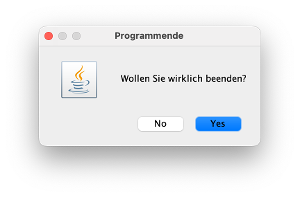
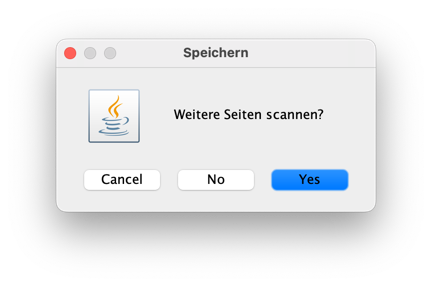
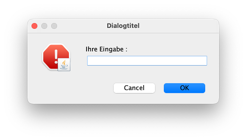

# Einstieg

Wir haben bis jetzt noch keine Nutzerinnen-Eingaben ermöglicht und verwaltet. Das wollen wir nun ändern. Es gibt die Möglichkeit, Nutzerinnen-Eingaben über die Konsole zu implementieren. Dazu steht z.B. die Klasse [Scanner](https://docs.oracle.com/javase/8/docs/api/java/util/Scanner.html) aus dem `java.util`-Paket zur Verfügung. Diese Klasse wollen wir hier aber nicht betrachten, sondern öffnen einen *Dialog* (ein Fenster), um Eingaben vorzunehmen. Dazu verwenden wir die Klasse [JOptionPane](https://docs.oracle.com/javase/8/docs/api/javax/swing/JOptionPane.html). 

Diese Klasse bietet einige nützliche statische Methoden, die uns Dialoge erzeugen. Die Klasse `JOptionPane` befindet sich im Paket `javax.swing`. Wenn Sie in Ihrem Java-Projekt eine Datei `module-info.java` haben, dann müssen Sie darin `requires java.desktop;` eintragen, um überhaupt Klassen aus dem `javax.swing`-Paket importieren zu können, das sich das Paket `javax.swing` im Modul `java.desktop` befindet:

=== "module-info.java"
	```java
	module SoSe23 	// SoSe23 ist der Name des Java-Projektes
	{
		requires java.desktop;
	}
	```

Die interessanten Methoden zur Erzeugung der Dialoge sind

- `showConfirmDialog()`,
- `showInputDialog()`,
- `showMessageDialog()` und
- `showOptionDialog()`  

Diese Methoden erzeugen jeweils ein Dialogfenster, in dem entweder etwas eingegeben werden kann (`showInputDialog()`) oder in dem etwas durch den Klick auf einen Button ausgewählt werden kann. Der Eingabe-Dialog gibt einen `String` zurück und die anderen Dialoge geben ein `int` zurück, welcher beschreibt, auf welchen Button geklickt wurde. Der zurückgegebene `int`-Wert lässt sich mit den folgenden Konstanten vergleichen:

- `JOptionPane.YES_OPTION`,
- `JOptionPane.NO_OPTION`,
- `JOptionPane.CANCEL_OPTION`,
- `JOptionPane.OK_OPTION`,
- `JOptionPane.CLOSED_OPTION`

## Beispiel `showConfirmDialog()`

Die `showConfirmDialog()`-Methode ist zwei Mal überladen. Es gibt 

- `static int showConfirmDialog(Component parentComponent, Object message)` und 
- `static int showConfirmDialog(Component parentComponent, Object message, String title, int optionType)`

Als `optionType` gibt es dabei die Auswahl zwischen 

- `JOptionPane.DEFAULT_OPTION`,
- `JOptionPane.YES_NO_OPTION`,
- `JOptionPane.YES_NO_CANCEL_OPTION`,
- `JOptionPane.OK_CANCEL_OPTION`

Die `parentComponent` ist das Fenster, welches das Dialogfenster aufruft. Wir haben ein solches Fenster (noch) nicht, deshalb werden wir zunächst den Wert hier stets auf `null` setzen. 

Der `String` `message` erscheint im Dialogfenster als Nachricht. Da dies nicht nur ein `String` sein kann, sondern besipielsweise auch ein `Icon`, ist der Typ von `message` als `Object` deklariert.

Der `String` `title` erscheint als Titel des Dialogfensters. 

### Beispiel mit `YES_NO_OPTION`

```java
int auswahl = JOptionPane.showConfirmDialog(
		null, 							// parentComponent
		"Wollen Sie wirklich beenden?", // message
		"Programmende", 				// title
		JOptionPane.YES_NO_OPTION		// optionType
	);
```

erzeugt z.B. folgendes Dialogfenster:



Wenn Sie nun auf einen der beiden Button `No` oder `Yes` klicken, dann schließt sich das Fenster wieder und in dem `int` `auswahl` ist der Wert gespeichert, der dem von Ihnen gedrückten Button entspricht. Diesen Wert können Sie wie folgt auswerten:


```java
if(auswahl == JOptionPane.NO_OPTION)
{
	// es wurde auf NO geklickt
}
else if(auswahl == JOptionPane.YES_OPTION)
{
	// es wurde auf YES geklickt
}
```

### Beispiel mit `YES_NO_CANCEL_OPTION`


```java
int auswahl = JOptionPane.showConfirmDialog(null, "Weitere Seiten scannen?", "Speichern", JOptionPane.YES_NO_CANCEL_OPTION);

if(auswahl == JOptionPane.NO_OPTION)
{
	// es wurde auf NO geklickt
}
else if(auswahl == JOptionPane.YES_OPTION)
{
	// es wurde auf YES geklickt
}
else if(auswahl == JOptionPane.CANCEL_OPTION)
{
	// es wurde auf CANCEL geklickt
}
```

erzeugt folgendes Dialogfenster:




## Beispiel `showInputDialog()`

Die Methode `showInputDialog()` öffnet ein Dialogfenster mit einem einzeiligen Textfeld, in das die Nutzerin etwas eingeben kann und diese Eingabe dann mit dem Klick auf einen Button beendet. Die Methode `showInputDialog()` ist sechs Mal überladen, siehe dazu [hier]. Uns interessiert in den meisten Fällen die einfachste Form `showInputDialog(Object message)` oder, wenn wir noch einen `messageType` hinzufügen wollen, `showInputDialog(Component parentComponent, Object message, String title, int messageType)`. 

Für den `messageType` gibt es folgende vordefinierte Konstanten:

- `ERROR_MESSAGE`,
- `INFORMATION_MESSAGE`,
- `WARNING_MESSAGE`,
- `QUESTION_MESSAGE`,
- `PLAIN_MESSAGE`

Wichtig ist, dass die `showInputDialog()`-Methode den `String` zurückgibt, der eingegeben wurde. 

```java
String eingabe = JOptionPane.showInputDialog("Ihre Eingabe : ");
System.out.println("Sie haben " + eingabe + " eingegeben");
```

erzeugt folgendes Dialogfenster:


Die Implementierung

```java
String eingabe = JOptionPane.showInputDialog(null, "Ihre Eingabe : ", "Dialogtitel", JOptionPane.ERROR_MESSAGE);
System.out.println("Sie haben " + eingabe + " eingegeben");
```

erzeugt folgendes Dialogfenster:



Die Ansicht der Fenster und auch der `messageType`-Icons sind betriebssystemabhängig. 

## Ausblick

Angenommen, wir wollen `JOptionPane.showInputDialog()` verwenden, um eine Zahl einzugeben. Klar ist, dass `showInputDialog()` die Eingabe als `String` zurückgibt. 

1. **Problem**: Wie wandeln wir einen `String` zu einem `int` (oder `double`) um? 

	**Antwort**: mit der Hilfe von [Wrapper-Klassen](wrapper.md#wrapper-klassen){ .md-button } 

2. **Problem**: Angenommen, wir haben eine Lösung, `String` nach `int` umzuwandeln. Wie stellen wir dann sicher, dass unser Programm nicht abstürzt, wenn wir gar keine Zahl eingeben, sondern z.B. `hallo`? Das lässt sich ja gar nicht in eine Zahl umwandeln.

	**Antwort**: mit der Behandlung von [Exceptions](exceptions.md#exceptions){ .md-button }


