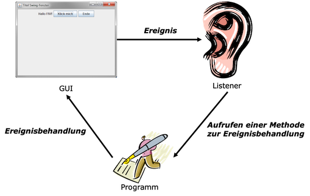

# Ereignisse


Im vorangegangenen Kapitel haben wir gelernt, wie wir Grafische Nutzeroberflächen (GUI) erstellen können. Nun wollen wir uns anschauen, wie auf *Ereignisse* reagiert werden kann, die die Nutzerin auf dieser Grafischen Oberfläche auslöst. Wenn wir beispielsweise in unserem [Taschenrechner](aufgaben.md#aufgabe-7-gui) auf einen Button klicken, dann soll entweder die Ziffer in dem Textfeld oben erscheinen oder es soll die Operation ausgeführt werden, auf die wir geklickt haben. In grafischen Nutzeroberflächen gibt es nicht nur Buttons, auf deren Klick-Ereignisse wir reagieren wollen, es gibt auch Eingaben über die Tastatur, das Fenster kann mit der Maus bewegt, vergrößert oder verkleinert werden, es können Kontextdialoge durch das Drücken der rechten Maustaste geöffnet werden usw. Wir lernen hier, welche unterschiedlichen Ereignisse es gibt und wie wir diese *behandeln* können, d.h. wie wir die Reaktion auf diese Ereignisse implementieren. 

Zunächst überlegen wir uns, wie es überhaupt möglich sein kann, dass *Ereignisse* (also Aktionen der Nutzerin) auf unserer grafischen Oberfläche erkannt werden und auf diese Ereignisse entsprechend reagiert werden kann. Man könnte (in einer Schleife) permanent bei der Maus oder der Tastatur anfragen, ob eine Taste gedrückt oder ob die Maus bewegt wurde. Das ist aber viel zu imperformant und würde das Programm blockieren. Diese Aufgabe wird nämlich von der Laufzeitumgebung automatisch übernommen. Im Hintergrund geschieht genau so etwas, aber wir müssen uns gar nicht darum kümmern. Wenn z.B. eine Maustaste gedrückt wird, dann wird im Hintergrund durch die Laufzeitumgebung eine bestimmte Methode aufgerufen (`mouseClicked()`). Woher wissen wir, wie diese Methode heißt? Die Antwort sind natürlich: **Interfaces**!

## Interfaces für Ereignisse - Listener

Die Idee ist die Folgende:

- Komponenten können unterschiedliche Ereignisse empfangen (Button angeklickt, Text eingegeben, Maus bewegt, Fenster geschlossen, ...).
- Die Anwendung registriert einen sogenannten **Listener** (ein *Listener*-Objekt) bei der Komponente für Ereignisse von Interesse.
- Tritt ein Ereignis, für das man sich beim *Listener* angemeldet hat, an der Komponente ein, wird eine bestimmte Methode am Listener-Objekt aufgerufen. 
- Alle diese Methoden, die durch die Laufzeitumgebung für bestimmte Ereignisse aufgerufen werden können, sind in *Interfaces* definiert. 
- Es gibt unterschiedliche *Interfaces*, die man implementieren muss, je nach den Ereignissen, auf die man reagieren möchte (Mausereignisse, Tastaturereigniss, Ereignisse am Fenster, ...).

Das Vorgehen kann man sich wie in der Abbildung gezeigt vorstellen:



Der *Listener* lauscht permanent auf Ereignisse. Sobald ein Ereignis aufritt, auf das der *Listener* lauscht, ruft er eine entsprechende Methode auf. Damit wir im Programm auf dieses Ereignis reagieren können (die Ereignisbehandlung implementieren), müssen wir zwei Dinge tun:

1. uns an dem Listener anmelden, der auf die Ereignisse lauscht, die uns interessieren (die wir behandeln wollen) und
2. die Ereignisbehandlung in der vom *Listener* aufgerufenen Methode implementieren.  

Die Methoden, die wir implementieren sind *abstrakt* in *Interfaces* festgelegt. Das bedeutet also, dass wir für die Ereignisbehandlung *Interfaces* implementieren. 

## Erstes Beispiel `ActionListener` 

Wir starten mit einem ersten Beispiel. Dazu haben wir uns folgende GUI erstellt:

```java linenums="1"
import java.awt.BorderLayout;
import java.awt.Font;
import javax.swing.*;

public class Ereignisbehandlung extends JFrame{
	
	public Ereignisbehandlung()
	{
		super();
		setTitle("Ereignisbehandlung");
		setDefaultCloseOperation(JFrame.EXIT_ON_CLOSE);
		JPanel mainPanel = init();

		this.getContentPane().add(mainPanel, BorderLayout.CENTER);
		setSize(200,150);
		setVisible(true);
	}
	
	private JPanel init()
	{
		JPanel panel = new JPanel();
		panel.setLayout(new BorderLayout());
		
		JButton oben = new JButton("Klick mich");
		
		JLabel unten = new JLabel("0");
		unten.setFont(new Font("Verdana", Font.BOLD, 24));
		unten.setHorizontalAlignment(JLabel.CENTER);
	
		panel.add(oben, BorderLayout.NORTH);
		panel.add(unten, BorderLayout.CENTER);
		
		return panel;
	}

	public static void main(String[] args) 
	{
		new Ereignisbehandlung();
	}

}
```

Die Ausführung des Programms zeigt folgendes kleines Fenster:


Es soll nun implementiert werden, dass sich durch einen Klick auf den Button die dargestellte Zahl um `1` erhöht. Die Methode, die ausgelöst wird, wenn ein Button geklickt wird, heißt `actionPerformed()`. Diese ist in dem Interface `ActionListener` implementiert. Wir müssen nun also

1. das Interface `ActionListener` implementieren und
2. uns beim `ActionListener` anmelden. 

#### Das Interface `ActionListener` implementieren 

Interfaces implementieren können wir bereits - mithilfe von `implements`:

1. Wir schreiben also: `public class Ereignisbehandlung extends JFrame implements ActionListener`.
2. Das Interface `ActionListener` muss aus dem `java.awt.event`-Paket importiert werden. 
3. Wir klicken auf `Add unimplemented methods` und in der Klasse erscheint die folgende Methode: 

```java
	@Override
	public void actionPerformed(ActionEvent e) {
		// TODO Auto-generated method stub
		
	}
```

Das Interface `ActionListener` enthält also nur genau eine Methode, die implmentiert werden muss. Dieser Methode wird ein `ActionEvent` als Parameter übergeben. Diese Klasse muss ebenfalls aus dem `java.awt.event`-Paket importiert werden. 

Wenn unser Button gedrückt wird, dann wird also "automatisch" (durch die Laufzeitumgebung) die Methode `actionPerformed()` aufgerufen. Alles, was *passieren* soll, wenn der Button geklickt wird, müssen wir in dieser Methode implementieren. Wir beginnen mit einer ganz einfachen Implementierung, mit einer simplen Ausgabe auf die Konsole:

```java
	@Override
	public void actionPerformed(ActionEvent e) 
	{
		System.out.println("Button gedrueckt!");		
	}
```

Wenn wir nun auf den Button klicken, passiert aber noch nichts, denn wir müssen den Button noch am `ActionListener` anmelden (siehe oben Punkt 2 in der Liste). 

#### Am `ActionListener` anmelden

Damit das Klick-Ereignis auf den Button auch so behandelt wird, wie wir das in der `actionPerformed()`-Methode definiert haben, müssen wir diesen Button an den `ActionListener` anmelden. Dazu existiert für einen `JButton` (für alle Komponenten `JComponent`) die Methode `addActionListener(ActionListener l)`. Dieser Methode muss nun ein `ActionListener`-Objekt übergeben werden, also ein Objekt, das das Interface `ActionListener` implementiert hat. Da wir den `ActionListener` in unserer Fensterklasse implementiert haben, ist das Fenster ein solches Objekt, das den `ActionListener` implementiert hat. Wir verwenden also `this`. 


```java linenums="1" hl_lines="3 4 29 46-50"
import java.awt.BorderLayout;
import java.awt.Font;
import java.awt.event.ActionEvent;
import java.awt.event.ActionListener;

import javax.swing.*;

public class Ereignisbehandlung extends JFrame implements ActionListener
{
	
	public Ereignisbehandlung()
	{
		super();
		setTitle("Ereignisbehandlung");
		setDefaultCloseOperation(JFrame.EXIT_ON_CLOSE);
		JPanel mainPanel = init();

		this.getContentPane().add(mainPanel, BorderLayout.CENTER);
		setSize(200,150);
		setVisible(true);
	}
	
	private JPanel init()
	{
		JPanel panel = new JPanel();
		panel.setLayout(new BorderLayout());
		
		JButton oben = new JButton("Klick mich");
		oben.addActionListener(this);
		
		JLabel unten = new JLabel("0");
		unten.setFont(new Font("Verdana", Font.BOLD, 24));
		unten.setHorizontalAlignment(JLabel.CENTER);
	
		panel.add(oben, BorderLayout.NORTH);
		panel.add(unten, BorderLayout.CENTER);
		
		return panel;
	}

	public static void main(String[] args) 
	{
		new Ereignisbehandlung();
	}

	@Override
	public void actionPerformed(ActionEvent e) 
	{
		System.out.println("Button gedrueckt!");
	}

}
```

Jedes mal, wenn wir nun auf den Button klicken, wird eine Ausgabe auf der Konsole erzeugt. Nach 5 Klicks also

```bash
Button gedrueckt!
Button gedrueckt!
Button gedrueckt!
Button gedrueckt!
Button gedrueckt!
```

Wir haben das erste Ereignis behandelt, das durch eine Nutzerinnenaktion ausgelöst wurde - das Klicken eines Buttons!

#### Zugriff auf Komponenten in `actionPerformed()`

Wenn wir nun aber die `actionPerformed()`-Methode so implementieren wollen, dass sich der Text des `JLabel`s `unten` ändert, dann stellen wir fest, dass wir in `actionPerformed()` ja gar keinen Zugriff auf dieses `JLabel` haben, weil die Referenz darauf nur eine lokale Variable in der `init()`-Methode ist. Um in allen Methoden der Klasse `Ereignisbehandlung` Zugriff auf dieses `JLabel` zu erlangen, müssen wir es *global* deklarieren (als Objektvariable der Klasse `Ereignisbehandlung`). 

Zusätzlich erzeugen wir eine weitere Variable, die die Anzahl der bisherigen Klicks mitzählt, um diesen Wert dann im `JLabel` darzustellen.  


```java linenums="1" hl_lines="10-11 33 52-53"
import java.awt.BorderLayout;
import java.awt.Font;
import java.awt.event.ActionEvent;
import java.awt.event.ActionListener;

import javax.swing.*;

public class Ereignisbehandlung extends JFrame implements ActionListener
{
	JLabel unten;
	Integer anzKlicks = 0;
	
	public Ereignisbehandlung()
	{
		super();
		setTitle("Ereignisbehandlung");
		setDefaultCloseOperation(JFrame.EXIT_ON_CLOSE);
		JPanel mainPanel = init();

		this.getContentPane().add(mainPanel, BorderLayout.CENTER);
		setSize(200,150);
		setVisible(true);
	}
	
	private JPanel init()
	{
		JPanel panel = new JPanel();
		panel.setLayout(new BorderLayout());
		
		JButton oben = new JButton("Klick mich");
		oben.addActionListener(this);
		
		this.unten = new JLabel(this.anzKlicks.toString());
		unten.setFont(new Font("Verdana", Font.BOLD, 24));
		unten.setHorizontalAlignment(JLabel.CENTER);
	
		panel.add(oben, BorderLayout.NORTH);
		panel.add(unten, BorderLayout.CENTER);
		
		return panel;
	}

	public static void main(String[] args) 
	{
		new Ereignisbehandlung();
	}

	@Override
	public void actionPerformed(ActionEvent e) 
	{
		System.out.println("Button gedrueckt!");
		this.anzKlicks++;
		this.unten.setText(this.anzKlicks.toString());
	}

}
```

Nun ändert sich mit jedem Button-Klick der angezeigte Wert.


#### Mehrere Buttons - `ActionEvent`

Wir ändern unsere GUI, indem wir die `init()`-Methode ändern:

```java linenums="25" hl_lines="6-10"
	private JPanel init()
	{
		JPanel panel = new JPanel();
		panel.setLayout(new BorderLayout());
		
		JPanel oben = new JPanel();
		JButton minus = new JButton("-");
		JButton plus = new JButton("+");
		oben.add(minus);
		oben.add(plus);
		
		this.unten = new JLabel(this.anzKlicks.toString());
		unten.setFont(new Font("Verdana", Font.BOLD, 24));
		unten.setHorizontalAlignment(JLabel.CENTER);
	
		panel.add(oben, BorderLayout.NORTH);
		panel.add(unten, BorderLayout.CENTER);
		
		return panel;
	}
```

Die GUI sieht dadurch nun so aus:


Das heißt, wir haben zwei Buttons und wollen für diese Buttons das Klick-Ereignis unterschiedlich behandeln. Bei Klick auf den `-`-Button soll der Wert der Zahl dekrementiert werden, bei Klick auf den `+`-Button inkrementiert. Wir müssen nun also innerhalb der `actionPerformed()`-Methode unterscheiden, welcher Button gedrückt wurde, d.h. durch welchen Button das `ActionEvent` ausgelöst wurde, welches wir behandeln. Dabei hilft uns das `ActionEvent`-Objekt, das der `actionPerformed(ActionEvent e)`-Methode übergeben wird. Die Klasse [ActionEvent](https://docs.oracle.com/en/java/javase/15/docs/api/java.desktop/java/awt/event/ActionEvent.html) hat einige nützliche Methoden. Wir verwenden jetzt zunächst eine Methode, die die Klasse `ActionEvent` von der Klasse [EventObject](https://docs.oracle.com/en/java/javase/15/docs/api/java.base/java/util/EventObject.html#getSource()) geerbt hat, die `getSource()`-Methode:


```java linenums="48" hl_lines="4"
	@Override
	public void actionPerformed(ActionEvent e) 
	{
		Object quelle = e.getSource();
		if(quelle instanceof JButton )
		{
			JButton button = (JButton) quelle;
			if(button.getText().equals("+"))
			{
				this.anzKlicks++;
			}
			else if(button.getText().equals("-"))
			{
				this.anzKlicks--;
			}
		}
		this.unten.setText(this.anzKlicks.toString());
	}
```

Die `getSource()`-Methode von `ActionEvent` liefert die Komponente (als `Object`) zurück, die das `ActionEvent` ausgelöst hat. Damit wir Objektmethoden (z.B. `getText()` - Zeilen `55` und `59`) von `JButton` verwenden können, müssen wir dieses `Object` nach `JButton` konvertieren (Zeile `54`). Damit dies gelingt, müssen wir zunächst prüfen, ob es sich bei der auslösenden Komponente tatsächlich um einen `JButton` handelt. Das erledigen wir hier mit dem `instanceof`-Operator in Zeile `52`. 

Mithilfe der `getText()`-Methoden erfragen wir den Text, der auf den Buttons steht. Wir vergleichen diesen mithilfe der `equals()`-Methode und können somit unterscheiden, ob das `ActionEvent` durch den `+`- oder den `-`-Button ausgelöst wurde. 

Wir dürfen **nicht vergessen**, die **beiden** Buttons an den `ActionListener` anzumelden:


```java linenums="1" hl_lines="33-34"
import java.awt.BorderLayout;
import java.awt.Font;
import java.awt.event.ActionEvent;
import java.awt.event.ActionListener;

import javax.swing.*;

public class Ereignisbehandlung extends JFrame implements ActionListener
{
	JLabel unten;
	Integer anzKlicks = 0;
	
	public Ereignisbehandlung()
	{
		super();
		setTitle("Ereignisbehandlung");
		setDefaultCloseOperation(JFrame.EXIT_ON_CLOSE);
		JPanel mainPanel = init();

		this.getContentPane().add(mainPanel, BorderLayout.CENTER);
		setSize(200,150);
		setVisible(true);
	}
	
	private JPanel init()
	{
		JPanel panel = new JPanel();
		panel.setLayout(new BorderLayout());

		JPanel oben = new JPanel();
		JButton minus = new JButton("-");
		JButton plus = new JButton("+");
		minus.addActionListener(this);
		plus.addActionListener(this);
		oben.add(minus);
		oben.add(plus);
		
		this.unten = new JLabel(this.anzKlicks.toString());
		unten.setFont(new Font("Verdana", Font.BOLD, 24));
		unten.setHorizontalAlignment(JLabel.CENTER);
	
		panel.add(oben, BorderLayout.NORTH);
		panel.add(unten, BorderLayout.CENTER);
		
		return panel;
	}

	public static void main(String[] args) 
	{
		new Ereignisbehandlung();
	}

	@Override
	public void actionPerformed(ActionEvent e) 
	{
		Object quelle = e.getSource();
		if(quelle instanceof JButton )
		{
			JButton button = (JButton) quelle;
			if(button.getText().equals("+"))
			{
				this.anzKlicks++;
			}
			else if(button.getText().equals("-"))
			{
				this.anzKlicks--;
			}
		}
		this.unten.setText(this.anzKlicks.toString());
	}

}
```

Nun haben wir für die beiden Buttons eine unterschiedliche Ereignisbehandlung realisiert. 


#### ActionCommand

Die Abfrage des Textes auf den Buttons zur Unterscheidung der Buttons ist nicht *clean code*. Das hat mehrere Gründe:

1. GUIs werden häufig für mehrere Sprachen zur Verfügung gestellt. Je nach Einstellungen in den Konfigurationen kann die "angezeigte" Sprache der GUI verändert werden. Somit würden auch die Buttons ihre Beschriftung ändern und man müsste in der `actionPerformed()`-Methode viele Varianten für die Textabfrage hinzufügen. 
2. Buttons können auch einfach nur Icons enthalten, d.h. gar keinen Text.
3. Der auf Buttons angezeigte Text kann sehr "kryptisch" sein, also irgendwelche Sonderzeichen oder Schriftzeichen enthalten. Es kann z.B. auch [HTML](https://de.wikipedia.org/wiki/Hypertext_Markup_Language)-Code sein. 

Das alles macht die Abfrage des Textes und insbesondere den Vergleich kompliziert bis gar unmöglich. Deshalb sollte man stattdessen besser das `ActionCommand` abfragen. Das `ActionCommand` wird mithilfe der `setActionCommand(String command)`-Methode gesetzt und mithilfe der `getActionCommand()`-Methode abgefragt. 

Wenn für einen Button **nicht** mithilfe der `setActionCommand()`-Methode ein `ActionCommand` definiert wurde, dann entspricht das `ActionCommand` dem Text auf dem Button. Das bedeutet, dass die `getActionCommand()`-Methode trotzdem verwendet werden könnte. 

Wir bräuchten also nur in der `actionPerformed()`-Methode `getText()` durch `getActionCommand()` ersetzen und hätten das gleiche Ergebnis:


```java linenums="53" hl_lines="4"
	@Override
	public void actionPerformed(ActionEvent e) 
	{
		Object quelle = e.getSource();
		if(quelle instanceof JButton )
		{
			JButton button = (JButton) quelle;
			if(button.getActionCommand().equals("+"))
			{
				this.anzKlicks++;
			}
			else if(button.getActionCommand().equals("-"))
			{
				this.anzKlicks--;
			}
		}
		this.unten.setText(this.anzKlicks.toString());
	}
```

Wenn wir allerdings eigene (andere) `ActionCommands` für die Buttons setzen, dann müssen wir auch den Vergleich anpassen:


```java linenums="1" hl_lines="32-33 61 65"
import java.awt.BorderLayout;
import java.awt.Font;
import java.awt.event.ActionEvent;
import java.awt.event.ActionListener;

import javax.swing.*;

public class Ereignisbehandlung extends JFrame implements ActionListener
{
	JLabel unten;
	Integer anzKlicks = 0;
	
	public Ereignisbehandlung()
	{
		super();
		setTitle("Ereignisbehandlung");
		setDefaultCloseOperation(JFrame.EXIT_ON_CLOSE);
		JPanel mainPanel = init();

		this.getContentPane().add(mainPanel, BorderLayout.CENTER);
		setSize(200,150);
		setVisible(true);
	}
	
	private JPanel init()
	{
		JPanel panel = new JPanel();
		panel.setLayout(new BorderLayout());
		JPanel oben = new JPanel();
		JButton minus = new JButton("-");
		JButton plus = new JButton("+");
		minus.setActionCommand("minus");
		plus.setActionCommand("plus");
		minus.addActionListener(this);
		plus.addActionListener(this);
		oben.add(minus);
		oben.add(plus);
		
		this.unten = new JLabel(this.anzKlicks.toString());
		unten.setFont(new Font("Verdana", Font.BOLD, 24));
		unten.setHorizontalAlignment(JLabel.CENTER);
	
		panel.add(oben, BorderLayout.NORTH);
		panel.add(unten, BorderLayout.CENTER);
		
		return panel;
	}

	public static void main(String[] args) 
	{
		new Ereignisbehandlung();
	}

	@Override
	public void actionPerformed(ActionEvent e) 
	{
		Object quelle = e.getSource();
		if(quelle instanceof JButton )
		{
			JButton button = (JButton) quelle;
			if(button.getActionCommand().equals("plus"))
			{
				this.anzKlicks++;
			}
			else if(button.getActionCommand().equals("minus"))
			{
				this.anzKlicks--;
			}
		}
		this.unten.setText(this.anzKlicks.toString());
	}

}
```


!!! success
	Wir kennen nun das Konzept, das hinter der Behandlung von Ereignissen steckt. Wir melden die Komponente, für die wir eine Ereignisbehandlung für ein Ereignis implementieren wollen, an den entsprechenden *Listener* an und wir implementieren das zugehörige Interface. Wir haben Buttons erfolgreich an den `ActionListener` angemeldet und das `ActionListener`-Interface implementiert. Dieses Interface enthält nur genau eine Methode, `actionPerformed()`. Wir können in dieser Methode auch bereits ermitteln, welche Komponente das `ActionEvent` ausgelöst hat, das gerade behandelt wird. Dadurch können wir in derselben `actionPerformed()`-Methode die (unterschiedliche) Ereignisbehandlung für mehrere Buttons implementieren. Damit können wir nun schonmal einen funktionsfähigen Taschenrechner bauen! Der Lösung für [Aufgabe 8](aufgaben.md#aufgabe-8-ereignisbehandlung) steht nichts mehr im Wege!


## Innere Klassen

Mit der Implementierung des `ActionListener` hat alles geklappt und funktional ist auch alles in Ordnung, **aber** so richtig schön ist es nicht - kein *clean code*. Dafür gibt es mehrere Gründe:

1. Unsere Klasse verstößt auf jeden Fall gegen das *Single Responsibility Principle* ([SRP](https://de.wikipedia.org/wiki/Single-Responsibility-Prinzip)). Unsere Klasse ist einerseits ein Fenster und andererseits kümmern wir uns in der Klasse auch um Funktionalitäten. Bei der Erstellung von Anwendungen mit grafischen Nutzeroberflächen hat sich sogar eine Dreiteilung etabliert, das sogenannte *Model-View-Controller-Pattern*. Darin ist die Darstellung der GUI die *View*, das Verwalten und Manipulieren der Daten das *Model* und die Steuerung mittels Nutzeraktionen der *Controller*. Langfristig streben wir eine solche Dreiteilung ebenfalls an. 
2. Wenn wir sehr viele Buttons (und später auch noch Textfelder, Menüs usw.) haben, dann kann die `actionPerformed()`-Methode schon allein dadurch sehr lang werden, dass wir viele Fallunterscheidungen benötigen, um zu ermitteln, welche Komponente das `ActionEvent` überhaupt ausgelöst hat. Wenn dann jeweils noch viel Funktionalität hinzukommt, wird die `actionPerformed()`-Methode viel zu lang. 
3. Wir haben bis jetzt nur ein einziges Interface, das `ActionListener`-Interface, implementiert und dieses enthält auch nur eine einzige Methode. Wenn wir nun auch noch auf Maus-, Mausbewegungs-, Tastatur- und Fenstereignisse reagieren wollen, dann implementieren wir mindestens vier weitere Interfaces, die jeweils bis zu sechs Methoden enthalten. Unsere Klasse würde sehr lang werden.

Wir benötigen Ideen, wie wir diese Konflikte auflösen können. Dazu benötigen wir neue Strukturierungsmöglichkeiten. Ein erster Schritt dahin sind *Innere Klassen*. Wir betrachten *Innere Klassen* aber nur als einen Zwischenschritt hin zu *anonymen Klassen*. Wir werden uns ansonsten nicht weiter mit *inneren Klassen* auseinandersetzen. 

### Begriffsbestimmung

Prinzipiell handelt es sich bei inneren Klassen um Klassen **in** einer Klasse. Der Oberbegriff für eine Klasse in einer Klasse ist *nested class*. In *nested classes* unterscheidet man zwischen

- statischen und
- nicht-statischen Klassen.

Die nicht-statischen *nested* Klassen (also Klassen, wie wir sie bisher kennen - wir kennen noch gar keine statischen Klassen) heißen *innere Klassen*. Wir wollen uns gar nicht mit statischen verschachtelten Klassen auseinandersetzen. Es sei an dieser Stelle aber der wesentliche Unterschied zwischen den statischen und den nicht-statischen verschachtelten Klassen genannt: nicht-statische Klassen (also innere Klassen) haben Zugriff auf die Eigenschaften der äußeren Klasse, statische verschachtelte Klassen haben diesen Zugriff nicht. Wenn wir schon bei Sachen sind, die uns nicht interessieren ;-) : sogenannte *lokale* Klassen sind Klassen **in** einer Methode. 

Innere Klassen sind aber nützlich und sinnvoll. Wir kennen auch schon eine, nämlich `Map.Entry` - die Klasse `Entry` ist eine innere Klasse von `Map` (ganz exakt handelt es sich bei beiden nicht um Klassen, sondern um Interfaces, das macht hier aber keinen Unterschied). In der Klasse `Integer` gibt es übrigens auch eine innere Klasse. Die fungiert als ein *Cache* für häufig verwendete Zahlen. Wenn Sie ein `Integer`-Objekt mit einem Wert kleiner als `128` erstellen, dann kommt dieses Objekt in den Cache und wenn Sie ein weiteres Objekt mit dem gleichen Wert erzeugen, dann wird dafür einfach das Objekt aus dem Cache verwendet. Das führt zu diesem "komischen" Verhalten:

```java
		Integer i1 = Integer.valueOf(1001);
		Integer i2 = Integer.valueOf(1001);
		Integer i3 = Integer.valueOf(101);
		Integer i4 = Integer.valueOf(101);
		System.out.println(i1 == i2);		// false
		System.out.println(i3 == i4);		// true
```

Der erste Vergleich ist `false`, weil es sich bei `i1` und `i2` um Referenzen auf zwei verschiedene Objekte handelt. Der zweite Vergleich ist aber `true`, weil es sich bei `i3` und `i4` um Referenzen auf dasselbe Objekt (aus dem Cache) handelt. Aber das nur nebenbei, um zu erläutern, dass es sinnvolle Verwendungen für innere Klassen gibt. 

### Ereignisbehandlung mit innerer Klasse

Wir verwenden unsere Klasse `Ereignisbehandlung` von oben. Aber wir lagern die eigentliche Behandlung des `ActionEvent`s in eine innere Klasse aus. Das heißt, wir trennen die Erstellung der GUI und die Behandlung der Ereignisse strukturell, in dem diese Dinge in zwei unterschiedlichen Klassen implementiert sind. Da es sich aber um die Ereignisbehandlung für genau die erstellte GUI handelt, ergibt es wenig Sinn, diese in eine "normale" Top-Level-Klasse zu überführen. Deshalb verwenden wir dafür eine innere Klasse:


```java linenums="1" hl_lines="8 34-35 54-55 65 69 72 74"
import java.awt.BorderLayout;
import java.awt.Font;
import java.awt.event.ActionEvent;
import java.awt.event.ActionListener;

import javax.swing.*;

public class Ereignisbehandlung extends JFrame
{
	JLabel unten;
	Integer anzKlicks = 0;
	
	public Ereignisbehandlung()
	{
		super();
		setTitle("Ereignisbehandlung");
		setDefaultCloseOperation(JFrame.EXIT_ON_CLOSE);
		JPanel mainPanel = init();

		this.getContentPane().add(mainPanel, BorderLayout.CENTER);
		setSize(200,150);
		setVisible(true);
	}
	
	private JPanel init()
	{
		JPanel panel = new JPanel();
		panel.setLayout(new BorderLayout());
		JPanel oben = new JPanel();
		JButton minus = new JButton("-");
		JButton plus = new JButton("+");
		minus.setActionCommand("minus");
		plus.setActionCommand("plus");
		minus.addActionListener(new ActionHandler());
		plus.addActionListener(new ActionHandler());
		oben.add(minus);
		oben.add(plus);
		
		this.unten = new JLabel(this.anzKlicks.toString());
		unten.setFont(new Font("Verdana", Font.BOLD, 24));
		unten.setHorizontalAlignment(JLabel.CENTER);
	
		panel.add(oben, BorderLayout.NORTH);
		panel.add(unten, BorderLayout.CENTER);
		
		return panel;
	}

	public static void main(String[] args) 
	{
		new Ereignisbehandlung();		
	}

	class ActionHandler implements ActionListener
	{
		@Override
		public void actionPerformed(ActionEvent e) 
		{
			Object quelle = e.getSource();
			if(quelle instanceof JButton )
			{
				JButton button = (JButton) quelle;
				if(button.getActionCommand().equals("plus"))
				{
					Ereignisbehandlung.this.anzKlicks++;
				}
				else if(button.getActionCommand().equals("minus"))
				{
					Ereignisbehandlung.this.anzKlicks--;
				}
			}
			Ereignisbehandlung.this.unten.setText(Ereignisbehandlung.this.anzKlicks.toString());
		}
	}

}
```

So viel hat sich gar nicht geändert: 

- Die Klasse `Ereignisbehandlung` implementiert jetzt nicht mehr selbst das Interface `ActionListener` (Zeile `8`).
- Das hat jetzt die neue (innere) Klasse `ActionHandler` übernommen (Zeile `54`). 
- Da der `ActionListener` nun nicht mehr in `Ereignisbehandlung` implementiert ist, sondern in `ActionHandler`, muss beim Anmelden an den `ActionListener` nun nicht mehr das `this`-Objekt, sondern ein Objekt von `ActionHandler` übergeben werden (Zeilen `34` und `35`).
- Da sich die Methode `actionPerformed()` nun in der Klasse `ActionHandler` befindet, handelt es sich dort bei der `this`-referenz um eine Referenz auf ein `ActionHandler`-Objekt. Wir können also nicht mehr einfach `this.anzKlicks++;` schreiben, da es sich bei `anzKlicks` ja nicht um eine Eigenschaft der `ActionHandler`-Klasse, sondern um eine Eigenschaft der `Ereignisbehandlung`-Klasse handelt. Das Gleiche gilt auch für das `JLabel unten` (Zeilen `65`, `69` und `72`).

Um auf die Eigenschaften der *äußeren* Klasse zuzugreifen, kann in der *inneren* Klasse über den Klassennamen der *äußeren* Klasse auf die Eigenschaften der *äußeren* Klasse referenziert werden. Das heißt, wenn die äußere Klasse `AeussereKlasse` heißt und eine Eigenschaft `eigenschaft_AeK` hat, dann kann aus der inneren Klasse heraus wie folgt auf diese Eigenschaft zugegriffen werden:

> AeussereKlasse.this.eigenschaft_AeK

In unserem Fall bedeutet das, dass wir nun über `Ereignisbehandlung.this.anzKlicks++;` und `Ereignisbehandlung.this.anzKlicks--;` den Wert der Eigenschaft `anzKlicks` der äußeren Klasse `Ereignisbehandlung` ändern können (Zeilen `65` und `69`). Um auf das JPanel `unten` aus der inneren Eigenschaft zugreifen zu können, schreiben wir deshalb `Ereignisbehandlung.this.unten` (Zeile `72`). 

**Beachten** Sie, dass das `this` darin notwendig ist. Wenn wir schreiben würden

```java
Ereignisbehandlung.anzKlicks++;
```

, dann würde das bedeuten, dass es sich bei `anzKlicks` um eine statische (Klassen-)Variable handeln würde. Um auf (nicht-statische) Objektvariablen zuzugreifen, verwenden wir in der Klasse ja die Referenz `this` und um also auf die Objektvariablen der äußeren Klasse zuzugreifen, schreiben wir


```java
Ereignisbehandlung.this.anzKlicks++;
```

Dasselbe gilt für Methoden. 

Wir haben nun immerhin die Verantwortlichkeiten zur Erstellung der GUI und zur Behandlung der Ereignisse in zwei verschiedene Klassen aufgeteilt. Das *Single Responsibility Principle* ist somit erfüllt. Das ist schonmal gut! Wir haben aber eingangs erwähnt, dass wir uns die inneren Klassen nur als ein Zwischenschritt anschauen. Dazu überlegen wir uns nochmal Folgendes:

- Wir haben für die Ereignisbehandlung eine eigene Klasse `ActionHandler` geschrieben. 
- Um sich an den `ActionListener` anzumelden, wurde der `addActionListener()`-Methode dafür ein Objekt von `ActionHandler` übergeben (siehe oben die Zeilen `34` und `35`).

Nun machen wir etwas Verrücktes ;-) : wir übergeben der `addActionListener()`-Methode auch wieder ein Objekt, in dem wir den `ActionListener` implementiert haben (implementieren), aber diese Implementierung erfolgt nicht in einer separaten Klasse, die einen Namen hat (`ActionHandler`), sondern die Implementierung erfolgt direkt dort, wo das Objekt übergeben wird, dafür ohne einen Klassennamen - eine *anonyme* Klasse. 


### Ereignisbehandlung mit anonymer Klasse

Jede Komponente, für die auf das `ActionEvent` reagiert werden soll, muss an den `ActionListener` mithilfe der `addActionListener()`-Methode angemeldet werden. Dieser Methode wird ein Objekt übergeben, in dem der `ActionListener` implementiert ist. Wir implementieren jetzt direkt dort, wo wir das Objekt übergeben, genau diese Klasse, geben ihr aber keinen Namen. Stattdessen geben wir `ActionListener` wie einen Konstruktor an, obwohl es sich bei `ActionListener` um ein Interface handelt, welches erstens keinen Konstruktor besitzt und zweitens von dem gar kein Objekt erzeugt werden kann. Wir schauen uns das am Beispiel des `-`-Buttons an:

```java linenums="1"
	minus.addActionListener(new ActionListener() {		// Objekt einer anonymen Klasse
		
		@Override
		public void actionPerformed(ActionEvent e) 
		{
			Ereignisbehandlung.this.anzKlicks--;
			Ereignisbehandlung.this.unten.setText(Ereignisbehandlung.this.anzKlicks.toString());
		}
	});
```

Wir übergeben der `addActionListener()`-Methode ein Objekt einer *anonymen* Klasse. Diese *anonyme* Klasse implementiert das `ActionListener`-Interface. Zunächst gehen wir nochmal einen Schritt zurück und schauen uns die Varianten an, die wir davor hatten:

```java
minus.addActionListener(this);		// ActionListener war in der Fenster-Klasse implementiert
minus.addActionListener(new ActionHandler());		// ActionListener war in der inneren Klasse ActionHandler implementiert
```

Nun implementieren wir das `ActionListener`-Interface direkt "vor Ort" - dort, wo es auch übergeben wird. Der Aufruf der `addActionListener()`-Methode ist übrigens noch exakt der gleiche


```java linenums="1"
	minus.addActionListener(


	 );
```

, nur das übergebene Objekt sieht etwas "komisch" aus:


```java linenums="1"
						new ActionListener() {		// Objekt einer anonymen Klasse
		
		@Override
		public void actionPerformed(ActionEvent e) 
		{
			Ereignisbehandlung.this.anzKlicks--;
			Ereignisbehandlung.this.unten.setText(Ereignisbehandlung.this.anzKlicks.toString());
		}
	}
```

Wir erkennen aber den Klassenrumpf, der ganz normal mit einer geschweiften Klammer `{` in Zeile `1`) beginnt und mit einer schließenden geschweiften Klammer `}` in Zeile `9` endet. Darin ist, auch ganz normal, die `actionPerformed()`-Methode implementiert, die ja implementiert werden muss, wenn das `ActionListener`-Interface implementiert wird. Innerhalb der Methode greifen wir auch, wie bei inneren Klassen üblich, auf die Objekteigenschaften der äußeren Klasse zu. 

Eigentlich ist nur dieser Ausdruck neu: `new ActionListener() { }`. Hier müssen wir uns einfach merken, dass es sich dabei um drei Sachen hadelt, die zugleich passieren:

1. Es wird das `ActionListener`-Interface implementiert. Dies geschieht "ganz normal" in einem Klassenrumpf, der mit `{` beginnt und mit `}` endet.
2. Die Klasse, in der das Interface implemntiert wird, hat aber keinen Namen, deshalb schreiben wir auch nicht `Klassenmane implements ActionListener`, sondern nur `ActionListener`.
3. Es wird ein Objekt erzeugt. Dazu wird, ganz normal, das Schlüsselwort `new` verwendet und ein Konstruktor - allerdings hier der Konstruktor einer Klasse, die keinen Namen hat. Da diese Klasse aber das `ActionListener`-Interface implementiert, kann dieser Name für den Konstruktor verwendet werden.

Der große Vorteil dieser Art der Implementierung des `ActionListener`-Interfaces liegt darin, dass jede Komponente ihre eigene Implementierung bekommt und dass es deshalb nicht notwendig ist, eine Fallunterscheidung zu treffen, welche Komponente das Ereignis ausgelöst hat. Hier kann es nur der `minus`-Button gewesen sein!

Die beiden Implementierungen des `ActionListener`s mithilfe einer anonymen Klasse sehen so aus:

```java linenums="1"

	minus.addActionListener(new ActionListener() {
		
		@Override
		public void actionPerformed(ActionEvent e) 
		{
			Ereignisbehandlung.this.anzKlicks--;
			Ereignisbehandlung.this.unten.setText(Ereignisbehandlung.this.anzKlicks.toString());
		}
	});
	
	plus.addActionListener(new ActionListener() {
		
		@Override
		public void actionPerformed(ActionEvent e) 
		{
			Ereignisbehandlung.this.anzKlicks++;
			Ereignisbehandlung.this.unten.setText(Ereignisbehandlung.this.anzKlicks.toString());
		}
	});
	
```

Den `ActionListener` mithilfe anonymer Klassen zu implementieren, ist ein *Best Practice*. In sehr vielen Fällen gewinnt man an Übersichtlichkeit. Wir werden im Rest des Semesters immer mal diskutieren, wann die Verwendung anonymer Klassen sinnvoll ist und wann nicht. Manchmal ist es aber auch nur Geschmackssache. 

Für diejenigen, die sich für *nested classes* interessieren, sei [dieser Link](https://docs.oracle.com/javase/tutorial/java/javaOO/nested.html) empfohlen.
