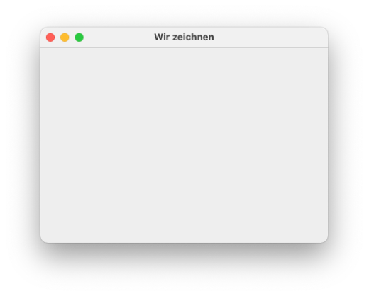
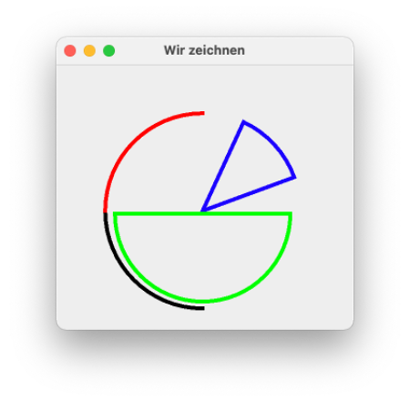
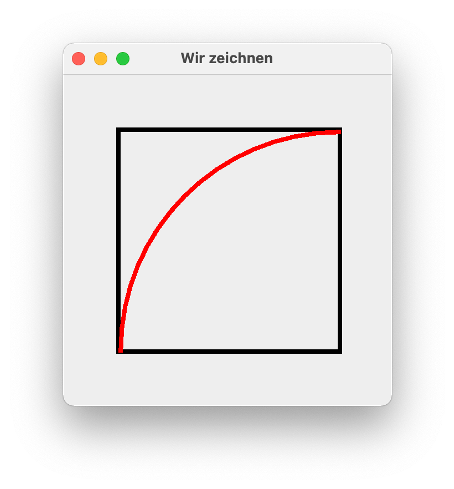
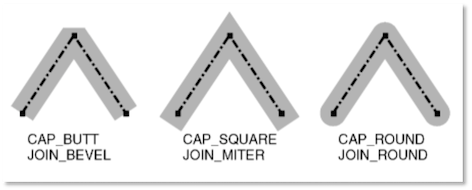

# Graphics

Wir werden unsere GUI nun um eine Komponente erweitern, in der wir zeichnen können. Im Prinzip wird unsere GUI **immer gezeichnet**. Die Steuerelemente sind nur vorformatiert und bestehen aus lauter Linien, Polygonen und Punkten, die zusammen dann so, wie z.B. ein Button aussehen. Wenn wir eine GUI haben und dieses Fenster z.B. die Größe ändert, wird es dabei jedes Mal neu gezeichnet. Diese (Neu-)Zeichnen wird dadurch angestoßen, dass für unser `JFrame` die Methode `paint()` aufgerufen wird. Diese Methode wird z.B. auch in der Methode `setVisible(true)` aufgerufen.  

Jede Komponente (also jedes Steuerelement und jeder Container) hat ihre eigene Objektmethode `paint()`, in der beschrieben ist, wie diese Komponente zu zeichnen ist. Genauer gesagt, werden in `paint()` folgende drei Methoden aufgerufen:

- `paintBorder()` - zeichnet den Rahmen der Komponente
- `paintChildren()` - ruft `paint()` für alle *Kindkomponenten* auf (also z.B. alle Steurelemente in einem `JPanel`)
- `paintComponent()` - zeichnet die Komponente (und ihre Kinder)

Damit überhaupt Linien und Punkte dargestellt werden können, gibt es eine Klasse `Graphics`, die, etwas vereinfacht gesagt, die Schnittstelle zwischen Hardware (dem Monitor) und dem zu zeichnenden Fenster darstellt. Alle Komponenten eines Fensters teilen sich genau **ein** Objekt dieser Klasse `Graphics`. Bei diesem Objekt wird auch vom *Graphics-Context* (*Grafikkontext*) gesprochen. Diese Klasse stellt eine Vielzahl von Methoden zur Verfügung, um einfache geometrische Objekte zu zeichnen, z.B.

- `drawLine()`, um eine Linie zu zeichnen,
- `drawOval()`, um eine (leere) Ellipse zu zeichnen,
- `drawRect()`, um ein (leeres) Rechteck zu zeichnen,
- `drawPolygon()`, um ein (leeres) Polygon (also ein Vieleck) zu zeichnen,
- `drawString()`, um ein Text zu zeichnen,
- `fillOval()`, um eine (ausgefüllte) Ellipse zu zeichnen,
- `fillRect()`, um ein (ausgefülltes) Rechteck zu zeichnen,
- `fillPolygon()`, um ein (ausgefülltes) Polygon (also ein Vieleck) zu zeichnen. 

Damit nun alle `paintX()`-Methoden (also `paint()`, `paintBorder()`, `paintComponent` und `paintChildren()`) Zugriff auf diesen Grafikkontext (das Objekt von `Graphics`) bekommen, wird es diesen Methoden übergeben. Das heißt, die Methoden sind so deklariert (alle `void`):

- `paint(Graphics g)`
- `paintBorder(Graphics g)` 
- `paintChildren(Graphics g)` 
- `paintComponent(Graphics g)` 


Die `Graphics`-Klasse gibt es schon seit Java 1.0. Allerdings hat man bereits sehr früh festgestellt, dass die Methoden in dieser Klasse nicht genügen, um "schöne" Grafiken zu erstellen. Deshalb hat man bereits in Java 1.1 eine neue Klasse `Graphics2D` eingeführt (hat von `Graphics` geerbt), in der hauptsächlich die Darstellung der geometrischen Objekte verbessert wurde, aber in der auch einige Methoden dazukamen, um z.B. andere Linienformen (gestrichelt, gepunktet, ...) zu definieren, andere Fonts für den Text usw. Tatsächlich handelt es sich seit JDK 1.2 bei dem Grafikkontext, also dem `Graphics`-Objekt `g` um ein Objekt der Klasse `Graphics2D`. 

### Eigene geometrische Objekte zeichnen

Bevor wir eigene geometrische Objekte zeichnen können, schauen wir zunächst nochmal auf unser "Grundgerüst" für eine GUI (siehe Kapitel [GUI Einführung](gui.md#erweitern-des-fensters-um-ein-jpanel)):


```java linenums="1"
import javax.swing.JFrame;
import javax.swing.JPanel;

public class MyFirstWindow extends JFrame
{
	
	public MyFirstWindow()
	{
		super();
		this.setTitle("My first window");
		this.setDefaultCloseOperation(JFrame.EXIT_ON_CLOSE);	
		
		this.getContentPane().add(this.initContent());
		
		this.setSize(400, 300);
		this.setLocation(300,200);
		this.setVisible(true);
	}
	
	private JPanel initContent()
	{
		JPanel mainPanel = new JPanel();
		// hier weitere Container oder Steuerelemente hinzufuegen
		return mainPanel;
	}

	public static void main(String[] args) 
	{
		new MyFirstWindow();
	}

}
```

Darin erzeugt die Methode `initContent()` ein `JPanel` und gibt es zurück. Dieses `JPanel` wird der `ContentPane` unseres Fensters hinzugefügt (Zeile `13`). Somit hat das `JFrame` ein *Kind*, nämlich das der `ContentPane` hinzugefügte `JPanel`. Wenn das `JFrame` nun *gezeichnet* wird, wird für dieses `JPanel` die Methode `paintComponent(Graphics g)` aufgerufen. Diese ist für ein `JPanel` so implementiert, dass ein hellgraues Rechteck ohne Rand (`Border`) gezeichnet wird. Würden wir dem `mainPanel` in der `initContent()`-Methode nun weitere Komponenten (Container oder Steuerlemente) hinzufügen, so würden diese alle so gezeichnet werden, wie für diese Komponenten die `paintComponent(Graphics g)`-Methode implementiert ist. 

Wir wollen nun aber **selbst** die `paintComponent(Graphics g)`-Methode für eine Komponente implementieren. Dazu entscheiden wir uns dafür, die `paintComponent()`-Methode von einem `JPanel` zu implementieren. *Aber wie kommen wir an diese Implementierung ran?* Indem wir von `JPanel` **erben**. Wenn wir eine Klasse erstellen, die von `JPanel` erbt, dann erben wir auch die Implementierung der `paintComponent()`-Methode von `JPanel` und können diese **überschreiben**.

Wir ändern dafür unser "Grundgerüst":


```java linenums="1" hl_lines="15 22-32"
import java.awt.Graphics;
import java.awt.Graphics2D;

import javax.swing.JFrame;
import javax.swing.JPanel;

public class MyFirstDrawingWindow extends JFrame{

	public MyFirstDrawingWindow()
	{
		super();
		this.setTitle("Wir zeichnen");
		this.setDefaultCloseOperation(JFrame.EXIT_ON_CLOSE);	
		
		this.getContentPane().add(new Canvas());
		
		this.setSize(400, 300);
		this.setLocation(300,200);
		this.setVisible(true);
	}
	
	private class Canvas extends JPanel
	{
		@Override
		protected void paintComponent(Graphics g)
		{
			super.paintComponent(g);		// Implementierung von JPanel aufrufen
			Graphics2D g2 = (Graphics2D)g;	// Methoden von Graphics2D nutzbar
			// hier koennen wir zeichnen
		}

	}

	public static void main(String[] args) 
	{
		new MyFirstDrawingWindow();
	}

}
```

An der Darstellung des Fensters ändert das zunächst gar nichts. Wenn wir das Programm ausführen, dann erscheint folgendes Fenster.



Das der `ContentPane` hinzugefügte `JPanel` wird also "ganz normal" als hellgraues Rechteck dargestellt. Der große Unterschied ist, dass es sich nun um ein Objekt unserer *inneren Klasse* `Canvas` handelt. Diese hat von `JPanel` geerbt. Ein Objekt von `Canvas` ist somit auch ein Objekt vom Typ `JPanel`. Aber wir können in `Canvas` die Methode `paintComponent(Graphics g)` **überschreiben** und somit eine eigene Implementierung für das Zeichnen unserer Komponente (einem `Canvas`-Objekt) erstellen. 


Innerhalb unserer eigenen Implementierung der `paintComponent()`-Methode rufen wir zunächst die `paintComponent()`-Methode von `JPanel` auf. Damit wird ein hellgraues Rechteck gezeichnet. Das sollten wir **immer** tun, da ansonsten manchmal unschöne Nebeneffekte entstehen. 

Außerdem sollten wir auch **immer** das `Graphics`-Objekt nach `Graphics2D` konvertieren, da uns in `Graphics2D` deutlich mehr Methoden zur Verfügung stehen (siehe z.B. [hier](https://docs.oracle.com/en/java/javase/11/docs/api/java.desktop/java/awt/Graphics2D.html) und [hier](https://docs.oracle.com/javase/tutorial/2d/index.html)).

??? Übung
	Die Methode `draw3DRect()` ist ein Beispiel für eine Methode, die in der `Graphics2D`-Klasse implementiert ist, aber in der Klasse `Graphics` nicht vorkommt. <br/>
	1. Warum funktioniert `Graphics2D g2 = (Graphics2D)g;` ? <br/>
	2. Warum funktioniert `g.draw3DRect()` nicht, aber `g2.draw3DRect()` doch (wenn jeweils Parameterliste stimmt)?

### Erste geometrische Objekte

Unser Fenster ist nun soweit vorbereitet und wir überschreiben die `paintComponent()`-Methode in unserer Klasse `Canvas`. Nun können wir darin beliebige Grafiken einfügen. Dazu rufen wir Methoden von `Graphics2D` auf. 

=== "paintComponent()-Methode in Canvas"
	```java linenums="24"
	@Override
	protected void paintComponent(Graphics g)
	{
		super.paintComponent(g);		// Implementierung von JPanel aufrufen
		Graphics2D g2 = (Graphics2D)g;	// Methoden von Graphics2D nutzbar
		
		g2.drawRect(40, 30, 200, 200);
		g2.drawOval(40, 30, 200, 200);
	}
	```

Die Methode `drawRect(int x, int y, int width, int height)` zeichnet ein Rechteck mit der Breite `width` und der Höhe `height`. Bei uns hat beides den Wert `200` und somit wird ein Quadrat gezeichnet. Die Werte `x` und `y` stehen für die Koordinaten des **linken oberen** Punktes des Rechtecks innerhalb des `JPanel`s, in dem wir zeichnen (also innerhalb der `ContentPane`). Der linke obere Punkt des `JPanel` hat die Koordinaten `(0,0)`, also gehen wir in dem Beispiel um `40` Pixel nach rechts und um `30` Pixel nach unten, um mit dem Zeichnen des Quadrates zu beginnen.

Die Methode `drawOval(int x, int y, int width, int height)` zeichnet eine Ellipse mit der Breite `width` und der Höhe `height`. Bei uns hat beides den Wert `200` und somit wird ein Kreis gezeichnet. Die Werte `x` und `y` stehen für die Koordinaten des **linken oberen** Punktes des gedachten Tangenetenvierecks um die Ellipse.

Der linke obere "Startpunkt" ist hier sowohl für den Kreis, als auch für das Quadrat der gleiche. Da auch Höhe und Breite jeweils gleich sind, passen die geometrischen Objekte genau ineinander, d.h. das Quadrat beschreibt das Tangenetenviereck um den Kreis. 


Sie können nun gerne beliebig die Methoden aus [Graphics2D](https://docs.oracle.com/en/java/javase/11/docs/api/java.desktop/java/awt/Graphics2D.html) ausprobieren. Es macht Spaß! Gerne auch beliebige Muster, z.B.


=== "paintComponent()-Methode in Canvas"
	```java linenums="24"
	@Override
	protected void paintComponent(Graphics g)
	{
		super.paintComponent(g);		// Implementierung von JPanel aufrufen
		Graphics2D g2 = (Graphics2D)g;	// Methoden von Graphics2D nutzbar
		
		for(int i=0; i<10; i++)
		{
			g2.drawOval(50+i*10, 50, 80, 80);
			g2.drawOval(50+i*10, 150, 80, 180);
		}
	}
	```


Anstelle der "vorgefertigten" Methoden für das Zeichnen von Rechtecken (`drawRect()`) und Ellipsen (`drawOval()`), können Sie auch immer erst entsprechende Objekte erzeugen und diese mithilfe der `draw()`-Methode zeichnen lassen, z.B. 


=== "paintComponent()-Methode in Canvas"
	```java linenums="24"
	@Override
	protected void paintComponent(Graphics g)
	{
		super.paintComponent(g);		// Implementierung von JPanel aufrufen
		Graphics2D g2 = (Graphics2D)g;	// Methoden von Graphics2D nutzbar
		
		Shape rectangle = new Rectangle2D.Double(40.0, 30.0, 200.0, 200.0);
		Shape circle = new Ellipse2D.Double(40.0, 30.0, 200.0, 200.0);
		
		g2.draw(rectangle);
		g2.draw(circle);
	}
	```

Das Interface `Shape` ist aus dem `java.awt`-Paket und die geometrischen Objekte sind aus dem `java.awt.geom`-Paket. Der Vorteil ist, dass für die geometrischen Objekte selbst viele Methoden existieren, um z.B. die Eigenschaften dieser Objekte abzufragen (z.B. Höhe oder Breite). Es gibt viele solcher Klassen - siehe dazu [Shape](https://docs.oracle.com/en/java/javase/11/docs/api/java.desktop/java/awt/Shape.html)  und darin `All Known Implementing Classes`.

Ein Kreisbogen kann z.B. mithilfe der Klassen `Arc2D.Double` oder `Arc2D.Float` gezeichnet werden. Ein Kreisbogen ist ein Teil einer Ellipse. Die Konstruktoren erwarten jeweils 7 Parameter (gibt auch jeweils noch andere Konstruktoren):

- `x`, x-Wert der linken oberen Ecke des Tangentenvierecks um die (gesamte) Ellipse,
- `y`, y-Wert der linken oberen Ecke des Tangentenvierecks um die (gesamte) Ellipse,
- `width`, Breite der (gesamten) Ellipse,
- `height`, Höhe der (gesamten) Ellipse,
- `start`, Startpunkt des Kreisbogens in Grad (0 ist "3 Uhr", 90 ist "12 Uhr", 180 ist "9 Uhr", 270 ist "6 Uhr"),
- `extent`, Länge des Kreisbogens in Grad (90 ist Viertelkreis, 180 ist Halbkreis, positiver Wert "gegen die Uhr", negativer Wert "mit der Uhr"),
- `type`, Auswahl zwischen `Arc2D.OPEN`, `Arc2D.PIE` und `Arc2D.CHORD`, siehe Abbildung.


Beispiele

=== "paintComponent()-Methode in Canvas"
	```java linenums="24"
	@Override
	protected void paintComponent(Graphics g)
	{
		super.paintComponent(g);		// Implementierung von JPanel aufrufen
		Graphics2D g2 = (Graphics2D)g;	// Methoden von Graphics2D nutzbar
		
		Shape arc1 = new Arc2D.Double(50.0, 50.0, 200.0, 200.0, 180.0, 90.0, Arc2D.OPEN);
		Shape arc2 = new Arc2D.Double(50.0, 50.0, 200.0, 200.0, 180.0, -90.0, Arc2D.OPEN);
		Shape arc3 = new Arc2D.Double(50.0, 50.0, 200.0, 200.0, 20.0, 45.0, Arc2D.PIE);
		Shape arc4 = new Arc2D.Double(60.0, 63.0, 180.0, 180.0, 0.0, -180.0, Arc2D.PIE);
		
		g2.setStroke(new BasicStroke(4.0f));	// dickere Linie
		g2.draw(arc1);
		g2.setColor(Color.RED);					// Zeichenfarbe rot
		g2.draw(arc2);
		g2.setColor(Color.BLUE);					
		g2.draw(arc3);
		g2.setColor(Color.GREEN);					
		g2.draw(arc4);
	}
	```




!!! Übung
	Erstellen Sie folgende Zeichnung:

	


Um die geometrischen Objekte gefüllt darzustellen, verwenden Sie anstelle von `draw(Shape s)` die `fill(Shape s)`-Methode.

### Linien

Die Linienart setzen Sie mithilfe der Methode `g2.setStroke(Stroke s)`. Das Interface `Stroke` wird von der Klasse `BasicStroke` implementiert (Beides aus dem `java.awt`-Paket). Das bedeutet, der Methode `setStroke()` wird ein `BasicStroke`-Objekt übergeben.

Die Klasse `BasicStroke` besitzt folgende Konstruktoren:

- `BasicStroke()`	
- `BasicStroke(float width)`	
- `BasicStroke(float width, int cap, int join)`	
- `BasicStroke(float width, int cap, int join, float miterlimit)`	
- `BasicStroke(float width, int cap, int join, float miterlimit, float[] dash, float dash_phase)`

Dabei gibt 
- `width` die Linienstärke als `float` an, z.B. `new BasicStroke(4.0f)`,
- `cap` beschreibt die Enden einer Linie. Es stehen drei vordefinierte Konstanten zur Verfügung: `CAP_BUTT`, `CAP_ROUND` und `CAP_SQUARE`

Beispiel:

=== "paintComponent()-Methode in Canvas"
	```java linenums="24"
	@Override
	protected void paintComponent(Graphics g)
	{
		super.paintComponent(g);		// Implementierung von JPanel aufrufen
		Graphics2D g2 = (Graphics2D)g;	// Methoden von Graphics2D nutzbar
		
		g2.setStroke(new BasicStroke(20, BasicStroke.CAP_BUTT, BasicStroke.JOIN_MITER));
		g2.drawLine(30, 50, 200, 50);
		g2.setStroke(new BasicStroke(20, BasicStroke.CAP_ROUND, BasicStroke.JOIN_MITER));
		g2.drawLine(30, 100, 200, 100);
		g2.setStroke(new BasicStroke(20, BasicStroke.CAP_SQUARE, BasicStroke.JOIN_MITER));
		g2.drawLine(30, 150, 200, 150);
	}
	```

ergibt: 


- Die Eigenschaft `join` von `BasicStroke` gibt an, wie sich zwei Linien an den Endpunkten verbinden. Es gibt die drei vordefinierten Konstanten `JOIN_BEVEL`, `JOIN_MITER` und `JOIN_ROUND`. Die Unterscheidung zeigt am besten die folgende Grafik:

 

- Mit dem `join` von Linien hat auch `miterlimit` zu tun. Es muss größer gleich `1.0f` sein und ist nur für `JOIN_MITER` von Bedeutung.
- Mit `dash` kann ein `float[]` für ein Muster des Strichelns der Linie angegeben werden.
- Mit `dash_phase` kann angegeben werden, nach welcher Verzögerung die Anwendung des `dash`-Musters erfolgt.


Beispiel:

=== "paintComponent()-Methode in Canvas"
	```java linenums="24"
	@Override
	protected void paintComponent(Graphics g)
	{
		super.paintComponent(g);		// Implementierung von JPanel aufrufen
		Graphics2D g2 = (Graphics2D)g;	// Methoden von Graphics2D nutzbar
		
		float[] dash1 = { 20.0f };
		float[] dash2 = { 20.0f, 40.0f };
		g2.setStroke(new BasicStroke(20.0f, BasicStroke.CAP_BUTT, BasicStroke.JOIN_MITER, 1.0f, dash1, 0.0f));
		g2.drawLine(30, 50, 350, 50);
		g2.setStroke(new BasicStroke(20.0f, BasicStroke.CAP_BUTT, BasicStroke.JOIN_MITER, 1.0f, dash2, 0.0f));
		g2.drawLine(30, 100, 350, 100);
		g2.setStroke(new BasicStroke(20.0f, BasicStroke.CAP_BUTT, BasicStroke.JOIN_MITER, 1.0f, dash1, 10.0f));
		g2.drawLine(30, 150, 350, 150);
	}
	```

ergibt: 


### Farben

Das Java-Farbmodell basiert auf dem [RGB-Farbmodell](https://wisotop.de/Farbmodelle-RGB-CMYK-HSS-HSL.php), wobei jede Farbe durch `24Bit` repräsentiert wird (`24Bit` *Farbtiefe*). Das bedeutet, dass für jeden Farbanteil von Rot, Grün, Blau jeweils `8Bit` zur Verfügung stehen und die einzelnen Farbanteile somit einen Wert zwischen `0` und `255` annehmen können. Einige Farben und deren Farbanteile von Rot, Grün und Blau sind in der folgenden Tabelle dargestellt:

|Farbe |Rot-Anteil |Grün-Anteil |Blau-Anteil |
|------|:-----------|:------------|:------------|
|Weiß |255 |255 |255 |
|Schwarz |0 |0 |0 |
|Grau |127 |127 |127 |
|Rot|255 |0 |0 |
|Grün |0 |255 |0 |
|Blau |0 |0 |255 |
|Gelb |255 |255 |0 |
|Magenta |255 |0 |255 |
|Cyan |0 |255 |255 |

Die Klasse `Color` aus dem `java.awt`-Paket besitzt sieben Konstruktoren. Die wichtigsten sind

- `public Color(int r, int g, int b)`, mit den `int`-Werten jeweils von `0` bis `255` für die Farbanteile,
- `public Color(float r, float g, float b)`, mit den `float`-Werten jeweils von `0.0f` bis `1.0f` für die Farbanteile,

und die Pendants mit einem zusätzlichen *Alpha-Anteil* für die Transparenz:

- `public Color(int r, int g, int b, int alpha)`, `0` bis `255` (`0` vollständig transparent, `255` deckend),
- `public Color(float r, float g, float b, float alpha)`, `0.0f` bis `1.0f` (`0` vollständig transparent, `1.0` deckend).

In `Color` sind darüber hinaus folgende Farben als statische Konstanten definiert:

- `WHITE`, `BLACK`, `BLUE`, `CYAN`, `DARKGRAY`, `GRAY`, `GREEN`, `LIGHTGRAY`, `MAGENTA`, `ORANGE`, `PINK`, `RED`, `YELLOW`


Beispiel:

=== "paintComponent()-Methode in Canvas"
	```java linenums="24"
	@Override
	protected void paintComponent(Graphics g)
	{
		super.paintComponent(g);		// Implementierung von JPanel aufrufen
		Graphics2D g2 = (Graphics2D)g;	// Methoden von Graphics2D nutzbar
		
		int diffX = 200;
		int diffY = 130;
		Color color;
		color = new Color(205,107,117,127);
		g2.setColor(color);
		g2.fillRect(50, 50, 150, 100);
		
		color = new Color(205,107,117,255);
		g2.setColor(color);
		g2.fillRect(50, 50+diffY, 150, 100);
		
		g2.setColor(Color.WHITE);
		g2.fillRect(50, 50+2*diffY, 150, 100);
		
		color = new Color(100,255,100,127);
		g2.setColor(color);
		g2.fillRect(50+diffX, 50, 150, 100);
		
		color = new Color(100,255,100,255);
		g2.setColor(color);
		g2.fillRect(50+diffX, 50+diffY, 150, 100);
		
		g2.setColor(Color.GREEN);
		g2.fillRect(50+diffX, 50+2*diffY, 150, 100);
		
		
		color = new Color(100,100,255,127);
		g2.setColor(color);
		g2.fillRect(50+2*diffX, 50, 150, 100);
		
		color = new Color(100,100,255,255);
		g2.setColor(color);
		g2.fillRect(50+2*diffX, 50+diffY, 150, 100);
		
		g2.setColor(Color.BLUE);
		g2.fillRect(50+2*diffX, 50+2*diffY, 150, 100);
	}
	```

ergibt: 


Mit den Klassen [LinearGradientPaint](https://docs.oracle.com/en/java/javase/15/docs/api/java.desktop/java/awt/LinearGradientPaint.html) und [GradientPaint](https://docs.oracle.com/en/java/javase/15/docs/api/java.desktop/java/awt/GradientPaint.html) können Farbverläufe implementiert werden. 


Beispiel:

=== "paintComponent()-Methode in Canvas"
	```java linenums="24"
	@Override
	protected void paintComponent(Graphics g)
	{
		super.paintComponent(g);		// Implementierung von JPanel aufrufen
		Graphics2D g2 = (Graphics2D)g;	// Methoden von Graphics2D nutzbar
		
		GradientPaint gp = new GradientPaint(0,0,Color.RED, 300, 100, Color.WHITE);
		g2.setPaint(gp);
		g2.fillRect(50, 50, 300, 100);
	}
	```

ergibt: 


### Höhe und Breite abhängig von der Canvas-Größe

Angenommen, Sie wollen eine geometrischen Figur so zeichnen, dass sich ihre Größe der Größe des Fensters anpasst. Dazu stehen Ihnen die Methoden `getHeight()` und `getWidth()` von `JPanel` (und somit von Ihrem `Canvas`-Objekt) zur Verfügung. Die linke obere Ecke des `JPanels` hat die Koordinaten `[x=0, y=0]` und die rechte untere Ecke hat die Koordinaten `[x=this.getWidth(), y= this.getHeight()]`, d.h

- für den linken Rand gilt `x = 0`,
- für den rechten Rand gilt `x = this.width()`,
- für den oberen Rand gilt `y = 0` und
- für den unteren Rand gilt `y = this.height()`.

Angenommen, wir wollen ein Rechteck einpassen, das jeweils `30` Pixel von allen vier Rändern Abstand hat, dann definieren wir:


Beispiel:

=== "paintComponent()-Methode in Canvas"
	```java linenums="24"
	@Override
	protected void paintComponent(Graphics g)
	{
		super.paintComponent(g);		// Implementierung von JPanel aufrufen
		Graphics2D g2 = (Graphics2D)g;	// Methoden von Graphics2D nutzbar
		
		int abstand = 30;
		int links = abstand;
		int oben = abstand;
		int rechts = this.getWidth() - abstand;
		int unten = this.getHeight() - abstand;
		int breite = rechts - links;
		int hoehe = unten - oben;
		
		g2.drawRect(links, oben, breite, hoehe);
	}
	```

ergibt: 


noch ein Beispiel - wir passen ein Dreieck in das Fenster ein:

=== "paintComponent()-Methode in Canvas"
	```java linenums="24"
	@Override
	protected void paintComponent(Graphics g)
	{
		super.paintComponent(g);		// Implementierung von JPanel aufrufen
		Graphics2D g2 = (Graphics2D)g;	// Methoden von Graphics2D nutzbar
		
			int abstand = 30;
			int links = abstand;
			int oben = abstand;
			int rechts = this.getWidth() - abstand;
			int unten = this.getHeight() - abstand;
			int breite = rechts - links;
			int hoehe = unten - oben;
			int mitteVertikal = this.getWidth()/2;
			
			g2.drawLine(links, unten, mitteVertikal, oben);
			g2.drawLine(mitteVertikal, oben, rechts, unten);
			g2.drawLine(rechts, unten, links, unten);
	}
	```

ergibt: 


!!! success
	Wir können eigene Grafiken erstellen. Wir erstellen dazu eine innere Klasse, die von `JPanel` erbt. Der Grund dafür ist, dass wir die Methode `paintComponent(Graphics g)` überschreiben wollen und darin mithilfe der Methoden aus der Klasse `Grahpcs2D` geometrische Objekte erstellen. Außerdem haben wir das Farbmodell von Java kennengelernt und können die Grafiken an die Fenstergröße anpassen. In der kommenden Lektion lernen wir, wie wir mithilfe der Maus zeichnen können.  
