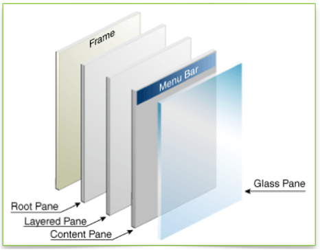
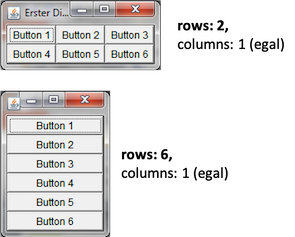

# Graphical User Interfaces

Bis jetzt haben wir unsere Ein- und Ausgaben über die Konsole erledigt oder wir haben Testklassen geschrieben, um Funktionalitäten unserer Programme zu testen. Nun wollen wir grafische Nutzeroberflächen (*Graphical User Interfaces (GUI)*) erstellen, also Fenster, die Steuerelemente enthalten. Steuerelemente sind Ein- und Ausgabeelemente, Labels (also Text), Buttons, Checkboxes, Radiobuttons usw. 

Das Java Developement Kit (JDK) beinhaltet verschiedene Bibliotheken zum Erstellen grafischer Nutzeroberflächen:

- AWT (abstract window toolkit) `java.awt`; alt, aber noch viele Sachen, die man heute noch nutzt: Farben, Listener für Maus und Tastur, Grafiken, ...
- Swing `javax.swing`; das verwenden wir zum Erstellen von Fenstern, auch nicht mehr ganz neu
- JavaFX `javafx`; sollte eigentlich Swing ablösen, hat sich aber nicht durchgesetzt, seit Java 11 nicht mehr Bestandteil des Standard-JDK

Swing ist, wie bereits gesagt, auch nicht mehr neu und wird häufig als veraltet bezeichnet. Allerdings gibt es auch keine Alternativen. JavaFX sollte Swing ablösen, hat sich jedoch noch nicht durchgesetzt. Wir verwenden Swing aus zwei Gründen:

- erstens ist es immer noch das am meisten verwendete Framework für die Erstellung von GUIs in nativen Desktopanwendungen (also alles, was nicht "Web" und was nicht "mobile" ist), bspw. wurde IntelliJ mit Swing aufgebaut und
- zweitens geht es uns um die *Konzepte*, d.h. um den hierarchischen Aufbau der Oberflächen, um Nutzereignisse und die Behandlung dieser. Wir werden uns im 3. Semester in "Webtechnologien" mit der Erstellung moderner Weboberflächen beschäftigen und dabei auf die Grundlagen aufbauen, die wir hier legen. Die Konzepte sind nämlich dieselben. 

### Elemente einer GUI

Eine GUI besteht aus verschiedenen Elementen, deren Zusammenspiel erst die *Benutzbarkeit* der Oberfläche ermöglichen. Unter *Benutzbarkeit* ist dabei die einfache, intuitive und übersichtliche Ein- und Ausgabe von Daten gemeint. Im 6. Semester gibt es eine ganze Lehrveranstaltung zum Thema *Usability* in unserem Studiengang. 


Folgende Elemente sind in einer GUI von Bedeutung:

- Das **Fenster** stellt den äußeren Rahmen einer grafischen Anwendung dar. Es enthält typischerweise einen Rahmen und eine Titelleiste, in der der Name des Fensters bzw. der Anwendung (in der oberen Abbildung `Window`) und drei Buttons zum Schließen des Fensters bzw. der Anwendung (das rote Kreuz in der oberen Abbildung), zum Vollbildmodus (das Quadrat) und zum Verkleinern des Fensters in die Taskleiste (der Unterstrich) enthalten sind. Der Rahmen, genau wie die Titelleiste mit den drei Buttons, sind aber optional. Ein Fenster enthält **Komponenten**.
- **Komponenten** sind alle Oberflächen- bzw. Steuerelemente, d.h. Buttons (siehe oben `< Back` und `Next >`), Labels (Texte, z.B. `Checkbox`), Checkboxes (die Quadrate, die ein Häkchen haben können oder auch nicht), Ein- und Ausgabefelder, Auswahllisten usw. *Steuerelemente* sind also alle Elemente, die direkt der Ein- und Ausgabe dienen. Darüber hinaus gibt es noch die Komponente *Container*. Ein *Container* kann selbst wieder *Container*  enhalten oder *Steuerelemente*. *Container* sind nicht direkt sichtbar, sondern sie dienen der Strukturierung einer grafischen Oberfläche. 
- **Layoutmanager** organisieren die Positionierung von Komponenten. Mithilfe von Layoutmanagern kann man Container unter- und/oder nebeneinander positionieren und organisiert somit die Anordnung der Steuerelemente. 
- **Menüs** sind einblendbare Befehlsleisten. Es gibt die Menüs, die meistens oben in der Menüleiste verankert sind und *Kontextmenüs*, die dort erscheinen, wo man, meistens mit der rechten, Maustaste hinklickt. 
- **Events** (*Ereignisse*) haben zunächst nichts mit der Darstellung selbst zu tun. Sie sind aber für die Benutzbarkeit sehr wichtig, denn jede Nutzeraktion löst ein Ereignis aus, welches wir im Programm behandeln können, z.B. Mausklicks, Mausbewegungen, Tastatureingaben, Bewegen, Vergrößern, Verkleinern des Fensters usw. Wir werden uns sehr ausführlich mit der *Behandlung von Ereignissen* beschäftigen.
- **Zeichenoperationen** dienen der Erstellung von Punkten, Linien, Text usw. in Fenstern. Während die Steuerelemente ein festes Aussehen besitzen (anpassbar, je nach Betriebssystem und unterschiedlichen *Look&Feel*-Frameworks), können mit Zeichenoperationen beliebige Elemente erstellt und dargestellt werden, z.B. Grafiken, Kurven oder Diagramme.

Wir werden auf alle diese Elemente eingehen und starten jetzt aber mit unserem ersten Fenster. 

### Ein erstes Fenster mit Swing

Wir erstellen uns eine Klasse `MyFirstWindow`. Von dieser Klasse erzeugen wir uns ein Objekt. Dazu implementieren wir den parameterlosen Konstruktor dieser Klasse. In diesem Konstruktor wird ein `JFrame` erzeugt - das ist das **Fenster** bei Swing. Wir haben in dieser Klasse auch eine `main()`-Methode. Das ist nicht ganz sauber, da die `main()`-Methode ja eigentlich keine Eigenschaft unserer Klasse ist, deren *Responsibility* die Erstellung eines Fensters ist, aber wir vereinfachen hier zu Anfang:

```java linenums="1"
import javax.swing.JFrame;

public class MyFirstWindow 
{
	
	public MyFirstWindow()
	{
		JFrame window = new JFrame();
		window.setTitle("My first window");
		window.setDefaultCloseOperation(JFrame.EXIT_ON_CLOSE);
		window.setSize(400, 300);
		window.setLocation(300,200);
		window.setVisible(true);
	}

	public static void main(String[] args) 
	{
		new MyFirstWindow();
	}

}
```

Wenn wir diese Klasse ausführen, erscheint folgendes Fenster:


Das Aussehen ist betriebssystemabhängig. Probieren Sie die drei "Knöpfe" in der Titelleiste aus, sie funktionieren bereits, d.h. das Fenster lässt sich in die Taskleiste verkleinern, es lässt sich in den Vollbildmodus umschalten und es kann geschlossen werden (und damit das ganze Programm). Sie können es auch bereits in der Größe verändern. 

Wir betrachten das Programm im Detail:

- In Zeile `8` wird ein Objekt der Klasse `JFrame` erzeugt. Diese Klasse muss aus dem `javax.swing`-Paket importiert werden (Zeile `1`). Sollte der Import bei Ihnen nicht funktionieren, müssen Sie in Ihre `module-info.java` noch `requires java.desktop;` einfügen, um dieses Modul zu laden. Die Klasse `JFrame` repräsentiert ein Fenster im Swing-Paket. Das bedeutet, dass wir, wenn wir in Zukunft eine GUI mithilfe von Swing erstellen, immer damit beginnen, ein Objekt der Klasse `JFrame` zu erzeugen - nämlich ein Fenster. 
- Die Klasse [JFrame](https://docs.oracle.com/en/java/javase/15/docs/api/java.desktop/javax/swing/JFrame.html) stellt eine Unmenge an Objektmethoden zur Verfügung, um das Fenster zu verändern. Viele dieser Methoden sind auch aus Klassen des `java.awt`-Pakets geerbt, z.B. von [Frame](https://docs.oracle.com/en/java/javase/15/docs/api/java.desktop/java/awt/Frame.html), von [Component](https://docs.oracle.com/en/java/javase/15/docs/api/java.desktop/java/awt/Component.html), von [Container](https://docs.oracle.com/en/java/javase/15/docs/api/java.desktop/java/awt/Container.html) oder von [Window](https://docs.oracle.com/en/java/javase/15/docs/api/java.desktop/java/awt/Window.html), aber dazu kommen wir später. Wir wenden einige dieser Methoden bereits an:
- In Zeile `9` setzen wir mithilfe der Objektmethode `setTitle()` einen Titel für unser Fenster, hier `"My first window"`. Um den Titel zu setzen, gibt es auch einen parametrisierten Konstruktor von `JFrame`, dem dieser Titel übergeben werden kann. 
- In Zeile `10` definieren wir, was passieren soll, wenn wir auf den `Schließen`-Buttons des Fensters klicken (also auf das rote Kreuz oder den roten Kreis in der Titelleiste). Mit der statischen Konstanten `EXIT_ON_CLOSE` aus der Klasse `JFrame` legen wir fest, dass sowohl das Fenster geschlossen als auch das Programm beendet werden soll, wenn wir den `Schließen`-Button anklicken. Diese Option ist auch die einzig empfohlene Option für das Schließen des (Haupt-)Fensters. Leider ist sie nicht Standard, so dass wir das immer mitprogrammieren müssen. Sollten Sie diese Anweisung vergessen, so schließt sich zwar das Fenster, nicht jedoch das Programm. 
- In Zeile `11` legen wir die Größe des Fensters in Pixeln fest. Hier wird die Breite mit `400`Pixeln und die Höhe mit `300` Pixeln festgelegt. Die Größe des Fensters ist somit abhängig von der Auflösung Ihres Monitors. Wenn Sie diese Angabe "vergessen", erscheint das Fenster genau so groß, wie es nötig ist, um alle Steuerelemente in dem Fenster darzustellen. Sie würden also nur die drei Knöpfe in der Titelleiste sehen. Diese "minimal erforderliche" Größe eines Fensters erreicht man auch mit der Objektmethode `pack()`, die das Fenster genau so groß darstellt, dass alle Steuerelemente sichtbar sind. 
- In Zeile `12` legen wir fest, *wo* das Fenster auf unserem Monitor erscheint. Die linke obere Ecke des Monitors hat die Koordinaten `(0,0)`. Der erste Parameterwert in `setLocation()` legt fest, wie weit nach *rechts* der linke obere Punkt des Fensters auf unserem Monitor verschoben wird und der zweite Parameterwert legt fest, wie weit nach *unten* der linke obere Punkt des Fensters verschoben wird. Hier verschieben wir also das Fenster um `300` Pixel nach rechts und um `200` Pixel nach unten. Wenn Sie diese Angabe nicht treffen, erscheint das Fenster in der linken oberen Ecke des Monitors. 
- In Zeile `13` setzen wir das Fenster auf *sichtbar*. Diese Anweisung sollten wir nicht vegessen, denn ansonsten sieht man das Fenster nicht und Sie wundern sich. 


#### setDefaultCloseOperation()

Mit der Objektmethode `setDefaultCloseOperation()` wird das Verhalten bei Schließen des Fensters definiert. Dafür wurden Konstanten in der Klasse `JFrame` definiert (genauer gesagt in der Klasse `javax.swing.WindowConstants`). Es wird empfohlen, dass wir für unser Hauptfenster stets `JFrame.EXIT_ON_CLOSE`) verwenden, da dann beim Schließen des Fensters auch das Programm beendet wird. Das ist aber leider nicht der Standardwert, deshalb müssen wir es immer explizit angeben. Hier eine Übersicht der vordefinierten Konstanten und ihrer Bedeutung:

|Konstante |Bedeutung |
|----------|----------|
|DO_NOTHING_ON_CLOSE |Es wird keine Aktion ausgeführt. Die Reaktion auf das Schließen muss vom Benutzer selbst über einen WindowListener realisiert werden. (windowClosing) |
|HIDE_ON_CLOSE |Versteckt das Fenster vor dem Benutzer. Alle Objekte und Ressourcen bleiben im Speicher erhalten und das Fenster kann jederzeit wieder sichtbar gemacht werden. |
|DISPOSE_ON_CLOSE |Das Fenster wird vom Bildschirm entfernt und alle Objekte und Ressourcen freigegeben. Wenn das letzte Fenster mit dieser Eigenschaft geschlossen wird verhält sich die Anwendung wie bei EXIT_ON_CLOSE. |
| EXIT_ON_CLOSE |Beendet die Anwendung und alle Fenster werden geschlossen und Ressourcen freigegeben. (System.exit(0)) |

#### Kurzer Überblick JFrame

Ein `JFrame` ist der äußere Rahmen einer Swing-Anwendung. Die Klasse befindet sich im Paket `javax.swing`. Ein Fenster (`JFrame`) hat 

- eine Titelleiste mit den drei bekannten Schaltflächen (`decorated`); 	`setUndecorated(boolean v)`
- einen Rahmen (`javax.swing.Border`) 
- Sichtbarkeit; `setVisible(boolean v)`
- Transparenz; 	`setOpacity(float f)` (0 durchsichtig; 1.0 undurchsichtig)
- eine Größe; 	`setSize(int b, int h)`
- eine Position; `setLocation(int x, int y)`
- eine Form; `setShape(Shape s)`

und kann 

- im Vordergrund sein; 	`toFront()`
- im Hintergrund sein; 	`toBack()`


### Unsere Klasse ist selbst ein Fenster

Ehe wir weitere Methoden für `JFrame` ausprobieren, ändern wir die Implementierung unserer Klasse leicht. Derzeit haben wir **in** unserer Klasse ein Fenster erzeugt. Nun soll unsere Klasse **selbst** (besser gesagt: ein Objekt unserer Klasse) ein Fenster sein. Dazu lassen wir unsere Klasse von `JFrame` erben:

```java linenums="1" hl_lines="3 8"
import javax.swing.JFrame;

public class MyFirstWindow extends JFrame
{
	
	public MyFirstWindow()
	{
		super();	// Konstruktor von JFrame
		this.setTitle("My first window");
		this.setDefaultCloseOperation(JFrame.EXIT_ON_CLOSE);
		this.setSize(400, 300);
		this.setLocation(300,200);
		this.setVisible(true);
	}

	public static void main(String[] args) 
	{
		new MyFirstWindow();
	}

}
```

Die wesentlichen Änderungen sind:

- Die Klasse `MyFirstWindow` erbt von `JFrame` (Zeile `3`). Jedes Objekt der Klasse `MyFirstWindow` ist also (auch) ein Objekt der Klasse `JFrame` - und damit selbst ein Fenster. 
- Im Konstruktor von `MyFirstWindow` rufen wir mit `super();` den Konstruktor von `JFrame` auf (Zeile `8`). Damit wird das Fenster erstellt. 
- Die Objektmethoden von `JFrame` werden jetzt alle von der Referenz `this` aufgerufen, dem Fenster-Objekt.

Wir werden auf diesem *Grundgerüst* für die Erstellung eines Fensters aufbauen, d.h. wir verwenden in Zukunft diese zweite Variante und ziehen sie der ersten vor. 

### Die Content Pane des Fensters

Bevor wir dem Fenster nun Komponenten hinzufügen, ist es noch erwähnenswert, dass ein Fenster aus verschiedenen "Schichten" besteht, sogenannten *panes*. Die folgende Abbildung zeigt die *panes* eines JFrames. 



Um dies besser zu erläutern, versuchen wir, die Hintergrundfarbe des Fensters neu zu setzen. Dazu steht in der Klasse `JFrame` die Methode `setBackground(Color)` zur Verfügung. Diese Methode erwartet ein `Color`, welche im `java.awt`-Paket zur Verfügung steht. Der erste Implementierungsversuch wäre deshalb wie folgt:

```java linenums="1" hl_lines="1 12"
import java.awt.Color;
import javax.swing.JFrame;

public class MyFirstWindow extends JFrame
{
	
	public MyFirstWindow()
	{
		super();
		this.setTitle("My first window");
		this.setDefaultCloseOperation(JFrame.EXIT_ON_CLOSE);
		this.setBackground(Color.CYAN);
		this.setSize(400, 300);
		this.setLocation(300,200);
		this.setVisible(true);
	}

	public static void main(String[] args) 
	{
		new MyFirstWindow();
	}

}
```

Wir wollen unseren Fesnterhintergrund also mit der vorderfinierten Farbe `CYAN` einfärben. Wenn wir dieses Programm ausführen, erhalten wir folgendes Fenster:


Zwar färbt sich die Titelleiste des Fensters, aber der Rest bleibt offensichtlich grau. Das liegt daran, dass die *Content Pane* des Fensters vor dem Hintergrund liegt. 

> Alle Komponenten fügen wir der Content Pane des Fensters hinzu! Das gilt auch für Färbungen des Hintergrunds. 

Die *Content Pane* ist dazu da, die Komponenten hinzuzufügen und darzustellen. Wenn wir einen anderen Hintergrund für das Fenster (unterhalb der Titelleiste) wünschen, dann müssen wir den Hintergrund der *Content Pane* einfärben. 

Den Zugriff auf die *Content Pane* erhalten wir mithilfe der Objektmethode 

```java
.getContentPane()
```

Unser Beispiel des Einfärbens des Hintergrundes sieht also korrekt so aus:

```java linenums="1" hl_lines="12"
import java.awt.Color;
import javax.swing.JFrame;

public class MyFirstWindow extends JFrame
{
	
	public MyFirstWindow()
	{
		super();
		this.setTitle("My first window");
		this.setDefaultCloseOperation(JFrame.EXIT_ON_CLOSE);
		this.getContentPane().setBackground(Color.CYAN);
		this.setSize(400, 300);
		this.setLocation(300,200);
		this.setVisible(true);
	}

	public static void main(String[] args) 
	{
		new MyFirstWindow();
	}

}
```

Beachten Sie, dass die *Content Pane* des Fensters zwar nun `CYAN` ist, dafür aber nicht mehr die Titelleiste. Wenn wir diese auch färben sollen, dann gehen wir auch noch wie oben vor. 


#### Container-Komponenten

Ehe wir Steuerelemente zu unserem Fenster hinzufügen, wollen wir auf die Unterscheidung zwischen *Steuerelementen* und *Containern* eingehen. Ein Fenster enthält *Komponenten* (`JComponent`). *Komponenten* können sein:

- *Steuerelemente*; das sind die sichtbaren Teile im Fenster, d.h. Buttons, Eingabefelder, Checkboxen usw. und
- *Container*; diese sieht man nicht direkt, sie dienen der Strukturierung der GUI. 

*Container* können weitere *Komponenten* (also *Container* oder *Steuerelemente*) enthalten. *Steuerelemente* enthalten aber **keine** weiteren *Komponenten*. Durch das Verschachteln von *Containern* in *Containern* entsteht eine "Hierarchie" (oder besser gesagt: eine "Baumstruktur") in unserer GUI:


Wichtig ist: 

- die Knoten des Baumes sind *Container* und
- die Blätter des Baumes sind *Steuerelemente* 

#### Inhalt der Content Pane

- Die *Content Pane* ist selbst ein *Container*. 
- Zur *Content Pane* können neue *Komponenten* (*Container* oder *Steuerelemente*) hinzugefügt werden. 
- Zum Hinzufügen neuer *Komponenten* wird die Objektmethode `add()` verwendet.
- Eine typische Klasse für einen *Container* ist die Klasse `JPanel`. `JPanels` können also ineinander verschachtelt werden, d.h. ein `JPanel` kann selbst wieder anderer `JPanels` entahlten (oder *Steuerelemente*).
- Typische *Steuerelemente* (die in der Baumstruktur die “Blätter“ bilden), sind `JButton`, `JLabel`, `JCheckBox`, `JRadioButton`, ...

#### Erweitern des Fensters um ein JPanel

Wir fügen unserer *Content Pane* nun ein `JPanel` (einen *Container*) hinzu und werden dieses `JPanel` danach mit weiteren *Komponenten* befüllen. Unser neues **Grundgerüst eines Fensters** sieht nun so aus:

```java linenums="1" hl_lines="3 15-16 23-28"
import java.awt.Color;
import javax.swing.JFrame;
import javax.swing.JPanel;

public class MyFirstWindow extends JFrame
{
	
	public MyFirstWindow()
	{
		super();
		this.setTitle("My first window");
		this.setDefaultCloseOperation(JFrame.EXIT_ON_CLOSE);
		this.getContentPane().setBackground(Color.CYAN);	
		
		JPanel content = this.initContent();
		this.getContentPane().add(content);
		
		this.setSize(400, 300);
		this.setLocation(300,200);
		this.setVisible(true);
	}
	
	private JPanel initContent()
	{
		JPanel mainPanel = new JPanel();
		// hier weitere Container oder Steuerelemente hinzufuegen
		return mainPanel;
	}

	public static void main(String[] args) 
	{
		new MyFirstWindow();
	}

}
```

- In Zeile `15` deklarieren wir eine Referenzvariable namens `content` vom Typ `JPanel`. Dazu muss die Klasse `JPanel` aus dem `javax.swing`-Paket importiert werden (Zeile `3`). 
- Dieses `JPanel` wird durch die Methode `initContent()` erzeugt, welche ein `JPanel` zurückgibt (Zeile `27`).
- In der Methode `initContent()` wird dieses `JPanel` erzeugt (Zeile `25`) unter Verwendung des parameterlosen Konstruktors von `JPanel`. 

Das so erzeugte Fenster sieht so aus:


**Beachten Sie**, dass der Hintergrund nun nicht mehr `CYAN` gefärbt ist! Deshalb werden wir diese Anweisung auch gleich entfernen. Der Grund dafür ist, dass zwar die *Content Pane* cyan ist, aber **davor** befindet sich jetzt ein `JPanel` (`content`), welches grau (Standardwert) ist. Dieses `JPanel` befüllt die gesamte *Content Pane*. Diese ist also gar nicht mehr zu sehen. 

#### Erweitern der initContent()-Methode

Wir werden die `initContent()`-Methode nun sukzessive erweitern, indem wir *Steuerelemente* (und später auch weitere *Container*, also `JPanel`) hinzufügen. Dabei ist das generelle Vorgehen stets gleich:

1. Steuerelement-Objekt erzeugen
2. Steuerelement-Objekt dem Container (dem `JPanel`) hinzufügen

Wir betrachten nur die `initContent()`-Methode (die erforderlichen Klassen müssen aus dem `javax.swing`-Paket importiert werden - oder Sie wählen `import javax.swing.*;`):


```java linenums="23" hl_lines="5-13"
	private JPanel initContent()
	{
		JPanel mainPanel = new JPanel();
		
		// Steuerlement-Objekte erstellen
		JLabel label = new JLabel("Name: ");
		JTextField input = new JTextField(10);
		JButton button = new JButton("Klick mich!");

		// Steuerlement-Objekte dem Container (JPanel) hinzufuegen
		mainPanel.add(label);
		mainPanel.add(input);
		mainPanel.add(button);

		return mainPanel;
	}
```

Das Fenster sieht nun so aus:


Wir haben also ein `JLabel` (einen Text) hinzugefügt ("Name"), ein `JTextField` (ein Eingabefeld, für das die Breite `10` Zeichen definiert wurde) sowie ein `JButton` (ein Button, auf dem "Klick mich!" steht). Bei allen drei Elementen handelt es sich um *Steuerelemente*. 

Beachten Sie, dass die Elemente nebeneinander angeordnet sind. Das ist die Standardeinstellung für ein `JPanel`. Solche Einstellungen können später mit einem *Layout-Manager* geändert werden. Die Steuerelemente werden solange nebeneinander angeordnet, solange sie nebeneinander passen. Wenn Sie die Fensterbreite schmaler gestalten (mit der Maus zusammenschieben), schieben sich die Steuerelemente untereinander. Um aber Kontrolle über die Anordnung der Steuerelemente zu gelangen, betrachten wir nun *Layout-Manager*. 

### Layout-Manager

*Layout-Manager* dienen der Anordnung von Komponenten. Es gibt viele Layout-Manager (`FlowLayout`, `BorderLAyout`, `CardLayout`, `OverlayLayout`, `GridLayout`, `GridBagLayout`, `BoxLayout`, `GroupLayout`, ...). Wir werden aber nicht alle betrachten, da dies erstens auf Dauer langweilig ist und zweitens [Layout-Manager ineinander verschachtelt](#verschachteln-von-layout-managern) werden können. Vielmehr können *Container* ineinander verschachtelt werden und diesen *Containern* unterschiedliche Layout-Manager zugewiesen werden. 

Es wird also einem *Container* ein Layout-Manager zugewiesen und die *Komponenten* in diesem *Container* sind dann so angeordnet, wie der Layout-Manager es definiert (nebeneinander oder untereinander oder übereinander ...). Das Zuweisen 
eines Layout-Managers zu einem *Container* erfolgt mithilfe von

```java
setLayout(new Layoutmanager()) // Layoutmanager durch entsprechenden Namen ersetzen
```

Wir betrachten im Folgenden drei Layout-Manager und diese genügen völlig für alle GUIs, die wir erstellen wollen:

- [FlowLayout](https://docs.oracle.com/javase/tutorial/uiswing/layout/flow.html)
- [GridLayout](https://docs.oracle.com/javase/tutorial/uiswing/layout/grid.html)
- [BorderLayout](https://docs.oracle.com/javase/tutorial/uiswing/layout/border.html)

Alle drei LayoutManager bedinden sich im `java.awt`-Paket, also `java.awt.FlowLayout`, `java.awt.GridLayout` und `java.awt.BorderLayout`.

#### FlowLayout

`FlowLayout` ist der Standard-Layout-Manager für ein `JPanel`. Das heißt, wenn wir einem `JPanel` keinen (anderen) Layout-Manager zuweisen, ist es im `FlowLayout`. `FlowLayout` ordnet die Komponenten nebeneinander in einer Zeile an (wenn sie in eine Zeile passen – ansonsten weitere Zeile).

Das Zuweisen eines *Containers* zum `FlowLayout` erfolgt mittels `setLayout(new FlowLayout());`.

Für `FlowLayout` steht aber nicht nur der parameterlose Konstruktor zur Verfügung, sondern auch 

- `FlowLayout(int align)`, wobei für `align` folgende vordefinierte Konstanten verwendet werden können:

	- `FlowLayout.CENTER` ; ordnet alle Komponenten mittig an, ist der Standard-Wert
	- `FlowLayout.LEFT` ; ordnet alle Komponenten linksbündig an
	- `FlowLayout.RIGHT` ; ordnet alle Komponenten rechtsbündig an

- `FlowLayout(int align, int hgap, int vgap)` , wobei `align` wie oben und 

	- `hgap` den horizontalen Abstand zwischen den Komponenten und
	- `vgap` den vertikalen Abstand zwischen den Komponenten beschreibt

Beispiele:


Beim `FlowLayout` bleiben die Steuerelemente stets in ihrer Standardgröße!

!!! Übung
	Fügen Sie in Ihre `initContent()`-Methode 6 Buttons ein (wie in der oberen Abbildung). Lassen Sie das `mainPanel` im `FlowLayout`. Probieren Sie ruhig mal die verschiedenen `align`-Werte. Verändern Sie mit der Maus die Größe des Fensters. Beachten Sie, dass sich die Größe der Buttons **nicht** ändert. 

#### GridLayout

`GridLayout` ordnet Komponenten innerhalb eines rechteckigen Gitters (einem *grid*) an. Das Zuweisen eines *Containers* zum `GridLayout` erfolgt mittels `setLayout(new GridLayout(int rows, int columns));`. Dabei geben `rows` die Anzahl der Zeilen des Gitters und `columns` die Anzahl der Spalten des Gitters an. Dabei wird aber immmer zuerst versucht, **ein Rechteck** zur erzeugen mit der Zeilenanzahl als **maßgeblichem Wert**! Das verdeutlichen die folgenden Beispiele:



Für `GridLayout` gibt es noch einen weiteren parametrisierten Konstruktor, nämlich `GridLayout(int rows, int columns, int hgap, int vgap)`, wobei `hgap` und `vgap` die gleiche Bedutung haben, wie beim `FlowLayout`.


**Wichtig** ist, dass sich die Größe der Komponenten der Größe des Containes anpasst, in der die Komponenten enthalten sind. das bedeutet, dass mit der Größe des Containers auch die Steuerelemente größer werden! Das bedeutet, dass im Gegensatz zum `FlowLayout` z.B. Buttons in diesem Layout-Manager keine feste Größe haben!

!!! Übung
	Verwenden Sie die `initContent()`-Methode aus der `FlowLayout`-Übung (mit den 6 Buttons). Weisen Sie dem `mainPanel` das `GridLayout` zu. Probieren Sie ruhig mal verschiedene `rows`, `columns`, `hgap`, `vgap`-Werte. Verändern Sie mit der Maus die Größe des Fensters. Beachten Sie, dass sich die Größe der Buttons **ändert**! 

#### BorderLayout

`BorderLayout` ist der Standard-Layout-Manager für ein `JFrame`. `BorderLayout` ordnet Komponenten in fünf Felder (`North`, `South`, `East`, `West`) und die Mitte (`Center`) an. `BorderLayout` besitzt

- einen parameterlosen Konstruktor `BoderLayout()` und
- einen parametrisierten Konstruktor `BorderLayout(int hgap, int vgap)` mit `hgap` und `vgap` wie zuvor.

Um Komponenten zu einem Container im `BoderLayout` hinzuzufügen, gibt es nun zwei verschiedene `add()`-Methoden:

- `add(Component comp)` fügt die Komponente `comp` dem **Center** hinzu (entspricht `add(comp, BorderLayout.CENTER)`),
- `add(Component comp, Object constraints)`, wobei `constraints` eine der folgenden vordefinierten Werte annehmen kann:

	- `BorderLayout.NORTH`; fügt `comp` dem oberen Feld hinzu, 
	- `BorderLayout.SOUTH`; fügt `comp` dem unteren Feld hinzu, 
	- `BorderLayout.EAST`; fügt `comp` dem linken Feld hinzu, 
	- `BorderLayout.WEST`; fügt `comp` dem rechten Feld hinzu, 
	- `BorderLayout.CENTER`; fügt `comp` der Mitte hinzu.

Angenommen, die `initContent()`-Methode sieht so aus:

```java linenums="23"
	private JPanel initContent()
	{
		JPanel mainPanel = new JPanel();
		mainPanel.setLayout(new BorderLayout());
		
		mainPanel.add(new JButton("NORTH"), BorderLayout.NORTH);
		mainPanel.add(new JButton("SOUTH"), BorderLayout.SOUTH);
		mainPanel.add(new JButton("EAST"), BorderLayout.EAST);
		mainPanel.add(new JButton("WEST"), BorderLayout.WEST);
		mainPanel.add(new JButton("CENTER"), BorderLayout.CENTER);

		return mainPanel;
	}
```

, dann wird folgendes Fenster erzeugt:


**Beachten Sie:**

- die Nord-, Süd-Buttons behalten ihre Höhe, skalieren auf Fensterbreite
- die Ost-, West-Buttons behalten ihre Breite, skalieren auf Fensterhöhe (minus Höhe für Norden und Süden)
- der Center-Button wird eingepasst (könnte z.B. auch ganz verschwinden)


!!! Übung
	Verwenden Sie die `initContent()`-Methode von oben (mit den 5 Buttons). Lassen Sie einzelne Buttons weg. Erklären Sie jeweils das Ergebnis!


#### Verschachteln von Layout-Managern

Eigentlich ist die Überschrift irreführend, denn es werden nicht die Layout-Manger verschachtelt, sondern die Container, denen jeweils andere Layout-Manager zugewiesen werden können. Wir wollen das an einem Beispiel demonstrieren. Wir betrachten dazu wieder nur die `initContent()`-Methode. Alles andere bleibt in unserem "Grundgerüst", das wir in der Klasse `MyFirstWindow` erstellt haben, gleich. 

- Wir beginnen damit, dass das `mainPanel` im `BorderLayout` ist und dass diesem `mainPanel` drei weitere `JPanel` hinzugefügt werden. 
- Das erste `JPanel` heißt `oben`, ist im `FlowLayout` und wird dem Norden des `mainPanel`s hinzugefügt. 
- Das zweite `JPanel` heißt `mitte`, ist im `GridLayout` und wird dem Center des `mainPanel`s hinzugefügt. 
- Das dritte `JPanel` heißt `unten`, ist im `FlowLayout` und wird dem Süden des `mainPanel`s hinzugefügt. 


```java linenums="23"
	private JPanel initContent()
	{
		JPanel mainPanel = new JPanel();
		mainPanel.setLayout(new BorderLayout());
		
		JPanel oben = new JPanel();
		oben.setLayout(new FlowLayout(FlowLayout.CENTER, 10, 10));
		
		JPanel mitte = new JPanel();
		mitte.setLayout(new GridLayout(3,2, 10, 10));
		
		JPanel unten = new JPanel();
		unten.setLayout(new FlowLayout(FlowLayout.RIGHT, 5, 5));
		
		mainPanel.add(oben, BorderLayout.NORTH);
		mainPanel.add(mitte, BorderLayout.CENTER);
		mainPanel.add(unten, BorderLayout.SOUTH);

		return mainPanel;
	}
```

Die einzelnen `JPanel` sind nicht unterscheidbar, da sie keinen Rand (`Border`) besitzen und alle einen grauen Hintergrund haben. Es sind "nur" *Container*, die uns helfen, die GUI zu strukturieren. Sichtbar sind erst die Steuerelemente, die wir nun den einzelnen `JPanel` hinzufügen:

```java linenums="23"
	private JPanel initContent()
	{
		JPanel mainPanel = new JPanel();
		mainPanel.setLayout(new BorderLayout());
		
		JPanel oben = new JPanel();
		oben.setLayout(new FlowLayout(FlowLayout.CENTER, 10, 10));
		oben.add(new JLabel("Name : "));
		oben.add(new JTextField(10));
		oben.setBackground(Color.LIGHT_GRAY);
		
		JPanel mitte = new JPanel();
		mitte.setLayout(new GridLayout(3,2, 10, 10));
		mitte.add(new JButton("Button 1"));
		mitte.add(new JButton("Button 2"));
		mitte.add(new JButton("Button 3"));
		mitte.add(new JButton("Button 4"));
		mitte.add(new JButton("Button 5"));
		mitte.add(new JButton("Button 6"));
		mitte.setBackground(Color.GREEN);

		JPanel unten = new JPanel();
		unten.setLayout(new FlowLayout(FlowLayout.RIGHT, 5, 5));
		unten.add(new JButton("Abbruch"));
		unten.add(new JButton("OK"));
		unten.setBackground(Color.LIGHT_GRAY);

		mainPanel.add(oben, BorderLayout.NORTH);
		mainPanel.add(mitte, BorderLayout.CENTER);
		mainPanel.add(unten, BorderLayout.SOUTH);

		return mainPanel;
	}
```

Zur besseren Erkennung wurde den einzelnen `JPanel` auch noch jeweils eine Hintergrundfarbe zugeordnet (Zeilen `32`, `42` und `48`). Somit ergibt sich folgende Ansicht: 


- Das `JPanel oben` ist im `FlowLayout`. Diesem Panel werden zwei Steuerelemente hinzugefügt: ein `JLabel` (`"Name"`) und ein `JTextField` der Breite 10 (Zeichen). Da das Panel im `FlowLayout` ist, erscheinen beide Steuerelemente nebeneinander (weil sie nebeneinander passen). Die Steuerelemente sind zentriert angeordnet (`FlowLayout.CENTER`) und haben einen horizontalen und vertikalen Abstand zu den Nachbarn von `10` Pixeln. Dem Panel wurde die Hintergrundfarbe `LIGHT-GRAY` zugewiesen. 
- Das `JPanel mitte` ist im `GridLayout` mit 3 Zeilen und 2 Spalten. Diesem Panel werden 6 `JButton` zugeordnet. Die Buttons haben einen vertikalen und horizontalen Abstand von jeweils 10 Pixeln (zwischen den Buttons ist der Abstand also 20). Beachten Sie, dass die Größe der Buttons an die Fenstergröße angepasst sind. Mit wachsender Fenstergröße wachsen auch die Button-Größen. Dem Panel wurde die Hintergrundfarbe `GREEN` zugewiesen. 
- Das `JPanel unten` ist im `FlowLayout`. Diesem Panel werden zwei `JButton` hinzugefügt. Das das Panel im `FlowLayout` ist, erscheinen beide Steuerelemente nebeneinander (weil sie nebeneinander passen). Die Steuerelemente sind rechtsbündig angeordnet (`FlowLayout.RIGHT`) und haben einen horizontalen und vertikalen Abstand zu den Nachbarn von jeweils `5` Pixeln. Beachten Sie, dass die Buttons in ihrer Standardgröße sind (und stets bleiben). Dem Panel wurde die Hintergrundfarbe `LIGHT-GRAY` zugewiesen.

Noch ein Wort zu den Größen:

- Die Größe des Fensters ist mit `300`x`200` vorgegeben. 
- Der "Norden" geht über die gesamte Breite. Die Höhe des "Nordens" ergibt sich aus den Standardhöhen von `JLabel` und `JTextField` plus den vertikalen Abständen nach oben und unten von jeweils `10` Pixeln.  
- Der "Süden" geht ebenfalls über die gesamte Breite. Die Höhe des "Südens" ergibt sich aus der Standardhöhe von `JButton` plus den vertikalen Abständen nach oben und unten von jeweils `5` Pixeln. 
- Das `Center`-Feld geht ebenfalls über die gesamte Breite, da es kein `EAST`- und kein `WEST`-Feld gibt. Die Höhe des `Center`-Feldes ergibt sich aus der Fensterhöhe minus der Höhe für die Titelleiste, minus der Höhe für den "Norden" und minus der Höhe für den "Süden". Das `Center`-Feld füllt also den verbleibenden Rest des Platzes im Fenster aus. 

Sie können beliebig viele Container in beliebiger Tiefe ineinanderschachteln und den Containern unterschiedliche Layout_Manager zuweisen. Damit gelingt ihnen jede denkbare Gestaltung grafischer Nutzeroberflächen. Weitere Anregungen zur Verwendung von Layout-Managern finden Sie z.B. [hier](https://docs.oracle.com/javase/tutorial/uiswing/layout/visual.html). 

!!! Übung
	Ändern Sie ausschließlich die Höhe des Fensters und dann einmal ausschließlich die Breite des Fensters und begründen Sie das jeweilige Ergebnis!


!!! success
	Wir haben unser erstes Fenster erstellt! Außerdem können wir dem Fenster Steuerelemente hinzufügen. Diese können wir mithilfe von *Containern*  und Layout-Manager positionieren, so dass wir ordentlich positionierte Grafische Nutzeroberflächen erstellen können. Im nächsten Schritt schauen wir uns an, wie wir auf *Ereignisse* reagieren können, z.B. auf das Klicken eines Buttons. 


