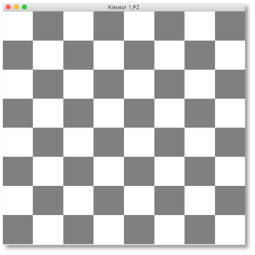
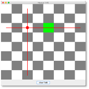

# Klausurvorbereitung

Alle wesentlichen Konzepte, die wir für die Klausur benötigen, haben wir jetzt in diesem und im vergangenen Semester gelernt. Wir wollen diese Kenntnisse nun durch mehrere Anwendungen vertiefen. Ganz vereinzelt wird dabei auch etwas Neues auftauchen. Dabei handelt es sich aber nicht um ein neues Konzept, sondern bspw. um einen Listener, den wir noch nicht hatten. Solche "Überraschungen" werden Sie aber in der Klausur nicht erleben. 

Dieses Kapitel wird hier so aufgebaut sein, dass es immer eine Aufgabe (eine Probeklausur) gibt und die dazugehörige Lösung, die aber "aufgeklappt" werden muss. Sie können ja immer zuerst probieren, die Lösung selbständig zu entwickeln. Wenn Sie am Ende alle Aufgaben selbständig lösen können, sind Sie mit Sicherheit sehr gut auf die Klausur vorbereitet. 

Wir beginnen aber noch kurz mit allgemeinen Betrachtungen zum Grundgerüst. Eines der nachfolgend vorgestellten Grundgerüste werden Sie mit Sicherheit bei der Klausur verwenden können.


### Mögliche Grundgerüste

Wie Sie wissen, ist das Fenster (`JFrame`) im [BorderLayout](gui.md#borderlayout). Das bedeutet, dass das Fenster in fünf Bereiche (`Container`) unterteilt ist. Sie müssen sich bei der Konfiguration überlegen,

- ob "gezeichnet" werden soll, d.h. ob das `JPanel` im `CENTER` des Fensters eine eigene Klasse ist, oder ob es mithilfe einer Methode erzeugt werden kann und
- welche der fündf Bereiche Sie benötigen. 

Wir erläutern das an Beispielen und beginnen mit einem Grundgerüst, welches wir für das Zeichnen verwenden können, welches also eine `Canvas` enthält.

=== "Grundgerüst mit Canvas"
	```java linenums="1"
	import java.awt.BorderLayout;
	import java.awt.Graphics;
	import java.awt.Graphics2D;

	import javax.swing.JFrame;
	import javax.swing.JPanel;

	public class GrundgeruestMitCanvas extends JFrame{
		Canvas canvas;
		
	    public GrundgeruestMitCanvas()
	    {
	        super();
	        this.setTitle("GrundgeruestMitCanvas");
	        this.setDefaultCloseOperation(JFrame.EXIT_ON_CLOSE);    

	        this.canvas = new Canvas();
	        this.getContentPane().add(this.canvas, BorderLayout.CENTER);
	        
	        // von den folgenden vier Zeilen werden eventuell eine oder mehrere oder alle auskommentiert
	        this.getContentPane().add(this.initNorth(), BorderLayout.NORTH);
	        this.getContentPane().add(this.initSouth(), BorderLayout.SOUTH);
	        this.getContentPane().add(this.initEast(), BorderLayout.EAST);
	        this.getContentPane().add(this.initWest(), BorderLayout.WEST);

	        this.setSize(400, 300);
	        this.setLocation(300,200);
	        this.setVisible(true);
	    }

	    private class Canvas extends JPanel
	    {
	        @Override
	        protected void paintComponent(Graphics g)
	        {
	            super.paintComponent(g);        // Implementierung von JPanel aufrufen
	            Graphics2D g2 = (Graphics2D)g;  // Methoden von Graphics2D nutzbar
	            // hier koennen wir zeichnen
	        }
	    }
	    
	    private JPanel initNorth() 
	    {
	    	JPanel north = new JPanel();
	    	// hier das JPanel fuer NORTH befuellen
	    	return north;
	    }
	      
	    private JPanel initSouth() 
	    {
	    	JPanel south = new JPanel();
	    	// hier das JPanel fuer SOUTH befuellen
	    	return south;
	    }
	    
	    
	    private JPanel initEast() 
	    {
	    	JPanel east = new JPanel();
	    	// hier das JPanel fuer EAST befuellen
	    	return east;
	    }
	      
	    private JPanel initWest() 
	    {
	    	JPanel west = new JPanel();
	    	// hier das JPanel fuer WEST befuellen
	    	return west;
	    }

	    public static void main(String[] args) 
	    {
	        new GrundgeruestMitCanvas();
	    }
	}	
	```

In diesem Grundgerüst werden alle fünf Bereiche des Fensters mit `JPanel` befüllt. Das `CENTER` wird mit einem Objekt der Klasse `Canvas` befüllt, welche von `JPanel` erbt. Diese Klasse wird benötigt, um in die `paintComponent()`-Methode zu zeichnen. Sollten Sie z.B. kein Panel im `EAST`- und im `WEST`-Bereich des Fensters benötigen, dann löschen Sie einfach die Zeilen `23` und `24` sowei die beiden Methoden `initEast()` und `initWest()`. 

Ein Grundgerüst **ohne** `Canvas`, also ohne Zeichnen, könnte dann so aussehen:


=== "Grundgerüst ohne Canvas"
	```java linenums="1"
	import java.awt.BorderLayout;

	import javax.swing.JFrame;
	import javax.swing.JPanel;

	public class GrundgeruestOhneCanvas extends JFrame{
		JPanel content;
		
	    public GrundgeruestOhneCanvas()
	    {
	        super();
	        this.setTitle("GrundgeruestMitCanvas");
	        this.setDefaultCloseOperation(JFrame.EXIT_ON_CLOSE);    

	        this.content = this.initCenter();
	        this.getContentPane().add(this.content, BorderLayout.CENTER);
	        
	        // von den folgenden vier Zeilen werden eventuell eine oder mehrere oder alle auskommentiert
	        this.getContentPane().add(this.initNorth(), BorderLayout.NORTH);
	        this.getContentPane().add(this.initSouth(), BorderLayout.SOUTH);
	        this.getContentPane().add(this.initEast(), BorderLayout.EAST);
	        this.getContentPane().add(this.initWest(), BorderLayout.WEST);

	        this.setSize(400, 300);
	        this.setLocation(300,200);
	        this.setVisible(true);
	    }

	    private JPanel initCenter() 
	    {
	    	JPanel center = new JPanel();
	    	// hier das JPanel fuer CENTER befuellen
	    	return center;
	    }
	    
	    private JPanel initNorth() 
	    {
	    	JPanel north = new JPanel();
	    	// hier das JPanel fuer NORTH befuellen
	    	return north;
	    }
	      
	    private JPanel initSouth() 
	    {
	    	JPanel south = new JPanel();
	    	// hier das JPanel fuer SOUTH befuellen
	    	return south;
	    }
	    
	    
	    private JPanel initEast() 
	    {
	    	JPanel east = new JPanel();
	    	// hier das JPanel fuer EAST befuellen
	    	return east;
	    }
	      
	    private JPanel initWest() 
	    {
	    	JPanel west = new JPanel();
	    	// hier das JPanel fuer WEST befuellen
	    	return west;
	    }

	    public static void main(String[] args) 
	    {
	        new GrundgeruestOhneCanvas();
	    }
	}
	```

Beachten Sie, dass `JPanel` ohne Angabe eines LayoutManagers im [FlowLayout](gui.md#flowlayout) sind. Das können Sie [ändern](gui.md#layout-manager) und die einzelnen `JPanel` auch noch [weiter verschachteln](gui.md#verschachteln-von-layout-managern).

Eines dieser beiden Grundgerüste können wir nun stets verwenden. Es muss dann jeweils "nur" noch angepasst werden. Wir beginnen mal mit einer Aufgabe. 


### Quadrat

??? "Aufgabe Quadrat"

	1. Schreiben Sie eine Klasse `Quadrat`, die folgendes Fenster darstellt: 

		

		- Es gibt also eine Zeichenfläche (`Canvas`) und zwei Buttons `new` und `fill`.

	2. Nach dem Klicken des Buttons `new` soll ein schwarzes unausgefülltes Quadrat mit der Strichstärke `3.0` so in der Zeichenfläche erscheinen, dass es 

		- mittig in der Zeichenfläche angeordnet ist und 

		- der kürzere der beiden Abstände (links/rechts oder oben/unten) ca. `10%` der Zeichenfläche groß ist. 

		- Nach dem Klicken des Buttons `new` steht darin nicht mehr `new`, sondern `refresh`.

		

	3. Nach Klicken des Buttons `fill` soll das Quadrat mit einer zufällig gewählten Farbe befüllt werden. Es soll aber trotzdem noch der schwarze Rand bleiben (am einfachsten: einmal mit der zufällig gewählten Farbe befüllt und danach nochmal unbefüllt schwarz malen).

		- Der Button wechselt den Text auf `unfill`. Nach dem Klicken auf `unfill` soll das Quadrat wieder unausgefüllt sein. 

		

	3. Die zufällig erzeugte Farbe soll so lange die Farbe zum Ausfüllen bleiben, bis der `refresh`-Button geklickt wird, d.h.

		- durch mehrmaliges Klicken des Button `fill` und `unfill` ändert sich die Farbe zum Befüllen des Quadrats nicht,

		- erst durch Klicken des Button `refresh` wird eine neue Farbe erzeugt, die dann wieder bis zum nächsten Klicken von `refresh` bleibt. 

	4. Implementieren Sie den `MouseListener` und den `MouseMotionListener` so, dass Sie bei gedrückter Maustaste die Größe des Quadrates ändern. 

		- Wenn Sie mit der Maus auf eine Kante des Quadrates (`+/-10px`) klicken und dann die Maus gedrückt halten, ändert sich die Größe des Quadrates entsprechend.

		- Wenn Sie weit weg von (also mehr als `10px` von der Kante entfernt) einer Kante klicken (egal, ob im Quadrat oder außerhalb), passiert gar nichts.

		- Die Größenänderungen sollen stets sofort sichtbar sein. Nach Loslassen der Maustaste bleibt das Quadrat in der eingestellten Größe. 

		- Das Quadrat bleibt stets möglichst mittig.

		- **Tipp**: An welche Kante Sie klicken, ist egal. Klicken Sie auf eine vertikale Kante (links oder rechts), brauchen Sie nur die Änderungen des x-Wertes zu berücksichtigen, klicken Sie auf eine horizontale Kante (oben oder unten), brauchen Sie nur die Änderungen der y-Werte zu berücksichtigen, um die neue Größe des Quadrates zu ermitteln. 


??? question "Lösung Quadrat"

	1. Zuerst überlegen wir uns, welches Grundgerüst wir verwenden und wie wir es anpassen. Wir müssen **zeichnen**, also das Grundgerüst **mit** `Canvas`. Von den Nord-, Süd-, Ost-, West-Bereichen benötigen wir nur den Süden (dort kommen die 'new'- und `fill`-Buttons rein). Also ist das unser Ausgangspunkt, in das wir schonmal die Buttons eingefügt haben: 

		```java linenums="1" hl_lines="43-47"
		import java.awt.BorderLayout;
		import java.awt.Graphics;
		import java.awt.Graphics2D;

		import javax.swing.JButton;
		import javax.swing.JFrame;
		import javax.swing.JPanel;

		public class Quadrat  extends JFrame{
			Canvas canvas;
			
		    public Quadrat()
		    {
		        super();
		        this.setTitle("Quadrat");
		        this.setDefaultCloseOperation(JFrame.EXIT_ON_CLOSE);    

		        this.canvas = new Canvas();
		        this.getContentPane().add(this.canvas, BorderLayout.CENTER);
		        
		        this.getContentPane().add(this.initSouth(), BorderLayout.SOUTH);

		        this.setSize(400, 400);
		        this.setLocation(300,200);
		        this.setVisible(true);
		    }

		    private class Canvas extends JPanel
		    {
		        @Override
		        protected void paintComponent(Graphics g)
		        {
		            super.paintComponent(g);        // Implementierung von JPanel aufrufen
		            Graphics2D g2 = (Graphics2D)g;  // Methoden von Graphics2D nutzbar
		            // hier koennen wir zeichnen
		        }
		    }
		      
		    private JPanel initSouth() 
		    {
		    	JPanel south = new JPanel();
		    	
		    	JButton newBtn = new JButton("new");
		    	JButton fillBtn = new JButton("fill");
		    	
		    	south.add(newBtn);
		    	south.add(fillBtn);
		    	
		    	return south;
		    }

		    public static void main(String[] args) 
		    {
		        new Quadrat();
		    }
		}
		```

		- Von den `initXXX()`-Methoden benötigen wir auch nur noch `initSouth()`. Die anderen drei sind deshalb gelöscht. 

	2. Die Implementierung des `ActionListener` für den `new`-Button erledigen wir mit einer anonymen Klasse. Wir müssen uns überlegen, ob es notwendig ist, für das Quadrat eine eigene Datenstruktur (z.B. Klasse) anzulegen. Zunächst machen wir das einmal ohne, sondern geben nur in einer globalen Variablen `zeigeQuadrat` an, ob das Quadrat gezeichnet werden soll oder nicht. 

		```java linenums="1" hl_lines="14 40-59 69-81"
		import java.awt.BasicStroke;
		import java.awt.BorderLayout;
		import java.awt.Graphics;
		import java.awt.Graphics2D;
		import java.awt.event.ActionEvent;
		import java.awt.event.ActionListener;

		import javax.swing.JButton;
		import javax.swing.JFrame;
		import javax.swing.JPanel;

		public class Quadrat  extends JFrame{
			Canvas canvas;
			boolean zeigeQuadrat = false;
			
		    public Quadrat()
		    {
		        super();
		        this.setTitle("Quadrat");
		        this.setDefaultCloseOperation(JFrame.EXIT_ON_CLOSE);    

		        this.canvas = new Canvas();
		        this.getContentPane().add(this.canvas, BorderLayout.CENTER);
		        
		        this.getContentPane().add(this.initSouth(), BorderLayout.SOUTH);

		        this.setSize(400, 400);
		        this.setLocation(300,200);
		        this.setVisible(true);
		    }

		    private class Canvas extends JPanel
		    {
		        @Override
		        protected void paintComponent(Graphics g)
		        {
		            super.paintComponent(g);        // Implementierung von JPanel aufrufen
		            Graphics2D g2 = (Graphics2D)g;  // Methoden von Graphics2D nutzbar
		            
		            if(Quadrat.this.zeigeQuadrat)
		            {
		            	g2.setStroke(new BasicStroke(3.0f));
		            	int canvasWidth = this.getWidth();
		            	int canvasHeight = this.getHeight();
		            	if(canvasHeight > canvasWidth)
		            	{
		            		int abstand = (int)(canvasWidth * 0.1);
		            		int seiteQuadrat = (int)(canvasWidth * 0.8);
		            		int oben = (canvasHeight - seiteQuadrat) / 2;
		            		g2.drawRect(abstand, oben, seiteQuadrat, seiteQuadrat);
		            	}
		            	else
		            	{
		            		int abstand = (int)(canvasHeight * 0.1);
		            		int seiteQuadrat = (int)(canvasHeight * 0.8);
		            		int links = (canvasWidth - seiteQuadrat) / 2;
		            		g2.drawRect(links, abstand, seiteQuadrat, seiteQuadrat);
		            	}
		            }
		        }
		    }
		      
		    private JPanel initSouth() 
		    {
		    	JPanel south = new JPanel();
		    	
		    	JButton newBtn = new JButton("new");
		    	
		    	newBtn.addActionListener(new ActionListener() {

					@Override
					public void actionPerformed(ActionEvent e) 
					{
						Quadrat.this.zeigeQuadrat = true;
						JButton thisBtn = (JButton)e.getSource();  // kann nur der newBtn sein!
						thisBtn.setText("refresh");
						Quadrat.this.canvas.repaint();
						
					}
		    		
		    	});
		    	
		    	JButton fillBtn = new JButton("fill");
		    	
		    	south.add(newBtn);
		    	south.add(fillBtn);
		    	
		    	return south;
		    }

		    public static void main(String[] args) 
		    {
		        new Quadrat();
		    }
		}
		```

		- Wenn die Variable `zeigeQuadrat` durch den Buttonklick auf `true` gesetzt wurde (Zeile `74`), dann wird in der `paintComponent()`-Methode das Quadrat dargestellt (Zeile `40`).

		- Zur korrekten Darstellung des Quadrates ist es von Bedeutung, ob das Fenster (die `Canvas`) höher als breit ist oder umgedreht (Zeile `45`). 

		- Ist es höher als breit, dann wird es in die **Breite** der `Canvas` eingepasst, d.h. der Abstand nach links ist 1/10 der `Canvas`-Breite (Zeile `47`) und die Seitenlänge des Quadrates ist 8/10 der Breite (Zeile `48`). Der Abstand des Quadrates nach oben muss entsprechend berechnet werden (Zeile `49`).

		- Ist es breiter als hoch, dann wird es in die **Höhe** der `Canvas` eingepasst, d.h. der Abstand nach oben ist 1/10 der `Canvas`-Höhe (Zeile `54`) und die Seitenlänge des Quadrates ist 8/10 der Höhe (Zeile `55`). Der Abstand des Quadrates nach links muss entsprechend berechnet werden (Zeile `56`).

		- In der `actionPerformed()`-Methode für den Button wird nicht nur `zeigeQuadrat` auf `true` gesetzt, sondern die `Canvas` auch neu gezeichnet (Zeile `77`)! 

		- Die Quelle des `ActionEvent` kann nur der Button selbst sein, da wir eine anonyme Klasse zur Implementierung des `ActionListener` verwenden. Deshalb können wir die Quelle ohne Prüfung in einen `JButton` konvertieren (Zeile `75`). Mithilfe der `setText()`-methode für `JButton` setzen wir den neuen Buttontext auf `refresh` (Zeile `76`).


	3. Die Implementierung des `ActionListener` für den `fill`-Button erledigen wir erneut mit einer anonymen Klasse. Wir gehen ähnlich vor, wie beim `new`-Button und erstellen eine globale Variable `fuelleQuadrat`. Diese gibt an, ob das Quadrat befüllt gezeichnet werden soll oder nicht. 

		```java linenums="1" hl_lines="17 48-52 59-62 71-74 103-121"
		import java.awt.BasicStroke;
		import java.awt.BorderLayout;
		import java.awt.Color;
		import java.awt.Graphics;
		import java.awt.Graphics2D;
		import java.awt.event.ActionEvent;
		import java.awt.event.ActionListener;
		import java.util.Random;

		import javax.swing.JButton;
		import javax.swing.JFrame;
		import javax.swing.JPanel;

		public class Quadrat  extends JFrame{
			Canvas canvas;
			boolean zeigeQuadrat = false;
			boolean fuelleQuadrat = false;
			
		    public Quadrat()
		    {
		        super();
		        this.setTitle("Quadrat");
		        this.setDefaultCloseOperation(JFrame.EXIT_ON_CLOSE);    

		        this.canvas = new Canvas();
		        this.getContentPane().add(this.canvas, BorderLayout.CENTER);
		        
		        this.getContentPane().add(this.initSouth(), BorderLayout.SOUTH);

		        this.setSize(400, 400);
		        this.setLocation(300,200);
		        this.setVisible(true);
		    }

		    private class Canvas extends JPanel
		    {
		        @Override
		        protected void paintComponent(Graphics g)
		        {
		            super.paintComponent(g);        // Implementierung von JPanel aufrufen
		            Graphics2D g2 = (Graphics2D)g;  // Methoden von Graphics2D nutzbar
		            
		            if(Quadrat.this.zeigeQuadrat)
		            {
		            	g2.setStroke(new BasicStroke(3.0f));
		            	int canvasWidth = this.getWidth();
		            	int canvasHeight = this.getHeight();
		            	Random r = new Random();
		            	int rot = r.nextInt(256);
		            	int gruen = r.nextInt(256);
		            	int blau = r.nextInt(256);
		            	g2.setColor(new Color(rot, gruen, blau));
		            	
		            	if(canvasHeight > canvasWidth)
		            	{
		            		int abstand = (int)(canvasWidth * 0.1);
		            		int seiteQuadrat = (int)(canvasWidth * 0.8);
		            		int oben = (canvasHeight - seiteQuadrat) / 2;
		            		if(fuelleQuadrat)
		            		{
		            			g2.fillRect(abstand, oben, seiteQuadrat, seiteQuadrat);
		            		}
		            		g2.setColor(Color.BLACK);
		            		g2.drawRect(abstand, oben, seiteQuadrat, seiteQuadrat);
		            	}
		            	else
		            	{
		            		int abstand = (int)(canvasHeight * 0.1);
		            		int seiteQuadrat = (int)(canvasHeight * 0.8);
		            		int links = (canvasWidth - seiteQuadrat) / 2;
		            		if(fuelleQuadrat)
		            		{
		            			g2.fillRect(links, abstand, seiteQuadrat, seiteQuadrat);
		            		}
		            		g2.setColor(Color.BLACK);
		            		g2.drawRect(links, abstand, seiteQuadrat, seiteQuadrat);
		            	}
		            }
		        }
		    }
		      
		    private JPanel initSouth() 
		    {
		    	JPanel south = new JPanel();
		    	
		    	JButton newBtn = new JButton("new");
		    	
		    	newBtn.addActionListener(new ActionListener() {

					@Override
					public void actionPerformed(ActionEvent e) 
					{
						Quadrat.this.zeigeQuadrat = true;
						JButton thisBtn = (JButton)e.getSource();  // kann nur der newBtn sein!
						thisBtn.setText("refresh");
						Quadrat.this.canvas.repaint();	
					}
		    		
		    	});
		    	
		    	JButton fillBtn = new JButton("fill");
		    	
		    	fillBtn.addActionListener(new ActionListener() {

					@Override
					public void actionPerformed(ActionEvent e) {
						JButton thisBtn = (JButton)e.getSource();  
						if(thisBtn.getText().equals("fill"))
						{
							Quadrat.this.fuelleQuadrat = true;
							thisBtn.setText("unfill");
						}
						else 
						{
							Quadrat.this.fuelleQuadrat = false;
							thisBtn.setText("fill");
						}
						Quadrat.this.canvas.repaint();	
					}
		    		
		    	});
		    	
		    	south.add(newBtn);
		    	south.add(fillBtn);
		    	
		    	return south;
		    }

		    public static void main(String[] args) 
		    {
		        new Quadrat();
		    }
		}
		```

		- Die Farbe zum Ausfüllen erzeugen wir zufällig mithilfe von `Random` (Zeilen `48-52`).

		- Es wird jeweils zuerst aus das ausgefüllte Quadrat gezeichnet (Zeile `61` bzw. `73`) falls `fuelleQuadrat` den Wert `true` hat (Zeile `59` bzw. `71`).

		- Nach dem Zeichnen des befüllten Quadrates wird die Zeichenfarbe wieder auf schwarz gestellt (Zeile `63` bzw. `75`) und dann das nichtausgefüllte Quadrat gezeichnet. 

		- In der `actionPerformed()`_Methode müssen wir unterscheiden, ob im Button `fill` steht oder `unfill` (zeile `108`). Je nachdem wird `fuelleQuadrat` auf `true` oder `false` gesetzt und der Text im Button entsprechend geändert. 

	4. Um nicht bei jeden Aufruf von `paintComponent()` eine neue Füllfarbe zufällig zu erzeugen, muss das Erzeugen der Farbe ausgelagert werden. Da auf die Farbe sowohl in `paintComponent()` (*View*)  als auch in `actionPerfomed()` (*Controller*) zugegriffen wird, muss diese als **globale** Referenz deklariert werden.

		- Wahrscheinlich ist es gut, die Farbe beim ersten Mal zu erzeugen, wenn der `new`-Button geklickt wird und dann immer durch das Klicken des `refresh`-Buttons. 

		```java linenums="1" hl_lines="18 50 93-94 97 99-103"
		import java.awt.BasicStroke;
		import java.awt.BorderLayout;
		import java.awt.Color;
		import java.awt.Graphics;
		import java.awt.Graphics2D;
		import java.awt.event.ActionEvent;
		import java.awt.event.ActionListener;
		import java.util.Random;

		import javax.swing.JButton;
		import javax.swing.JFrame;
		import javax.swing.JPanel;

		public class Quadrat  extends JFrame{
			Canvas canvas;
			boolean zeigeQuadrat = false;
			boolean fuelleQuadrat = false;
			Color aktuelleFuellfarbe = Color.WHITE;
			
		    public Quadrat()
		    {
		        super();
		        this.setTitle("Quadrat");
		        this.setDefaultCloseOperation(JFrame.EXIT_ON_CLOSE);    

		        this.canvas = new Canvas();
		        this.getContentPane().add(this.canvas, BorderLayout.CENTER);
		        
		        this.getContentPane().add(this.initSouth(), BorderLayout.SOUTH);

		        this.setSize(400, 400);
		        this.setLocation(300,200);
		        this.setVisible(true);
		    }

		    private class Canvas extends JPanel
		    {
		        @Override
		        protected void paintComponent(Graphics g)
		        {
		            super.paintComponent(g);        // Implementierung von JPanel aufrufen
		            Graphics2D g2 = (Graphics2D)g;  // Methoden von Graphics2D nutzbar
		            
		            if(Quadrat.this.zeigeQuadrat)
		            {
		            	g2.setStroke(new BasicStroke(3.0f));
		            	int canvasWidth = this.getWidth();
		            	int canvasHeight = this.getHeight();

		            	g2.setColor(Quadrat.this.aktuelleFuellfarbe);
		            	
		            	if(canvasHeight > canvasWidth)
		            	{
		            		int abstand = (int)(canvasWidth * 0.1);
		            		int seiteQuadrat = (int)(canvasWidth * 0.8);
		            		int oben = (canvasHeight - seiteQuadrat) / 2;
		            		if(fuelleQuadrat)
		            		{
		            			g2.fillRect(abstand, oben, seiteQuadrat, seiteQuadrat);
		            		}
		            		g2.setColor(Color.BLACK);
		            		g2.drawRect(abstand, oben, seiteQuadrat, seiteQuadrat);
		            	}
		            	else
		            	{
		            		int abstand = (int)(canvasHeight * 0.1);
		            		int seiteQuadrat = (int)(canvasHeight * 0.8);
		            		int links = (canvasWidth - seiteQuadrat) / 2;
		            		if(fuelleQuadrat)
		            		{
		            			g2.fillRect(links, abstand, seiteQuadrat, seiteQuadrat);
		            		}
		            		g2.setColor(Color.BLACK);
		            		g2.drawRect(links, abstand, seiteQuadrat, seiteQuadrat);
		            	}
		            }
		        }
		    }
		      
		    private JPanel initSouth() 
		    {
		    	JPanel south = new JPanel();
		    	
		    	JButton newBtn = new JButton("new");
		    	
		    	newBtn.addActionListener(new ActionListener() {

					@Override
					public void actionPerformed(ActionEvent e) 
					{
						JButton thisBtn = (JButton)e.getSource();  

						if(thisBtn.getText().equals("new"))
						{
							Quadrat.this.zeigeQuadrat = true;
							thisBtn.setText("refresh");
						}
						
						Random r = new Random();
						int rot = r.nextInt(256);
		            	int gruen = r.nextInt(256);
		            	int blau = r.nextInt(256);
		            	Quadrat.this.aktuelleFuellfarbe = new Color(rot, gruen, blau);
						
						Quadrat.this.canvas.repaint();	
					}
		    		
		    	});
		    	
		    	JButton fillBtn = new JButton("fill");
		    	
		    	fillBtn.addActionListener(new ActionListener() {

					@Override
					public void actionPerformed(ActionEvent e) {
						JButton thisBtn = (JButton)e.getSource();  
						if(thisBtn.getText().equals("fill"))
						{
							Quadrat.this.fuelleQuadrat = true;
							thisBtn.setText("unfill");
						}
						else 
						{
							Quadrat.this.fuelleQuadrat = false;
							thisBtn.setText("fill");
						}
						Quadrat.this.canvas.repaint();	
					}
		    		
		    	});
		    	
		    	south.add(newBtn);
		    	south.add(fillBtn);
		    	
		    	return south;
		    }

		    public static void main(String[] args) 
		    {
		        new Quadrat();
		    }
		}
		```

	5. Für eine geeignete Implementierung des `MouseListener` und des `MouseMotionListener` benötigen wir globalen Zugriff auf die Größe und die Position des Quadrates. Wir müssen ja mit der Maus erkennen können, ob wir eine Kante des Quadrates getroffen haben. Wir lagern deshalb einige Werte des Quadrates **global** aus (und Umbenennungen): `int quadratLinks, quadratRechts, quadratOben, quadratUnten, quadratLaenge;` 

		- In `paintComponent()` werden diese globalen Variablen nun mit Werten belegt:

		```java
		if(canvasHeight > canvasWidth)
    	{
    		Quadrat.this.quadratLinks = (int)(canvasWidth * 0.1);
    		Quadrat.this.quadratLaenge = (int)(canvasWidth * 0.8);
    		Quadrat.this.quadratRechts = Quadrat.this.quadratLinks + Quadrat.this.quadratLaenge;
    		Quadrat.this.quadratOben = (canvasHeight - Quadrat.this.quadratLaenge) / 2;
    		Quadrat.this.quadratUnten = Quadrat.this.quadratOben + Quadrat.this.quadratLaenge;
    		if(fuelleQuadrat)
    		{
    			g2.fillRect(Quadrat.this.quadratLinks, Quadrat.this.quadratOben, Quadrat.this.quadratLaenge, Quadrat.this.quadratLaenge);
    		}
    		g2.setColor(Color.BLACK);
    		g2.drawRect(Quadrat.this.quadratLinks, Quadrat.this.quadratOben, Quadrat.this.quadratLaenge, Quadrat.this.quadratLaenge);
    	}
    	else
    	{
    		Quadrat.this.quadratOben = (int)(canvasHeight * 0.1);
    		Quadrat.this.quadratLaenge = (int)(canvasHeight * 0.8);
    		Quadrat.this.quadratLinks = (canvasWidth - Quadrat.this.quadratLaenge) / 2;
    		Quadrat.this.quadratRechts = Quadrat.this.quadratLinks + Quadrat.this.quadratLaenge;
    		Quadrat.this.quadratUnten = Quadrat.this.quadratOben + Quadrat.this.quadratLaenge;
    		if(fuelleQuadrat)
    		{
    			g2.fillRect(Quadrat.this.quadratLinks, Quadrat.this.quadratOben, Quadrat.this.quadratLaenge, Quadrat.this.quadratLaenge);
    		}
    		g2.setColor(Color.BLACK);
    		g2.drawRect(Quadrat.this.quadratLinks, Quadrat.this.quadratOben, Quadrat.this.quadratLaenge, Quadrat.this.quadratLaenge);
    	}
		```

		- Nun implementieren wir `MouseListener` und `MouseMotionListener` und **melden** `canvas` daran an.

		```java linenums="1" hl_lines="19 32-33 154-159 161-166 168-172"
		import java.awt.BasicStroke;
		import java.awt.BorderLayout;
		import java.awt.Color;
		import java.awt.Graphics;
		import java.awt.Graphics2D;
		import java.awt.event.ActionEvent;
		import java.awt.event.ActionListener;
		import java.awt.event.MouseEvent;
		import java.awt.event.MouseListener;
		import java.awt.event.MouseMotionListener;
		import java.util.Random;

		import javax.swing.JButton;
		import javax.swing.JFrame;
		import javax.swing.JPanel;

		public class Quadrat extends JFrame implements MouseListener, MouseMotionListener
		{
			Canvas canvas;
			boolean zeigeQuadrat = false;
			boolean fuelleQuadrat = false;
			Color aktuelleFuellfarbe = Color.WHITE;
			int quadratLinks, quadratRechts, quadratOben, quadratUnten, quadratLaenge;
			
		    public Quadrat()
		    {
		        super();
		        this.setTitle("Quadrat");
		        this.setDefaultCloseOperation(JFrame.EXIT_ON_CLOSE);    

		        this.canvas = new Canvas();
		        this.canvas.addMouseListener(this);
		        this.canvas.addMouseMotionListener(this);
		        this.getContentPane().add(this.canvas, BorderLayout.CENTER);
		        
		        this.getContentPane().add(this.initSouth(), BorderLayout.SOUTH);

		        this.setSize(400, 400);
		        this.setLocation(300,200);
		        this.setVisible(true);
		    }

		    private class Canvas extends JPanel
		    {
		        @Override
		        protected void paintComponent(Graphics g)
		        {
		            super.paintComponent(g);        // Implementierung von JPanel aufrufen
		            Graphics2D g2 = (Graphics2D)g;  // Methoden von Graphics2D nutzbar
		            
		            if(Quadrat.this.zeigeQuadrat)
		            {
		            	g2.setStroke(new BasicStroke(3.0f));
		            	int canvasWidth = this.getWidth();
		            	int canvasHeight = this.getHeight();

		            	g2.setColor(Quadrat.this.aktuelleFuellfarbe);
		            	
		            	if(canvasHeight > canvasWidth)
		            	{
		            		Quadrat.this.quadratLinks = (int)(canvasWidth * 0.1);
		            		Quadrat.this.quadratLaenge = (int)(canvasWidth * 0.8);
		            		Quadrat.this.quadratRechts = Quadrat.this.quadratLinks + Quadrat.this.quadratLaenge;
		            		Quadrat.this.quadratOben = (canvasHeight - Quadrat.this.quadratLaenge) / 2;
		            		Quadrat.this.quadratUnten = Quadrat.this.quadratOben + Quadrat.this.quadratLaenge;
		            		if(fuelleQuadrat)
		            		{
		            			g2.fillRect(Quadrat.this.quadratLinks, Quadrat.this.quadratOben, Quadrat.this.quadratLaenge, Quadrat.this.quadratLaenge);
		            		}
		            		g2.setColor(Color.BLACK);
		            		g2.drawRect(Quadrat.this.quadratLinks, Quadrat.this.quadratOben, Quadrat.this.quadratLaenge, Quadrat.this.quadratLaenge);
		            	}
		            	else
		            	{
		            		Quadrat.this.quadratOben = (int)(canvasHeight * 0.1);
		            		Quadrat.this.quadratLaenge = (int)(canvasHeight * 0.8);
		            		Quadrat.this.quadratLinks = (canvasWidth - Quadrat.this.quadratLaenge) / 2;
		            		Quadrat.this.quadratRechts = Quadrat.this.quadratLinks + Quadrat.this.quadratLaenge;
		            		Quadrat.this.quadratUnten = Quadrat.this.quadratOben + Quadrat.this.quadratLaenge;
		            		if(fuelleQuadrat)
		            		{
		            			g2.fillRect(Quadrat.this.quadratLinks, Quadrat.this.quadratOben, Quadrat.this.quadratLaenge, Quadrat.this.quadratLaenge);
		            		}
		            		g2.setColor(Color.BLACK);
		            		g2.drawRect(Quadrat.this.quadratLinks, Quadrat.this.quadratOben, Quadrat.this.quadratLaenge, Quadrat.this.quadratLaenge);
		            	}
		            }
		        }
		    }
		      
		    private JPanel initSouth() 
		    {
		    	JPanel south = new JPanel();
		    	
		    	JButton newBtn = new JButton("new");
		    	
		    	newBtn.addActionListener(new ActionListener() {

					@Override
					public void actionPerformed(ActionEvent e) 
					{
						JButton thisBtn = (JButton)e.getSource();  

						if(thisBtn.getText().equals("new"))
						{
							Quadrat.this.zeigeQuadrat = true;
							thisBtn.setText("refresh");
						}
						
						Random r = new Random();
						int rot = r.nextInt(256);
		            	int gruen = r.nextInt(256);
		            	int blau = r.nextInt(256);
		            	Quadrat.this.aktuelleFuellfarbe = new Color(rot, gruen, blau);
						
						Quadrat.this.canvas.repaint();	
					}
		    		
		    	});
		    	
		    	JButton fillBtn = new JButton("fill");
		    	
		    	fillBtn.addActionListener(new ActionListener() {

					@Override
					public void actionPerformed(ActionEvent e) {
						JButton thisBtn = (JButton)e.getSource();  
						if(thisBtn.getText().equals("fill"))
						{
							Quadrat.this.fuelleQuadrat = true;
							thisBtn.setText("unfill");
						}
						else 
						{
							Quadrat.this.fuelleQuadrat = false;
							thisBtn.setText("fill");
						}
						Quadrat.this.canvas.repaint();	
					}
		    		
		    	});
		    	
		    	south.add(newBtn);
		    	south.add(fillBtn);
		    	
		    	return south;
		    }

		    public static void main(String[] args) 
		    {
		        new Quadrat();
		    }

			@Override
			public void mousePressed(MouseEvent e) {
				int x = e.getX();
				int y = e.getY();
				System.out.println("mousePressed x=" + x + ", y=" + y);
			}
			
			@Override
			public void mouseDragged(MouseEvent e) {
				int x = e.getX();
				int y = e.getY();
				System.out.println("mouseDragged x=" + x + ", y=" + y);
			}

			@Override 
			public void mouseReleased(MouseEvent e) {
				int x = e.getX();
				int y = e.getY();
				System.out.println("mouseReleased x=" + x + ", y=" + y);
			}

			@Override public void mouseMoved(MouseEvent e) {}
			@Override public void mouseClicked(MouseEvent e) {}
			@Override public void mouseEntered(MouseEvent e) {}
			@Override public void mouseExited(MouseEvent e) {}
		}
		```


	5. Für das eigentliche Verschieben rächt sich jetzt, dass wir uns anfangs keine gute Datenstruktur überlegt hatten. Es wird jetzt alles ein wenig komplizierter, da wir mehrere Unterscheidungen treffen müssen:

		- Wir müssen unterscheiden, ob das Quadrat nun gerade bewegt wird oder nicht. 

		- Wir müssen unterscheiden, ob wir die linke Kante bewegen, oder die rechte oder die untere oder die obere. 

		- Für alle dieses Unterscheidungen erstellen wir uns globale Variablen. 

		```java
		if(canvasHeight > canvasWidth)
    	{
    		Quadrat.this.quadratLinks = (int)(canvasWidth * 0.1);
    		Quadrat.this.quadratLaenge = (int)(canvasWidth * 0.8);
    		Quadrat.this.quadratRechts = Quadrat.this.quadratLinks + Quadrat.this.quadratLaenge;
    		Quadrat.this.quadratOben = (canvasHeight - Quadrat.this.quadratLaenge) / 2;
    		Quadrat.this.quadratUnten = Quadrat.this.quadratOben + Quadrat.this.quadratLaenge;
    		if(fuelleQuadrat)
    		{
    			g2.fillRect(Quadrat.this.quadratLinks, Quadrat.this.quadratOben, Quadrat.this.quadratLaenge, Quadrat.this.quadratLaenge);
    		}
    		g2.setColor(Color.BLACK);
    		g2.drawRect(Quadrat.this.quadratLinks, Quadrat.this.quadratOben, Quadrat.this.quadratLaenge, Quadrat.this.quadratLaenge);
    	}
    	else
    	{
    		Quadrat.this.quadratOben = (int)(canvasHeight * 0.1);
    		Quadrat.this.quadratLaenge = (int)(canvasHeight * 0.8);
    		Quadrat.this.quadratLinks = (canvasWidth - Quadrat.this.quadratLaenge) / 2;
    		Quadrat.this.quadratRechts = Quadrat.this.quadratLinks + Quadrat.this.quadratLaenge;
    		Quadrat.this.quadratUnten = Quadrat.this.quadratOben + Quadrat.this.quadratLaenge;
    		if(fuelleQuadrat)
    		{
    			g2.fillRect(Quadrat.this.quadratLinks, Quadrat.this.quadratOben, Quadrat.this.quadratLaenge, Quadrat.this.quadratLaenge);
    		}
    		g2.setColor(Color.BLACK);
    		g2.drawRect(Quadrat.this.quadratLinks, Quadrat.this.quadratOben, Quadrat.this.quadratLaenge, Quadrat.this.quadratLaenge);
    	}
		```

		- Nun implementieren wir `MouseListener` und `MouseMotionListener` und **melden** `canvas` daran an.

		```java linenums="1" hl_lines="24-30 66-67 96-105"
		import java.awt.BasicStroke;
		import java.awt.BorderLayout;
		import java.awt.Color;
		import java.awt.Graphics;
		import java.awt.Graphics2D;
		import java.awt.event.ActionEvent;
		import java.awt.event.ActionListener;
		import java.awt.event.MouseEvent;
		import java.awt.event.MouseListener;
		import java.awt.event.MouseMotionListener;
		import java.util.Random;

		import javax.swing.JButton;
		import javax.swing.JFrame;
		import javax.swing.JPanel;

		public class Quadrat extends JFrame implements MouseListener, MouseMotionListener
		{
			Canvas canvas;
			boolean zeigeQuadrat = false;
			boolean fuelleQuadrat = false;
			Color aktuelleFuellfarbe = Color.WHITE;
			int quadratLinks, quadratRechts, quadratOben, quadratUnten, quadratLaenge;
			boolean bewegt = false;
			boolean linkeKante = false;
			boolean rechteKante = false;
			boolean obereKante = false;
			boolean untereKante = false;
			int warX = 0;
			int warY = 0;
			
		    public Quadrat()
		    {
		        super();
		        this.setTitle("Quadrat");
		        this.setDefaultCloseOperation(JFrame.EXIT_ON_CLOSE);    

		        this.canvas = new Canvas();
		        this.canvas.addMouseListener(this);
		        this.canvas.addMouseMotionListener(this);
		        this.getContentPane().add(this.canvas, BorderLayout.CENTER);
		        
		        this.getContentPane().add(this.initSouth(), BorderLayout.SOUTH);

		        this.setSize(400, 400);
		        this.setLocation(300,200);
		        this.setVisible(true);
		    }

		    private class Canvas extends JPanel
		    {
		        @Override
		        protected void paintComponent(Graphics g)
		        {
		            super.paintComponent(g);        // Implementierung von JPanel aufrufen
		            Graphics2D g2 = (Graphics2D)g;  // Methoden von Graphics2D nutzbar
		            
		            if(Quadrat.this.zeigeQuadrat)
		            {
		            	g2.setStroke(new BasicStroke(3.0f));
		            	int canvasWidth = this.getWidth();
		            	int canvasHeight = this.getHeight();

		            	g2.setColor(Quadrat.this.aktuelleFuellfarbe);
		            	
		            	if(!Quadrat.this.bewegt)
		            	{
			            	if(canvasHeight > canvasWidth)
			            	{
			            		Quadrat.this.quadratLinks = (int)(canvasWidth * 0.1);
			            		Quadrat.this.quadratLaenge = (int)(canvasWidth * 0.8);
			            		Quadrat.this.quadratRechts = Quadrat.this.quadratLinks + Quadrat.this.quadratLaenge;
			            		Quadrat.this.quadratOben = (canvasHeight - Quadrat.this.quadratLaenge) / 2;
			            		Quadrat.this.quadratUnten = Quadrat.this.quadratOben + Quadrat.this.quadratLaenge;
			            		if(fuelleQuadrat)
			            		{
			            			g2.fillRect(Quadrat.this.quadratLinks, Quadrat.this.quadratOben, Quadrat.this.quadratLaenge, Quadrat.this.quadratLaenge);
			            		}
			            		g2.setColor(Color.BLACK);
			            		g2.drawRect(Quadrat.this.quadratLinks, Quadrat.this.quadratOben, Quadrat.this.quadratLaenge, Quadrat.this.quadratLaenge);
			            	}
			            	else
			            	{
			            		Quadrat.this.quadratOben = (int)(canvasHeight * 0.1);
			            		Quadrat.this.quadratLaenge = (int)(canvasHeight * 0.8);
			            		Quadrat.this.quadratLinks = (canvasWidth - Quadrat.this.quadratLaenge) / 2;
			            		Quadrat.this.quadratRechts = Quadrat.this.quadratLinks + Quadrat.this.quadratLaenge;
			            		Quadrat.this.quadratUnten = Quadrat.this.quadratOben + Quadrat.this.quadratLaenge;
			            		if(fuelleQuadrat)
			            		{
			            			g2.fillRect(Quadrat.this.quadratLinks, Quadrat.this.quadratOben, Quadrat.this.quadratLaenge, Quadrat.this.quadratLaenge);
			            		}
			            		g2.setColor(Color.BLACK);
			            		g2.drawRect(Quadrat.this.quadratLinks, Quadrat.this.quadratOben, Quadrat.this.quadratLaenge, Quadrat.this.quadratLaenge);
			            	}
		            	}
		            	else // bewegt
		            	{
		            		if(fuelleQuadrat)
		            		{
		            			g2.fillRect(Quadrat.this.quadratLinks, Quadrat.this.quadratOben, Quadrat.this.quadratLaenge, Quadrat.this.quadratLaenge);
		            		}
		            		g2.setColor(Color.BLACK);
		            		g2.drawRect(Quadrat.this.quadratLinks, Quadrat.this.quadratOben, Quadrat.this.quadratLaenge, Quadrat.this.quadratLaenge);
		            	}
		            	
		            }
		        }
		    }
		      
		    private JPanel initSouth() 
		    {
		    	JPanel south = new JPanel();
		    	
		    	JButton newBtn = new JButton("new");
		    	
		    	newBtn.addActionListener(new ActionListener() {

					@Override
					public void actionPerformed(ActionEvent e) 
					{
						JButton thisBtn = (JButton)e.getSource();  

						if(thisBtn.getText().equals("new"))
						{
							Quadrat.this.zeigeQuadrat = true;
							thisBtn.setText("refresh");
						}
						
						Random r = new Random();
						int rot = r.nextInt(256);
		            	int gruen = r.nextInt(256);
		            	int blau = r.nextInt(256);
		            	Quadrat.this.aktuelleFuellfarbe = new Color(rot, gruen, blau);
						
						Quadrat.this.canvas.repaint();	
					}
		    		
		    	});
		    	
		    	JButton fillBtn = new JButton("fill");
		    	
		    	fillBtn.addActionListener(new ActionListener() {

					@Override
					public void actionPerformed(ActionEvent e) {
						JButton thisBtn = (JButton)e.getSource();  
						if(thisBtn.getText().equals("fill"))
						{
							Quadrat.this.fuelleQuadrat = true;
							thisBtn.setText("unfill");
						}
						else 
						{
							Quadrat.this.fuelleQuadrat = false;
							thisBtn.setText("fill");
						}
						Quadrat.this.canvas.repaint();	
					}
		    		
		    	});
		    	
		    	south.add(newBtn);
		    	south.add(fillBtn);
		    	
		    	return south;
		    }

		    public static void main(String[] args) 
		    {
		        new Quadrat();
		    }

			@Override
			public void mousePressed(MouseEvent e) {
				int x = e.getX();
				int y = e.getY();
				System.out.println("mousePressed x=" + x + ", y=" + y);
				
				int linksX = this.quadratLinks;
				int rechtsX = this.quadratRechts;
				int obenY = this.quadratOben;
				int untenY = this.quadratUnten;

				if(x > linksX-10 && x < linksX+10)
				{
					this.bewegt = true;
					this.linkeKante = true;
					this.warX = x;
				}
				else if(x > rechtsX-10 && x < rechtsX+10)
				{
					this.bewegt = true;
					this.rechteKante = true;
					this.warX = x;
				}
				else if(y > obenY-10 && y < obenY+10)
				{
					this.bewegt = true;
					this.obereKante = true;
					this.warY = y;
				}
				else if(y > untenY-10 && y < untenY+10)
				{
					this.bewegt = true;
					this.untereKante = true;
					this.warY = y;
				}
			}
			
			@Override
			public void mouseDragged(MouseEvent e) {
				if(this.bewegt)
				{
					int x = e.getX();
					int y = e.getY();
					System.out.println("mouseDragged x=" + x + ", y=" + y);
					
					if(this.linkeKante)
					{
						int diffX = x - this.warX;
						this.quadratLinks = this.quadratLinks + diffX;
						this.quadratOben = this.quadratOben + diffX;
						this.quadratLaenge = this.quadratLaenge - 2 * diffX;
						this.warX = x;
					}
					else if(this.rechteKante)
					{
						int diffX = x - this.warX;
						this.quadratLinks = this.quadratLinks - diffX;
						this.quadratOben = this.quadratOben - diffX;
						this.quadratLaenge = this.quadratLaenge + 2 * diffX;
						this.warX = x;
					}
					else if(this.obereKante)
					{
						int diffY = y - this.warY;
						this.quadratLinks = this.quadratLinks + diffY;
						this.quadratOben = this.quadratOben + diffY;
						this.quadratLaenge = this.quadratLaenge - 2 * diffY;
						this.warY = y;
					}
					else if(this.untereKante)
					{
						int diffY = y - this.warY;
						this.quadratLinks = this.quadratLinks - diffY;
						this.quadratOben = this.quadratOben - diffY;
						this.quadratLaenge = this.quadratLaenge + 2 * diffY;
						this.warY = y;
					}
					Quadrat.this.canvas.repaint();
				}
				
			}
			
			@Override 
			public void mouseReleased(MouseEvent e) {
				this.bewegt = false;
				Quadrat.this.canvas.repaint();
			}

			@Override public void mouseMoved(MouseEvent e) {}
			@Override public void mouseClicked(MouseEvent e) {}
			@Override public void mouseEntered(MouseEvent e) {}
			@Override public void mouseExited(MouseEvent e) {}
		}
		```

		- In `mousePressed()` bestimmen wir zunächst, ob wir in der Nähe der linken oder der rechten oder der oberen oder unteren Kante geklickt haben. Wenn ja, dann setzen wir die entsprechenden Variablen und merken uns, wo (`warX` oder `warY`) wir hingeklickt hatten. 

		- In `mouseDragged()` wird zunächst ermittelt, ob wir überhaupt im `bewegt`-Modus sind. Wenn ja, ermitteln wir, wie weit und wohin wir uns seit dem letzten Aufruf von `mouseDragged()` bewegt haben. Dementsprechend werden die Variablen für das Quadrat neu gesetzt. 

		- Wenn wir die Maus wieder loslassen (`mouseReleased()`) wird `bewegt` wieder auf `false` gesetzt und das Quadrat wird somit wieder "normal" durch die `paintComponent()`-Methode dargestellt. 


### Schachbrett

??? "Aufgabe Schachbrett"

	1. Schreiben Sie eine Klasse `Schachbrett`, die folgendes Fenster darstellt: 
		
		
	 
		- Es werden 8x8 Rechtecke dargestellt – abwechselnd mit grauem und weißem Hintergrund 
		- **bitte beachten:** 
			- die dargestellten Rechtecke sind gezeichnet, es handelt sich nicht um einzelne JPanels!!! (ist für später wichtig) 
			- das 8x8-Feld der Rechtecke füllt die Zeichenfläche *vollständig*, d.h. wenn Sie die Größe des Fensters verändern, passt sich auch das 8x8-Feld entsprechend an

	2. Implementieren Sie den `MausListener` so, dass Sie durch Mausklick auf die Zeichenfläche einen ausgefüllten Kreis in das Rechteck malen, in das Sie geklickt haben. 
		
		

		- Die Abbildung zeigt das Schachbrett nach einem Mausklick auf das Rechteck in der 2. Zeile und 4. Spalte.
		- Versuchen Sie, die Kreise möglichst *zentriert* in die Rechtecke zu malen. Eine gute Größe für den Durchmesser der Kreise ist 1/3 der Breite oder Höhe der Rechtecke.

	3. Klicken Sie mehrmals mit der Maus, werden entsprechend mehrere Kreise dargestellt. 
		
		


	4. Fügen Sie dem Süden des Fensters ein `JPanel` hinzu. Dieses `JPanel` enthält einen `JButton` `'clear field'`. Nach Drücken dieses Buttons werden alle roten Kreise wieder gelöscht. 
		
		


	5. Erweitern Sie Ihre Implementierung nun so, dass durch einen Mausklick nicht nur ein roter Kreis gezeichnet wird, sondern auch noch eine horizontale und eine vertikale Linie in der Zeile und der Spalte, in der der Kreis gezeichnet wird. 
		
		

		- in der Zeile und Spalte des Kreises erscheint jeweils mittig eine rote Linie


		

		- Abbildung zeigt Schachbrett nach mehreren Mausklicks
		- Die Linien müssen nicht, wie im Bild dargestellt, in der Mitte der Rechtecke anfangen. Sie können auch komplett durchgezeichnet werden, d.h. vom Beginn bis zum Ende einer Zeile bzw. Spalte.

		
	6. Erweitern Sie Ihre Implementierung nun so, dass es nicht mehr möglich ist, dass 2 Kreise in der gleichen Spalte oder in der gleichen Zeile erscheinen. Wenn Sie ein Rechteck anklicken, in dessen Zeile oder Spalte bereits ein anderer Kreis ist, so soll kein neuer Kreis gezeichnet werden, sondern das Rechteck als grünes Rechteck erscheinen. 
		
		

		- In das grüne Rechteck wurde geklickt - es erscheint kein Kreis, da in der Zeile bereits ein Kreis ist – stattdessen ein grünes Rechteck.


		

		- In das grüne Rechteck wurde geklickt - es erscheint kein Kreis, da in der Zeile bereits ein Kreis ist - stattdessen ein grünes Rechteck.
		- Das Rechteck bleibt nur bis zum nächsten Klick markiert (grün).

	7. **Zusatzaufgabe:** Erweitern Sie die Schritte 5 und 6 auch auf die Diagonalen, d.h. es sollen auch die jeweiligen Diagonalen der Punkte eingezeichnet werden und keine zwei Punkte dürfen in der gleichen Diagonalen liegen.


??? question "Lösung Schachbrett"

	1. Zuerst überlegen wir uns, welches Grundgerüst wir verwenden und wie wir es anpassen. Wir müssen **zeichnen**, also das Grundgerüst **mit** `Canvas`. Von den Nord-, Süd-, Ost-, West-Bereichen benötigen wir nur den Süden (dort kommt der 'clear field'-Button rein). Also ist das unser Ausgangspunkt: 

		```java linenums="1"
		import java.awt.BorderLayout;
		import java.awt.Graphics;
		import java.awt.Graphics2D;

		import javax.swing.JFrame;
		import javax.swing.JPanel;

		public class Schachbrett extends JFrame{
			Canvas canvas;
			
		    public Schachbrett()
		    {
		        super();
		        this.setTitle("Schachbrett");
		        this.setDefaultCloseOperation(JFrame.EXIT_ON_CLOSE);    

		        this.canvas = new Canvas();
		        this.getContentPane().add(this.canvas, BorderLayout.CENTER);
		        
		        // NORTH, EAST, WEST geloescht
		        this.getContentPane().add(this.initSouth(), BorderLayout.SOUTH);

		        this.setSize(400, 300);
		        this.setLocation(300,200);
		        this.setVisible(true);
		    }

		    private class Canvas extends JPanel
		    {
		        @Override
		        protected void paintComponent(Graphics g)
		        {
		            super.paintComponent(g);        // Implementierung von JPanel aufrufen
		            Graphics2D g2 = (Graphics2D)g;  // Methoden von Graphics2D nutzbar
		            // hier koennen wir zeichnen
		        }
		    }
		    
		    private JPanel initSouth() 
		    {
		    	JPanel south = new JPanel();
		    	// hier das JPanel fuer SOUTH befuellen
		    	return south;
		    }
		    
		    public static void main(String[] args) 
		    {
		        new Schachbrett();
		    }
		}
		```

		Von den `initXXX()`-Methoden benötigen wir auch nur noch `initSouth()`. Die anderen drei sind deshalb gelöscht. 

	2. Jetzt können wir mit dem Zeichnen des Schachbretts beginnen. Dazu könnten wir "einfach" 64 gleich große Rechtecke in die `Canvas` zeichnen. Wir sollten hier aber unbedingt dafür ein *Model*, d.h. eine Datenstruktur erstellen und diese dann in der *View* darstellen. Für eine solche Datenstruktur (für ein *Model*) gibt es drei Gründe:
		- wir wollen später erkennen, in welches Feld geklickt wurde und 
		- wir wollen erkennen können, in welches Feld bereits geklickt wurde und
		- wir wollen erkennen können, welche Felder Nachbarfelder sind.

		Da die Dimensionen hier fest sind (8x8), kann man das in einem (zweidimensionalen) Array erledigen. Als Typ jedes einzelnen Elementes sollte `boolean` genügen - markiert oder nicht markiert. Wenn Sie sich nicht sicher sind, ob zwei Zustände genügen, können Sie auch eine `enum` als Typ verwenden. Wir machen das mal, dann bleibt die Lösung flexibler und wir üben `enum` nochmal. 

		```java linenums="1" hl_lines="10-11 19 32-42"
		import java.awt.BorderLayout;
		import java.awt.Graphics;
		import java.awt.Graphics2D;

		import javax.swing.JFrame;
		import javax.swing.JPanel;

		public class Schachbrett extends JFrame{
			Canvas canvas;
			enum State { MARKIERT, UNMARKIERT };
			State[][] field;
			
		    public Schachbrett()
		    {
		        super();
		        this.setTitle("Schachbrett");
		        this.setDefaultCloseOperation(JFrame.EXIT_ON_CLOSE);    

		        this.initField();
		        
		        this.canvas = new Canvas();
		        this.getContentPane().add(this.canvas, BorderLayout.CENTER);
		        
		        // NORTH, EAST, WEST geloescht
		        this.getContentPane().add(this.initSouth(), BorderLayout.SOUTH);

		        this.setSize(400, 300);
		        this.setLocation(300,200);
		        this.setVisible(true);
		    }
		    
		    private void initField() 
		    {
		    	this.field = new State[8][8];
		    	for(int row=0; row<this.field.length; row++)
		    	{
		    		for(int col=0; col<this.field[row].length; col++)
		        	{
		        		this.field[row][col] = State.UNMARKIERT;
		        	}
		    	}
		    }

		    private class Canvas extends JPanel
		    {
		        @Override
		        protected void paintComponent(Graphics g)
		        {
		            super.paintComponent(g);        // Implementierung von JPanel aufrufen
		            Graphics2D g2 = (Graphics2D)g;  // Methoden von Graphics2D nutzbar
		            // hier koennen wir zeichnen
		        }
		    }
		    
		    private JPanel initSouth() 
		    {
		    	JPanel south = new JPanel();
		    	// hier das JPanel fuer SOUTH befuellen
		    	return south;
		    }
		    
		    public static void main(String[] args) 
		    {
		        new Schachbrett();
		    }
		}
		```

		- Wir hätten das `field` auch im Konstruktor erzeugen und befüllen können, lagern es aber in eine eigene Methode aus und rufen diese im Konstruktor auf. Alles, was wir funktional in eine eigene Methode auslagern können, sollten wir auch auslagern - liest sich viel besser!

	3. Jetzt überlegen wir, wie wir das Schachbrett darstellen (die *View*). Die Darstellung erfolgt am besten mit der `fillRect()`-Methode. Diese erwartet die Koordinaten des linken oberen Punktes und die Breite und die Höhe des Rechtecks. Breite und Höhe ergeben sich aus der Breite und Höhe der `Canvas`, jeweils geteilt durch `8`. Aus der Position des zu zeichnenden Rechtecks in einer Zeile ergibt sich dann der `x`-Wert für den linken oberen Punkt und aus der Position des zu zeichnenden Feldes in der Spalte ergibt sich der `y`-Wert des linken oberen Punktes. Wir ändern nun nur die `paintComponent()`-Methode (die *View*), da es nur um die Darstellung geht:

		```java linenums="44"
	    private class Canvas extends JPanel
	    {
	        @Override
	        protected void paintComponent(Graphics g)
	        {
	            super.paintComponent(g);        // Implementierung von JPanel aufrufen
	            Graphics2D g2 = (Graphics2D)g;  // Methoden von Graphics2D nutzbar
	            
	            int canvasHeight = this.getHeight();
	            int canvasWidth = this.getWidth();
	            int heightRect = canvasHeight / 8;
	            int widthRect = canvasWidth / 8;
	            
	            boolean grey = true;
	        	for(int row=0; row<Schachbrett.this.field.length; row++)
	        	{
	        		int y = row * heightRect;		// y-Wert des linken oberen Punktes
	        		grey = !grey;					// mit gleichen Farbe anfangen, wie aufgehoert
	        		for(int col=0; col<Schachbrett.this.field[row].length; col++)
	            	{
	        			int x = col * widthRect; 	// x-Wert des linken oberen Punktes
	        			
	        			if(grey) {
	        				g2.setColor(Color.LIGHT_GRAY);
	        				grey = false;
	        			} else {
	        				g2.setColor(Color.WHITE);
	        				grey = true;
	        			}
	        			g2.fillRect(x, y, widthRect, heightRect);
	            	}
	        	}
	        }
	    }
		```

		- Wir laufen also durch das `field`-Array und ermitteln für die aktuelle Zeile den `y`-Wert und für die jeweils aktuelle Spalte den `x`-Wert.
		- Damit wir immer zwischen Grau und Weiß umschalten, erstellen wir uns eine boole'sche Variable `grey`, die abwechselnd `true` und `false` wird, je nachdem, ob wir als nächstes ein graues oder ein weißes Feld zeichnen wollen. 
		- Nach jeder Zeile ändert sich die Farbe jedoch nicht (wir fangen in der neuen Zeile mit der gleichen Farbe an, wie wir in der alten Zeile aufgehört haben). Deshalb mussten wir noch die Anweisung in Zeile `61` hinzufügen. 
		- Das Schachbrett wird nun so gezeichnet, wie wir das wollten. Wenn das Fenster vergrößert oder verkleinert wird, dann passen sich die Felder entsprechend an, da wir alles abhängig von der Breite und Höhe der Canvas berechnen. 
		- Wir können aber die Fenstergröße aber gleich etwas quadratischer gestalten (z.B. `this.setSize(400, 400);`).

	4. Jetzt kümmern wir uns um die roten Punkte inmitten des Rechtecks, falls wir mit der Maus darauf geklickt haben. Dazu benötigen wir den `MouseListener`, denn es geht um einen Mausklick (also entweder `mouseClicked()` oder `mousePressed()`) und nicht um eine Bewegung der Maus. Wir entscheiden uns für `mouseClicked()` - das ist nun also unser *Controller*. Wir implementieren zunächst den `MouseListener` und prüfen, ob damit alles funktioniert (ob wir z.B. nicht vergessen haben, an den `MouseListener` anzumelden.)

		```java linenums="1" hl_lines="5-6 11 25 95-100"
		import java.awt.BorderLayout;
		import java.awt.Color;
		import java.awt.Graphics;
		import java.awt.Graphics2D;
		import java.awt.event.MouseEvent;
		import java.awt.event.MouseListener;

		import javax.swing.JFrame;
		import javax.swing.JPanel;

		public class Schachbrett extends JFrame implements MouseListener{
			Canvas canvas;
			enum State { MARKIERT, UNMARKIERT };
			State[][] field;
			
		    public Schachbrett()
		    {
		        super();
		        this.setTitle("Schachbrett");
		        this.setDefaultCloseOperation(JFrame.EXIT_ON_CLOSE);    

		        this.initField();
		        
		        this.canvas = new Canvas();
		        this.canvas.addMouseListener(this);
		        this.getContentPane().add(this.canvas, BorderLayout.CENTER);
		        
		        // NORTH, EAST, WEST geloescht
		        this.getContentPane().add(this.initSouth(), BorderLayout.SOUTH);

		        this.setSize(400, 400);
		        this.setLocation(300,200);
		        this.setVisible(true);
		    }
		    
		    private void initField() 
		    {
		    	this.field = new State[8][8];
		    	for(int row=0; row<this.field.length; row++)
		    	{
		    		for(int col=0; col<this.field[row].length; col++)
		        	{
		        		this.field[row][col] = State.UNMARKIERT;
		        	}
		    	}
		    }

		    private class Canvas extends JPanel
		    {
		        @Override
		        protected void paintComponent(Graphics g)
		        {
		            super.paintComponent(g);        // Implementierung von JPanel aufrufen
		            Graphics2D g2 = (Graphics2D)g;  // Methoden von Graphics2D nutzbar
		            
		            int canvasHeight = this.getHeight();
		            int canvasWidth = this.getWidth();
		            int heightRect = canvasHeight / 8;
		            int widthRect = canvasWidth / 8;
		            
		            boolean grey = true;
		        	for(int row=0; row<Schachbrett.this.field.length; row++)
		        	{
		        		int y = row * heightRect;		// y-Wert des linken oberen Punktes
		        		grey = !grey;					// mit einer anderen Farbe anfangen, als aufgehoert
		        		for(int col=0; col<Schachbrett.this.field[row].length; col++)
		            	{
		        			int x = col * widthRect; 	// x-Wert des linken oberen Punktes
		        			
		        			if(grey) {
		        				g2.setColor(Color.LIGHT_GRAY);
		        				grey = false;
		        			} else {
		        				g2.setColor(Color.WHITE);
		        				grey = true;
		        			}
		        			g2.fillRect(x, y, widthRect, heightRect);
		            	}
		        	}
		        }
		    }
		    
		    private JPanel initSouth() 
		    {
		    	JPanel south = new JPanel();
		    	// hier das JPanel fuer SOUTH befuellen
		    	return south;
		    }
		    
		    public static void main(String[] args) 
		    {
		        new Schachbrett();
		    }

			@Override
			public void mouseClicked(MouseEvent e) {
				int x = e.getX();
				int y = e.getY();
				System.out.println("mouseClicked: [x=" + x + ", " + y + "]");	
			}

			@Override public void mousePressed(MouseEvent e) {}
			@Override public void mouseReleased(MouseEvent e) {}
			@Override public void mouseEntered(MouseEvent e) {}
			@Override public void mouseExited(MouseEvent e) {}
		}
		```


		- Wir fügen das `implements MouseListener` im Klassenkopf ein und importieren den `MouseListener` aus dem `java.awt.event`-Paket (lassen wir natürlich Eclipse erledigen). 

		- Wir lassen Eclipse durch `Add unimplemented methods` die Methoden aus dem `MouseListener` hinzufügen. Dabei wird auch `MouseEvent` importiert. 

		- Da wir uns für die Implementierung von `mouseClicked()` entschieden haben, können wir die anderen Methoden ein wenig verkleinern, um Übersicht zu bewahren.

		- In `mouseClicked()` können wir schonmal die Koordinaten des `MouseEvent` abfragen und eine Ausgabe auf die Konsole durchführen, um zu kontrollieren, ob alles funktioniert.

		- **Unbedingt** müssen wir natürlich `canvas` an den `MouseListener` anmelden (Zeile `25`). 

		- `mouseClicked()` wird aufgerufen, wenn wir in das Feld klicken - die Koordinaten des Klicks in die `Canvas` werden auf der Konsole ausgegeben. 


	5. Nun müssten wir uns überlegen, auf welches Rechteck aus dem `field`-Array wir geklickt haben. Dieses Rechteck wollen wir als `MARKIERT` speichern. Angenommen, wir kennen die Koordinaten `x` und `y` des Mausklicks in die `Canvas`. Um nun zu wissen, in welche "Spalte" oder "Zeile" wir geklickt haben, müssen wir die Breite und Höhe der Rechtecke kennen. Diese kennen wir aber in `mouseClicked()` nicht, da die Breite und Höhe der Rechtecke jeweils von der Breite und Höhe der `Canvas` abhängig ist (welche sich ändern können). Die Höhe und Breite der Rechtecke ist somit eine Eigenschaft der `Canvas` und um auf diese Eigenschaft zuzugreifen, müssen wir sie **global** verfügbar machen:

		```java linenums="1" hl_lines="50-51 61-62 105-110"
		import java.awt.BorderLayout;
		import java.awt.Color;
		import java.awt.Graphics;
		import java.awt.Graphics2D;
		import java.awt.event.MouseEvent;
		import java.awt.event.MouseListener;

		import javax.swing.JFrame;
		import javax.swing.JPanel;

		public class Schachbrett extends JFrame implements MouseListener{
			Canvas canvas;
			enum State { MARKIERT, UNMARKIERT };
			State[][] field;
			
		    public Schachbrett()
		    {
		        super();
		        this.setTitle("Schachbrett");
		        this.setDefaultCloseOperation(JFrame.EXIT_ON_CLOSE);    

		        this.initField();
		        
		        this.canvas = new Canvas();
		        this.canvas.addMouseListener(this);
		        this.getContentPane().add(this.canvas, BorderLayout.CENTER);
		        
		        // NORTH, EAST, WEST geloescht
		        this.getContentPane().add(this.initSouth(), BorderLayout.SOUTH);

		        this.setSize(400, 400);
		        this.setLocation(300,200);
		        this.setVisible(true);
		    }
		    
		    private void initField() 
		    {
		    	this.field = new State[8][8];
		    	for(int row=0; row<this.field.length; row++)
		    	{
		    		for(int col=0; col<this.field[row].length; col++)
		        	{
		        		this.field[row][col] = State.UNMARKIERT;
		        	}
		    	}
		    }

		    private class Canvas extends JPanel
		    {
		    	int heightRect = 0;
		    	int widthRect = 0;
		    	
		        @Override
		        protected void paintComponent(Graphics g)
		        {
		            super.paintComponent(g);        // Implementierung von JPanel aufrufen
		            Graphics2D g2 = (Graphics2D)g;  // Methoden von Graphics2D nutzbar
		            
		            int canvasHeight = this.getHeight();
		            int canvasWidth = this.getWidth();
		            this.heightRect = canvasHeight / 8;
		            this.widthRect = canvasWidth / 8;
		            
		            boolean grey = true;
		        	for(int row=0; row<Schachbrett.this.field.length; row++)
		        	{
		        		int y = row * this.heightRect;		// y-Wert des linken oberen Punktes
		        		grey = !grey;					// mit einer anderen Farbe anfangen, als aufgehoert
		        		for(int col=0; col<Schachbrett.this.field[row].length; col++)
		            	{
		        			int x = col * this.widthRect; 	// x-Wert des linken oberen Punktes
		        			
		        			if(grey) {
		        				g2.setColor(Color.LIGHT_GRAY);
		        				grey = false;
		        			} else {
		        				g2.setColor(Color.WHITE);
		        				grey = true;
		        			}
		        			g2.fillRect(x, y, this.widthRect, this.heightRect);
		            	}
		        	}
		        }
		    }
		    
		    private JPanel initSouth() 
		    {
		    	JPanel south = new JPanel();
		    	// hier das JPanel fuer SOUTH befuellen
		    	return south;
		    }
		    
		    public static void main(String[] args) 
		    {
		        new Schachbrett();
		    }

			@Override
			public void mouseClicked(MouseEvent e) 
			{
				int x = e.getX();
				int y = e.getY();
				System.out.println("mouseClicked: [x=" + x + ", " + y + "]");
				
				int spalte = x / this.canvas.widthRect;
				int zeile = y / this.canvas.heightRect;
				
				this.field[zeile][spalte] = State.MARKIERT;
				System.out.println("mouseClicked: [zeile = " + zeile + ", spalte = " + spalte + "]");
				this.canvas.repaint();
			}

			@Override public void mousePressed(MouseEvent e) {}
			@Override public void mouseReleased(MouseEvent e) {}
			@Override public void mouseEntered(MouseEvent e) {}
			@Override public void mouseExited(MouseEvent e) {}
		}
		```

		- Die Variablen `heightRect` und `widthRect` werden in den Zeilen `50` und `51` als global deklariert.

		- In den Zeilen `61` und `62` bekommen diese Variablen ihren Wert abhängig von der Größe der `Canvas`. 

		- Nun können wir auf diese Werte in der `mouseClicked()`-Methode über die `canvas`-Referenz zugreifen (Zeilen `105` und `106`). Für die Berechnung der `zeile` und `spalte` verwenden wir die Integer-Division (wie oft passt ein Rechteck in `x` bzw. in `y`?).

		- Das entsprechende Feld setzen wir auf `MARKIERT` (Zeile `108`).

		- Zur Kontrolle noch eine Konsolenausgabe (Zeile `109`).

		- Damit wir es nicht vergessen, sicherheitshalber schonmal das `repaint()` der `canvas` (Zeile `110`). 


	6. In alle als `MARKIERT` markierten Felder zeichnen wir nun einen roten Kreis. Gezeichnet wird immer in der `paintComponent()`:

		```java linenums="53" hl_lines="30-37"
		@Override
        protected void paintComponent(Graphics g)
        {
            super.paintComponent(g);        // Implementierung von JPanel aufrufen
            Graphics2D g2 = (Graphics2D)g;  // Methoden von Graphics2D nutzbar
            
            int canvasHeight = this.getHeight();
            int canvasWidth = this.getWidth();
            this.heightRect = canvasHeight / 8;
            this.widthRect = canvasWidth / 8;
            
            boolean grey = true;
        	for(int row=0; row<Schachbrett.this.field.length; row++)
        	{
        		int y = row * this.heightRect;		// y-Wert des linken oberen Punktes
        		grey = !grey;					// mit einer anderen Farbe anfangen, als aufgehoert
        		for(int col=0; col<Schachbrett.this.field[row].length; col++)
            	{
        			int x = col * this.widthRect; 	// x-Wert des linken oberen Punktes
        			
        			if(grey) {
        				g2.setColor(Color.LIGHT_GRAY);
        				grey = false;
        			} else {
        				g2.setColor(Color.WHITE);
        				grey = true;
        			}
        			g2.fillRect(x, y, this.widthRect, this.heightRect);
        			
        			if(Schachbrett.this.field[row][col] == State.MARKIERT)
        			{
        				int abstandX = this.widthRect / 3;
        				int abstandY = this.heightRect / 3;
        				int durchmesser = this.widthRect / 3;
        				g2.setColor(Color.RED);
        				g2.fillOval(x+abstandX, y+abstandY, durchmesser, durchmesser);
        			}
            	}
        	}
        }
		```

		- Da die linke obere "Ecke" des Kreises weiter rechts und weiter unten als die linke obere Ecke des Rechtecks ist, fügen wir noch einen `abstandX` und einen `abstandY` hinzu, der sich jeweils aus dem Drittel der Rechtecksbreite und der Recjteckshöhe ergibt (Zeilen `84` und `85`).

		- Der Durchmesser des Kreises ist dann ebenfalls ein Drittel (somit bleibt das dritte Dtrittel als Abstand rechts - der Kreis ist recht mittig) - Zeile `86`.

		- Wir setzen die Farbe auf rot und zeichnen den Kreis (Zeilen `87` und `88`). 

		

	7. Die roten vertikalen und horizontalen Linien könnten wir nun auch noch gleich zeichnen:

		```java linenums="53" hl_lines="47-49"
		@Override
        protected void paintComponent(Graphics g)
        {
            super.paintComponent(g);        // Implementierung von JPanel aufrufen
            Graphics2D g2 = (Graphics2D)g;  // Methoden von Graphics2D nutzbar
            
            int canvasHeight = this.getHeight();
            int canvasWidth = this.getWidth();
            this.heightRect = canvasHeight / 8;
            this.widthRect = canvasWidth / 8;
            
            boolean grey = true;
        	for(int row=0; row<Schachbrett.this.field.length; row++)
        	{
        		int y = row * this.heightRect;		// y-Wert des linken oberen Punktes
        		grey = !grey;					// mit einer anderen Farbe anfangen, als aufgehoert
        		for(int col=0; col<Schachbrett.this.field[row].length; col++)
            	{
        			int x = col * this.widthRect; 	// x-Wert des linken oberen Punktes
        			
        			if(grey) {
        				g2.setColor(Color.LIGHT_GRAY);
        				grey = false;
        			} else {
        				g2.setColor(Color.WHITE);
        				grey = true;
        			}
        			g2.fillRect(x, y, this.widthRect, this.heightRect);
            	}
        	}
        	
        	for(int row=0; row<Schachbrett.this.field.length; row++)
        	{
        		int y = row * this.heightRect;		
        		for(int col=0; col<Schachbrett.this.field[row].length; col++)
            	{
        			int x = col * this.widthRect; 	
        			
        			if(Schachbrett.this.field[row][col] == State.MARKIERT)
        			{
        				int abstandX = this.widthRect / 3;
        				int abstandY = this.heightRect / 3;
        				int durchmesser = this.widthRect / 3;
        				g2.setColor(Color.RED);
        				g2.fillOval(x+abstandX, y+abstandY, durchmesser, durchmesser);
        				
        				g2.setStroke(new BasicStroke(3.0f));
        				g2.drawLine((this.widthRect / 2), y + (this.heightRect / 2), canvasWidth - (this.widthRect / 2), y + (this.heightRect / 2));
        				g2.drawLine(x+ (this.widthRect / 2), (this.heightRect / 2), x + (this.widthRect / 2), canvasHeight - (this.heightRect / 2));
            			
        			}
            	}
        	}
        }
		```

		- Das Zeichnen passiert jetzt in **zwei** `for`-Schleifen. Zunächst werden die grauen und weißen Rechtecke gezeichnet und erst danach die roten Kreise und Linien. Hätten wir auch die Linien in der ersten `for`-Schleife gezeichnet, wären sie teilweise von den nachfolgenden Rechtecken abgedeckt und somit nur teilweise sichtbar gewesen. 

		- Das Zeichnen der beiden Linien (vertikal und horizontal) erfolgt in den Zeilen `99-101`. Zunächst wird die Strichstärke etwas erhöht (auf `3.0f` px). 

		- In Zeile `100` wird die horizontale Linie gezeichnet. Diese Linie könnte auch bei `x=0` beginnen und bei `canvasWidth` aufhören. Um sie in der Mitte des ersten Rechtecks beginnen zu lassen, wird statt `x=0` `x=(this.rectWidth/2)` gewählt. Um sie in der Mitte des letzten Rechtecks enden zu lassen, wird statt`x=canvasWidth` `x=canvasWidth-(this.rectWidth/2)` gewählt. In welcher Zeile diese Linie gezeichnet wird, ergibt sich aus dem Wert von `y`. Dieser Wert bestimmt aber die oberste Kante der Zeile. Um die Linie in die Mitte der Zeile zu zeichnen, wird jeweils `this.heightRect/2` zu `y` addiert.

		- Das Zeichnen der vertikalen Linie in Zeile `101` ist ganz ähnlich, nur dass der Wert von `x` bestimmt, in welche Spaqlte die Linie gezeichnet wird und die `y`-Werte jeweils so angepasst werden, dass die Linie nicht ganz oben beginnt und ganz oben endet, sondern jeweils mittig im Rechteck. 

		


	8. Um zu verhindern, dass zwei rote Punkte in derselben Zeile bzw. in derselben Spalte sind, müssen wir im *Controller* eine weitere Bedingung einbauen, die prüft, ob das angeklickte Feld überhaupt auf `MARKIERT` gesetzt werden darf. Dazu muss für eine gegebene `zeile` und eine gegebene `spalte` geprüft werden, ob sich darin bereits ein `MARKIERT`es `field` befindet. Es wird also die `mouseClicked()`-Methode angepasst:

		```java linenums="124" hl_lines="11-36"
		@Override
		public void mouseClicked(MouseEvent e) 
		{
			int x = e.getX();
			int y = e.getY();
			System.out.println("mouseClicked: [x=" + x + ", " + y + "]");
			
			int spalte = x / this.canvas.widthRect;
			int zeile = y / this.canvas.heightRect;
			
			boolean bereitsMarkiert = false;
			if(Schachbrett.this.field[zeile][spalte] == State.MARKIERT)
			{
				bereitsMarkiert = true;
			}
			
	    	for(int row=0; row<Schachbrett.this.field.length  && !bereitsMarkiert; row++)
	    	{
	    		if(Schachbrett.this.field[row][spalte] == State.MARKIERT)
	    		{
	    			bereitsMarkiert = true;
	    		}
	    	}
	    	
			for(int col=0; col<Schachbrett.this.field[zeile].length && !bereitsMarkiert; col++)
	    	{		
				if(Schachbrett.this.field[zeile][col] == State.MARKIERT)
				{
					bereitsMarkiert = true;
				}
	    	}
			
			if(!bereitsMarkiert)
			{
				this.field[zeile][spalte] = State.MARKIERT;
			}
			System.out.println("mouseClicked: [zeile = " + zeile + ", spalte = " + spalte + "]");
			this.canvas.repaint();
		}
		```

		- Wir erstellen uns eine Variable `bereitsMarkiert`, in der wir uns merken wollen, ob ein bereits `MARKIERT`es `field` in der `zeile` oder in der `spalte` existiert (Zeile `134`). 

		- In den Zeilen `135-138` wird geprüft, ob das Feld selbst in `zeile` und `spalte` bereits `MARKIERT` ist. 

		- In den Zeilen `140-146` wird geprüft, ob in der `spalte` ein bereits `MARKIERT`es `field` existiert. 

		- In den Zeilen `148-154` wird geprüft, ob in der `zeile` ein bereits `MARKIERT`es `field` existiert. 

		- Nur, wenn keine der drei Bedingungen erfüllt sind, kann das `field[zeile][spalte]` auf `MARKIERT` gesetzt werden. 

		- Somit wird die Anforderung , dass keine zwei Felder in einer Zeile bzw. in einer Spalte auf `MARKIERT` gesetzt sein dürfen, erfüllt. Die Prüfung geschieht "nur" im *Controller*!

	9. Wie kann nun dafür gesorgt werden, dass das Feld grün erscheint, wenn es zwar angeklickt wird, aber bereits ein markiertes Feld in der Zeile bzw. der Spalte existiert? Eine einfache Möglichkeit wäre, einfach einen neuen `State` hinzuzufügen, z.B. `GRUEN`. Wir können uns aber auch zwei globale Variablen `gruenZeile` und `gruenSpalte` erzeugen und wenn diese jeweils einen Wert besitzen, der innerhalb des `field`-Bereiches liegt, dann solll dieses Feld einen grünen Hintergrund bekommen. Es gibt viele Möglichkeiten, wir nehmen mal die erste:

		```java linenums="1" hl_lines="14 82-86 165-168"
		import java.awt.BasicStroke;
		import java.awt.BorderLayout;
		import java.awt.Color;
		import java.awt.Graphics;
		import java.awt.Graphics2D;
		import java.awt.event.MouseEvent;
		import java.awt.event.MouseListener;

		import javax.swing.JFrame;
		import javax.swing.JPanel;

		public class Schachbrett extends JFrame implements MouseListener{
			Canvas canvas;
			enum State { MARKIERT, UNMARKIERT, GREEN };
			State[][] field;
			
		    public Schachbrett()
		    {
		        super();
		        this.setTitle("Schachbrett");
		        this.setDefaultCloseOperation(JFrame.EXIT_ON_CLOSE);    

		        this.initField();
		        
		        this.canvas = new Canvas();
		        this.canvas.addMouseListener(this);
		        this.getContentPane().add(this.canvas, BorderLayout.CENTER);
		        
		        // NORTH, EAST, WEST geloescht
		        this.getContentPane().add(this.initSouth(), BorderLayout.SOUTH);

		        this.setSize(400, 400);
		        this.setLocation(300,200);
		        this.setVisible(true);
		    }
		    
		    private void initField() 
		    {
		    	this.field = new State[8][8];
		    	for(int row=0; row<this.field.length; row++)
		    	{
		    		for(int col=0; col<this.field[row].length; col++)
		        	{
		        		this.field[row][col] = State.UNMARKIERT;
		        	}
		    	}
		    }

		    private class Canvas extends JPanel
		    {
		    	int heightRect = 0;
		    	int widthRect = 0;
		    	
		        @Override
		        protected void paintComponent(Graphics g)
		        {
		            super.paintComponent(g);        // Implementierung von JPanel aufrufen
		            Graphics2D g2 = (Graphics2D)g;  // Methoden von Graphics2D nutzbar
		            
		            int canvasHeight = this.getHeight();
		            int canvasWidth = this.getWidth();
		            this.heightRect = canvasHeight / 8;
		            this.widthRect = canvasWidth / 8;
		            
		            boolean grey = true;
		        	for(int row=0; row<Schachbrett.this.field.length; row++)
		        	{
		        		int y = row * this.heightRect;		// y-Wert des linken oberen Punktes
		        		grey = !grey;					// mit einer anderen Farbe anfangen, als aufgehoert
		        		for(int col=0; col<Schachbrett.this.field[row].length; col++)
		            	{
		        			int x = col * this.widthRect; 	// x-Wert des linken oberen Punktes
		        			
		        			if(grey) {
		        				g2.setColor(Color.LIGHT_GRAY);
		        				grey = false;
		        			} else {
		        				g2.setColor(Color.WHITE);
		        				grey = true;
		        			}
		        			
		        			if(Schachbrett.this.field[row][col] == State.GREEN)
		        			{
		        				g2.setColor(Color.GREEN);
		        				Schachbrett.this.field[row][col] = State.UNMARKIERT;
		        			}
		        			
		        			g2.fillRect(x, y, this.widthRect, this.heightRect);
		            	}
		        	}
		        	
		        	for(int row=0; row<Schachbrett.this.field.length; row++)
		        	{
		        		int y = row * this.heightRect;		
		        		for(int col=0; col<Schachbrett.this.field[row].length; col++)
		            	{
		        			int x = col * this.widthRect; 	
		        			
		        			if(Schachbrett.this.field[row][col] == State.MARKIERT)
		        			{
		        				int abstandX = this.widthRect / 3;
		        				int abstandY = this.heightRect / 3;
		        				int durchmesser = this.widthRect / 3;
		        				g2.setColor(Color.RED);
		        				g2.fillOval(x+abstandX, y+abstandY, durchmesser, durchmesser);
		        				
		        				g2.setStroke(new BasicStroke(3.0f));
		        				g2.drawLine((this.widthRect / 2), y + (this.heightRect / 2), canvasWidth - (this.widthRect / 2), y + (this.heightRect / 2));
		        				g2.drawLine(x+ (this.widthRect / 2), (this.heightRect / 2), x + (this.widthRect / 2), canvasHeight - (this.heightRect / 2));
		            			
		        			}
		            	}
		        	}
		        }
		    }
		    
		    private JPanel initSouth() 
		    {
		    	JPanel south = new JPanel();
		    	// hier das JPanel fuer SOUTH befuellen
		    	return south;
		    }
		    
		    public static void main(String[] args) 
		    {
		        new Schachbrett();
		    }

			@Override
			public void mouseClicked(MouseEvent e) 
			{
				int x = e.getX();
				int y = e.getY();
				System.out.println("mouseClicked: [x=" + x + ", " + y + "]");
				
				int spalte = x / this.canvas.widthRect;
				int zeile = y / this.canvas.heightRect;
				
				boolean bereitsMarkiert = false;
				if(Schachbrett.this.field[zeile][spalte] == State.MARKIERT)
				{
					bereitsMarkiert = true;
				}
				
		    	for(int row=0; row<Schachbrett.this.field.length  && !bereitsMarkiert; row++)
		    	{
		    		if(Schachbrett.this.field[row][spalte] == State.MARKIERT)
		    		{
		    			bereitsMarkiert = true;
		    		}
		    	}
		    	
				for(int col=0; col<Schachbrett.this.field[zeile].length && !bereitsMarkiert; col++)
		    	{		
					if(Schachbrett.this.field[zeile][col] == State.MARKIERT)
					{
						bereitsMarkiert = true;
					}
		    	}
				
				if(!bereitsMarkiert)
				{
					this.field[zeile][spalte] = State.MARKIERT;
				}
				else 
				{
					this.field[zeile][spalte] = State.GREEN;
				}
				
				System.out.println("mouseClicked: [zeile = " + zeile + ", spalte = " + spalte + "]");
				this.canvas.repaint();
			}

			@Override public void mousePressed(MouseEvent e) {}
			@Override public void mouseReleased(MouseEvent e) {}
			@Override public void mouseEntered(MouseEvent e) {}
			@Override public void mouseExited(MouseEvent e) {}
		}
		```

		10. Jetzt wird der `clear field`-Button erzeugt und für diesen Button der `ActionListener` implementiert. Das kann alles innerhalb der `initSouth()`-Methode passieren. Das Löschen des Feldes besteht darin, alle Felder auf `UNMARKIERT` zu setzen. Das erledigt bereits die `initField()`-Methode. Diese Methode muss also nur aufgerufen werden und danach die `canvas` neu gezeichnet: 


		```java linenums="124" hl_lines="11-36"
		@Override
		public void mouseClicked(MouseEvent e) 
		{
			int x = e.getX();
			int y = e.getY();
			System.out.println("mouseClicked: [x=" + x + ", " + y + "]");
			
			int spalte = x / this.canvas.widthRect;
			int zeile = y / this.canvas.heightRect;
			
			boolean bereitsMarkiert = false;
			if(Schachbrett.this.field[zeile][spalte] == State.MARKIERT)
			{
				bereitsMarkiert = true;
			}
			
	    	for(int row=0; row<Schachbrett.this.field.length  && !bereitsMarkiert; row++)
	    	{
	    		if(Schachbrett.this.field[row][spalte] == State.MARKIERT)
	    		{
	    			bereitsMarkiert = true;
	    		}
	    	}
	    	
			for(int col=0; col<Schachbrett.this.field[zeile].length && !bereitsMarkiert; col++)
	    	{		
				if(Schachbrett.this.field[zeile][col] == State.MARKIERT)
				{
					bereitsMarkiert = true;
				}
	    	}
			
			if(!bereitsMarkiert)
			{
				this.field[zeile][spalte] = State.MARKIERT;
			}
			System.out.println("mouseClicked: [zeile = " + zeile + ", spalte = " + spalte + "]");
			this.canvas.repaint();
		}
		```

		- Wir erstellen uns eine Variable `bereitsMarkiert`, in der wir uns merken wollen, ob ein bereits `MARKIERT`es `field` in der `zeile` oder in der `spalte` existiert (Zeile `134`). 

		- In den Zeilen `135-138` wird geprüft, ob das Feld selbst in `zeile` und `spalte` bereits `MARKIERT` ist. 

		- In den Zeilen `140-146` wird geprüft, ob in der `spalte` ein bereits `MARKIERT`es `field` existiert. 

		- In den Zeilen `148-154` wird geprüft, ob in der `zeile` ein bereits `MARKIERT`es `field` existiert. 

		- Nur, wenn keine der drei Bedingungen erfüllt sind, kann das `field[zeile][spalte]` auf `MARKIERT` gesetzt werden. 

		- Somit wird die Anforderung , dass keine zwei Felder in einer Zeile bzw. in einer Spalte auf `MARKIERT` gesetzt sein dürfen, erfüllt. Die Prüfung geschieht "nur" im *Controller*!

	10. Wie kann nun dafür gesorgt werden, dass das Feld grün erscheint, wenn es zwar angeklickt wird, aber bereits ein markiertes Feld in der Zeile bzw. der Spalte existiert? Eine einfache Möglichkeit wäre, einfach einen neuen `State` hinzuzufügen, z.B. `GRUEN`. Wir können uns aber auch zwei globale Variablen `gruenZeile` und `gruenSpalte` erzeugen und wenn diese jeweils einen Wert besitzen, der innerhalb des `field`-Bereiches liegt, dann solll dieses Feld einen grünen Hintergrund bekommen. Es gibt viele Möglichkeiten, wir nehmen mal die erste:

		```java linenums="117" hl_lines="4-16"
	    private JPanel initSouth() 
	    {
	    	JPanel south = new JPanel();
	    	JButton clearBtn = new JButton("clear field");
	    	
	    	clearBtn.addActionListener(new ActionListener() {

				@Override
				public void actionPerformed(ActionEvent e) {
					Schachbrett.this.initField();
					Schachbrett.this.canvas.repaint();
				}
	    		
	    	});
	    	
	    	south.add(clearBtn);
	    	return south;
	    }
		```

	11. Die Überprüfung eines "Konfliktfalls" für die Diagonalen kann ebenfalls in der `mouseClicked()`-Methode als zusätzliche Bedingung eingefügt werden. Dazu müssen wir nur die Frage beantworten, wie wir ermitteln können, ob ein Feld mit den Koordinaten `zeile1` und `spalte1` auf einer Diagonalen des Feldes `zeile` und `spalte` liegt.

		- Nehmen wir an, `zeile=3` und `spalte=4`. Dann wären z.B. `zeile1=0` und `spalte1=1` auf einer Diagonalen und auch `zeile1=1` und `spalte1=2` und auch `zeile1=2` und `spalte1=3` und auch `zeile1=4` und `spalte1=5` und auch `zeile1=5` und `spalte1=6` und auch `zeile1=6` und `spalte1=7`. 

		- Für die andere Diagonale gilt `zeile1=2` und `spalte1=5` und auch `zeile1=1` und `spalte1=6` und auch `zeile1=0` und `spalte1=7`, aber auch `zeile1=4` und `spalte1=3` und auch `zeile1=5` und `spalte1=2` und auch `zeile1=6` und `spalte1=1` und auch `zeile1=7` und `spalte1=0`. 

		- Es gilt also, dass `| zeile1 - zeile | == | spalte1 - spalte |`, damit die Felder in `zeile, spalte` und `zeile1, spalte1` in einer Diagonalen liegen.

		```java linenums="144" hl_lines="33-46"
		@Override
		public void mouseClicked(MouseEvent e) 
		{
			int x = e.getX();
			int y = e.getY();
			System.out.println("mouseClicked: [x=" + x + ", " + y + "]");
			
			int spalte = x / this.canvas.widthRect;
			int zeile = y / this.canvas.heightRect;
			
			boolean bereitsMarkiert = false;
			if(Schachbrett.this.field[zeile][spalte] == State.MARKIERT)
			{
				bereitsMarkiert = true;
			}
			
	    	for(int row=0; row<Schachbrett.this.field.length  && !bereitsMarkiert; row++)
	    	{
	    		if(Schachbrett.this.field[row][spalte] == State.MARKIERT)
	    		{
	    			bereitsMarkiert = true;
	    		}
	    	}
	    	
			for(int col=0; col<Schachbrett.this.field[zeile].length && !bereitsMarkiert; col++)
	    	{		
				if(Schachbrett.this.field[zeile][col] == State.MARKIERT)
				{
					bereitsMarkiert = true;
				}
	    	}
			
			// Diagonalen
			for(int row=0; row<Schachbrett.this.field.length  && !bereitsMarkiert; row++)
	    	{
	    		for(int col=0; col<Schachbrett.this.field[row].length && !bereitsMarkiert; col++)
		    	{		
					if(!(col==spalte && row==zeile)) // nicht das Feld selbst betrachten
					{
						if((Math.abs(col-spalte) == Math.abs(row-zeile)) && Schachbrett.this.field[row][col] == State.MARKIERT)
						{
							bereitsMarkiert = true;
						}
					}
		    	}
	    	}
			
			if(!bereitsMarkiert)
			{
				this.field[zeile][spalte] = State.MARKIERT;
			}
			else 
			{
				this.field[zeile][spalte] = State.GREEN;
			}
			
			System.out.println("mouseClicked: [zeile = " + zeile + ", spalte = " + spalte + "]");
			this.canvas.repaint();
		}
		```


### Schiebepuzzle

??? "Aufgabe Schiebepuzzle"

	1. Implementieren Sie folgendes Puzzle: 
		
		

		- obige Abbildung zeigt den Anfangszustand des Puzzles (`2` über `1` links)

		

		- obige Abbildung zeigt den Endzustand des Puzzles (`1` über `2` links)

		- Das Puzzle besteht aus 5 „Kacheln“, 3 gelben und 2 roten. Die roten Kacheln sind mit einer `1` und einer `2` nummeriert. Am Anfang steht die rote Kachel mit der `2` über der roten Kachel mit der `1`. (siehe erste Abb.) Ziel des Puzzles ist es, die beiden roten Kacheln zu vertauschen. Wenn links die `1` über der `2` steht, ist das Puzzle beendet. Wo die gelben Kacheln im Endzustand sind, ist egal (siehe zweite Abb.). Ein Feld ist stets frei (grau dargestellt). In dieses Feld kann eine benachbarte Kachel geschoben werden.

		- Zeigen Sie oben die Anzahl der Züge an. Wenn der Endzustand erreicht ist, kann nicht mehr gezogen werden! Der Button `Neustart` setzt alles wieder auf Anfang. 

		- Die Programmierung bleibt ganz Ihnen überlassen. Zum Schieben einer Kachel auf das leere Feld, klickt man auf die Kachel selbst. Diese „bewegt“ sich dann auf das leere (graue) Feld und hinterlässt ein leeres (graues) Feld (siehe folgende Abb.)

		

	2. **Tipps:** 

		- Sie benötigen keine `Canvas` und kein Überschreiben der `paintComponent()`-Methode!	

		- Am einfachsten bekommt man ein Label in die Mitte eines Panels gesetzt, wenn das Panel im `GridLayout(1,1)` (oder sogar parameterlos) ist und Sie für das Label `label.setHorizontalAlignment(JLabel.CENTER);` definieren

		- die (Schrift-)Farbe eines Labels setzt man mit `label.setForeground(Color);`

		- die (Hintergrund-Farbe eines Panels setzt man mit `panel.setBackground(Color);`

		- für das Identifizieren des entsprechenden Panels, auf das man geklickt hat, könnte es hilfreich sein, sich dafür eine eigene Klasse zu schreiben (die von JPanel erbt). Muss aber nicht.

		- wahrscheinlich ist es am einfachsten, ein zweidimensionales Array 2x3 als Datenstruktur für Ihr Puzzle zu verwenden


??? question "Lösung Schiebepuzzle"

	```java linenums="1"
	import java.awt.BorderLayout;
	import java.awt.Color;
	import java.awt.Font;
	import java.awt.GridLayout;
	import java.awt.event.ActionEvent;
	import java.awt.event.ActionListener;
	import java.awt.event.MouseEvent;
	import java.awt.event.MouseListener;

	import javax.swing.*;

	public class Puzzle extends JFrame
	{
		JLabel infoLabel;
		int anzMoves;
		enum State {EINS, ZWEI, LEER, GELB}
		State[][] field;
		MyPanel[][] panels;
		JPanel mainPanel;

		Puzzle()
		{
			super("Puzzle");
			this.setDefaultCloseOperation(JFrame.EXIT_ON_CLOSE);
			this.getContentPane().add(this.infoLabelPanel(), BorderLayout.NORTH);
			this.getContentPane().add(this.mainPanelStart(), BorderLayout.CENTER);
			this.getContentPane().add(this.buttonPanel(), BorderLayout.SOUTH);
			this.setSize(500, 400);
			this.setVisible(true);
		}

		/****************************************
		 * erstmal alles fuer das Model
		 * initiale Belegung von field
		 */
		void initialisiereField()
		{
			this.field = new State[2][3];
			this.field[0][0] = State.ZWEI;
			this.field[0][1] = State.LEER;
			this.field[0][2] = State.GELB;
			this.field[1][0] = State.EINS;
			this.field[1][1] = State.GELB;
			this.field[1][2] = State.GELB;	
		}

		/**
		 * Hilfsmethode, um zu wissen, in welcher Zeile sich das leere Feld befindet
		 * damit ist makeMove() etwas kuerzer
		 * @return zeile von LEER
		 */
		int getLeerZeile()
		{
			for(int zeile=0; zeile<2; zeile++)
				for(int spalte=0; spalte<3; spalte++)
					if(this.field[zeile][spalte]==State.LEER) return zeile;

			return -1; // fehlerfall - kommt aber nicht vor
		}

		/**
		 * Hilfsmethode, um zu wissen, in welcher Zeile sich das leere Feld befindet
		 * damit ist makeMove() etwas kuerzer
		 * @return spalte von LEER
		 */
		int getLeerSpalte()
		{
			for(int zeile=0; zeile<2; zeile++)
				for(int spalte=0; spalte<3; spalte++)
					if(this.field[zeile][spalte]==State.LEER) return spalte;

			return -1; // fehlerfall - kommt aber nicht vor
		}

		/**
		 * von field[fromZeile][fromSpalte] aus wird gezogen
		 * es wird geprueft, ob die leere Kachel entweder in der gleichen zeile 
		 * ist --> dann muss die spalte von LEER entweder links oder rechts sein (+/+ 1)
		 * oder in der gleichen spalte --> dann muss die zeile von LEER entweder
		 * darueber oder darunter sein (+/+ 1)
		 * @param fromZeile
		 * @param fromSpalte
		 * @return ob zug ausgefuehrt wurde oder nicht
		 */
		boolean makeMove(int fromZeile, int fromSpalte)
		{
			if(this.field[fromZeile][fromSpalte]!=State.LEER)
			{
				int zeileLeer = this.getLeerZeile();
				int spalteLeer = this.getLeerSpalte();
				if((Math.abs(zeileLeer-fromZeile)==1 && spalteLeer-fromSpalte==0) || (zeileLeer-fromZeile==0 &&  Math.abs(spalteLeer-fromSpalte)==1))
				{
					this.field[zeileLeer][spalteLeer]=this.field[fromZeile][fromSpalte];
					this.field[fromZeile][fromSpalte]=State.LEER;
					this.printField();	// nur zum debuggen
					this.anzMoves++;
					return true;
				}
			}
			return false;
		}

		/**
		 * definition des endzustands (links oben EINS, links unten ZWEI)
		 * @return ob endzustand erreicht oder nicht
		 */
		boolean ende()
		{
			return (this.field[0][0]==State.EINS && this.field[1][0]==State.ZWEI);
		}

		/*********************************************
		 * jetzt alles fuer die View - ganz zu Anfang
		 */

		JPanel initialiserePanels()
		{
			this.panels = new MyPanel[2][3];
			for(int zeile=0; zeile<2; zeile++)
			{
				for(int spalte=0; spalte<3; spalte++)
				{
					this.panels[zeile][spalte] = new MyPanel(zeile, spalte);
					this.panels[zeile][spalte].view(this.field[zeile][spalte]);
					this.mainPanel.add(this.panels[zeile][spalte]);
				}
			}
			return this.mainPanel;
		}

		JPanel mainPanelStart()
		{
			this.mainPanel = new JPanel();
			this.mainPanel.setLayout(new GridLayout(2,3,3,3));
			this.initialisiereField();		// model
			this.initialiserePanels();		// view
			return mainPanel;
		}

		JPanel infoLabelPanel()
		{
			JPanel infoPanel = new JPanel();
			this.infoLabel = new JLabel("Anzahl Zuege : " + this.anzMoves);
			this.infoLabel.setFont(new Font("Verdana", Font.ITALIC, 18));
			infoPanel.add(this.infoLabel);
			return infoPanel;
		}

		JPanel buttonPanel()
		{
			JPanel buttonPanel = new JPanel();
			JButton neuStart = new JButton("Neustart");
			neuStart.addActionListener(new ActionListener() {

				@Override
				public void actionPerformed(ActionEvent e)
				{
					Puzzle.this.restart();			
				}

			});
			buttonPanel.add(neuStart);
			return buttonPanel;
		}

		/**
		 * jetzt für Restart und Update
		 * Restart: nach Druecken des Buttons "Neustart"
		 * Update: nach jedem Zug
		 */
		void restart()
		{
			this.anzMoves=0;
			this.infoLabel.setFont(new Font("Verdana", Font.ITALIC, 18));
			this.initialisiereField();
			this.updatePanels();
		}

		void updateLabel(boolean ende)
		{
			if(ende)
			{
				this.infoLabel.setFont(new Font("Verdana", Font.ITALIC|Font.BOLD, 18));	
				this.infoLabel.setText("Ende! Anzahl Zuege : " + this.anzMoves);
			}
			else
			{
				this.infoLabel.setText("Anzahl Zuege : " + this.anzMoves);
			}
		}

		void updatePanels()
		{
			for(int zeile=0; zeile<2; zeile++)
			{
				for(int spalte=0; spalte<3; spalte++)
				{
					this.panels[zeile][spalte].view(this.field[zeile][spalte]);
				}
			}
			this.updateLabel(this.ende());
		}

		/**
		 * das ist nur zum "Debuggen" - aber ganz nuetzlich
		 */
		void printField()
		{
			for(int zeile=0; zeile<2; zeile++)
			{
				for(int spalte=0; spalte<3; spalte++)
				{
					if (this.field[zeile][spalte]==State.LEER) System.out.print(" -");
					else if (this.field[zeile][spalte]==State.EINS) System.out.print(" 1");
					else if (this.field[zeile][spalte]==State.ZWEI) System.out.print(" 2");
					else if (this.field[zeile][spalte]==State.GELB) System.out.print(" o");
				}
				System.out.println();
			}
			System.out.println();
		}

		/**
		 * die Klasse für die "Kacheln"
		 * die "Kacheln" sind JPanels (mit allen JPanel-Methoden)
		 * ausserdem noch nuetzliche Objekteigenschaften: zeile, spalte und das Label, 
		 * das auf der Kachel ist (für GELB und LEER ist das Label leer)
		 */
		class MyPanel extends JPanel implements MouseListener
		{
			int zeile;
			int spalte;
			JLabel label;

			MyPanel(int zeile, int spalte)
			{
				super();
				this.zeile = zeile;
				this.spalte = spalte;
				this.setLayout(new GridLayout());
				this.label = new JLabel();
				this.label.setHorizontalAlignment(JLabel.CENTER);
				this.label.setForeground(Color.WHITE);
				this.label.setFont(new Font("Verdana", Font.BOLD, 48));
				this.add(label);
				this.addMouseListener(this);
			}

			void view(State state)
			{
				switch(state)	// geht natuerlich auch mit if(state==State.EINS) usw.
				{
					case EINS : this.setBackground(Color.RED);
								this.label.setText("1");		break;
					case ZWEI : this.setBackground(Color.RED);
								this.label.setText("2");		break;
					case LEER : this.setBackground(Color.LIGHT_GRAY);
								this.label.setText("");			break;
					case GELB : this.setBackground(Color.YELLOW);
								this.label.setText("");			break;
				}
			}

			@Override
			public void mouseClicked(MouseEvent e)
			{
				if(!Puzzle.this.ende() && Puzzle.this.makeMove(this.zeile, this.spalte)) Puzzle.this.updatePanels();		
			}

			@Override public void mousePressed(MouseEvent e) {}
			@Override public void mouseReleased(MouseEvent e) {}
			@Override public void mouseEntered(MouseEvent e) {}
			@Override public void mouseExited(MouseEvent e) {}

		}

		public static void main(String[] args)
		{
			new Puzzle();

		}

	}	
	```


### Rechtecke anordnen

??? "Aufgabe Rechtecke anordnen"

	1. Implementieren Sie folgende GUI: 
		
		

		- die Abbildung zeigt die Ausgangssituation
		
		

		- Die Zeichenfläche ist in 4 gleichgroße Teile unterteilt. Diese Unterteilung wird durch Linien dargestellt. 

	2. Durch Drücken des Buttons `rectangle` erscheint (beim ersten Mal ein grünes) Rechteck. Dieses Rechteck kann dann mit gedrückter Maustaste verschoben werden. Sobald es im linken oberen Feld ist, wird es dort fixiert und kann nicht mehr bewegt werden. 

		

		- die obige Abbildung zeigt die Situation, in der das grüne Rechteck fixiert ist und nicht mehr bewegt werden kann

	3. Nachdem das grüne (erste) Rechteck fixiert ist, kann der Button `rectangle` ein weiteres Mal gedrückt werden. Es erscheint ein rotes Rechteck. Das rote Rechteck soll in das rechte obere Feld.

		

	4. Nachdem auch das rote Rechteck fixiert ist, kann der Button `rectangle` ein weiteres Mal gedrückt werden. Es erscheint ein gelbes Rechteck. Das gelbe Rechteck soll in das linke untere Feld.

		

	5. Nun kann der Button `rectangle` ein weiteres Mal gedrückt werden. Es erscheint ein dunkelgraues Rechteck. Das dunkelgraue Rechteck soll in das rechte untere Feld.

		

	6. Wenn auch das graue Rechteck fixiert ist, ist die Endesituation erreicht (siehe  Label oben in der folgenden Abbildung):

		

	7. Nach Klick auf den Button `clear` wird wieder die Ausgangssituation hergestellt: 
		
		

	

??? question "Lösung Rechtecke anordnen"

	=== "MyRectangle.java"
		```java linenums="1"
		import java.awt.Color;
		import java.awt.Point;

		public class MyRectangle
		{
			int x1, y1, x2, y2;
			Color color;
			boolean fixed;
			
			MyRectangle(int x1, int y1, int x2, int y2, Color color)
			{
				this.x1 = x1;
				this.y1 = y1;
				this.x2 = x2;
				this.y2 = y2;
				this.color = color;
				this.fixed = false;
			}
			
			boolean inside(int x, int y)
			{
				return (this.x1<=x && this.x2>=x && this.y1<=y && this.y2>=y);
			}
			
			boolean inside(Point p)
			{
				return inside(p.x, p.y);
			}
			
			void move(int diffX, int diffY)
			{
				if(!this.fixed)
				{
					this.x1=this.x1+diffX;
					this.y1=this.y1+diffY;
					this.x2=this.x2+diffX;
					this.y2=this.y2+diffY;
				}
			}
			
			Color getColor()
			{
				return this.color;
			}
			
			Point getLinksOben()
			{
				return new Point(this.x1, this.y1);
			}
			
			Point getRechtsOben()
			{
				return new Point(this.x2, this.y1);
			}
			
			Point getLinksUnten()
			{
				return new Point(this.x1, this.y2);
			}
			
			Point getRechtsUnten()
			{
				return new Point(this.x2, this.y2);
			}
		}
		```

	=== "RechteckeAnordnen.java"
		```java linenums="1"
		import java.awt.BorderLayout;
		import java.awt.Color;
		import java.awt.Font;
		import java.awt.Graphics;
		import java.awt.Graphics2D;
		import java.awt.Point;
		import java.awt.event.ActionEvent;
		import java.awt.event.ActionListener;
		import java.awt.event.MouseEvent;
		import java.awt.event.MouseListener;
		import java.awt.event.MouseMotionListener;
		import java.util.ArrayList;
		import java.util.List;

		import javax.swing.*;

		public class RechteckeAnordnen  extends JFrame
		{
			JButton resetButton, newRectButton;
			MyRectangle aktRechteck = null;
			List<MyRectangle> rectangles = new ArrayList<>();
			Canvas canvas;
			JLabel infoLabel;
			int anzRectFixed = 0;
			
			RechteckeAnordnen()
			{
				super("Rechtecke fixieren");
				this.setDefaultCloseOperation(JFrame.EXIT_ON_CLOSE);
				this.canvas = new Canvas();
				this.getContentPane().add(this.createInfoPanel(), BorderLayout.NORTH);
				this.getContentPane().add(this.canvas, BorderLayout.CENTER);
				this.getContentPane().add(this.createButtons(), BorderLayout.SOUTH);
				this.setSize(400, 400);
				this.setVisible(true);
			}
			
			JPanel createInfoPanel()
			{
				JPanel infoPanel = new JPanel();
				this.infoLabel = new JLabel(this.anzRectFixed + " Rechtecke fixiert");
				this.infoLabel.setFont(new Font("Verdana", Font.ITALIC, 18));
				infoPanel.add(this.infoLabel);
				return infoPanel;
			}
			
			JPanel createButtons()
			{
				JPanel buttonPanel = new JPanel();
				this.resetButton = new JButton("clear");
				this.resetButton.addActionListener(new ActionListener() {

					@Override
					public void actionPerformed(ActionEvent e)
					{
						RechteckeAnordnen.this.aktRechteck = null;
						RechteckeAnordnen.this.anzRectFixed = 0;
						RechteckeAnordnen.this.rectangles.clear();
						RechteckeAnordnen.this.infoLabel.setFont(new Font("Verdana", Font.ITALIC, 18));
						RechteckeAnordnen.this.infoLabel.setText(RechteckeAnordnen.this.anzRectFixed + " Rechtecke fixiert");	
						RechteckeAnordnen.this.canvas.repaint();
					}
					
				});
				buttonPanel.add(resetButton);
				this.newRectButton = new JButton("rectangle");
				this.newRectButton.addActionListener(new ActionListener() {

					@Override
					public void actionPerformed(ActionEvent e)
					{
						if(RechteckeAnordnen.this.aktRechteck==null && RechteckeAnordnen.this.anzRectFixed<4)
						{
							int x = RechteckeAnordnen.this.canvas.getWidth()/4;
							int y = RechteckeAnordnen.this.canvas.getHeight()/4;
							Color color = null;
							switch(RechteckeAnordnen.this.rectangles.size())
							{
								case 0 : color = Color.GREEN; break;
								case 1 : color = Color.RED; break;
								case 2 : color = Color.YELLOW; break;
								case 3 : color = Color.DARK_GRAY; break;
								default : color = Color.WHITE; break;
							}
							RechteckeAnordnen.this.aktRechteck = new MyRectangle(x,y,x+2*x, y+2*y, color);
							RechteckeAnordnen.this.canvas.repaint();
						}
					}
					
				});
				buttonPanel.add(newRectButton);
				return buttonPanel;
			}
			
			class Canvas extends JPanel implements MouseListener, MouseMotionListener
			{
				boolean move = false;
				Point from;
				
				Canvas()
				{
					this.setBorder(BorderFactory.createLineBorder(Color.black));
					this.addMouseListener(this);
					this.addMouseMotionListener(this);
				}
				
				@Override
				protected void paintComponent(Graphics g)
				{
					super.paintComponent(g);
					Graphics2D g2 = (Graphics2D)g;
					int widthPanel = this.getWidth(); 		// Breite der Canvas
					int heightPanel = this.getHeight();  	// Hoehe der Canvas
					g2.drawLine(widthPanel/2, 0, widthPanel/2, heightPanel);
					g2.drawLine(0, heightPanel/2, widthPanel, heightPanel/2);

					for(MyRectangle rect : RechteckeAnordnen.this.rectangles)
					{
						g2.setColor(rect.color);
						int x = rect.x1;
						int y = rect.y1;
						int width = rect.x2-rect.x1;
						int height = rect.y2-rect.y1;
						g2.fill3DRect(x, y, width, height, true);
					}
					
					if(RechteckeAnordnen.this.aktRechteck != null)
					{
						g2.setColor(RechteckeAnordnen.this.aktRechteck.color);
						int x = RechteckeAnordnen.this.aktRechteck.x1;
						int y = RechteckeAnordnen.this.aktRechteck.y1;
						int width = RechteckeAnordnen.this.aktRechteck.x2-RechteckeAnordnen.this.aktRechteck.x1;
						int height = RechteckeAnordnen.this.aktRechteck.y2-RechteckeAnordnen.this.aktRechteck.y1;
						g2.fill3DRect(x, y, width, height, true);
					}
				}

				@Override
				public void mouseClicked(MouseEvent e) {}

				@Override
				public void mousePressed(MouseEvent e) {
					this.from = e.getPoint();
					if(RechteckeAnordnen.this.aktRechteck != null && RechteckeAnordnen.this.aktRechteck.inside(from))
					{
						this.move = true;
					}
				}

				@Override
				public void mouseReleased(MouseEvent e) {
					this.move=false;		
				}

				@Override
				public void mouseEntered(MouseEvent e) {

				}

				@Override
				public void mouseExited(MouseEvent e) {

				}

				@Override
				public void mouseDragged(MouseEvent e) {
					Point here = e.getPoint();
					if(move)
					{
						int diffX = here.x-this.from.x;
						int diffY = here.y-this.from.y;
						RechteckeAnordnen.this.aktRechteck.move(diffX, diffY);
						this.from = here;
						int diff = 15;

						switch(RechteckeAnordnen.this.anzRectFixed)
						{
							case 0 : 	Point goal = new Point(0,0); 
										Point corner = RechteckeAnordnen.this.aktRechteck.getLinksOben();
										if(Math.abs(goal.x-corner.x)<5 && Math.abs(goal.y-corner.y)<diff)
										{
											this.move=false;
											RechteckeAnordnen.this.rectangles.add(new MyRectangle(0,0,this.getWidth()/2, this.getHeight()/2, RechteckeAnordnen.this.aktRechteck.getColor()));
											RechteckeAnordnen.this.aktRechteck = null;
											RechteckeAnordnen.this.anzRectFixed++;
											RechteckeAnordnen.this.infoLabel.setText(RechteckeAnordnen.this.anzRectFixed + " Rechtecke fixiert");
										}
										break;
							case 1 : 	goal = new Point(this.getWidth(), 0); 
										corner = RechteckeAnordnen.this.aktRechteck.getRechtsOben();
										if(Math.abs(goal.x-corner.x)<5 && Math.abs(goal.y-corner.y)<diff)
										{
											this.move=false;
											RechteckeAnordnen.this.rectangles.add(new MyRectangle(this.getWidth()/2+1, 0, this.getWidth(), this.getHeight()/2, RechteckeAnordnen.this.aktRechteck.getColor()));
											RechteckeAnordnen.this.aktRechteck = null;
											RechteckeAnordnen.this.anzRectFixed++;
											RechteckeAnordnen.this.infoLabel.setText(RechteckeAnordnen.this.anzRectFixed + " Rechtecke fixiert");
										}
										break;	
							case 2 : 	goal = new Point(0, this.getHeight()); 
										corner = RechteckeAnordnen.this.aktRechteck.getLinksUnten();
										if(Math.abs(goal.x-corner.x)<5 && Math.abs(goal.y-corner.y)<diff)
										{
											this.move=false;
											RechteckeAnordnen.this.rectangles.add(new MyRectangle(0, this.getHeight()/2+1, this.getWidth()/2, this.getHeight(), RechteckeAnordnen.this.aktRechteck.getColor()));
											RechteckeAnordnen.this.aktRechteck = null;
											RechteckeAnordnen.this.anzRectFixed++;
											RechteckeAnordnen.this.infoLabel.setText(RechteckeAnordnen.this.anzRectFixed + " Rechtecke fixiert");
										}
										break;		
							case 3 : 	goal = new Point(this.getWidth(), this.getHeight()); 
										corner = RechteckeAnordnen.this.aktRechteck.getRechtsUnten();
										if(Math.abs(goal.x-corner.x)<5 && Math.abs(goal.y-corner.y)<diff)
										{
											this.move=false;
											RechteckeAnordnen.this.rectangles.add(new MyRectangle(this.getWidth()/2+1, this.getHeight()/2+1, this.getWidth(), this.getHeight(), RechteckeAnordnen.this.aktRechteck.getColor()));
											RechteckeAnordnen.this.aktRechteck = null;
											RechteckeAnordnen.this.anzRectFixed++;
											RechteckeAnordnen.this.infoLabel.setFont(new Font("Verdana", Font.ITALIC|Font.BOLD, 18));
											RechteckeAnordnen.this.infoLabel.setText(RechteckeAnordnen.this.anzRectFixed + " Rechtecke fixiert -- ENDE");
										}
										break;	
						}
						this.repaint();
						
					}
					
					
				}

				@Override
				public void mouseMoved(MouseEvent e) {
			
				}
			}
			
			public static void main(String[] args) {
				new RechteckeAnordnen();

			}

		}
		```


