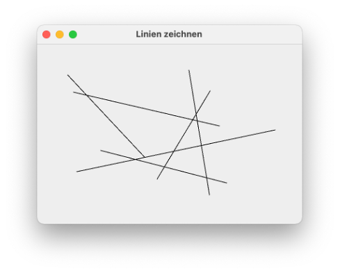

# Mausereignisse

In der letzten [Lektion](graphics.md#graphics) haben wir uns angeschaut, wie wir eigene geometrische Objekte in einer GUI erzeugen können, d.h. wie haben "Zeichnen" in einer GUI gelernt. Um Zeichnen zu können, haben wir

- eine innere Klasse erstellt, die von `JPanel` geerbt hat,
- darin die Methode `paintComponent()` überschrieben und
- in dieser Methode Objektmethoden der Klasse `Graphics2D` aufgerufen, welche das Zeichnen von geometrischen Objekten ermöglichen.

Nun wollen wir uns anschauen, wie wir Ereignisse der Maus behandeln. Bei den Mausereignissen unterscheiden wir zwei Arten von Ereignissen:

- Ereignisse der Maus, die einmalig von der Maus ausgelöst werden. Dazu gehören die Ereignisse, wenn die linke Maustaste gedrückt wird, wenn die gedrückte Taste losgelassen wird, wenn sich die Maus auf eine Komponente bewegt, die sich an den Mauslistener angemeldet hat oder wenn der Mauszeiger diese Komponente wieder verlässt. 
- Ereignisse der Maus, die durch Bewegung der Maus permanent ausgelöst werden. Dazu gehört die Mausbewegung selbst oder auch die Bewegung der Maus bei gedrückter Taste.  

Die erste Art von Mausereignissen können wir behandeln, indem wir

- den `MouseListener` implementieren und
- eine Komponente (z.B. unsere `Canvas`) an den `MouseListener` anmelden. 


Die zweite Art von Maus(-Bewegungs-)ereignissen können wir behandeln, indem wir

- den `MouseMotionListener` implementieren und
- eine Komponente (z.B. unsere `Canvas`) an den `MouseMotionListener` anmelden. 

Wir starten wieder mit einem einfachen Beispiel, welches auf unserem Gründgerüst für das Zeichnen basiert:

```java linenums="1"
import java.awt.Graphics;
import java.awt.Graphics2D;

import javax.swing.JFrame;
import javax.swing.JPanel;

public class Mausereignisse extends JFrame{

    public Mausereignisse()
    {
        super();
        this.setTitle("Mausereignisse");
        this.setDefaultCloseOperation(JFrame.EXIT_ON_CLOSE);    

        this.getContentPane().add(new Canvas());

        this.setSize(400, 300);
        this.setLocation(300,200);
        this.setVisible(true);
    }

    private class Canvas extends JPanel
    {
        @Override
        protected void paintComponent(Graphics g)
        {
            super.paintComponent(g);        // Implementierung von JPanel aufrufen
            Graphics2D g2 = (Graphics2D)g;  // Methoden von Graphics2D nutzbar
            // hier koennen wir zeichnen
        }
    }

    public static void main(String[] args) 
    {
        new Mausereignisse();
    }
}
```

### Der `MouseListener`

In dieser Klasse implementieren wir zunächst den `MouseListener`, d.h. wir fügen in den Klassenkopf `implements MouseListener` ein und lassen durch Eclipse die zu implementierenden Methoden einfügen:


```java linenums="1"
import java.awt.Graphics;
import java.awt.Graphics2D;
import java.awt.event.MouseEvent;
import java.awt.event.MouseListener;

import javax.swing.JFrame;
import javax.swing.JPanel;

public class Mausereignisse extends JFrame implements MouseListener{

    public Mausereignisse()
    {
        super();
        this.setTitle("Mausereignisse");
        this.setDefaultCloseOperation(JFrame.EXIT_ON_CLOSE);    

        this.getContentPane().add(new Canvas());

        this.setSize(400, 300);
        this.setLocation(300,200);
        this.setVisible(true);
    }

    private class Canvas extends JPanel
    {
        @Override
        protected void paintComponent(Graphics g)
        {
            super.paintComponent(g);        // Implementierung von JPanel aufrufen
            Graphics2D g2 = (Graphics2D)g;  // Methoden von Graphics2D nutzbar
            // hier koennen wir zeichnen
        }
    }

    public static void main(String[] args) 
    {
        new Mausereignisse();
    }

	@Override
	public void mouseClicked(MouseEvent e) {
		System.out.println("mouseClicked");		
	}

	@Override
	public void mousePressed(MouseEvent e) {
		System.out.println("mousePressed");	
	}

	@Override
	public void mouseReleased(MouseEvent e) {
		System.out.println("mouseReleased");			
	}

	@Override
	public void mouseEntered(MouseEvent e) {
		System.out.println("mouseEntered");			
	}

	@Override
	public void mouseExited(MouseEvent e) {
		System.out.println("mouseExited");			
	}
}
```

Wie wir sehen, sind es nun nicht mehr nur eine Methode, wie beim `ActionListener`, sondern gleich fünf Methoden, die wir implementieren können. Unsere zunächst einfachste Implementierung (aber zumindest am Anfang stets empfohlen!) ist die einfache Ausgabe auf die Konsole. Noch passiert aber nichts, denn wir dürfen nicht vergessen, uns an den `MouseListener` **anzumelden**!

### `Canvas` meldet sich an den `MouseListener` an

Wir könnten nun das gesamte Fenster an den `MouseListener` anmelden. Dazu würden wir in den Konstruktor von `Mausereignisse` ein `this.addMouseListener(this);` einfügen. Damit würde `this` (also das Objekt von `Mausereignisse`, welches ja selbst ein `JFrame` ist) an den `MouseListener` angemeldet. Die Methode `addMouseListener()` erwartet ein Objekt der Implementierung von `MouseListener`. Das wäre ebenfalls `this`, da der `MouseListener` in der Klasse `Mausereignisse` implementiert ist. 

Weil jedoch später der Umgang mit den Mausereignissen etwas leichter ist, wollen wir das `Canvas`-Objekt an den `MouseListener` anmelden. Es soll also nur die Zeichenfläche (geerbt von `JPanel`) an den `MouseListener` angemeldet werden und nicht das gesamte Fenster. Dazu speichern wir das `Canvas`-Objekt in eine Variable - und wir vereinfachen die Sache auch gleich ein bisschen, indem es keine lokale Variable im Konstruktor von `Mausereignisse` wird, sondern eine Objektvariable der Klasse. Diese Änderungen und das Anmelden von `canvas` an den `MouseListener` sehen so aus:


```java linenums="1" hl_lines="10 18-20"
import java.awt.Graphics;
import java.awt.Graphics2D;
import java.awt.event.MouseEvent;
import java.awt.event.MouseListener;

import javax.swing.JFrame;
import javax.swing.JPanel;

public class Mausereignisse extends JFrame implements MouseListener{
	Canvas canvas;
	
    public Mausereignisse()
    {
        super();
        this.setTitle("Mausereignisse");
        this.setDefaultCloseOperation(JFrame.EXIT_ON_CLOSE);    

        this.canvas = new Canvas();
        this.canvas.addMouseListener(this);
        this.getContentPane().add(this.canvas);

        this.setSize(400, 300);
        this.setLocation(300,200);
        this.setVisible(true);
    }

    private class Canvas extends JPanel
    {
        @Override
        protected void paintComponent(Graphics g)
        {
            super.paintComponent(g);        // Implementierung von JPanel aufrufen
            Graphics2D g2 = (Graphics2D)g;  // Methoden von Graphics2D nutzbar
            // hier koennen wir zeichnen
        }
    }

    public static void main(String[] args) 
    {
        new Mausereignisse();
    }

	@Override
	public void mouseClicked(MouseEvent e) {
		System.out.println("mouseClicked");		
	}

	@Override
	public void mousePressed(MouseEvent e) {
		System.out.println("mousePressed");	
	}

	@Override
	public void mouseReleased(MouseEvent e) {
		System.out.println("mouseReleased");			
	}

	@Override
	public void mouseEntered(MouseEvent e) {
		System.out.println("mouseEntered");			
	}

	@Override
	public void mouseExited(MouseEvent e) {
		System.out.println("mouseExited");			
	}
}
```

Wir erstellen uns also eine Objektvariable `canvas` (Zeile `10`), welche eine Referenz auf das `Canvas`-Objekt ist, das wir im Konstruktor erzeugen (Zeile `18`). Diese Referenz übergeben wir dann auch der `ContentPane` (Zeile `20`). Mithilfe der Methode `addMouseListener()` melden wir das `Canvas`-Objekt an den `MouseListener` an (Zeile `19`). Da der `MouseListener` in der Klasse `Mausereignisse` implementiert ist, wird als Implementierung des `MouseListeners` `this` übergeben (Zeile `19`). 


### Die Methoden des `MouseListener`

Nun ist der `MouseListener` implementiert und das `Canvas`-Objekt ist an den `MouseListener` angemeldet. Wir können nun die einzelnen Methoden des `MouseListener` ausprobieren:

- `mousePressed()` wird aufgerufen, wenn die (linke) Maustaste heruntergedrückt wird. Drücken Sie die Maustaste und halten Sie sie gedrückt. In der Konsole erscheint `mousePressed`.
- `mouseReleased()` wird aufgerufen, wenn die (linke) Maustaste nach dem Drücken wieder losgelassen wird. Lassen Sie die Maustaste, nachdem auf der Konsole `mousePressed` erschienen ist, wieder los. In der Konsole erscheint `mouseReleased`.
- `mouseClicked()` wird aufgerufen, wenn erst `mousePressed()` und dann `mouseReleased()` aufgerufen wurde. `mouseClicked()` beschreibt also die Kombination aus Maustaste gedrückt und Maustaste losgelassen - einen Maus-Klick also.
- `mouseEntered()` wird aufgerufen, wenn Sie den Mauszeiger auf die Komponente bewegen, die an den `MouseListener` angemeldet ist. Wenn Sie in unserem Fall also die Maus in die Zeichenfläche `canvas` bewegen, dann wird die Methode `mouseEntered()` einmalig ausgeführt. 
- `mouseExited()` wird aufgerufen, wenn Sie den Mauszeiger von der Komponente wieder wegbewegen, die an den `MouseListener` angemeldet ist. Wenn Sie in unserem Fall also die Maus von der Zeichenfläche in die Titelleiste des Fensters oder ganz aus dem Fenster (der `ContentPane`) bewegen, dann wird die Methode `mouseExited()` einmalig ausgeführt. 


??? Übung
	Probieren Sie intensiv aus, wann welche Methoden aufgerufen werden! <br/>
	1. Schaffen Sie es, dass zwar `mousePressed` und danach `mouseReleased` auf der Konsole erscheint, nicht aber `mouseClicked`? Wann ist das der Fall? <br/>
	2. Erzeugen Sie folgende Ausgabereihenfolge auf der Konsole: `mousePressed`, `mouseExited`, `mouseReleased`, `mouseEntered`!


### Die Methoden des `MouseMotionListener`

Wir implementieren jetzt auch noch den `MouseMotionListener`. Wir dürfen erneut nicht die **beiden** Schritte vergessen:

1. Implementieren des `MouseMotionListener` (also `implements MouseMotionListener`) **und**
2. Anmelden an den `MouseMotionListener` (also `canvas.addMouseMotionListener(this);`)


```java linenums="1" hl_lines="5 10 21 78-81 83-86"
import java.awt.Graphics;
import java.awt.Graphics2D;
import java.awt.event.MouseEvent;
import java.awt.event.MouseListener;
import java.awt.event.MouseMotionListener;

import javax.swing.JFrame;
import javax.swing.JPanel;

public class Mausereignisse extends JFrame implements MouseListener, MouseMotionListener{
	Canvas canvas;
	
    public Mausereignisse()
    {
        super();
        this.setTitle("Mausereignisse");
        this.setDefaultCloseOperation(JFrame.EXIT_ON_CLOSE);    

        this.canvas = new Canvas();
        this.canvas.addMouseListener(this);
        this.canvas.addMouseMotionListener(this);
        this.getContentPane().add(this.canvas);

        this.setSize(400, 300);
        this.setLocation(300,200);
        this.setVisible(true);
    }

    private class Canvas extends JPanel
    {
        @Override
        protected void paintComponent(Graphics g)
        {
            super.paintComponent(g);        // Implementierung von JPanel aufrufen
            Graphics2D g2 = (Graphics2D)g;  // Methoden von Graphics2D nutzbar
            // hier koennen wir zeichnen
        }
    }

    public static void main(String[] args) 
    {
        new Mausereignisse();
    }

    /*
     * die naechtsten fuenf Methoden sind Methoden
     * von MouseListener
     */
	@Override
	public void mouseClicked(MouseEvent e) {
		System.out.println("mouseClicked");		
	}

	@Override
	public void mousePressed(MouseEvent e) {
		System.out.println("mousePressed");	
	}

	@Override
	public void mouseReleased(MouseEvent e) {
		System.out.println("mouseReleased");			
	}

	@Override
	public void mouseEntered(MouseEvent e) {
		System.out.println("mouseEntered");			
	}

	@Override
	public void mouseExited(MouseEvent e) {
		System.out.println("mouseExited");			
	}

    /*
     * die naechtsten beiden Methoden sind Methoden
     * von MouseMotionListener
     */
	@Override
	public void mouseDragged(MouseEvent e) {
		System.out.println("mouseDragged");		
	}

	@Override
	public void mouseMoved(MouseEvent e) {
		System.out.println("mouseMoved");			
	}
}
```

Beachten Sie, dass die Methoden `mouseDragged()` bzw. `mouseMoved()` permanent, d.h. bei jeder (kleinsten) Bewegung der Maus aufgerufen werden. 

- `mouseMoved()` wird bei jeder (kleinsten) Mausbewegung aufgerufen, wobei die Maustaste nicht gedrückt ist.
- `mouseDragged()` wird bei jeder (kleinsten) Mausbewegung aufgerufen, wobei die Maustaste gedrückt gehalten wird. 

Wenn Sie anhand der Konsolenausgaben geprüft haben, dass die Methoden "funktionieren", dann können Sie dort die Konsolenausgaben auch wieder auskommentieren, da Ihre Konsole ansonsten zu "vollgeschreiben" wird. 

### Objektmethoden der Klasse `MouseEvent`

All diesen Methoden, sowohl vom `MouseListener` als auch vom `MouseMotionListener` wird ein `MouseEvent` als Parameter übergeben. Dieses Objekt besitzt einige nützliche Objektmethoden. Die wichtigsten dabei sind sicherlich die Auskünfte darüber, **wo** das Mausereignis ausgelöst wurde. Wir betrachten einige Objektmethoden des `MouseEvent`-Objekts am Beispiel der `mouseClicked(MouseEvent e)`-Methode (kommentieren Sie die Konsolenausgabe der beiden Methoden vom `MouseMotionListener` aus, damit Sie sich auf die Ausgabe von `mouseClicked()` konzentrieren können). 

- die Methode `getX()` gibt den `x`-Wert der Koordinate zurück, bei dem das `MouseEvent` stattgefunden hat. Die Koordinate bezieht sich auf die Komponente, die an den `MouseListener` (bzw. `MouseMotionListener`) angemeldet ist. Das ist auch der Grund, warum wir nicht das gesamte Fenster an den `MouseListener`  (und `MouseMotionListener`) angemeldet haben. Der Punkt `[x=0, y=0]` befindet sich bei dem `Canvas`-Objekt in der linken oberen Ecke der `ContentPane`. Der Punkt mit den Koordinaten `[x=0, y=0]` beim Fenster ist der linke obere Punkt des Fensters, d.h. der linke obere Punkt der Titelleiste. 
- die Methode `getY()` gibt den `y`-Wert der Koordinate zurück, bei dem das `MouseEvent` stattgefunden hat (Koordinate der Komponente).
- die Methode `getPoint()` gibt ein `Point`-Objekt (von `java.awt`) zurück. Ein `Point`-Objekt besitzt die sichtbaren Objektvariablen `x` und `y` für die Koordinaten.

Wir probieren beide Möglichkeiten aus, die Koordinaten zu erfragen:

```java linenums="49"
	@Override
	public void mouseClicked(MouseEvent e) {
		Point p = e.getPoint();
		int x = e.getX();
		int y = e.getY();
		System.out.println("mouseClicked bei [x=" + p.x +" ,y=" + p.y + "]");	
		System.out.println("mouseClicked bei [x=" + x +" ,y=" + y + "]");
	}
```  

Beide Ausgaben zeigen (natürlich) die gleichen Koordinaten an, z.B. 

```bash
mouseClicked bei [x=388 ,y=215]
mouseClicked bei [x=388 ,y=215]
```

Beachten Sie, dass Sie in allen Methoden, in denen das `MouseEvent` übergeben wird, die Koordinaten des Ereignisses auslesen können. Für `mouseMoved()` sieht die Implementierung gleich aus. Die Ausgabe ist nur deutlich häufiger, da jede Mausbewegung (ohne gedrückte Maustaste) zum Aufruf der Methode führt. 


```java linenums="90"
	@Override
	public void mouseMoved(MouseEvent e) {
		Point p = e.getPoint();
		System.out.println("mouseMoved bei [x=" + p.x +" ,y=" + p.y + "]");				
	}
```  

Beide Ausgaben zeigen (natürlich) die gleichen Koordinaten an, z.B. 

```bash
mouseMoved bei [x=267 ,y=242]
mouseMoved bei [x=282 ,y=261]
mouseMoved bei [x=282 ,y=261]
mouseMoved bei [x=298 ,y=280]
mouseMoved bei [x=298 ,y=280]
mouseMoved bei [x=309 ,y=292]
mouseMoved bei [x=309 ,y=292]
```

Manchmal sind die Mausbewegungen, die ein Auslösen des Ereignisses zur Folge haben, sogar so klein, dass sich die Koordinaten gar nicht ändern. 

Weiterhin kann mithilfe des `MouseEvent`-Objektes überprüft werden, ob während des auslösenden Mausereignisses eine besondere Taste auf der Tastatur gedrückt wurde, z.B. die `Alt`-Taste (linke `option`-Taste beim Mac), die `AltGraph`-Taste (rechte `option`-Taste beim Mac), die `Ctrl`-Taste, oder die `Meta`-Taste (`Windows`-Taste bzw. `Apple`-Taste):


```java linenums="49" hl_lines="9-13"
	@Override
	public void mouseClicked(MouseEvent e) {
		Point p = e.getPoint();
		int x = e.getX();
		int y = e.getY();
		System.out.println("mouseClicked bei [x=" + p.x +" ,y=" + p.y + "]");	
		System.out.println("mouseClicked bei [x=" + x +" ,y=" + y + "]");

		if(e.isAltDown()) System.out.println("Alt-Taste gedrueckt");
		if(e.isAltGraphDown()) System.out.println("AltGraph-Taste gedrueckt");
		if(e.isControlDown()) System.out.println("Ctrl-Taste gedrueckt");
		if(e.isMetaDown()) System.out.println("Meta-Taste gedrueckt");
		if(e.isShiftDown()) System.out.println("Shift-Taste gedrueckt");
	}
```  

Probieren Sie die Maus-Klicks bei unterschiedlich gedrückter Taste auf der Tastatur aus!

Mithilfe der Objektmethode `getClickCount()` lässt sich die Anzahl die Klicks abfragen:


```java linenums="49" hl_lines="15"
	@Override
	public void mouseClicked(MouseEvent e) {
		Point p = e.getPoint();
		int x = e.getX();
		int y = e.getY();
		System.out.println("mouseClicked bei [x=" + p.x +" ,y=" + p.y + "]");	
		System.out.println("mouseClicked bei [x=" + x +" ,y=" + y + "]");

		if(e.isAltDown()) System.out.println("Alt-Taste gedrueckt");
		if(e.isAltGraphDown()) System.out.println("AltGraph-Taste gedrueckt");
		if(e.isControlDown()) System.out.println("Ctrl-Taste gedrueckt");
		if(e.isMetaDown()) System.out.println("Meta-Taste gedrueckt");
		if(e.isShiftDown()) System.out.println("Shift-Taste gedrueckt");

		if(e.getClickCount() == 2) System.out.println("Doppelklick");
	}
``` 

Nochmal, weil es wichtig ist: alle diese Objektmethoden stehen allen Methoden zur Verfügung, denen ein `MouseEvent` übergeben wird. Wir können sie also in allen Methoden aus `MouseListener` und `MouseMotionListener` anwenden. 

## Zeichnen mit der Maus

Wir können nun zwei Sachen:

- Zeichnen und
- Mausereignisse behandeln.

Diese beiden Fähigkeiten wollen wir nun miteinander verbinden. Dazu zunächst einige theoretische Vorüberlegungen.


### Model-View-Controller

Unter *Model-View-Controller* versteht man ein Entwurfsmuster (ein *Design Pattern*), welches ein wesentliches Konzept bei Anwendungen darstellt, die eine GUI besitzen. Wir werden es in diesem Semester nicht mehr schaffen, ausführlich auf dieses Konzept einzugehen, aber wir betrachten ein paar wesentliche Grundsätze daraus, die auch für unsere Anwendungen wichtig sind. Die Grundidee bei *Model-View-Controlle (MVC)* ist die Unterscheidung von drei Aufgaben:

- Das *Model* kümmert sich um die Datenverwaltung. Es gibt eine oder mehrere Datenstrukturen, in denen Daten gespeichert werden. Das *Model*  kümmert sich darum, diese Datenstrukturen zu erstellen und Daten in diese Datenstrukturen einzufügen, zu ändern oder zu löschen. 
- Der *Controller* verwaltet die Nutzerinteraktionen. Auf der Basis bestimmter Aktionen, die durch die Nutzerin verursacht werden (Mausklicks, Tatstureingaben, ...) stößt der *Controller* beim *Model* eine Änderung der der Datenverwaltung an (Daten hinzufügen, ändern oder löschen) und er stößt bei der *View*  die Darstellung der Daten an. Der *Controller* hat also Zugriff auf das *Model*  und auf die *View*. 
- Die *View*  kümmert sich um die Darstellung der Daten in der GUI. Die *View* hat also Zugriff auf das *Model*, denn die *View* verwendet die vom *Model* verwalteten Daten, um diese darzustellen. 

Diese drei Aufgaben sollten möglichst losgelöst voneinander gelöst werden, d.h. es sollte möglichst keine Überschneidungen zwischen diesen Komponenten geben. Für uns ist es in diesem Zusammenhang wichtig, dass die `paintComponent()`-Methode unsere *View* ist. In der `paintComponent()`-Methode können wir zeichnen, d.h. Daten visualisieren. Wir sollten

- keine weitere Methode (außer die `paintComponent()`-Methode) haben, die etwas zeichnet und wir sollten
- in der `paintComponent()`-Methode keine Verwaltung von Daten durchführen. 

Unser *Controller* ist die Implementierung der `Listener`, je nachdem, welche Nutzerinteraktionen wir unterstützen und behandeln wollen, also z.B. `ActionListener`, `MouseListener` und/oder `MouseMotionListener`. 

Unsere Herausforderung ist nun, ein *Model* zu erstellen. Dazu müssen wir stets überlegen, welche Daten wir benötigen, damit die *View* (die `paintComponent()`-Methode) die Objekte zeichnen kann, die gewünscht sind. 

Wir wollen diese theoretischen Überlegungen an einigen Beispielen erläutern. 


### Beispiel 1: Kreise zeichnen

Unser erstes Beispiel ist einfach. Wir wollen mit der Maus in unsere `Canvas` klicken und dort, wo wir hingeklickt haben, soll ein schwarzer, ausgefüllter Kreis erscheinen. Alle Kreise haben den gleichen (einen festen) Durchmesser. Dazu folgende Überlegungen:

- *View*: in der `paintComponent()`-Methode können wir z.B. mithilfe der `fillOval()`-Methode Kreise zeichnen. Wir müssen nur die Koordinaten `x` und `y` kennen, an denen der jeweilige Kreis gezeichnet werden soll. 
- *Controller*: um zu wissen, wo wir mit der Maus in die `Canvas` geklickt haben, müssen wir den `MouseListener` implementieren.
- *Model*: wir müssen Koordinaten speichern, also entweder `int`-Werte `x` und `y` oder gleich Objekte vom Typ `Point`. Wir entscheiden uns für Letzteres. Da wir nicht wissen, wie viele `Point`-Objekte gespeichert werden sollen, kommt ein `Array` nicht in Frage. Wir benötigen Eine `Collection`. Hier ist es egal, ob `List` oder `Set`. Wir entscheiden uns für `List`. 


Wir starten erneut mit unserem Grundgerüst für das Zeichnen, haben dort aber bereits den `MouseListener` implementiert:

=== "KreiseZeichnen.java"
	```java linenums="1"
	import java.awt.Graphics;
	import java.awt.Graphics2D;
	import java.awt.Point;
	import java.awt.event.MouseEvent;
	import java.awt.event.MouseListener;

	import javax.swing.JFrame;
	import javax.swing.JPanel;

	public class KreiseZeichnen extends JFrame implements MouseListener {
		Canvas canvas;
		
	    public KreiseZeichnen()
	    {
	        super();
	        this.setTitle("Kreise zeichnen");
	        this.setDefaultCloseOperation(JFrame.EXIT_ON_CLOSE);    

	        this.canvas = new Canvas();
	        this.canvas.addMouseListener(this);
	        this.getContentPane().add(this.canvas);

	        this.setSize(400, 300);
	        this.setLocation(300,200);
	        this.setVisible(true);
	    }

	    private class Canvas extends JPanel
	    {
	    	// die View
	        @Override
	        protected void paintComponent(Graphics g)
	        {
	            super.paintComponent(g);        
	            Graphics2D g2 = (Graphics2D)g;  
	            // hier koennen wir zeichnen
	        }
	    }

	    public static void main(String[] args) 
	    {
	        new KreiseZeichnen();
	    }

		// der Controller
		@Override
		public void mouseClicked(MouseEvent e) {
			Point p = e.getPoint();
			System.out.println("mouseClicked bei [x=" + p.x +" ,y=" + p.y + "]");	
		}

		@Override
		public void mousePressed(MouseEvent e) {}

		@Override
		public void mouseReleased(MouseEvent e) {}

		@Override
		public void mouseEntered(MouseEvent e) {}

		@Override
		public void mouseExited(MouseEvent e) {}

	}
	``` 

Im Sinne des *Controllers* sind wir nur daran interessiert, die `mouseClicked()`-Methode des `MouseListener` zu implementieren, aber natürlich müssen die anderen Methoden des `MouseListener` auch "implementiert" werden, ansonsten bliben sie abstrakt und somit die ganze Klasse. Wir lassen sie aber leer. 

Wir fügen nun das *Model* ein, nämlich eine Liste aus lauter Punkten, d.h. ein `List<Point`, die wir `points` nennen. Wir erzeugen die Liste im Konstruktor der Klasse, da wir sowohl in `mouseClicked()`, als auch in `paintComponent()` auf diese Liste zugreifen wollen, deklarieren wir sie als globale Variable. 


=== "Einfügen des Models"
	```java linenums="1" hl_lines="3 6-7 14 22 34 43-46 60 62"
	import java.awt.Graphics;
	import java.awt.Graphics2D;
	import java.awt.Point;
	import java.awt.event.MouseEvent;
	import java.awt.event.MouseListener;
	import java.util.ArrayList;
	import java.util.List;

	import javax.swing.JFrame;
	import javax.swing.JPanel;

	public class KreiseZeichnen extends JFrame implements MouseListener {
		Canvas canvas;
		List<Point> points;
		
	    public KreiseZeichnen()
	    {
	        super();
	        this.setTitle("Kreise zeichnen");
	        this.setDefaultCloseOperation(JFrame.EXIT_ON_CLOSE);    

	        this.points = new ArrayList<>();
	        this.canvas = new Canvas();
	        this.canvas.addMouseListener(this);
	        this.getContentPane().add(this.canvas);

	        this.setSize(400, 300);
	        this.setLocation(300,200);
	        this.setVisible(true);
	    }

	    private class Canvas extends JPanel
	    {
	    	final static int DURCHMESSER = 20;

	    	// die View
	        @Override
	        protected void paintComponent(Graphics g)
	        {
	            super.paintComponent(g);        
	            Graphics2D g2 = (Graphics2D)g;  
	            
	            for(Point p : KreiseZeichnen.this.points)
	            {
	            	g2.fillOval(p.x, p.y, DURCHMESSER, DURCHMESSER);
	            }
	        }
	    }

	    public static void main(String[] args) 
	    {
	        new KreiseZeichnen();
	    }

	    // der Controller
		@Override
		public void mouseClicked(MouseEvent e) {
			Point p = e.getPoint();
			System.out.println("mouseClicked bei [x=" + p.x +" ,y=" + p.y + "]");
			this.points.add(p);
			
			this.canvas.repaint();
		}

		@Override
		public void mousePressed(MouseEvent e) {}

		@Override
		public void mouseReleased(MouseEvent e) {}

		@Override
		public void mouseEntered(MouseEvent e) {}

		@Override
		public void mouseExited(MouseEvent e) {}

	}
	``` 

Wir betrachten die Änderungen im Detail:

- Die Klasse `Point` existiert in `java.awt`-Paket und muss von dort importiert werden (Zeile `3`).
- Die Klasse `List` gibt es zwei Mal! Wir wollen hier die `Collection` verwenden und nutzen deshalb die Klasse `List` aus dem `java.util`-Paket. Hier müssen Sie aufpassen, dass Sie die richtige `List`-Klasse importieren (Zeile `7`). 
- Die Klasse `ArrayList` ist aber eindeutig und wird aus dem `java.util`-Paket importiert (Zeile `6`).
- In Zeile `14` wird die *globale* Variable `points` vom Typ `List<Point>` deklariert. Sie muss global sein, damit wir sowohl in der `mouseClicked()`-, als auch in der `paintComponent()`-Methode darauf Zugriff haben. 
- In Zeile `22` erzeugen wir ein Objekt der Klasse `ArrayList` für die `points`-Referenz. 
- In Zeile `34` erstellen wir eine Konstante `DURCHMESSER`, mit der wir den Durchmesser der Kreise festlegen, die wir durch die Maus-Klicks erzeugen wollen. Hier ist es Geschmackssache, ob sie diese Konstante als `static` deklarieren oder nicht. Die Unterscheidung liegt darin, ob Sie allen Objekten aus `Canvas` diesen Wert mitgeben sollen oder ob jedes `Canvas`-Objekt "seinen eigenen" `DURCHMESSER` haben soll. Da wir eh nur ein Objekt von `Canvas` erzeugen, macht es hier keinen Unterschied. 
- In den Zeilen `43-46` wird die Datenstruktur `List` ausgelesen und jeder einzelne `Point` darin verwendet, um einen Kreis an diese Stelle zu zeichnen. Hier greift die *View* auf das *Model* zu (aber nur lesend!). Hier ist also unsere einzige Verbindung zwischen *Model* und *View*. Es sei an dieser Stelle angemerkt, dass die *View*  das Model auch dazu verwenden könnte, um z.B. Quadrate mit der Größe `100x100` zu zeichnen oder rote Kreise oder ... Insofern ist das *Model* unabhängig von der *View* und genau das wollen wir auch erreichen. Wir sehen hier auch den Zugriff auf eine Objekteigenschaft von der inneren in die äußere Klasse. Um auf die Objekteigenschaft `points` der äußeren Klasse zuzugreifen, schreiben wir `KreiseZeichnen.this.points` (siehe auch )
- In Zeile `60` wird die Liste (also das *Model*) durch die Interaktionen der Nutzerin (also durch den *Controller*) befüllt. Immer dort, wohin mit der Maus geklickt wird, wird dieser `Point` in der Datenstruktur Liste (also im *Model*) gespeichert. Hier sehen wir die einzige Verbindung zwischen *Controller*  und *Model*. Der *Controller* greift auf das *Model* zu und stößt das Speichern eines Datums an. 
- Zeile `62` ist **sehr wichtig** und wird häufig vergessen. Hier "triggert" der *Controller* die *View*. Wenn wir uns an die Einführung des Zeichnens erinnern, dann wird ein Fenster mit allen seinen Komponenten "gezeichnet". Wenn wir die `Canvas` mit neuen Kreisen "befüllen", dann bewirkt das nicht automatisch ein Neuzeichnen der `Canvas`. Ein Neuzeichnen würde nur erfolgen, wenn wir bspw. die Fenstergröße ändern oder das Fenster in die Taskleiste bewegen und wieder öffnen. Um ein Neuzeichnen aus dem Programm heraus anzustoßen, benötigen wir die Methode `repaint()`. Wir hätten auch `this.repaint();` angeben können, dann wäre das gesamte Fenster neu gezeichnet worden (inkl. der `Canvas`). Mit `this.canvas.repaint();` wird "nur" die `Canvas` neu gezeichnet.  


??? Übung
	1. Ändern Sie das Programm so, dass die Punkte als Mittelpunkte der Kreise verwendet werden! <br/>
	2. Ändern Sie das Programm so, dass rote Quadrate der Größe `30x30` anstelle der schwarzen Kreise gezeichnet werden! <br/>
	3. Ändern Sie das Programm so, dass die Punkte nur durch einen Doppelklick der Maus erfasst werden (einfacher Mausklick genügt nicht)! <br/>


### Beispiel 2: Linien zeichnen

In unserem zweiten Beispiel wollen wir Linien zeichnen. Dabei soll das Vorgehen so sein:

1. Wir klicken mit der Maus und legen dabei den Anfangspunkt der Linie fest.
2. Wir halten die Maustaste gedrückt und bewegen bei gedrückter Maustaste die Maus. Dabei wird die Linie bereits gezeichnet. 
3. Wir lassen die Maustaste los. dadurch steht der Endpunkt der Linie fest. 

Für Punkt `1.` implementieren wir die Methode `mousePressed()` und wir benötigen somit den `MouseListener`. <br/>
Für Punkt `2.` implementieren wir die Methode `mouseDragged()` und wir benötigen somit den `MouseMotionListener`. <br/>
Für Punkt `3.` implementieren wir die Methode `mouseReleased()` aus dem `MouseListener`. <br/>


Wir starten erneut mit unserem Grundgerüst für das Zeichnen, haben dort aber bereits den `MouseListener` und den `MouseMotionListener`implementiert und die Methoden, die uns nicht interessieren, zusammengekürzt:

=== "LinienZeichnen.java"
	```java linenums="1"
	import java.awt.Graphics;
	import java.awt.Graphics2D;
	import java.awt.Point;
	import java.awt.event.MouseEvent;
	import java.awt.event.MouseListener;
	import java.awt.event.MouseMotionListener;

	import javax.swing.JFrame;
	import javax.swing.JPanel;

	public class LinienZeichnen extends JFrame implements MouseListener, MouseMotionListener {
		Canvas canvas;
		
	    public LinienZeichnen()
	    {
	        super();
	        this.setTitle("Linien zeichnen");
	        this.setDefaultCloseOperation(JFrame.EXIT_ON_CLOSE);    

	        this.canvas = new Canvas();
	        this.canvas.addMouseListener(this);
	        this.canvas.addMouseMotionListener(this);
	        this.getContentPane().add(this.canvas);

	        this.setSize(400, 300);
	        this.setLocation(300,200);
	        this.setVisible(true);
	    }

	    private class Canvas extends JPanel
	    {
	    	// die View
	        @Override
	        protected void paintComponent(Graphics g)
	        {
	            super.paintComponent(g);        
	            Graphics2D g2 = (Graphics2D)g;  
	            
	        }
	    }

	    public static void main(String[] args) 
	    {
	        new LinienZeichnen();
	    }

	    // der Controller
		@Override
		public void mousePressed(MouseEvent e) {
			Point p = e.getPoint();
		}
		
		@Override
		public void mouseDragged(MouseEvent e) {
			Point p = e.getPoint();
			
		}
		
		@Override
		public void mouseReleased(MouseEvent e) {
			Point p = e.getPoint();
		}
		
		@Override public void mouseClicked(MouseEvent e) {}
		@Override public void mouseEntered(MouseEvent e) {}
		@Override public void mouseExited(MouseEvent e) {}
		@Override public void mouseMoved(MouseEvent e) {}
	}
	``` 

Wir überlegen uns nun das *Model*. Dies ist etwas komplexer, als das *Model* für das Zeichnen der Kreise. Es gibt

- *gespeicherte* Linien. Diese Linien sind bereits fertig erstellt. Diese Linien sollten in einer `Collection` gespeichert werden. Es bietet sich wieder eine Liste an (Menge ginge auch). Das Typisieren dieser Liste liegt jedoch nicht auf der Hand, da es im Gegensatz zu `Point` keine Klasse für eine `Linie` gibt, die wir benutzen könnten. Müssen wir uns also selber schreiben.
- eine *aktuelle* Linie. Das ist die Linie, die gerade gezeichnet wird. Diese Linie ist noch nicht gespeichert, d.h. die Maustaste wurde noch nicht losgelassen. Es kann auch sein, dass aktuell keine Linie gezeichnet wird, dann ist der Wert dafür `null`. Auch diese *aktuelle* Linie sollte vom Typ `Linie` sein, den wir uns zunächst erstellen. 


=== "Linie.java"
	```java linenums="1"
	import java.awt.Point;

	public class Linie {
		private Point start;
		private Point ende;
		
		public Linie(Point start, Point ende) {
			this.start = start;
			this.ende = ende;
		}
		
		public void setEnde(Point newEnde) {
			this.ende = newEnde;
		}

		public int getXstart() {
			return this.start.x;
		}
		
		public int getYstart() {
			return this.start.y;
		}
		
		public int getXende() {
			return this.ende.x;
		}
		
		public int getYende() {
			return this.ende.y;
		}
		
	}
	```

Mit dem Konstruktor können wir uns ein Objekt von `Linie` erstellen (im *Controller* bei `mousePressed()`) und haben dann mithilfe von `setEnde()` die Möglichkeit, den Endpunkt der `Linie` noch zu ändern (im *Controller* bei `mouseDragged()`. Die *Getter* benötigen wir in der *View*, um die Werte der Start- und Endpunkte der `Linie` auszulesen. 

Wir beginnen zunächst damit, **eine** Linie zu erzeugen:


=== "LinienZeichnen.java"
	```java linenums="1" hl_lines="13 40-48 61 67 69"
	import java.awt.Graphics;
	import java.awt.Graphics2D;
	import java.awt.Point;
	import java.awt.event.MouseEvent;
	import java.awt.event.MouseListener;
	import java.awt.event.MouseMotionListener;

	import javax.swing.JFrame;
	import javax.swing.JPanel;

	public class LinienZeichnen extends JFrame implements MouseListener, MouseMotionListener {
		Canvas canvas;
		Linie aktLinie;
		
	    public LinienZeichnen()
	    {
	        super();
	        this.setTitle("Linien zeichnen");
	        this.setDefaultCloseOperation(JFrame.EXIT_ON_CLOSE);    

	        this.canvas = new Canvas();
	        this.canvas.addMouseListener(this);
	        this.canvas.addMouseMotionListener(this);
	        this.getContentPane().add(this.canvas);

	        this.setSize(400, 300);
	        this.setLocation(300,200);
	        this.setVisible(true);
	    }

	    private class Canvas extends JPanel
	    {
	    	// die View
	        @Override
	        protected void paintComponent(Graphics g)
	        {
	            super.paintComponent(g);        
	            Graphics2D g2 = (Graphics2D)g;  
	            
	            if(LinienZeichnen.this.aktLinie != null)
	            {
	            	int x1 = LinienZeichnen.this.aktLinie.getXstart();
	            	int y1 = LinienZeichnen.this.aktLinie.getYstart();
	            	int x2 = LinienZeichnen.this.aktLinie.getXende();
	            	int y2 = LinienZeichnen.this.aktLinie.getYende();
	            	
	            	g2.drawLine(x1, y1, x2, y2);
	            }
	        }
	    }

	    public static void main(String[] args) 
	    {
	        new LinienZeichnen();
	    }

	    // der Controller
		@Override
		public void mousePressed(MouseEvent e) {
			Point p = e.getPoint();
			this.aktLinie = new Linie(p,p);
		}
		
		@Override
		public void mouseDragged(MouseEvent e) {
			Point p = e.getPoint();
			this.aktLinie.setEnde(p);
			
			this.canvas.repaint();
		}
		
		@Override
		public void mouseReleased(MouseEvent e) {
			Point p = e.getPoint();
		}
		
		@Override public void mouseClicked(MouseEvent e) {}
		@Override public void mouseEntered(MouseEvent e) {}
		@Override public void mouseExited(MouseEvent e) {}
		@Override public void mouseMoved(MouseEvent e) {}
	}
	``` 

- Die Variable `aktLinie` ist *global*, weil wir sowohl in den Methoden `mousepressed()` und `mouseDragged` als auch in `paintComponent()` darauf zugreifen wollen (Zeile `13`).
- In der `paintComponent()`-Methode (unserer *View*) lesen wir diese `Linie` aus, um sie grafisch als Linie darzustellen. Der Zugriff auf die Eigenschaften des Objektes `aktLinie` erfolgt aber nur, wenn `aktLinie` auch tatsächlich auf ein Objekt zeigt. Wir prüfen deshalb zunächst, ob `aktLinie` nicht `null` ist (Zeile `40`).
- Nachdem wir die `x`- und `y`-Werte des `start`- und des `ende`-Punktes der `aktLinie` ausgelesen haben (Zeilen `42-45`), stellen wir eine Linie grafisch mithilfe der `drawLine()`-Methode dar. 
- Das Objekt einer `Linie` wird in der `mousePressed()`-Methode erstellt. Der `start`- und der `ende`-Punkt dieser `Linie` sind zunächst gleich (die Linie ist also am Anfang nur ein Punkt) - Zeile `61`.
- Wenn wir bei gedrückter Maustaste die Maus bewegen, wird permanent die `mouseDragged()`-Methode aufgerufen. Dort setzen wir die aktuelle Position der Maus als neuen `ende`-Punkt von `aktLinie` (Zeile `67`).
- Zeile `69` ist wieder **sehr wichtig** (und wird häufig vergessen). Hier "triggert" der *Controller* die *View*. Wenn wir die `Canvas` mit einer neuen Linie "befüllen", dann bewirkt das nicht automatisch ein Neuzeichnen der `Canvas`. Das Neuzeichnen erfolgt erst durch den Aufruf `this.canvas.repaint();`.  

Wir können nun viele Linien zeichnen, aber diese werden noch nicht gespeichert. Zum Speichern der Linien benötigen wir wieder eine Collection. Das Speichern der aktuellen Linie in diese Collection erfolgt in dem Moment, indem wir die Maustaste wieder loslassen, also in `mouseReleased()`. Die Collection muss wieder *global* verfügbar sein. 


=== "LinienZeichnen.java"
	```java linenums="1" hl_lines="7 8 16 24 54-62 89"
	import java.awt.Graphics;
	import java.awt.Graphics2D;
	import java.awt.Point;
	import java.awt.event.MouseEvent;
	import java.awt.event.MouseListener;
	import java.awt.event.MouseMotionListener;
	import java.util.ArrayList;
	import java.util.List;

	import javax.swing.JFrame;
	import javax.swing.JPanel;

	public class LinienZeichnen extends JFrame implements MouseListener, MouseMotionListener {
		Canvas canvas;
		Linie aktLinie;
		List<Linie> linien;
		
	    public LinienZeichnen()
	    {
	        super();
	        this.setTitle("Linien zeichnen");
	        this.setDefaultCloseOperation(JFrame.EXIT_ON_CLOSE);    

	        this.linien = new ArrayList<>();
	        this.canvas = new Canvas();
	        this.canvas.addMouseListener(this);
	        this.canvas.addMouseMotionListener(this);
	        this.getContentPane().add(this.canvas);

	        this.setSize(400, 300);
	        this.setLocation(300,200);
	        this.setVisible(true);
	    }

	    private class Canvas extends JPanel
	    {
	    	// die View
	        @Override
	        protected void paintComponent(Graphics g)
	        {
	            super.paintComponent(g);        
	            Graphics2D g2 = (Graphics2D)g;  
	            
	            if(LinienZeichnen.this.aktLinie != null)
	            {
	            	int x1 = LinienZeichnen.this.aktLinie.getXstart();
	            	int y1 = LinienZeichnen.this.aktLinie.getYstart();
	            	int x2 = LinienZeichnen.this.aktLinie.getXende();
	            	int y2 = LinienZeichnen.this.aktLinie.getYende();
	            	
	            	g2.drawLine(x1, y1, x2, y2);
	            }
	            
	            for(Linie l : LinienZeichnen.this.linien)
	            {
	            	int x1 = l.getXstart();
	            	int y1 = l.getYstart();
	            	int x2 = l.getXende();
	            	int y2 = l.getYende();
	            	
	            	g2.drawLine(x1, y1, x2, y2);
	            }
	        }
	    }

	    public static void main(String[] args) 
	    {
	        new LinienZeichnen();
	    }

	    // der Controller
		@Override
		public void mousePressed(MouseEvent e) {
			Point p = e.getPoint();
			this.aktLinie = new Linie(p,p);
		}
		
		@Override
		public void mouseDragged(MouseEvent e) {
			Point p = e.getPoint();
			this.aktLinie.setEnde(p);
			
			this.canvas.repaint();
		}
		
		@Override
		public void mouseReleased(MouseEvent e) {
			Point p = e.getPoint();
			this.linien.add(aktLinie);
		}
		
		@Override public void mouseClicked(MouseEvent e) {}
		@Override public void mouseEntered(MouseEvent e) {}
		@Override public void mouseExited(MouseEvent e) {}
		@Override public void mouseMoved(MouseEvent e) {}
	}
	``` 





??? Übung
	1. Ändern Sie das Programm so, dass nicht Linien gezeichnet werden, sondern Kreise! Ändern Sie aber nur die *View*, d.h. die `paintComponent()`. Die gespeicherten `Linien` geben den Durchmesser der Kreise an.  


