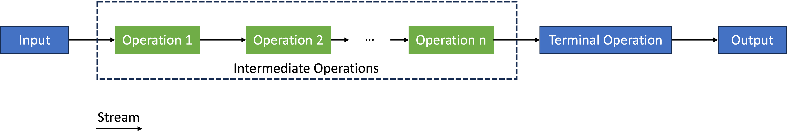

# Streams

Die [Java Streams API](https://docs.oracle.com/en/java/javase/24/docs/api/java.base/java/util/stream/package-summary.html) ermöglicht die Erzeugung, Manipulation und Verwendung eines "Stroms" von Objekten. Während [Collections]() zum Speichern von Objekten verwendet werden, wird die [Java Streams API](https://docs.oracle.com/en/java/javase/24/docs/api/java.base/java/util/stream/package-summary.html) zur Verarbeitung dieser Objekte verwendet, speichert die Objekte selbst jedoch nicht. 

- Ein Stream ist keine Datenstruktur, sondern ein Stream erhält *Input* von Collections, Arrays, Dateien usw.
- Streams verändern nicht die Datenstruktur, aus der sie stammen, sondern erzeugen ein Resultat, indem Operationen *verkettet* werden.
- *Intermediate Operations* erzeugen selbst wieder einen Stream. Dadurch können *intermediate operations* verkettet werden.
- *Terminal Operations* sind am Ende eines Streams und erzeugen das Resultat.



Es gibt also zwei Arten von Operationen in *Streams* 

- *Terminal Operations* und  
- *Intermediate Operations*.

|intermediate operations |terminal operations |
|------------------------|--------------------|
| return *Stream* | return *non-stream* Werte |
| können verkettet werden | können nicht verkettet werden | 
| eine *Stream-Pipeline* kann mehrere intermediäre Operationen enthalten | eine *Stream-Pipeline* enthält genau eine terminal Operation am Ende. |
| intermediäre Operationen werden ausgeführt, wenn die terminale Operation aufgerufen wird (*lazy loading*) | terminale Operationen triggern die Abarbeitung des Streams (*eagerly loaded*) |
| produzieren kein finales Ergebnis | produzieren das finale Ergebnis der *Stream-Pipeline* |
| Beispiele: `filter()`, `map()`, `distinct()`, `sorted()`, `limit()`, `skip()` | Beispiele: `forEach()`, `toArray()`, `reduce()`, `collect()`, `min()`, `max()`, `count()`, `anyMatch()`, `allMatch()`, `noneMatch()`, `findFirst()`, `findAny()` |

Bevor wir uns die einzelnen Operationen näher anschauen, betrachten wir zunächst einige [Beispiele](https://medium.com/javarevisited/java-interview-12-java-stream-api-programming-tips-for-developers-c3a5e5ddc539), um eine Gefühl für *Streams* zu bekommen:


##### Maximum einer Liste von Zahlen berechnen

```java
List<Integer> age = Arrays.asList(12, 4, 16, 5, 27);

int maxAge = age.stream()
        .mapToInt(Integer::intValue)
        .max()
        .orElse(-1);
System.out.println("Max age is: " + maxAge);	// 27
```


##### Produkt einer Liste von Zahlen berechnen

```java
List<Integer> numList = Arrays.asList(1, 2, 3, 4, 5, 6, 7);
int product = numList.stream()
        .reduce(1, (a, b) -> a * b);
System.out.println("Product: " + product);		// 5040
```


##### Doppelungen in einer Liste von Zahlen entfernen

```java
List<Integer> age = Arrays.asList(12, 22, 12, 27, 31, 45, 31, 31, 51);
List<Integer> distinctAge = age.stream()
        .distinct()
        .collect(Collectors.toList());
System.out.println("Distinct Age List: " + distinctAge);	// [12, 22, 27, 31, 45, 51]
```


##### Summe aller geraden Zahlen aus einer Liste berechnen

```java
List<Integer> numList = Arrays.asList(1, 2, 3, 4, 5, 6, 7, 8, 9);
int evenSum = numList.stream()
        .filter(n -> n%2 == 0)
        .mapToInt(Integer::intValue)
        .sum();
System.out.println("Sum of even numbers: " + evenSum);		// 20
```


##### Summe und Durchschnitt einer Liste von Zahlen berechnen

```java
List<Integer> numList = Arrays.asList(1, 2, 3, 4, 5, 6, 7);
int sum = numList.stream()
        .mapToInt(Integer::intValue)
        .sum();
double average = numList.stream()
        .mapToDouble(Integer::doubleValue)
        .average()
        .getAsDouble();
System.out.printf("Sum : %d and Average: %f",sum,average);	// 28 and 4.0
```

## Streams erzeugen

#### `stream()`

In allen obigen Beispielen werden die Streams mithilfe von `stream()` erzeugt. Diese Methode wird durch das Interface [Collection](https://docs.oracle.com/javase/8/docs/api/java/util/Collection.html) zur Verfügung gestellt und lässt sich immer dort anwenden, wo aus einer Collection (`List`, `Set`, `Map`, ...) ein Stream erzeugt werden soll. Ein einfaches Beispiel (sihe aber auch oben) ist

```java
List<String> l1 = List.of("eins", "zwei", "drei", "vier", "fuenf");
Stream<String> s1 = l1.stream();
s1.forEach(System.out::println);		// eins \n zwei \n drei \n vier \n fuenf \n
```

Die Methode `stream()` existiert nicht nur für Collections, sondern auch für [Arrays](https://docs.oracle.com/javase/8/docs/api/java/util/Arrays.html). Dort ist sie aber eine statische Methode, die ein Array erwartet:

```java
String[] array = {"a", "b", "c"};
Stream<String> stream = Arrays.stream(array);
```

Neben `stream()` gibt es noch weitere Stream-erzeugende Methoden, die wir hier kurz betrachten wollen:


#### `Stream.of()`

Die statische `of()`-Methode aus [Stream](https://docs.oracle.com/javase/8/docs/api/java/util/stream/Stream.html) erwartet ein oder mehrere Elemente, die als Stream zurückgegeben werden, z.B.:

```java
Stream<String> s2 = Stream.of("eins", "zwei", "drei", "vier", "fuenf");
s2.forEach(System.out::println);		// eins \n zwei \n drei \n vier \n fuenf \n
```

#### `Stream.generate()`

Die statische `generate()`-Methode aus [Stream](https://docs.oracle.com/javase/8/docs/api/java/util/stream/Stream.html) erwartet einen `Supplier` und erzeugt daraus einen **undendlichen** Stream, z.B.:

```java
Random random = new Random();
Stream<Integer> s3 = Stream.generate(random::nextInt);
s3.forEach(System.out::println);     // hoert nicht auf !!!
```

Eine einfache Möglichkeit, die Anzahl der erzeugten Objekte zu begrenzen, ist die Verwendung der Methode `limit(long)` aus [Stream](https://docs.oracle.com/javase/8/docs/api/java/util/stream/Stream.html), z.B.:


```java
Random random = new Random();
Stream<Integer> s3 = Stream.generate(random::nextInt).limit(10);
s3.forEach(System.out::println);     // 10 zufaellig erzeugte int-Werte
```

#### `Stream.iterate()`

Die statische `iterate()`-Methode aus [Stream](https://docs.oracle.com/javase/8/docs/api/java/util/stream/Stream.html) erwartet zwei Parameter: einen sogenannten `seed` und eine Funktion `f` (einen [UnaryOperator](https://docs.oracle.com/javase/8/docs/api/java/util/function/UnaryOperator.html) aus `java.util.function`). Die Idee ist, dass iterativ die Funktion `f` auf `seed` angewendet wird, d.h.:

1. `f(seed)`,
2. `f(f(seed))`, 
3. `f(f(f(seed)))`,
4. ...

```java
Stream<Integer> s4 = Stream.iterate(0, n -> n + 2);
s4.forEach(System.out::println);	// hoert nicht auf, gerade positive Zahlen zu erzeugen !!!
```

Auch hier kann z.B. wieder `limit(long)` helfen, um den Stream zu begrenzen:

```java
Stream<Integer> s4 = Stream.iterate(0, n -> n + 2).limit(10);
s4.forEach(System.out::println);	// 0 2 4 6 8 10 12 14 16 18
```


## Intermediate Operations

Wir haben in den Beispielen bereits einige Beispiele für *intermediate operations* gesehen. Folgende Tabelle gibt einen [Überblick](https://docs.oracle.com/javase/8/docs/api/java/util/stream/Stream.html) über einige der meistverwendeten *intermediate operations*. *Intermediate Operations*

- können miteinander "verkettet" werden,
- erwarten einen *Stream* und erzeugen einen einen *Stream*, d.h. sie transformieren einen *Stream* in einen anderen.


| Operation |Bedeutung |Wirkung |
|-----------|--------------|----|
| `map(Function mapper)` |Wendet auf alle Elemente (Objekte) des Streams die `mapper`-Funktion an. |Ändert die Anzahl der Objekte des Streams nicht. |
| `filter(Predicate predicate)` |Filtert aus einem Stream alle die Objekte, für die `predicate` den Wert `true` hat. |Ändert die Anzahl der Objekte und gibt nur die Objekte als Stream weiter, für die das `predicate` gilt. |
| `sorted(Comparator comparator)` | Sortiert alle Elemente (Objekte) eines Streams wie durch `comparator` vorgegeben. Gibt es auch als `sorted()`, dann wird `Comparable` genutzt.|Anzahl der Objekte bleibt gleich, Ausgabestream sortiert. |
| `distinct()` | Entfernt alle doppelten Elemente (Objekte) aus dem Stream. Doppelungen werden mittels `equals()` erkannt. | Ändert die Anzahl der Objekte, jedes Objekt kommt im Ausgabestream nur noch einmal vor. |
| `peek(Consumer action)` |Wendet eine `action` auf alle Elemente (Objekte) eines Streams an. Im Unterschied zu `map()` werden hier die Elemente nicht verändert. | Ändert die Anzahl der Elemente nicht. |
| `flatMap(Function mapper)` |Wird typischerweise dafür eingesetzt, um aus einem Stream von Collections einen Stream aller Elemente dieser Collections zu erzeugen. | Ändert nicht die Gesamtanzahl der involvierten Objekte. Aus einem Collections-Stream wird eine Elemente-Stream. | 

Wir betrachten die genannten intermediären Operationen an Beispielen, um ein Verständnis darüber zu erlangen:

#### `map(Function mapper)`

Die Methode `map()` erwartet einen Stream und gibt einen Stream mit gleich vielen Elementen weiter, ersetzt jedoch alle eingehenden Elemente unter Anwendung einer Funktion:

!!! question "Was wird ausgegeben?"
	```java
    int[] numbers = {1, 2, 3, 4, 5, 6, 7, 8, 9, 10};
    Arrays.stream(numbers)
            .map(x -> x * x)
            .forEach(System.out::println);
	```


!!! question "Was wird ausgegeben?"
	```java
    List<String> words = List.of("eins", "zwei", "drei", "vier", "fuenf");
    words.stream()
            .map(x -> x.toUpperCase())
            .forEach(System.out::println);
	```


!!! question "Was wird ausgegeben?"
	```java
    List<String> words = List.of("abc", "a", "abcd", "abcde", "ab");
    words.stream()
            .map(x -> x.length())
            .sorted()
            .forEach(System.out::println);
	```


!!! question "Was wird ausgegeben? - Beachten Sie die Reihenfolge der Ausgaben!"
	```java
    public record Rectangle(int width, int length)
    {
        public int area()
        {
            return this.width * this.length;
        }
    }
    Set<Rectangle> rectangles = new HashSet<>();
    rectangles.add(new Rectangle(1, 2));
    rectangles.add(new Rectangle(3, 2));
    rectangles.add(new Rectangle(1, 4));
    rectangles.add(new Rectangle(3, 4));
    rectangles.add(new Rectangle(2, 5));
    rectangles.add(new Rectangle(4, 2));
    rectangles.stream()
            .peek(s -> System.out.println(s.length() + " x " + s.width() + " = " + s.area()))
            .map(x -> x.area())
            .peek(r -> System.out.println(r))
            .filter(x -> x < 5)
            .forEach(System.out::println);
	```


#### `filter(Predicate predicate)`

Die Methode `filter()` erwartet einen Stream und gibt einen Stream weiter, lässt jedoch nur die Elemente durch, für die das `predicate` den Wert `true` ergibt. Die Elemente selbst bleiben unverändert:


!!! question "Was wird ausgegeben?"
	```java
    int[] numbers = {1, 2, 3, 4, 5, 6, 7, 8, 9, 10};
    Arrays.stream(numbers)
            .filter(x -> x %2 == 0)
            .forEach(System.out::println);
	```


!!! question "Was wird ausgegeben?"
	```java
    List<String> l1 = List.of("abc", "a", "abcd", "abcde", "ab");
    l1.stream()
            .filter(x -> x.length() < 3)
            .forEach(System.out::println);
	```


!!! question "Was wird ausgegeben?"
	```java
    Stream<String> s2 = Stream.of("eins", "zwei", "drei", "vier", "fuenf");
    s2.filter(x -> x.contains("ei"))
      .forEach(System.out::println);
	```


#### `sorted(Comparator comparator)`

Es gibt auch eine Methode `sorted()`. Diese kann auf Klassen angewendet werden, die das [Comparable](https://docs.oracle.com/javase/8/docs/api/java/lang/Comparable.html)-Interface implementiert haben (z.B. String, alle Wrapper-Klassen usw.). Es wird die `compareTo()`-Methode verwendet, um die Elemente zu sortieren. Mit der Methode `sorted(Comparator comparator)` kann ein eigener [Comparator](https://docs.oracle.com/en/java/javase/24/docs/api/java.base/java/util/Comparator.html) implementiert werden. Dabei handelt es sich um ein *Functional Interface* mit der *SAM* `int compare(T o1, T o2)`.

Es gibt verschiedene Möglichkeiten, [Comparator](https://docs.oracle.com/en/java/javase/24/docs/api/java.base/java/util/Comparator.html) anzuwenden (siehe auch [Übung 9](uebungen.md#ubung-9-lambdas-functional-interface-comparator)). Eine ist, die statischen Methoden des Interfaces zu verwenden, z.B. `Comparator.comparingInt(ToIntFunction keyExtractor)` (es gibt auch `comparingDouble(), comparingLong()`):


!!! question "Was wird ausgegeben? - Beachten Sie die Reihenfolge der Ausgaben!"
	```java
    public record Rectangle(int width, int length)
    {
        public int area()
        {
            return this.width * this.length;
        }
    }
    Set<Rectangle> rectangles = new HashSet<>();
    rectangles.add(new Rectangle(1, 2));
    rectangles.add(new Rectangle(3, 2));
    rectangles.add(new Rectangle(1, 4));
    rectangles.add(new Rectangle(3, 4));
    rectangles.add(new Rectangle(2, 5));
    rectangles.add(new Rectangle(4, 2));
    rectangles.stream()
                .sorted(Comparator.comparingInt(Rectangle::area))
                .forEach(System.out::println);
	```


## Terminal Operations

*Terminal Operations* beenden die *Stream-Pipeline* (und triggern die Ausführung der gesamten *Stream-Pipeline*). *Terminal Operations* liefern den Wert der Berechnung. Zu einer *Stream-Pipeline*  gehört genau eine terminale Operation (am Ende). Für die folgenden Beispiele nehmen wir an, wir hätten folgende Klasse (`record`) `Person`:

```java
public record Person(String name, String stadt){
    @Override
    public String toString()
    {
        return String.format("%s aus %s", name, stadt);
    }
}
```

und definieren folgende Liste `personen`:

```java
List<Person> personen = List.of(
        new Person("Alice", "Ankara"),
        new Person("Alice", "Caracas"),
        new Person("Barbara", "Bern"),
        new Person("Barbara", "Damaskus"),
        new Person("Conny", "Caracas"),
        new Person("Conny", "Bern"),
        new Person("Daniela", "Damaskus"),
        new Person("Daniela", "Caracas"),
        new Person("Elvira","Bern" ),
        new Person("Elvira","Ankara" ),
        new Person("Frieda", "Caracas"),
        new Person("Gerda", "Ankara"),
        new Person("Hannah", "Hanoi"),
        new Person("Ina", "Islamabad"),
        new Person("Jana", "Hanoi")
        );
```

Wir betrachten Beispiele einiger terminaler Operationen:

### `forEach(Consumer action)`

Die `forEach()`-Methode kommt im [Interface Stream<T>](https://docs.oracle.com/javase/8/docs/api/java/util/stream/Stream.html#forEach-java.util.function.Consumer-), aber auch im [Interface Iterable](https://docs.oracle.com/javase/8/docs/api/java/lang/Iterable.html) vor, welches von Listen und Mengen implementiert ist. `forEach()` erwartet einen [Consumer](https://docs.oracle.com/javase/8/docs/api/java/util/function/Consumer.html), also eine *Funktion*, die ein Parameter erwartet und nichts zurückgibt (also z.B. `System.out::println`).

Da es sich bei `personen` um eine Liste handelt, können wir `forEach()` direkt für die Liste aufrufen, das hat dann aber nichts mit *Streams* zu tun (sondern mit `Iterable`):

```java
personen.forEach(System.out::println);
personen.forEach(p -> System.out.println(p.name()));
```

Für `Stream` erhalten wir aber genau die gleiche Ausgabe:

```java
personen.stream().forEach(System.out::println);
personen.stream().forEach(p -> System.out.println(p.name()));
```

Mit *Streams*  sind wir dann aber flexibler für *intermediate operations*, z.B. um doppelte Namen herauszufiltern:


```java
personen.stream()
        .map(p -> p.name())
        .distinct()
        .forEach(System.out::println);
```


!!! question "Werden doppelte Namen ausgegeben (J/N)?"
    ```java
    personen.stream()
            .distinct()
            .forEach(p -> System.out.println(p.name()));
    ```


### `reduce(T identity, BinaryOperator<T> accumulator)`

Die Methode [reduce()](https://docs.oracle.com/en/java/javase/24/docs/api/java.base/java/util/stream/Stream.html#reduce(java.util.function.BinaryOperator)) gehört zu den *reduction operations* (auch *fold* genannt). *reduction operations* erwarten eine Sequenz von Input-Elementen (einen *Stream*) und kombinieren diese zu einem einzigen Wert. Der `reduce()`-Methode wird eine Funktion ([BinaryOperator](https://docs.oracle.com/en/java/javase/24/docs/api/java.base/java/util/function/BinaryOperator.html)) übergeben. Diese Funktion wird auf jedes einzelne Element angewendet und zu einem Result akkumuliert. Das Prinzip ist wie folgt:

```java
     T result = identity;
     for (T element : this stream)
         result = accumulator.apply(result, element)
     return result;
```

!!! question "Was wird ausgegeben?"
    ```java
        int[] numbers = {1, 2, 3, 4};
        int result = Arrays.stream(numbers1).reduce(0, (x, y) -> (x + y));
        System.out.println("result = " + result);
    ```

!!! question "Was wird ausgegeben?"
    ```java
        int[] numbers = {1, 2, 3, 4};
        int result = Arrays.stream(numbers1).reduce(1, (x, y) -> (x * y));
        System.out.println("result = " + result);
    ```

### `collect(Collector<> collector)`

Die Methode `collect()` gehört ebenfalls zu den *reduction operations*. Das Ergebnis von `collect()` ist typischerweise eine Collection. 
Wir können mithilfe von `collect()` z.B. eine einfache Liste der Namen der Personen (siehe oben) erstellen:

```java
List<String> namensListe = personen.stream()
    .map(p -> p.name())
    .collect(Collectors.toList());
```

Wir können auch angeben, dass eine `Set` erzeugt werden soll. Diese enthält (im Gegensatz zur Liste) keine Doppelungen:

```java
Set<String> namensSet = personen.stream()
        .map(p -> p.name())
        .collect(Collectors.toCollection(TreeSet::new));
```


??? question "Erstellen Sie eine `HashSet`, die alle Städte aus `personen` enthält und geben Sie diese aus!"
    ```java
    Set<String> stadtSet = personen.stream()
            .map(p -> p.stadt())
            .collect(Collectors.toCollection(HashSet::new));
    stadtSet.forEach(System.out::println);
    ```


Unter Verwendung von `Collector.groupingBy()` kann eine `Map` erstellt werden, deren Schlüssel dem angegebenen `groupingBy`-Element entspricht:

```java
Map<String, List<Person>> personenStadt
        = personen.stream()
        .collect(
            Collectors.groupingBy(
                Person::stadt
            )
        );
personenStadt.entrySet().stream().forEach(System.out::println);
```

Ausgabe: 

```bash
Bern=[Barbara aus Bern, Conny aus Bern, Elvira aus Bern]
Caracas=[Alice aus Caracas, Conny aus Caracas, Daniela aus Caracas, Frieda aus Caracas]
Ankara=[Alice aus Ankara, Elvira aus Ankara, Gerda aus Ankara]
Hanoi=[Hannah aus Hanoi, Jana aus Hanoi]
Islamabad=[Ina aus Islamabad]
Damaskus=[Barbara aus Damaskus, Daniela aus Damaskus]
```

Das kann dann sogar nochmal beliebig verschachtelt werden, z.B.:


```java
Map<String, Map<String, List<Person>>> personenStadtName
        = personen.stream()
        .collect(
            Collectors.groupingBy(
                Person::name,
                Collectors.groupingBy(
                    Person::stadt
                )
            )
        );
personenStadtName.entrySet().stream().forEach(System.out::println);
```

Ausgabe: 

```bash
Barbara={Bern=[Barbara aus Bern], Damaskus=[Barbara aus Damaskus]}
Alice={Caracas=[Alice aus Caracas], Ankara=[Alice aus Ankara]}
Hannah={Hanoi=[Hannah aus Hanoi]}
Jana={Hanoi=[Jana aus Hanoi]}
Gerda={Ankara=[Gerda aus Ankara]}
Conny={Bern=[Conny aus Bern], Caracas=[Conny aus Caracas]}
Ina={Islamabad=[Ina aus Islamabad]}
Elvira={Bern=[Elvira aus Bern], Ankara=[Elvira aus Ankara]}
Frieda={Caracas=[Frieda aus Caracas]}
Daniela={Caracas=[Daniela aus Caracas], Damaskus=[Daniela aus Damaskus]}
```

Es wird also nach `name` gruppiert und in jeder Namensgruppe dann nochmal nach `stadt`. Um nur die Namen nach Städten zu gruppieren, kann bspw. 


```java
Map<String, List<String>> personenNameStaedte
        = personen.stream()
        .collect(Collectors.groupingBy(
                Person::name,
                Collectors.mapping(
                        Person::stadt,
                        Collectors.toList())));
personenNameStaedte.entrySet().stream().forEach(System.out::println);
```

Ausgabe: 

```bash
Barbara=[Bern, Damaskus]
Alice=[Ankara, Caracas]
Hannah=[Hanoi]
Jana=[Hanoi]
Gerda=[Ankara]
Conny=[Caracas, Bern]
Ina=[Islamabad]
Elvira=[Bern, Ankara]
Frieda=[Caracas]
Daniela=[Damaskus, Caracas]
```

verwendet werden. `Collector.groupingBy()` erwartet also entweder 

- 1 Parameter (`Function classifier`), um in einer `Function` anzugeben, wonach gruppiert werden soll (z.B. `Person::stadt`) oder
- 2 Parameter (`Function classifier` und `Collector downstream`), um einerseits in einer `Function` anzugeben, wonach gruppiert werden soll und andererseits einen weiteren kaskadierenden `Collector` für eine "innere" Gruppierung anzugeben. 

Es gibt noch eine Implementierung mit 3 Parametern (siehe [Collectors](https://docs.oracle.com/javase/8/docs/api/java/util/stream/Collectors.html#groupingBy-java.util.function.Function-java.util.stream.Collector-)), aber 1-2 genügen uns bereits :sweat:.


### `allMatch(Predicate<T> p)`, `anyMatch(Predicate<T> p)`

Den Methoden `allMatch(Predicate p)` und `anyMatch(Predicate p)` wird ein [Predicate](https://docs.oracle.com/javase/8/docs/api/java/util/function/Predicate.html) übergeben und sie geben ein `boolean` zurück. Ein `Predicate` ist eine Funktion über **einen** Parameter, die ein `boolean` zurückgibt.


!!! question "Welchen Wert hat `answer`?"
    ```java
    List<Integer> list = Arrays.asList(3, 4, 6, 12, 20);
    boolean answer = list.stream().allMatch(n-> n % 3 ==0);
    ```

!!! question "Welchen Wert hat `answer`?"
    ```java
    List<Integer> list = Arrays.asList(3, 4, 6, 12, 21);
    boolean answer = list.stream().allMatch(n-> n % 3 ==0);
    ```

!!! question "Welchen Wert hat `answer`?"
    ```java
    List<Integer> list = Arrays.asList(3, 4, 6, 12, 20);
    boolean answer = list.stream().anyMatch(n-> n % 3 ==0);
    ```


### `min(Comparator<T> c)`, `max(Comparator<T> c)`

Den Methoden `min(Comparator<T> c)` und `max(Comparator<T> c)` wird ein [Comparator](https://docs.oracle.com/javase/8/docs/api/java/util/Comparator.html) übergeben und sie geben das "kleinste" bzw. "größte" Element aus dem Stream zurück. Ein `Comparator` ist eine Funktion über **zwei** Parameter, die ein `int` zurückgibt. Die *SAM* des Interfaces `Comparator` ist `compare(T o1, T o2)` und hat die gleiche Bedeutung, wie `compareTo()` aus `Comparable`, d.h. wenn `o1` "größer" ist als `o2`, dann ist der Rückgabewert von `compare() > 0`.

Beachten Sie, dass `min()` und `max()` tatsächlich ein [Optional<T>](https://docs.oracle.com/javase/8/docs/api/java/util/Optional.html) zurückgeben, d.h. der Wert könnte auch `null` sein. Wir müssen deshalb stets noch z.B. `get()` für das zurückgegebene `Optional` aufrufen. Diese Funktion gibt den Wert zurück, wenn er existiert (ansonsten wird eine `NoSuchElementException` geworfen).


!!! question "Welchen Wert hat `answer`?"
    ```java
    List<Integer> list = Arrays.asList(3, 4, 6, 12, 20);
    int answer = list.stream().min((a,b) -> a - b).get();
    ```

!!! question "Welchen Wert hat `answer`?"
    ```java
    Person answer = personen.stream().min((a,b) -> a.name().compareTo(b.name())).get();
    ```

!!! question "Welchen Wert hat `answer`?"
    ```java
    Person answer = personen.stream().max((a,b) -> a.stadt().length() - b.stadt().length()).get();
    ```

!!! question "Welchen Wert hat `answer`?"
    ```java
    List<Integer> list = Arrays.asList(3, 4, 6, 12, 20);
    int answer = list.stream().max((a,b) -> a % 4 - b % 4).get();
    ```


### `sum()`, `average()`, `count()`

Die Methoden `sum()`, `average()`, `count()` sind Methoden aus dem Interface [IntStream](https://docs.oracle.com/en/java/javase/24/docs/api/java.base/java/util/stream/IntStream.html). Die Methode `count()` gibt es aber auch bereits in `Stream`. Neben `IntStream` gibt es auch `DoubleStream` und `LongStream`. In allen drei Stream-Arten kommen die hier diskutierten Methoden vor. Wir zeigen aber alles am Beispiel von `IntStream`.

Aus einem Stream können wir mithilfe von `mapToInt()` oder `flatMapToInt()` einen `IntStream` erzeugen. Beide Methoden erwarten als Parameter eine [ToIntFunction](https://docs.oracle.com/en/java/javase/24/docs/api/java.base/java/util/function/ToIntFunction.html). Diese besitzt als *SAM* die Methode `applyAsInt(T value)` und gibt einen `int` zurück. 

Die Methode `sum()` gibt ein `int` zurück, `count()` ein `long` und `average()` ein [OptionalDouble](https://docs.oracle.com/en/java/javase/24/docs/api/java.base/java/util/OptionalDouble.html), dessen `double`-Wert wir durch `getAsDouble()` erhalten können. 


!!! question "Welchen Wert hat `answer`?"
    ```java
    List<Integer> list = Arrays.asList(3, 4, 5, 6);
    int answer = list.stream().mapToInt(p -> p).sum();      // int
    ```

!!! question "Welchen Wert hat `answer`?"
    ```java
    long answer = list.stream().count();                    // long
    ```

!!! question "Welchen Wert hat `answer`?"
    ```java
    double answer = list.stream().mapToInt(p -> p).average().getAsDouble();  // double
    ```


## Typische Fehler mit Streams

Jetzt noch einige Empfehlungen, um typische Fehler mit Streams zu vermeiden (siehe z.B. [hier](https://medium.com/javarevisited/avoid-these-5-common-java-stream-mistakes-for-efficient-development-7aefce097ac3)). 


### Ein Stream ist nur einmal terminierbar

Jeder Stream kann nur einmal terminiert werden. Folgender Code führt deshalb zu einem Fehler:

!!! failure "Fehler"
    ```java
        List<String> fruits = Arrays.asList("apple", "banana", "orange", "mango");

        // create a stream
        Stream<String> fruitStream = fruits.stream();

        // count() is terminal operation - closes the stream
        long count = fruitStream.count();
        System.out.println("Number of fruits: " + count);

        // try to reuse the same stream - this will fail!
        List<String> upperCaseFruits = fruitStream
                .map(String::toUpperCase)
                .collect(Collectors.toList());
    ```  

Es wird eine `IllegalStateException` geworfen:

```bash
Exception in thread "main" java.lang.IllegalStateException: stream has already been operated upon or closed
```


!!! success "Richtig"
    ```java
        List<String> fruits = Arrays.asList("apple", "banana", "orange", "mango");
        
        // eigener Stream fuer count()
        long count = fruits.stream().count();
        System.out.println("Number of fruits: " + count);
        
        // eigener Stream fuer collect()
        List<String> upperCaseFruits = fruits.stream()
            .map(String::toUpperCase)
            .collect(Collectors.toList());
        
        System.out.println("Uppercase fruits: " + upperCaseFruits);
    ```  

Ausgabe:

```bash
Number of fruits: 4
Uppercase fruits: [APPLE, BANANA, ORANGE, MANGO]
```

### Nebenläufiges Ändern während der Iteration

Wenn wir aus einer `Collection` einen *Stream* erzeugen, darf die `Collection` nicht geändert werden, während wir den *Stream* abarbeiten. Beispielsweise führt folgender Code zu einem Fehler:


!!! failure "Fehler"
    ```java
        List<Integer> numbers = new ArrayList<>(Arrays.asList(1, 2, 3, 4, 5));

        // nicht die Collection aendern, waehrend der Stream abgearbeitet wird!
        numbers.stream().forEach(number -> {
            if (number % 2 == 0) {
                numbers1.add(number * 2);
            }
        });
    ```  


Es wird eine `ConcurrentModificationException` geworfen:

```bash
Exception in thread "main" java.util.ConcurrentModificationException
```


!!! success "Richtig"
    ```java
        List<Integer> numbers = new ArrayList<>(Arrays.asList(1, 2, 3, 4, 5));
        
        // neue Collection mit den gewuenschten Aenderungen erzeugen 
        List<Integer> modifiedNumbers = numbers.stream()
            .flatMap(number -> {
                if (number % 2 == 0) {
                    return Stream.of(number, number * 2);
                }
                return Stream.of(number);
            })
            .collect(Collectors.toList());
        
        System.out.println("Original numbers: " + numbers);
        System.out.println("Modified numbers: " + modifiedNumbers);
    ```  

Ausgabe:

```bash
Original numbers: [1, 2, 3, 4, 5]
Modified numbers: [1, 2, 4, 3, 4, 8, 5]
```

### Optionale Werte behandeln

Wenn wir keine `Optional` Werte behandeln, können wir `NullPointerException` oder `NoSuchElementException` riskieren:


!!! failure "Fehler"
    ```java
        List<String> names = Arrays.asList("John", "Jane", "Bob");

        // keine Optional-Behandlung!
        String firstLongName = names.stream()
                .filter(name -> name.length() > 10)
                .findFirst()
                .get();     // wirft NoSuchElementException
    ```  


Es wird eine `NoSuchElementException` geworfen:

```bash
Exception in thread "main" java.util.NoSuchElementException: No value present
    at java.base/java.util.Optional.get(Optional.java:xxx)
```


!!! success "Richtig"
    ```java
        List<String> names = Arrays.asList("John", "Jane", "Bob");

        // orElse
        String firstLongName = names.stream()
                .filter(name -> name.length() > 10)
                .findFirst()
                .orElse("No long name found");

        // orElseGet - returns String "Default name"
        String computedName = names.stream()
                .filter(name -> name.length() > 10)
                .findFirst()
                .orElseGet(() -> "Default Name");

        // ifPresent  - void, prints if present 
        names.stream()
                .filter(name -> name.length() > 10)
                .findFirst()
                .ifPresent(name -> System.out.println("Found long name: " + name));

        // orElseThrow - wirft eigene Exception
        try {
            String requiredName = names.stream()
                    .filter(name -> name.length() > 10)
                    .findFirst()
                    .orElseThrow(() -> new IllegalStateException("No long name found"));
        } catch (IllegalStateException e) {
            System.out.println("Handled exception: " + e.getMessage());
        }

        System.out.println("firstLongName : " + firstLongName);
        System.out.println("computedName : " + computedName);
    ```  

Ausgabe:

```bash
Handled exception: No long name found
firstLongName : No long name found
computedName : Default Name
```


### Effiziente Operation für Collections verwenden

Die Verwendung ineffizienter Operationen für Collections kann zu schlechter Performanz führen. Ist nicht völlig falsch, aber der sinnvolle Einsatz von Operationen über Collections ist besser:


!!! warning "ineffizient"
    ```java
        List<String> words = Arrays.asList("apple", "banana", "apple", "cherry", "banana");

        // Inefficient way to count occurrences
        Map<String, Long> wordCounts = words.stream()
                .collect(Collectors.toMap(
                        word -> word,
                        word -> 1L,
                        (count1, count2) -> count1 + 1
                ));
        wordCounts.entrySet().stream().forEach(System.out::println);
    ```  


Ausgabe:

```bash
banana=2
cherry=1
apple=2
```


!!! success "besser"
    ```java
        List<String> words = Arrays.asList("apple", "banana", "apple", "cherry", "banana");

        // Efficient counting using groupingBy
        Map<String, Long> wordCounts = words.stream()
                .collect(Collectors.groupingBy(
                        Function.identity(),
                        Collectors.counting()
                ));

        // Efficient distinct collection
        List<String> uniqueWords = words.stream()
                .distinct()
                .collect(Collectors.toList());

        // Efficient grouping with downstream collector
        Map<Integer, List<String>> wordsByLength = words.stream()
                .collect(Collectors.groupingBy(
                        String::length,
                        Collectors.toList()
                ));

        // Efficient partitioning
        Map<Boolean, List<String>> partitioned = words.stream()
                .collect(Collectors.partitioningBy(
                        word -> word.length() > 5
                ));

        System.out.printf("%n%n----------- wordCounts ---------------%n%n");
        wordCounts.entrySet().stream().forEach(System.out::println);
        System.out.printf("%n%n----------- uniqueWords --------------%n%n");
        uniqueWords.stream().forEach(System.out::println);
        System.out.printf("%n%n---------- wordsByLength -------------%n%n");
        wordsByLength.entrySet().stream().forEach(System.out::println);
        System.out.printf("%n%n----------- partitioned --------------%n%n");
        partitioned.entrySet().stream().forEach(System.out::println);
    ```  

Ausgabe:

```bash
----------- wordCounts ---------------

banana=2
cherry=1
apple=2


----------- uniqueWords --------------

apple
banana
cherry


---------- wordsByLength -------------

5=[apple, apple]
6=[banana, cherry, banana]


----------- partitioned --------------

false=[apple, apple]
true=[banana, cherry, banana]

```


## Beispiele Streams und Lambdas

Die folgenden Beispiele sind [Medium: 50 Java 8 Lambda Snippets Every Developer Should Know](https://medium.com/@gaddamnaveen192/50-java-8-lambda-snippets-every-developer-should-know-00c4bf90e367) entnommen. Da es ein `member-only article` ist, poste ich den Inhalt (hoffentlich legaler Weise :smile:) hier. 

#### Iterating List using Lambda

```java
List<String> list = Arrays.asList("Java", "Spring", "Lambda");
list.forEach(item -> System.out.println(item));
```

#### Filtering a List with Lambda

```java
List<String> list = Arrays.asList("Java", "JavaScript", "Python");
List<String> filteredList = list.stream()
    .filter(s -> s.startsWith("J"))
    .collect(Collectors.toList());
filteredList.forEach(System.out::println);
```

#### Sorting a List using Lambda

```java
List<String> list = Arrays.asList("Java", "Lambda", "Kafka");
list.sort((s1, s2) -> s1.compareTo(s2));
list.forEach(System.out::println);
```

#### Using a Custom Functional Interface

```java
@FunctionalInterface
interface Calculator {
    int calculate(int a, int b);
}

public static void main(String[] args) {
    Calculator add = (a, b) -> a + b;
    Calculator multiply = (a, b) -> a * b;
    System.out.println("Addition: " + add.calculate(5, 3));
    System.out.println("Multiplication: " + multiply.calculate(5, 3));
}
```

#### Lambda with Map Iteration

```java
Map<String, Integer> map = new HashMap<>();
map.put("Java", 8);
map.put("Spring", 5);
map.put("Lambda", 1);
map.forEach((key, value) -> System.out.println(key + ": " + value));
```

#### Lambda in Comparator

```java
List<String> list = Arrays.asList("Java", "Lambda", "Kafka");
list.sort(Comparator.comparingInt(String::length));
list.forEach(System.out::println);
```

#### Method Reference with Lambda

```java
List<String> list = Arrays.asList("Java", "Lambda", "Kafka");
list.forEach(System.out::println);
```

#### Lambda with Optional

```java
Optional<String> optional = Optional.of("Java");
optional.ifPresent(s -> System.out.println("Value is present: " + s));
```

#### Lambda with Predicate

```java
Predicate<String> isEmpty = s -> s.isEmpty();
System.out.println(isEmpty.test(""));       // true
System.out.println(isEmpty.test("Java"));   // false
```

#### Lambda with BiFunction

```java
BiFunction<Integer, Integer, Integer> add = (a, b) -> a + b;
System.out.println(add.apply(2, 3)); // 5
```

#### Lambda with Consumer

```java
Consumer<String> print = s -> System.out.println(s);
print.accept("Hello, World!"); // Hello, World!
```

#### Lambda with Supplier

```java
Supplier<String> supplier = () -> "Java";
System.out.println(supplier.get()); // Java
```

#### Lambda with Stream Sorted

```java
List<String> list = Arrays.asList("Banana", "Pear", "Grapes");
list.stream()
    .sorted()
    .forEach(System.out::println);
```

#### Lambda with Stream Count

```java
List<Integer> numbers = Arrays.asList(1, 2, 3, 4, 5);
long count = numbers.stream()
    .count();
System.out.println("Count: " + count); // Count: 5
```

#### Lambda with Stream AnyMatch

```java
List<String> list = Arrays.asList("Java", "Spring", "Lambda");
boolean containsJava = list.stream()
    .anyMatch(s -> s.equals("Java"));
System.out.println("Contains 'Java': " + containsJava); // true
```

#### Lambda with Stream AllMatch

```java
List<Integer> numbers = Arrays.asList(2, 4, 6, 8, 10);
boolean allEven = numbers.stream()
    .allMatch(n -> n % 2 == 0);
System.out.println("All even: " + allEven); // true
```

#### Lambda with Stream NoneMatch

```java
List<String> list = Arrays.asList("Java", "Spring", "Lambda");
boolean nonePython = list.stream()
    .noneMatch(s -> s.equals("Python"));
System.out.println("Contains no 'Python': " + nonePython); // true
```

#### Lambda with Stream FindFirst

```java
List<String> list = Arrays.asList("Java", "Spring", "Lambda");
Optional<String> first = list.stream()
    .findFirst();
first.ifPresent(System.out::println); // Java
```

#### Lambda with Stream FindAny

```java
List<String> list = Arrays.asList("Java", "Spring", "Lambda");
Optional<String> any = list.stream()
    .findAny();
any.ifPresent(System.out::println);
```

#### Lambda for Summing Integers

```java
List<Integer> numbers = Arrays.asList(1, 2, 3, 4, 5);
int sum = numbers.stream()
    .mapToInt(Integer::intValue)
    .sum();
System.out.println("Sum: " + sum); // Sum: 15
```

#### Lambda for Max Integer

```java
List<Integer> numbers = Arrays.asList(1, 2, 3, 4, 5);
int max = numbers.stream()
    .mapToInt(Integer::intValue)
    .max()
    .orElse(Integer.MIN_VALUE);
System.out.println("Max: " + max); // Max: 5
```

#### Lambda for Min Integer

```java
List<Integer> numbers = Arrays.asList(1, 2, 3, 4, 5);
int min = numbers.stream()
    .mapToInt(Integer::intValue)
    .min()
    .orElse(Integer.MAX_VALUE);
System.out.println("Min: " + min); // Min: 1
```

#### Lambda for Joining Strings

```java
List<String> list = Arrays.asList("Java", "Spring", "Lambda");
String joined = list.stream()
    .collect(Collectors.joining(", "));
System.out.println(joined); // Java, Spring, Lambda
```

#### Lambda for Joining Without Delimiter

```java
List<String> list = Arrays.asList("Java", "Spring", "Lambda");
String joined = list.stream()
    .collect(Collectors.joining());
System.out.println(joined); // JavaSpringLambda
```

#### Lambda with Stream MapToInt

```java
List<String> list = Arrays.asList("Java", "Spring", "Lambda");
list.stream()
    .mapToInt(String::length)
    .forEach(System.out::println); // 4, 6, 6
```

#### Lambda with Stream Collect to Set

```java
List<String> list = Arrays.asList("Java", "Spring", "Lambda", "Spring");
Set<String> set = list.stream()
    .collect(Collectors.toSet());
set.forEach(System.out::println); // Java, Spring, Lambda
```

#### Lambda with Stream GroupingBy

```java
List<String> list = Arrays.asList("Java", "Spring", "Lambda", "Java");
Map<String, Long> frequency = list.stream()
    .collect(Collectors.groupingBy(s -> s, Collectors.counting()));
frequency.forEach((k, v) -> System.out.println(k + ": " + v));
// Java: 2, Spring: 1, Lambda: 1
```


```java
List<String> list = Arrays.asList("Java", "Spring", "Lambda");
Map<Integer, List<String>> map = list.stream()
    .collect(Collectors.groupingBy(String::length));
map.forEach((k, v) -> System.out.println(k + ": " + v));
// 4: [Java], 6: [Spring, Lambda]
```

#### Lambda with Stream PartitioningBy

```java
List<Integer> numbers = Arrays.asList(1, 2, 3, 4, 5, 6, 7, 8, 9, 10);
Map<Boolean, List<Integer>> partitioned = numbers.stream()
    .collect(Collectors.partitioningBy(n -> n % 2 == 0));
partitioned.forEach((k, v) -> System.out.println(k + ": " + v));
// true: [2, 4, 6, 8, 10], false: [1, 3, 5, 7, 9]List<Integer> numbers = Arrays.asList(1, 2, 3, 4, 5, 6, 7, 8, 9, 10);
Map<Boolean, List<Integer>> partitioned = numbers.stream()
    .collect(Collectors.partitioningBy(n -> n % 2 == 0));
partitioned.forEach((k, v) -> System.out.println(k + ": " + v));
// true: [2, 4, 6, 8, 10], false: [1, 3, 5, 7, 9]
```

#### Lambda with Stream Counting

```java
List<String> list = Arrays.asList("Java", "Spring", "Lambda");
long count = list.stream()
    .collect(Collectors.counting());
System.out.println("Count: " + count); // Count: 3
```

#### Lambda with Stream SummarizingInt

```java
List<Integer> numbers = Arrays.asList(1, 2, 3, 4, 5);
IntSummaryStatistics stats = numbers.stream()
    .collect(Collectors.summarizingInt(Integer::intValue));
System.out.println("Sum: " + stats.getSum());
System.out.println("Average: " + stats.getAverage());
System.out.println("Max: " + stats.getMax());
System.out.println("Min: " + stats.getMin());
```

#### Lambda with Stream ToMap

```java
List<String> list = Arrays.asList("Java", "Spring", "Lambda");
Map<String, Integer> map = list.stream()
    .collect(Collectors.toMap(s -> s, String::length));
map.forEach((k, v) -> System.out.println(k + ": " + v));
// Java: 4, Spring: 6, Lambda: 6
```

#### Lambda for Creating a Stream

```java
Stream<String> stream = Stream.of("Java", "Spring", "Lambda");
stream.forEach(System.out::println);
```

#### Lambda with Stream Limit

```java
Stream<String> stream = Stream.of("Java", "Spring", "Lambda", "Kafka");
stream.limit(2)
    .forEach(System.out::println); // Java, Spring
```

#### Lambda with Stream Peek

```java
Stream<String> stream = Stream.of("Java", "Spring", "Lambda", "Kafka");
stream.peek(System.out::println)
    .collect(Collectors.toList());
```

#### Lambda with Stream Distinct

```java
List<String> list = Arrays.asList("Java", "Spring", "Java", "Lambda");
list.stream()
    .distinct()
    .forEach(System.out::println);
// Java, Spring, Lambda
```

#### Lambda with Stream FlatMap

```java
List<List<String>> listOfLists = Arrays.asList(
    Arrays.asList("Java", "Spring"),
    Arrays.asList("Lambda", "Kafka")
);
listOfLists.stream()
    .flatMap(List::stream)
    .forEach(System.out::println);
// Java, Spring, Lambda, Kafka
```

#### Lambda with Stream Reduce

```java
List<Integer> numbers = Arrays.asList(1, 2, 3, 4, 5);
int sum = numbers.stream()
    .reduce(0, (a, b) -> a + b);
System.out.println("Sum: " + sum); // Sum: 15
```

#### Lambda with Stream Filter and Map

```java
List<String> list = Arrays.asList("Java", "Spring", "Lambda");
list.stream()
    .filter(s -> s.startsWith("J"))
    .map(String::toUpperCase)
    .forEach(System.out::println);
// JAVA
```

#### Lambda with Stream Sorted with Comparator

```java
List<String> list = Arrays.asList("Java", "Spring", "Lambda");
list.stream()
    .sorted((s1, s2) -> s2.compareTo(s1)) // reverse order
    .forEach(System.out::println);
// Spring, Lambda, Java
```

#### Lambda with Stream Iterate

```java
Stream.iterate(0, n -> n + 2)
    .limit(5)
    .forEach(System.out::println);
// 0, 2, 4, 6, 8
```

#### Lambda with Stream Generate

```java
Stream.generate(() -> "Java")
    .limit(3)
    .forEach(System.out::println);
// Java, Java, Java
```

#### Lambda with Stream of Primitives

```java
IntStream.range(1, 4)
    .forEach(System.out::println);
// 1, 2, 3
```

#### Lambda with Stream to Array

```java
List<String> list = Arrays.asList("Java", "Spring", "Lambda");
String[] array = list.stream()
    .toArray(String[]::new);
System.out.println(Arrays.toString(array));
// [Java, Spring, Lambda]
```

#### Lambda with Stream Collect to List

```java
Stream<String> stream = Stream.of("Java", "Spring", "Lambda");
List<String> collectedList = stream
    .collect(Collectors.toList());
System.out.println(collectedList);
// [Java, Spring, Lambda]
```


