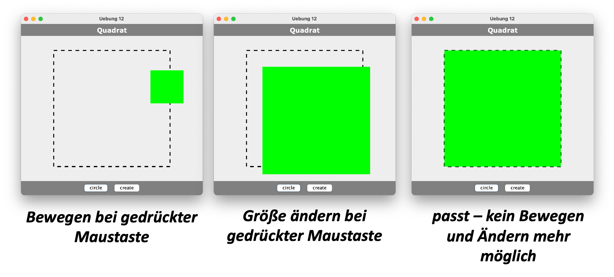

# Übungen


##### Übung 1 (Codereview und static)

??? "Was ist an diesem Code alles falsch?"

	```java
	package uebungen.uebung1;

	/*
	 * °C = (°F - 32) * 5/9 (von Fahrenheit in Celsius)
	 * °F = °C * 1,8 + 32 (von Celsius nach Fahrenheit)
	 */

	public class Konvertierung {
		
		private double celsius;
		private double fahrenheit;
		
		public Konvertierung(double celsius) 
		{		
			this.celsius = celsius;
			this.fahrenheit = celsius * 1.8 + 32;		
		}
		
		public Konvertierung(double fahrenheit) 
		{		
			this.celsius = fahrenheit - 32 * 5/9;
			this.fahrenheit = fahrenheit;		
		}
		
		public void print()
		{
			System.out.println(this.celsius + "\u00B0C = " + this.fahrenheit + "\u00B0F");
		}
	}
	```


??? success "Eine mögliche Lösung für Übung 1"
	```java
	package uebungen.uebung1;

	/*
	 * °C = (°F - 32) * 5/9 (von Fahrenheit in Celsius)
	 * °F = °C * 1,8 + 32 (von Celsius nach Fahrenheit)
	 */

	public class Konvertierung {

		private Konvertierung() {
			
		}
	    
	    public static double celsiusToFahrenheit(double celsius) {
	    	final double FACTOR_CELSIUS_TO_FAHRENHEIT = 1.8;
	    	final int DIFFERENCE_CELSIUS_TO_FAHRENHEIT = 32;
	    	
	    	double fahrenheit = celsius * FACTOR_CELSIUS_TO_FAHRENHEIT 
	    			+ DIFFERENCE_CELSIUS_TO_FAHRENHEIT; 
	    	
	    	return fahrenheit;
	    }
	    
	    public static double fahrenheitToCelsius(double fahrenheit) {
	    	final double FACTOR_FAHRENHEIT_TO_CELSIUS = 5.0/9.0;
	    	final int DIFFERENCE_FAHRENHEIT_TO_CELSIUS = 32;
	    	
	    	double celsius = (fahrenheit - DIFFERENCE_FAHRENHEIT_TO_CELSIUS) * FACTOR_FAHRENHEIT_TO_CELSIUS;
	   
	    	return celsius;
	    }
	}
	```

##### Übung 2 (String und algorithmisches Denken)

??? "Übung 2"

	1. Erstellen Sie im Paket `uebungen.uebung2` eine Java-Klasse `Uebung2` mit `main()`-Methode. In diese Klasse implementieren wir statische Methoden. Öffnen Sie zum Lösen der Übung am besten die JavaDoc-Dokumentation der Klasse [String](https://docs.oracle.com/en/java/javase/11/docs/api/java.base/java/lang/String.html). Überlegen Sie sich, bevor Sie jeweils anfangen zu implementieren, genau, wie Sie vorgehen möchten.

	2. Implementieren Sie eine Methode `static boolean isBinaryNumber(String s)`. Diese Methode überprüft, ob der `String s` einer Binärzahl entspricht, d.h. ob er nur `0` und `1` enthält. 

	3. Testen Sie die Methode `isBinaryNumber(String s)` z.B. mit den folgenden Aufrufen:
	```java
	System.out.println(isBinaryNumber("101101"));	// true
	System.out.println(isBinaryNumber("0"));		// true
	System.out.println(isBinaryNumber("101a01"));	// false
	System.out.println(isBinaryNumber("101201"));	// false
	```

	4. Implementieren Sie eine Methode `static int binaryToDecimal(String s)`. Diese Methode wandelt den `String s` in eine Dezimalzahl um, wenn `s` einer Binärzahl entspricht. Wenn `s` keiner Binärzahl entspricht, wird `-1` zurückgegeben. 

	5. Testen Sie die Methode `binaryToDecimal(String s)` z.B. mit den folgenden Aufrufen:
	```java
	System.out.println(binaryToDecimal("101101"));	// 45
	System.out.println(binaryToDecimal("0"));		// 0
	System.out.println(binaryToDecimal("000001"));	// 1
	System.out.println(binaryToDecimal("100000"));	// 32
	System.out.println(binaryToDecimal("101a01"));	// -1
	System.out.println(binaryToDecimal("101201"));	// -1
	```

	6. Implementieren Sie eine Methode `static String toLowerCase(String input)`. Diese Methode wandelt alle Großbuchstaben ('A'...'Z') in Kleinbuchstaben um (und nur diese - alle anderen Zeichen bleiben erhalten). Schauen Sie sich dazu auch nochmal die [ASCII-Tabelle](https://freiheit.f4.htw-berlin.de/prog1/variablen/#char) an.

	7. Testen Sie die Methode `toLowerCase(String input)` z.B. mit den folgenden Aufrufen:
	```java
	System.out.println(toLowerCase("abcdEFG"));		// abcdefg
	System.out.println(toLowerCase("abcd123EFG"));	// abcd123efg
	System.out.println(toLowerCase("ABC XYZ !%"));	// abc xyz !%
	```

	**Zusatz:**

	8. Implementieren Sie eine Methode `static boolean isPalindrome(String input)`. Diese Methode prüft, ob es sich bei `input` um ein Palindrom handelt (also von vorne nach hinten genauso gelesen werden kann, wie von hinten nach vorne). Groß- und Kleinschreibung wird nicht berücksichtigt! Die Methode [substring(int,int)](https://docs.oracle.com/en/java/javase/11/docs/api/java.base/java/lang/String.html#substring(int,int)) aus `String` ist dabei wahrscheinlich nützlich!

	9. Testen Sie die Methode `isPalindrome(String input)` z.B. mit den folgenden Aufrufen:
	```java
	System.out.println(isPalindrome("Otto"));		// true
	System.out.println(isPalindrome("abc_CBA"));	// true
	System.out.println(isPalindrome("abc_-CBA"));	// false
	System.out.println(isPalindrome("-"));			// true
	System.out.println(isPalindrome("Dreh mal am Herd"));	// false 
	```

	8. Angenommen, Sie sollen für einen gegebenen `String` angeben, ob er korrekt geklammerte Ausdrücke enthält (nur die Klammern betrachten). Wie würden Sie vorgehen? Nicht implementieren, nur nachdenken. Folgende Beispiele:
	```
	((()))()(()) 		// korrekt
	((())				// nicht korrekt
	(()))				// nicht korrekt
	())(				// nicht korrekt
	```

??? success "Eine mögliche Lösung für Übung 2"
	```java
	package uebungen.uebung2.loesung;

	public class Uebung2 {
		
		public static boolean isBinaryNumber(String s)
		{
			for(int index=0; index < s.length(); index++)
			{
				char c = s.charAt(index);
				if(!(c=='0' || c=='1'))
				{
					return false;
				}
			}
			return true;
		}
		
		public static int binaryToDecimal(String s)
		{
			if(!isBinaryNumber(s)) return -1;
			int decimalNumber = 0;
			int exp = 0;
			for(int index = s.length()-1; index >= 0; index--)
			{
				char c = s.charAt(index);
				int digit = c - '0';
				int value = digit * (int)Math.pow(2, exp);
				decimalNumber += value;
				exp++;
			}
			
			return decimalNumber;
		}
		
		public static String toLowerCase(String input)
		{
			String output = "";
			final int UPPER_TO_LOWER = 32;

			for(int index=0; index < input.length(); index++)
			{
				char c = input.charAt(index);
				if(c >= 'A' && c<= 'Z')
				{
					c = (char)(c + UPPER_TO_LOWER);
				}
				output += c;
			}
			return output;
		}
			
		public static boolean isPalindrome(String input)
		{
			String s = toLowerCase(input);
			boolean palindrome = true;
			while(palindrome && s.length() > 1)
			{
				char c1 = s.charAt(0); 
				char c2 = s.charAt(s.length() - 1);
				if(c1 == c2)
				{
					s = s.substring(1,s.length() - 1);
				}
				else 
				{
					palindrome = false;
				}
			}
			return palindrome;
		}
			
		public static boolean checkBraces(String input)
		{
			int nrOpening = 0;	// man koennte auch fuer jede oeffnende ++ und
			int nrClosing = 0;	// jede schliessende -- und dann nur eine Variable
								// dann pruefen, ob nie negativ
			boolean correct = true;
			for(int index=0; correct && index < input.length(); index++)
			{
				char c = input.charAt(index);
				if(c== '(') 
				{
					nrOpening++;
				}
				else if(c== ')') 
				{
					nrClosing++;
				}
				
				if(nrClosing > nrOpening)	// dann waere hier < 0
				{
					correct = false;
				}
			}
			if(nrOpening != nrClosing) 		// dann waere hier == 0
			{
				correct = false;
			}
			return correct;
		}

		public static void main(String[] args) {
			System.out.println(isBinaryNumber("101101"));	// true
			System.out.println(isBinaryNumber("0"));		// true
			System.out.println(isBinaryNumber("101a01"));	// false
			System.out.println(isBinaryNumber("101201"));	// false

			System.out.println(binaryToDecimal("101101"));	// 45
			System.out.println(binaryToDecimal("0"));		// 0
			System.out.println(binaryToDecimal("000001"));	// 1
			System.out.println(binaryToDecimal("100000"));	// 32
			System.out.println(binaryToDecimal("101a01"));	// -1
			System.out.println(binaryToDecimal("101201"));	// -1
			
			System.out.println(toLowerCase("abcdEFG"));		// abcdefg
			System.out.println(toLowerCase("abcd123EFG"));	// abcd123efg
			System.out.println(toLowerCase("ABC XYZ !%"));	// abc xyz !%
		
			System.out.println(isPalindrome("Otto"));		// true
			System.out.println(isPalindrome("abc_CBA"));	// true
			System.out.println(isPalindrome("abc_-CBA"));	// false
			System.out.println(isPalindrome("-"));			// true
			System.out.println(isPalindrome("Dreh mal am Herd"));	// false
			// das letzte waere okay, wenn man bei der Pruefung
			// die Leerzeichen ignorieren wuerde, waere auch moeglich
		}

	}
	```


##### Übung 3 (Exceptions)

??? "Übung 3"

	1. Schreiben Sie ein Programm zur Eingabe von zwei Zahlen mithilfe der Klasse `JOptionPane` und deren Division! Fangen Sie folgende Ausnahmen ab:
		- Falls die Eingabe keiner Zahl entspricht.
		- Falls die zweite Zahl eine 0 ist.

	2. **Scenario**:
		- Fenster zur Eingabe von Zahl 1 öffnet sich: <br/>
			
		- falsche Eingabe - keine Zahl:  <br/>
			
		- Fenster öffnet sich erneut (andere Nachricht!):  <br/>
			
		- Fenster zur Eingabe von Zahl 2 öffnet sich:  <br/>
			
		- die Division Zahl1/Zahl2 schlägt fehl (`ArithmeticException`), deshalb (andere Nachricht!):  <br/>
			
		- Ergebnis  <br/>
			

	3. Lagern Sie eine solche Eingabemöglichkeit in eine wiederverwendbare Methode aus, z.B. `public int inputInt(int min, int max)`, welche die eingegebene Zahl zurückgibt, wobei die eingegebene Zahl im Bereich `[min, max]` liegen muss.

	4. Lesen Sie eine Zahl ein und geben Sie die Zahl umgedreht (rückwärts gelesen) wieder aus (führende Nullen entfallen):
		```bash
		3456789 --> 9876543
		```

		```bash
		1000 --> 1
		```

	5. Lesen Sie eine Zahl ein und geben Sie die Quersumme der Zahl aus.

		```bash
		123456 --> 21
		```

		```bash
		1000 --> 1		
		```

	**Viel Spaß!**


??? success "Eine mögliche Lösung für Übung 3"
	```java
	package uebungen.uebung3.loesung;

	import javax.swing.JOptionPane;

	public class Uebung3 
	{
		public static int inputInt(String message)
		{
			int number = 0;
			boolean notANumber = true;
			while(notANumber)
			{
				String input = JOptionPane.showInputDialog(message);
		
				try 
				{
					number = Integer.parseInt(input);
					notANumber = false;
				} 
				catch (NumberFormatException e) 
				{
					message = "Ihre Eingabe war keine Zahl!";
				}
			}
			return number;
		}
		
		public static int inputInt(String message, int min, int max)
		{
			int number = 0;
			boolean notANumber = true;
			while(notANumber)
			{
				String input = JOptionPane.showInputDialog(message);
		
				try 
				{
					number = Integer.parseInt(input);
					if(number >= min && number <= max)
					{
						notANumber = false;
					}
					else
					{
						message = "Zahl nicht zwischen " + min + " und " + max +" !";
					}
				} 
				catch (NumberFormatException e) 
				{
					message = "Ihre Eingabe war keine Zahl!";
				}
			}
			return number;
		}
		
		public static void printDivide()
		{
			int number1 = inputInt("Zahl 1:");
			int number2 = 0;
			double result = 0.0;
			
			boolean isZero = true;
			String message = "Zahl 2:";
			
			while(isZero)
			{
				number2 = inputInt(message);
		
				try 
				{
					result = number1 / number2;
					isZero = false;
				} 
				catch (ArithmeticException e) 
				{
					message = "Zahl darf nicht 0 sein";
				}
			}
			String output = number1 + " / " + number2 + " = " + result;
			
			JOptionPane.showMessageDialog(null, output);
		}
		
		public static void printReverse()
		{
			int number = inputInt("Zahl : ");
			int copyNumber = number;		// fuer spaetere Ausgabe
			int reverse = 0;
			
			while(number != 0)
			{
				int last = number % 10; 
				reverse = reverse * 10 + last;
				number = number / 10;	
			}
			
			String output = copyNumber + " --> " + reverse;
			JOptionPane.showMessageDialog(null, output); 
		}
		
		
		public static void printChecksum()
		{
			int number = inputInt("Zahl : ");
			int copyNumber = number;		// fuer spaetere Ausgabe
			int checksum = 0;
			
			while(number != 0)
			{
				int last = number % 10; 
				checksum = checksum + last;
				number = number / 10;	
			}
			
			String output = "Die Quersumme von " + copyNumber + " ist " + checksum;
			JOptionPane.showMessageDialog(null, output); 
		}

		public static void main(String[] args) 
		{
			
			  int number1 = inputInt("Geben Sie eine Zahl ein :");
			  System.out.println(number1);

			  int choice = JOptionPane.showConfirmDialog(null, "Wollen Sie weiterspielen?",
			  "Abfrage", JOptionPane.YES_NO_OPTION); 
			  System.out.println(choice);
			  
			  if(choice == JOptionPane.YES_OPTION) 
			  { 
				  System.out.println("yes geklickt"); 
			  }
			  if(choice == JOptionPane.NO_OPTION) 
			  { 
				  System.out.println("no geklickt"); 
			  }
			  if(choice == JOptionPane.CANCEL_OPTION) 
			  { 
				  System.out.println("no geklickt");
			  }
			 
			  printDivide();
			
			  printReverse();
			  
			  printChecksum();

		}

	}
	```


##### Übung 4 (Listen und Mengen)

??? "Übung 4"

	1. Erstellen Sie eine Klasse `Uebung4` mit `main()`-Methode.
	2. Definieren Sie in der `main()`-Methode eine Variable `words` vom Typ `String[]` und weisen Sie dieser Variablen folgende Werte zu:
		```java
		String[] words = {"Linux", "Apple", "Facebook", "Amazon", "IBM", "Lenovo", "Google", "IBM", "Microsoft", "Apple", "Google", "Twitter", "Skype", "Chrome", "Linux", "Firefox"};
		```

	**A. Listen (`List`)**

	1. Erstellen Sie eine Methode `public static List<String> createArrayList(String[] words)`. In dieser Methode soll eine `ArrayList` erstellt werden. Alle Elemente in dieser Liste sind vom Typ `String`. Befüllen Sie diese Liste mit allen Wörtern aus dem `words`-Array. Die Methode gibt die befüllte Liste (`List`) zurück. 
	2. Erstellen Sie eine Methode `public static void printList(List<String> list)`. Diese Methode gibt alle Elemente der Liste `list` auf der Konsole aus. Geben Sie auch die Anzahl der Elemente der Liste aus. 
	3. Erstellen Sie in der `main()`-Methode mithilfe der Methode `createArrayList(words)` eine Liste und speichern Sie diese Liste in einer Variablen vom Typ `List<String>`. Geben Sie alle Elemente dieser Liste mithilfe der Methode `printList()` auf der Konsole aus. 
	4. Studieren Sie alle Methoden für `List` unter [https://docs.oracle.com/en/java/javase/11/docs/api/java.base/java/util/List.html](https://docs.oracle.com/en/java/javase/11/docs/api/java.base/java/util/List.html).

		- Ermitteln Sie den Index in der Liste, in der `"Apple"` das **erste** Mal auftaucht. Erzeugen Sie folgende Ausgabe: 
			```bash
			Index des ersten Auftretens von Apple  : 1
			```

		- Ermitteln Sie den Index in der Liste, in der `"Apple"` das **letzte** Mal auftaucht. Erzeugen Sie folgende Ausgabe: 
			```bash
			Index des letzten Auftretens von Apple : 9
			```

		- Geben Sie den Wert des **ersten** Elementes der Liste aus. Erzeugen Sie folgende Ausgabe: 
			```bash
			erstes Element der Liste : Linux
			```	

		- Geben Sie den Wert des **letzten** Elementes der Liste aus. Erzeugen Sie folgende Ausgabe: 
			```bash
			letztes Element der Liste : Firefox
			```	

		- Löschen Sie die Werte `"Apple"`, `"Google"` und `"Facebook"`. Geben Sie die Liste erneut mithilfe der `printList(list)`-Methode aus.

	**B. Mengen (`Set`)**

	1. Erstellen Sie eine Methode `public static Set<String> createHashSet(String[] words)`. In dieser Methode soll eine `HashSet` erstellt werden. Alle Elemente in dieser Liste sind vom Typ `String`. Befüllen Sie diese Liste mit allen Wörtern aus dem `words`-Array. Die Methode gibt die befüllte Menge (`Set`) zurück. 
	2. Erstellen Sie eine Methode `public static void printSet(Set<String> set)`. Diese Methode gibt alle Elemente der Menge `set` auf der Konsole aus. Geben Sie auch die Anzahl der Elemente der Menge aus. 
	3. Erstellen Sie in der `main()`-Methode mithilfe der Methode `createHashSet(words)` eine Menge und speichern Sie diese Menge in einer Variablen vom Typ `Set<String>`. Geben Sie alle Elemente dieser Menge mithilfe der Methode `printSet()` auf der Konsole aus. Was beobachten Sie in Bezug auf die Anzahl der Elemente im Vergleich zur Anzahl der Elemente in der Liste? Warum ist das so?
	4. Erstellen Sie eine Methode `public static Set<String> createTreeSet(String[] words)`. In dieser Methode soll eine `TreeSet` erstellt werden. Alle Elemente in dieser Liste sind vom Typ `String`. Befüllen Sie diese Menge (`Set`) mit allen Wörtern aus dem `words`-Array. Die Methode gibt die befüllte Menge (`Set`) zurück. 
	5. Erstellen Sie in der `main()`-Methode mithilfe der Methode `createTreeSet(words)` eine Menge und speichern Sie diese Menge in einer Variablen. Geben Sie alle Elemente dieser Menge mithilfe der Methode `printSet()` auf der Konsole aus. Was beobachten Sie in Bezug auf die Sortierung der Elemente im Vergleich zur `HashSet`?

	**Zusatz**

	1. Erstellen Sie für die Liste eine Methode `public static List<String> findDoublets(List<String> list)`. Diese Methode erstellt eine Liste, in der alle Elemente enthalten sind, die in `list` doppelt vorkommen. Diese Elemente werden dann auch doppelt in die Resultat-Liste übernommen. Geben Sie diese Liste mithilfe der `printList()`-Methode in der `main()`-Methode aus.

	??? "Mögliche Ausgabe (je nach Reihenfolge des Aufrufs der Methoden)"

		```bash
		Liste mit 16 Elementen :
		--------------------------
		Linux
		Apple
		Facebook
		Amazon
		IBM
		Lenovo
		Google
		IBM
		Microsoft
		Apple
		Google
		Twitter
		Skype
		Chrome
		Linux
		Firefox
		Index des ersten Auftretens von Apple  : 1
		Index des letzten Auftretens von Apple : 9
		erstes Element in der Liste  : Linux
		letztes Element in der Liste : Firefox

		Liste mit 13 Elementen :
		--------------------------
		Linux
		Amazon
		IBM
		Lenovo
		IBM
		Microsoft
		Apple
		Google
		Twitter
		Skype
		Chrome
		Linux
		Firefox

		Doublets-
		Liste mit 4 Elementen :
		--------------------------
		Linux
		IBM
		IBM
		Linux

		ohne Doublets-
		Liste mit 9 Elementen :
		--------------------------
		Amazon
		Lenovo
		Microsoft
		Apple
		Google
		Twitter
		Skype
		Chrome
		Firefox

		Menge mit 12 Elementen :
		--------------------------
		Lenovo
		Google
		Apple
		Skype
		Linux
		IBM
		Twitter
		Chrome
		Microsoft
		Amazon
		Facebook
		Firefox

		Menge mit 12 Elementen :
		--------------------------
		Amazon
		Apple
		Chrome
		Facebook
		Firefox
		Google
		IBM
		Lenovo
		Linux
		Microsoft
		Skype
		Twitter
		```


??? question "mögliche Lösung für Übung 4"
	
	=== "Uebung4.java"
		```java linenums="1"
		package uebungen.uebung4.loesung;

		import java.util.ArrayList;
		import java.util.HashSet;
		import java.util.Iterator;
		import java.util.List;
		import java.util.Set;
		import java.util.TreeSet;

		public class Uebung4 {

			//A1. Erstellen Sie eine Methode public static List<String> createArrayList(String[] words). 
			//In dieser Methode soll eine ArrayList erstellt werden. Alle Elemente in dieser Liste sind vom Typ String. 
			//Befüllen Sie diese Liste mit allen Wörtern aus dem words-Array. Die Methode gibt die befüllte Liste (List) zurück.
			public static List<String> createArrayList(String[] words){
				// neue ArrayList mit String als Type anlegen
				List<String> list = new ArrayList<>();

				// jedes Element aus words in die Liste einfügen
				for(int i=0; i<words.length; i++) {
					list.add(words[i]);
				}

				return list;		
			}


			//A2. Erstellen Sie eine Methode public static void printList(List<String> list). 
			//Diese Methode gibt alle Elemente der Liste list auf der Konsole aus. 
			//Geben Sie auch die Anzahl der Elemente der Liste aus.
			public static void printList(List<String> list)
			{
				//Variante 1: Iterator
				System.out.println("--Iterator--");					
				Iterator<String> it = list.iterator();
				while(it.hasNext()) {
					System.out.println(it.next());
				}


				//Variante 2: for-Schleife
				System.out.println("--Schleife--");
				for(String s : list)
				{
					System.out.println(s);
				}

				//Anzahl der Elemente ausgeben
				System.out.println("Die Liste hat "+ list.size() + " Elemente.");
			}

			//B1. Erstellen Sie eine Methode public static Set<String> createHashSet(String[] words). 
			//In dieser Methode soll eine HashSet erstellt werden. 
			//Alle Elemente in dieser Liste sind vom Typ String. 
			//Befüllen Sie diese Liste mit allen Wörtern aus dem words-Array. 
			//Die Methode gibt die befüllte Menge (Set) zurück.
			public static Set<String> createHashSet(String[] words)
			{
				Set<String> set = new HashSet<>();		
				for(int i=0; i<words.length; i++) {
					set.add(words[i]);
				}
				return set;	
			}

			//B2. Erstellen Sie eine Methode public static void printSet(Set<String> set). 
			//Diese Methode gibt alle Elemente der Menge set auf der Konsole aus. 
			//Geben Sie auch die Anzahl der Elemente der Menge aus. 
			public static void printSet(Set<String> set)
			{
				for(String s : set)
				{
					System.out.println(s);
				}

				System.out.println("Das Set hat "+ set.size() + " Elemente.");
			}

			//B4. Erstellen Sie eine Methode public static Set<String> createTreeSet(String[] words). 
			//In dieser Methode soll eine TreeSet erstellt werden. 
			//Alle Elemente in dieser Liste sind vom Typ String. 
			//Befüllen Sie diese Menge (Set) mit allen Wörtern aus dem words-Array. 
			//Die Methode gibt die befüllte Menge (Set) zurück. 
			public static Set<String> createTreeSet(String[] words)
			{		
				Set<String> set = new TreeSet<>();
				for(int i=0; i<words.length; i++) {
					set.add(words[i]);
				}
				return set;	
			}

			//Zusatz: Erstellen Sie für die Liste eine Methode public static List<String> findDoublets(List<String> list). 
			//Diese Methode erstellt eine Liste, in der alle Elemente enthalten sind, die in list doppelt vorkommen. 
			//Diese Elemente werden dann auch doppelt in die Resultat-Liste übernommen. 
			//Geben Sie diese Liste mithilfe der printList()-Methode in der main()-Methode aus.
			public static List<String> findDoublets(List<String> list)
			{
				//Grundidee 
				//Beispiel-Liste: "a" "b" "a" "c" "a"

				//Index:  0 1 2 3 4
				//Inhalt: a b a c a

				//erster Index von "a": 0
				//letzter Index von "a":4 
				//0 != 4 -> es gibt Duplikate 
				//erster Index von "b":1
				//letzter Index von "b":1
				//1 == 1 -> keine Duplikate, also diesen Eintrag als Einzeleintrag merken
				//...

				//leere Liste "singles" für Einzeleinträge anlegen
				List<String> singles = new ArrayList<>();

				//durch list iterieren und testen ob das Element Duplikate hat, 
				//wenn nicht in "singles" speichern 
				Iterator<String> it = list.iterator();
				//it = copy.iterator();
				while(it.hasNext()) {
					String s = it.next();
					if(list.indexOf(s) == list.lastIndexOf(s)) singles.add(s);
				}

				//Kopie von list anlegen
				List<String> copy = new ArrayList<>();
				it = list.iterator();
				while(it.hasNext()) copy.add(it.next());

				//alle singles aus der kopierten Liste entfernen
				copy.removeAll(singles);
				return copy;
				//um zu testen, warum die Kopie nötig ist:
				//copy.removeAll(singles); und return copy; ersetzen durch
				//list.removeAll(singles); 
				//return list;
				//und dann die Ausgabe von l2 in der main anschauen

			}

			public static void main(String[] args) {
				String[] words = {"Linux", "Apple", "Facebook", "Amazon", "IBM", "Lenovo", "Google", "IBM", "Microsoft", "Apple", "Google", "Twitter", "Skype", "Chrome", "Linux", "Firefox"};

				System.out.println("---------- A ----------");
				//A3. Erstellen Sie in der main()-Methode mithilfe der Methode createArrayList(words) eine 
				//Liste und speichern Sie diese Liste in einer Variablen vom Typ List<String>. 
				List<String> l1 = createArrayList(words);		
				//Geben Sie alle Elemente dieser Liste mithilfe der Methode printList() auf der Konsole aus. 
				printList(l1);

				//A4. Ermitteln Sie den Index in der Liste, in der "Apple" das erste Mal auftaucht. 
				//Erzeugen Sie folgende Ausgabe:  Index des ersten Auftretens von Apple  : 1
				System.out.println("Index des ersten Auftretens von Apple: " + l1.indexOf("Apple"));

				//Ermitteln Sie den Index in der Liste, in der "Apple" das letzte Mal auftaucht. 
				//Erzeugen Sie folgende Ausgabe: Index des letzten Auftretens von Apple : 9
				System.out.println("Index des letzten Auftretens von Apple: " + l1.lastIndexOf("Apple"));

				//Geben Sie den Wert des ersten Elementes der Liste aus. 
				//Erzeugen Sie folgende Ausgabe: erstes Element der Liste : Linux
				System.out.println("erstes Element der Liste: " + l1.get(0));

				//Geben Sie den Wert des letzten Elementes der Liste aus. 
				//Erzeugen Sie folgende Ausgabe: letztes Element der Liste : Firefox
				System.out.println("letztes Element der Liste: " + l1.get(l1.size()-1));

				//Löschen Sie die Werte "Apple", "Google" und "Facebook". 
				//Geben Sie die Liste erneut mithilfe der printList(list)-Methode aus.
				//1. Möglichkeit: nur 1. Vorkommen löschen
				l1.remove("Apple");
				l1.remove("Google");
				l1.remove("Facebook");
				printList(l1);
				//2. Möglichkeit: alle löschen
				while(l1.remove("Apple"));
				while(l1.remove("Google"));
				while(l1.remove("Facebook"));
				printList(l1);

				System.out.println("---------- B ----------");
				System.out.println("-------HashSet------");
				//B3. Erstellen Sie in der main()-Methode mithilfe der Methode createHashSet(words) 
				//eine Menge und speichern Sie diese Menge in einer Variablen vom Typ Set<String>. 
				Set<String> h1 = createHashSet(words);
				//Geben Sie alle Elemente dieser Menge mithilfe der Methode printSet() auf der Konsole aus. 
				//Was beobachten Sie in Bezug auf die Anzahl der Elemente im Vergleich zur Anzahl der Elemente 
				//in der Liste? Warum ist das so?
				printSet(h1);

				System.out.println("-------TreeSet------");
				//B5. Erstellen Sie in der main()-Methode mithilfe der Methode createTreeSet(words) 
				//eine Menge und speichern Sie diese Menge in einer Variablen. 
				Set<String> t1 = createTreeSet(words);
				//Geben Sie alle Elemente dieser Menge mithilfe der Methode printSet() auf der Konsole aus. 
				//Was beobachten Sie in Bezug auf die Sortierung der Elemente im Vergleich zur HashSet? 
				printSet(t1);

				System.out.println("-------Duplicates------");
				List<String> l2 =  createArrayList(words);	
				List<String> d = findDoublets(l2);
				printList(d);	
				printList(l2);
			}

		}
		```


##### Übung 5 (Maps)

??? "Übung 5"

	1. Erstellen Sie eine Klasse `Stadt` mit folgenden Objektvariablen:
		- `String name;`
		- `List<Integer> bevoelkerung;`
		- `float flaeche;`

	2. Erstellen Sie für die Klasse `Stadt` einen parametrisierten Konstruktor `public Stadt(String name, List<Integer> bevoelkerung, float flaeche)`, der die Objektvariablen initialisiert.
	3. Erstellen Sie für die Klasse `Stadt` eine `print()`-Methode, so dass eine Ausgabe auf der Konsole in folgender Form erscheint (Bsp.):
		```bash
		Berlin             891,68 km2    3.382.169   3.460.725   3.574.830
		```
	4. Erstellen Sie eine Klasse `StadtTest` mit `main()`-Methode. Kopieren Sie in die Klasse die Methode `public static Stadt[] staedte()` hinein:
		```java
		public static Stadt[] staedte()
		{
			Stadt[] staedte = new Stadt[6];
			List<Integer> berlinBevoelkerung = new ArrayList<>();
			berlinBevoelkerung.add(3382169);	
			berlinBevoelkerung.add(3460725);	
			berlinBevoelkerung.add(3574830);
			staedte[0] = new Stadt("Berlin", berlinBevoelkerung, 891.68f);
			
			List<Integer> hamburgBevoelkerung = new ArrayList<>();
			hamburgBevoelkerung.add(1715392);	
			hamburgBevoelkerung.add(1786448);	
			hamburgBevoelkerung.add(1810438);	
			staedte[1] = new Stadt("Hamburg", hamburgBevoelkerung, 755.22f);
			
			List<Integer> muenchenBevoelkerung = new ArrayList<>();
			muenchenBevoelkerung.add(1210223);	
			muenchenBevoelkerung.add(1353186);	
			muenchenBevoelkerung.add(1464301);
			staedte[2] = new Stadt("Muenchen", muenchenBevoelkerung, 310.70f);
			
			List<Integer> koelnBevoelkerung = new ArrayList<>();
			koelnBevoelkerung.add(962884);	
			koelnBevoelkerung.add(1007119);	
			koelnBevoelkerung.add(1075935);	
			staedte[3] = new Stadt("Koeln", koelnBevoelkerung, 405.02f);
			
			List<Integer> frankfurtBevoelkerung = new ArrayList<>();
			frankfurtBevoelkerung.add(648550);	
			frankfurtBevoelkerung.add(679664);	
			frankfurtBevoelkerung.add(736414);
			staedte[4] = new Stadt("Frankfurt/Main", frankfurtBevoelkerung, 248.31f);
			
			berlinBevoelkerung = new ArrayList<>();
			berlinBevoelkerung.add(3382169);	
			berlinBevoelkerung.add(3460725);	
			berlinBevoelkerung.add(3574830);
			staedte[5] = new Stadt("Berlin", berlinBevoelkerung, 891.68f);
			
			return staedte;
		}		
		```

	**Liste**

	5. Erstellen Sie in der `main()`-Methode eine `List<Stadt> staedteListe = new ArrayList<>();`. Fügen Sie der `staedteListe` alle Städte aus dem durch Aufruf der `staedte()`-Methode erzeugtem Array zu.
	6. Geben Sie alle Informationen über alle Städte aus der Liste unter Verwendung der `print()`-Methode aus der Klasse `Stadt` aus.

	**Menge**

	5. Erstellen Sie in der `main()`-Methode eine `Set<Stadt> staedteMenge = new HashSet<>();`. Fügen Sie der `staedteMenge` alle Städte aus dem durch Aufruf der `staedte()`-Methode erzeugtem Array zu.
	6. Geben Sie alle Informationen über alle Städte aus der Menge unter Verwendung der `print()`-Methode aus der Klasse `Stadt` aus.
	7. Berlin erscheint doppelt, obwohl eine Menge keine doppelten Elemente enthalten darf. Warum?

	**Stadt - Teil 2**

	5. Implementieren Sie in der Klasse `Stadt` die `equals(Object)`- und die `hashCode()`-Methode.
	6. Führen Sie danach die `StadtTest`-Klasse erneut aus. Was hat sich an der Menge geändert?

	**Maps**

	5. Erstellen Sie in der `main()`-Methode eine `Map<Integer, Stadt> staedteMap = new HashMap<>();`. Fügen Sie der `staedteMap` einen fortlaufenden, eindeutigen `Integer`-Wert beginnend mit `1` als *Key* sowie alle alle Städte aus dem durch Aufruf der `staedte()`-Methode erzeugtem Array als *Value* hinzu.
	6. Geben Sie alle Informationen über alle Städte aus der Liste unter Verwendung der `print()`-Methode aus der Klasse `Stadt` aus. Beginnen Sie die Zeile jeweils mit der Ausgabe des *Keys*.

	**Ausgaben**

	```bash
	------------ Liste --------------
	Berlin             891,68 km2    3.382.169   3.460.725   3.574.830
	Hamburg            755,22 km2    1.715.392   1.786.448   1.810.438
	Muenchen           310,70 km2    1.210.223   1.353.186   1.464.301
	Koeln              405,02 km2      962.884   1.007.119   1.075.935
	Frankfurt/Main     248,31 km2      648.550     679.664     736.414
	Berlin             891,68 km2    3.382.169   3.460.725   3.574.830

	------------ Menge --------------
	Frankfurt/Main     248,31 km2      648.550     679.664     736.414
	Berlin             891,68 km2    3.382.169   3.460.725   3.574.830
	Muenchen           310,70 km2    1.210.223   1.353.186   1.464.301
	Koeln              405,02 km2      962.884   1.007.119   1.075.935
	Hamburg            755,22 km2    1.715.392   1.786.448   1.810.438

	------------ Maps --------------
	1  Berlin            891,68 km2    3.382.169   3.460.725   3.574.830
	2  Hamburg           755,22 km2    1.715.392   1.786.448   1.810.438
	3  Muenchen          310,70 km2    1.210.223   1.353.186   1.464.301
	4  Koeln             405,02 km2      962.884   1.007.119   1.075.935
	5  Frankfurt/Main    248,31 km2      648.550     679.664     736.414
	6  Berlin            891,68 km2    3.382.169   3.460.725   3.574.830
	``` 


??? question "mögliche Lösung für Übung 5"
	
	=== "Stadt.java"
		```java linenums="1"
		package uebungen.uebung5;

		import java.util.List;

		public class Stadt 
		{
			
			String name;
			List<Integer> bevoelkerung;
			float flaeche;
			
			public Stadt(String name, List<Integer> bevoelkerung, float flaeche) 
			{
				this.name = name;
				this.bevoelkerung = bevoelkerung;
				this.flaeche = flaeche;
			}
			
			public void print()
			{
				System.out.printf("%-18s %.2f km%c", this.name, this.flaeche, '\u00B2');
				for(Integer anzahl : this.bevoelkerung)
				{
					System.out.printf("%,14d", anzahl);
				}
				System.out.println();
			}
			
			@Override
			public boolean equals(Object o)
			{
				if(o == null) return false;
				if(this == o) return true;
				if(this.getClass() != o.getClass()) return false;
				
				Stadt other = (Stadt)o; // Compilertyp Object hat keine Objektvariable name
										// Compilertyp Stadt hat name
										// o und other zeigen auf dasselbe Objekt
				return (this.name.equals(other.name));
			}
			
			@Override
			public int hashCode()
			{
				return this.name.hashCode();
			}

		}
		```
	
	=== "StadtTest.java"
		```java linenums="1"
		package uebungen.uebung5;

		import java.util.List;
		import java.util.ArrayList;
		import java.util.Collection;
		import java.util.Set;
		import java.util.HashSet;
		import java.util.Map;
		import java.util.HashMap;

		public class StadtTest {

			public static Stadt[] staedte()
			{
			    Stadt[] staedte = new Stadt[6];
			    List<Integer> berlinBevoelkerung = new ArrayList<>();
			    berlinBevoelkerung.add(3382169);    
			    berlinBevoelkerung.add(3460725);    
			    berlinBevoelkerung.add(3574830);
			    staedte[0] = new Stadt("Berlin", berlinBevoelkerung, 891.68f);

			    List<Integer> hamburgBevoelkerung = new ArrayList<>();
			    hamburgBevoelkerung.add(1715392);   
			    hamburgBevoelkerung.add(1786448);   
			    hamburgBevoelkerung.add(1810438);   
			    staedte[1] = new Stadt("Hamburg", hamburgBevoelkerung, 755.22f);

			    List<Integer> muenchenBevoelkerung = new ArrayList<>();
			    muenchenBevoelkerung.add(1210223);  
			    muenchenBevoelkerung.add(1353186);  
			    muenchenBevoelkerung.add(1464301);
			    staedte[2] = new Stadt("Muenchen", muenchenBevoelkerung, 310.70f);

			    List<Integer> koelnBevoelkerung = new ArrayList<>();
			    koelnBevoelkerung.add(962884);  
			    koelnBevoelkerung.add(1007119); 
			    koelnBevoelkerung.add(1075935); 
			    staedte[3] = new Stadt("Koeln", koelnBevoelkerung, 405.02f);

			    List<Integer> frankfurtBevoelkerung = new ArrayList<>();
			    frankfurtBevoelkerung.add(648550);  
			    frankfurtBevoelkerung.add(679664);  
			    frankfurtBevoelkerung.add(736414);
			    staedte[4] = new Stadt("Frankfurt/Main", frankfurtBevoelkerung, 248.31f);

			    berlinBevoelkerung = new ArrayList<>();
			    berlinBevoelkerung.add(3382169);    
			    berlinBevoelkerung.add(3460725);    
			    berlinBevoelkerung.add(3574830);
			    staedte[5] = new Stadt("Berlin", berlinBevoelkerung, 891.68f);

			    return staedte;
			}       
			
			public static void main(String[] args) 
			{
				System.out.printf("%n%n------------- Array ----------------%n%n");
				Stadt[] staedteArray = staedte();
				for(Stadt stadt : staedteArray)
				{
					stadt.print();
				}
				
				System.out.printf("%n%n------------- Liste ----------------%n%n");
				List<Stadt> staedteListe = new ArrayList<>();
				// Liste befuellen
				for(Stadt stadt : staedteArray)
				{
					staedteListe.add(stadt);
				}
				// Liste ausgeben
				for(Stadt stadt : staedteListe)
				{
					stadt.print();
				}
				
				System.out.printf("%n%n------------- Menge ----------------%n%n");
				Set<Stadt> staedteMenge = new HashSet<>();
				// Menge befuellen
				for(Stadt stadt : staedteArray)
				{
					staedteMenge.add(stadt);
				}
				// Menge ausgeben
				for(Stadt stadt : staedteMenge)
				{
					stadt.print();
				}
				
				System.out.printf("%n%n------------- Maps ----------------%n%n");
				Map<Integer, Stadt> staedteMap = new HashMap<>();
				Integer i = 1;
				// Map befuellen
				for(Stadt stadt : staedteArray)
				{
					staedteMap.put(i, stadt);
					i++;
				}
				
				System.out.printf("%n%n------------- alle Eintraege ----------------%n%n");
				// Map ausgeben
				Set<Map.Entry<Integer, Stadt>> alleEintraege = staedteMap.entrySet();
				for(Map.Entry<Integer, Stadt> eintrag : alleEintraege)
				{
					System.out.printf("%-3d", eintrag.getKey());
					Stadt stadt = eintrag.getValue();
					stadt.print();
				}
				
				System.out.printf("%n%n------------- alle Werte ----------------%n%n");
				// alle Werte ausgeben
				Collection<Stadt> alleWerte = staedteMap.values();
				for(Stadt stadt : alleWerte)
				{
					stadt.print();
				}
				
				System.out.printf("%n%n------------- alle Schluessel ----------------%n%n");
				// alle Schluessel ausgeben
				Set<Integer> alleSchluessel = staedteMap.keySet();
				for(Integer schluessel : alleSchluessel)
				{
					System.out.println(schluessel);
					Stadt stadt = staedteMap.get(schluessel);
				}
			}

		}

		```


##### Übung 6 (Interfaces)

??? "Übung 6"

	1. Wir beschäftigen uns nochmal mit der Übung 5, d.h. mit `Stadt` und `StadtTest`. Dieses Mal geht es uns aber mehr um die Verwendung des Interfaces `Comparable`. Zunächst sind die beiden Klassen `Stadt` und `StadtTest` wie folgt gegeben (das haben wir so in Übung 5 erarbeitet - es gibt eine Änderung in `StadtTest`, dort benutzen wir jetzt ): 

		=== "Stadt.java" 
		```java
		import java.util.*;

		public class Stadt
		{
			String name;
			List<Integer> bevoelkerung;
			float flaeche;
			
			public Stadt(String name, List<Integer> bevoelkerung, float flaeche)
			{
				super();
				this.name = name;
				this.bevoelkerung = bevoelkerung;
				this.flaeche = flaeche;
			}
			
			void print()
			{
				System.out.printf("%-18s %.2f km%c", this.name, this.flaeche, '\u00B2');
				for(Integer anzahl : this.bevoelkerung)
				{
					System.out.printf("%,14d", anzahl);
				}
				System.out.println();
			}
			
			@Override
			public boolean equals(Object o)
			{
				if(o==null) return false;
				if(o==this) return true;
				if(this.getClass()!=o.getClass()) return false;
				
				Stadt other = (Stadt)o;
				return (this.name.equals(other.name));
			}
			
			@Override
			public int hashCode()
			{
				return this.name.hashCode();
			}

		}
		```

		=== "StadtTest.java" 
		```java
		import java.util.*;
		
		public class StadtTest
		{
			public static Stadt[] staedte()
			{
				Stadt[] staedte = new Stadt[6];
				List<Integer> berlinBevoelkerung = new ArrayList<>();
				berlinBevoelkerung.add(3382169);	
				berlinBevoelkerung.add(3460725);	
				berlinBevoelkerung.add(3574830);
				staedte[0] = new Stadt("Berlin", berlinBevoelkerung, 891.68f);
				
				List<Integer> hamburgBevoelkerung = new ArrayList<>();
				hamburgBevoelkerung.add(1715392);	
				hamburgBevoelkerung.add(1786448);	
				hamburgBevoelkerung.add(1810438);	
				staedte[1] = new Stadt("Hamburg", hamburgBevoelkerung, 755.22f);
				
				List<Integer> muenchenBevoelkerung = new ArrayList<>();
				muenchenBevoelkerung.add(1210223);	
				muenchenBevoelkerung.add(1353186);	
				muenchenBevoelkerung.add(1464301);
				staedte[2] = new Stadt("Muenchen", muenchenBevoelkerung, 310.70f);
				
				List<Integer> koelnBevoelkerung = new ArrayList<>();
				koelnBevoelkerung.add(962884);	
				koelnBevoelkerung.add(1007119);	
				koelnBevoelkerung.add(1075935);	
				staedte[3] = new Stadt("Koeln", koelnBevoelkerung, 405.02f);
				
				List<Integer> frankfurtBevoelkerung = new ArrayList<>();
				frankfurtBevoelkerung.add(648550);	
				frankfurtBevoelkerung.add(679664);	
				frankfurtBevoelkerung.add(736414);
				staedte[4] = new Stadt("Frankfurt/Main", frankfurtBevoelkerung, 248.31f);
				
				berlinBevoelkerung = new ArrayList<>();
				berlinBevoelkerung.add(3382169);	
				berlinBevoelkerung.add(3460725);	
				berlinBevoelkerung.add(3574830);
				staedte[5] = new Stadt("Berlin", berlinBevoelkerung, 891.68f);
				
				return staedte;
			}
			
			public static void main(String[] args)
			{
				System.out.printf("%n------------ Menge --------------%n");
				Set<Stadt> staedteMenge = new HashSet<>();
				for(Stadt s : staedte())
				{
					staedteMenge.add(s);
				}
				for(Stadt s : staedteMenge)
				{
					s.print();
				}
				
				System.out.printf("%n------------ Maps --------------%n");
				Map<MyInteger, Stadt> staedteMap = new HashMap<>();
				int i = 1;
				for(Stadt s : staedte())
				{
					staedteMap.put(new MyInteger(i++), s);
				}
				for(Map.Entry<MyInteger, Stadt> entry : staedteMap.entrySet())
				{
					MyInteger key = entry.getKey();
					System.out.printf("%-3d",key.intValue());
					entry.getValue().print();
				}
			}
		}
		```

	2. Für die Schlüssel in der `Map` benutzen wir die selbstgeschriebne Klasse `MyInteger`:

		=== "MyInteger.java" 
		```java
		public class MyInteger 
		{
			private int value;
			
			public MyInteger(int value)
			{
				this.value = value;
			}
			
			public int intValue()
			{
				return this.value;
			}
			
			public static MyInteger valueOf(int value)
			{
				return new MyInteger(value);
			}
		}
		```

	3. Ändern Sie in der `StadtTest.java` den Konstruktoraufruf der `Set` von `HashSet` nach `TreeSet` und führen Sie die Klasse aus - es wird eine Exception geworfen (`Stadt cannot be cast to class java.lang.Comparable`). Implementieren Sie für `Stadt` das Interface `Comparable<Stadt>` so, dass nach den Namen der Städte sortiert wird. Führen Sie dann erneut `StadtTest.java` aus. Es sollte folgende Ausgabe für die `Set` erzeugt werden:

		```bash
		------------ Menge --------------
		Berlin             891,68 km2    3.382.169   3.460.725   3.574.830
		Frankfurt/Main     248,31 km2      648.550     679.664     736.414
		Hamburg            755,22 km2    1.715.392   1.786.448   1.810.438
		Koeln              405,02 km2      962.884   1.007.119   1.075.935
		Muenchen           310,70 km2    1.210.223   1.353.186   1.464.301
		```

	4. Ändern Sie `compareTo()` in `Stadt` so, dass die Namen der Städte **absteigend** sortiert werden und führen Sie dann `StadtTest.java` erneut aus. Es sollte folgende Ausgabe erzeugt werden:

		```bash
		------------ Menge --------------
		Muenchen           310,70 km2    1.210.223   1.353.186   1.464.301
		Koeln              405,02 km2      962.884   1.007.119   1.075.935
		Hamburg            755,22 km2    1.715.392   1.786.448   1.810.438
		Frankfurt/Main     248,31 km2      648.550     679.664     736.414
		Berlin             891,68 km2    3.382.169   3.460.725   3.574.830
		```

	5. Ändern Sie `compareTo()` in `Stadt` so, dass die Städte **absteigend** nach ihrer Fläche sortiert werden und führen Sie dann `StadtTest.java` erneut aus. Es sollte folgende Ausgabe erzeugt werden:

		```bash
		------------ Menge --------------
		Berlin             891,68 km2    3.382.169   3.460.725   3.574.830
		Hamburg            755,22 km2    1.715.392   1.786.448   1.810.438
		Koeln              405,02 km2      962.884   1.007.119   1.075.935
		Muenchen           310,70 km2    1.210.223   1.353.186   1.464.301
		Frankfurt/Main     248,31 km2      648.550     679.664     736.414
		```

	6. Ändern Sie in der `StadtTest.java` den Konstruktoraufruf der `Map` von `HashMap` nach `TreeMap` und führen Sie die Klasse aus - es wird eine Exception geworfen (`MyInteger cannot be cast to class java.lang.Comparable`). Implementieren Sie für `MyInteger` das Interface `Comparable<MyInteger>` so, dass nach den Größen der Werte sortiert wird. Führen Sie dann erneut `StadtTest.java` aus. Es sollte folgende Ausgabe für die `Map` erzeugt werden:

		```bash
		------------ Maps --------------
		1  Berlin             891,68 km2    3.382.169   3.460.725   3.574.830
		2  Hamburg            755,22 km2    1.715.392   1.786.448   1.810.438
		3  Muenchen           310,70 km2    1.210.223   1.353.186   1.464.301
		4  Koeln              405,02 km2      962.884   1.007.119   1.075.935
		5  Frankfurt/Main     248,31 km2      648.550     679.664     736.414
		6  Berlin             891,68 km2    3.382.169   3.460.725   3.574.830
		```

	7. Ändern Sie `compareTo()` in `MyInteger` so, dass die Werte der Schlüssel **absteigend** sortiert werden und führen Sie dann `StadtTest.java` erneut aus. Es sollte folgende Ausgabe erzeugt werden:

		```bash
		------------ Maps --------------
		6  Berlin             891,68 km2    3.382.169   3.460.725   3.574.830
		5  Frankfurt/Main     248,31 km2      648.550     679.664     736.414
		4  Koeln              405,02 km2      962.884   1.007.119   1.075.935
		3  Muenchen           310,70 km2    1.210.223   1.353.186   1.464.301
		2  Hamburg            755,22 km2    1.715.392   1.786.448   1.810.438
		1  Berlin             891,68 km2    3.382.169   3.460.725   3.574.830
		```

	- **Zusatz**: Schreiben Sie in `StadtTest.java` eine Methode `public static boolean contains(Map<MyInteger, Stadt> staedteMap, Stadt stadt)`, die ein `true` zurückgibt, wenn die Stadt `stadt` bereits in der `staedteMap` als ein `value` existiert. *Tipp*: Die Methode `get(Object key)` aus `Map` gibt den zu `key` gehörigen `value` zurück und mit `keySet()` bekommt man die Menge aller `keys` aus der `Map` ermittelt. Testen Sie die Methode, indem Sie zur Menge nur dann die `stadt` hinzufügen, wenn sie nicht bereits in der Menge aufgeführt ist. Sie sollten folgende Ausgabe erhalten: 

		```bash
		------------ Maps --------------
		5  Frankfurt/Main     248,31 km2      648.550     679.664     736.414
		4  Koeln              405,02 km2      962.884   1.007.119   1.075.935
		3  Muenchen           310,70 km2    1.210.223   1.353.186   1.464.301
		2  Hamburg            755,22 km2    1.715.392   1.786.448   1.810.438
		1  Berlin             891,68 km2    3.382.169   3.460.725   3.574.830
		```

??? question "mögliche Lösung für Übung 6"
	
	=== "Stadt.java"
		```java linenums="1"
		package uebungen.uebung6;

		import java.util.*;

		public class Stadt implements Comparable<Stadt>
		{
		    String name;
		    List<Integer> bevoelkerung;
		    float flaeche;

		    public Stadt(String name, List<Integer> bevoelkerung, float flaeche)
		    {
		        super();
		        this.name = name;
		        this.bevoelkerung = bevoelkerung;
		        this.flaeche = flaeche;
		    }

		    void print()
		    {
		        System.out.printf("%-18s %.2f km%c", this.name, this.flaeche, '\u00B2');
		        for(Integer anzahl : this.bevoelkerung)
		        {
		            System.out.printf("%,14d", anzahl);
		        }
		        System.out.println();
		    }

		    @Override
		    public boolean equals(Object o)
		    {
		        if(o==null) return false;
		        if(o==this) return true;
		        if(this.getClass()!=o.getClass()) return false;

		        Stadt other = (Stadt)o;
		        return (this.name.equals(other.name));
		    }

		    @Override
		    public int hashCode()
		    {
		        return this.name.hashCode();
		    }

			@Override
			public int compareTo(Stadt o) 
			{
				//return o.name.compareTo(this.name);
				if(this.flaeche > o.flaeche) return 1;
				else if(this.flaeche < o.flaeche) return -1;
				else return 0;
			}

		}

		```

	=== "MyInteger.java"
		```java linenums="1"
		package uebungen.uebung6;

		public class MyInteger implements Comparable<MyInteger>
		{
		    private int value;

		    public MyInteger(int value)
		    {
		        this.value = value;
		    }

		    public int intValue()
		    {
		        return this.value;
		    }

		    public static MyInteger valueOf(int value)
		    {
		        return new MyInteger(value);
		    }

			@Override
			public int compareTo(MyInteger o) 
			{
				return (this.value - o.value);
			}

		}

		```

	=== "StadtTest.java"
		```java linenums="1"
		package uebungen.uebung6;

		import java.util.*;

		public class StadtTest
		{
		    public static Stadt[] staedte()
		    {
		        Stadt[] staedte = new Stadt[6];
		        List<Integer> berlinBevoelkerung = new ArrayList<>();
		        berlinBevoelkerung.add(3382169);    
		        berlinBevoelkerung.add(3460725);    
		        berlinBevoelkerung.add(3574830);
		        staedte[0] = new Stadt("Berlin", berlinBevoelkerung, 891.68f);

		        List<Integer> hamburgBevoelkerung = new ArrayList<>();
		        hamburgBevoelkerung.add(1715392);   
		        hamburgBevoelkerung.add(1786448);   
		        hamburgBevoelkerung.add(1810438);   
		        staedte[1] = new Stadt("Hamburg", hamburgBevoelkerung, 755.22f);

		        List<Integer> muenchenBevoelkerung = new ArrayList<>();
		        muenchenBevoelkerung.add(1210223);  
		        muenchenBevoelkerung.add(1353186);  
		        muenchenBevoelkerung.add(1464301);
		        staedte[2] = new Stadt("Muenchen", muenchenBevoelkerung, 310.70f);

		        List<Integer> koelnBevoelkerung = new ArrayList<>();
		        koelnBevoelkerung.add(962884);  
		        koelnBevoelkerung.add(1007119); 
		        koelnBevoelkerung.add(1075935); 
		        staedte[3] = new Stadt("Koeln", koelnBevoelkerung, 405.02f);

		        List<Integer> frankfurtBevoelkerung = new ArrayList<>();
		        frankfurtBevoelkerung.add(648550);  
		        frankfurtBevoelkerung.add(679664);  
		        frankfurtBevoelkerung.add(736414);
		        staedte[4] = new Stadt("Frankfurt/Main", frankfurtBevoelkerung, 248.31f);

		        berlinBevoelkerung = new ArrayList<>();
		        berlinBevoelkerung.add(3382169);    
		        berlinBevoelkerung.add(3460725);    
		        berlinBevoelkerung.add(3574830);
		        staedte[5] = new Stadt("Berlin", berlinBevoelkerung, 891.68f);

		        return staedte;
		    }
		    
		    public static boolean contains(Map<MyInteger, Stadt> staedteMap, Stadt stadt)
		    {
		    	/*
		    	// ueber alle Values
		    	Collection<Stadt> alleStaedte = staedteMap.values();
		    	for(Stadt s : alleStaedte)
		    	{
		    		if(s.equals(stadt)) return true;
		    	}
		    	return false;
		    	*/
		    	
		    	/*
		    	// ueber alle Keys
		    	Set<MyInteger> alleSchluessel = staedteMap.keySet();
		    	for(MyInteger schluessel : alleSchluessel)
		    	{
		    		Stadt s = staedteMap.get(schluessel);
		    		if(s.equals(stadt)) return true;
		    	}
		    	return false;
		    	*/
		    	
		    	// uber alle Schluessel-Werte-Paare
		    	Set<Map.Entry<MyInteger, Stadt>> alleEintraege = staedteMap.entrySet();
		    	for(Map.Entry<MyInteger, Stadt> eintrag : alleEintraege)
		    	{
		    		Stadt s = eintrag.getValue();
		    		if(s.equals(stadt)) return true;
		    	}
		    	return false;
		    }

		    public static void main(String[] args)
		    {
		        System.out.printf("%n------------ Menge --------------%n");
		        Set<Stadt> staedteMenge = new TreeSet<>();
		        for(Stadt s : staedte())
		        {
		            staedteMenge.add(s);
		        }
		        for(Stadt s : staedteMenge)
		        {
		            s.print();
		        }

		        System.out.printf("%n------------ Maps --------------%n");
		        Map<MyInteger, Stadt> staedteMap = new TreeMap<>();
		        int i = 1;
		        for(Stadt s : staedte())
		        {
		        	if(!contains(staedteMap, s)) {
		        		staedteMap.put(new MyInteger(i++), s);
		        	}
		        }
		        for(Map.Entry<MyInteger, Stadt> entry : staedteMap.entrySet())
		        {
		            MyInteger key = entry.getKey();
		            System.out.printf("%-3d",key.intValue());
		            entry.getValue().print();
		        }
		    }
		}

		```


##### Übung 7 (GUI)

??? "Übung 7"

	1. Erstellen Sie (ungefähr) folgende GUI:

		

		bzw. betriebssystemabhängig ungefähr so:

		

		**Tipp:** Zur Erstellung von Rahmen (*Border*) schauen Sie z.B. [hier](https://docs.oracle.com/javase/tutorial/uiswing/components/border.html) oder [hier](http://www.java2s.com/Code/Java/Swing-JFC/Borderofallkinds.htm).


??? question "mögliche Lösung für Übung 7"
	
	=== "Uebung7.java"
		```java linenums="1"
		package uebungen.uebung7;

		import java.awt.BorderLayout;
		import java.awt.Color;
		import java.awt.GridLayout;

		import javax.swing.*;

		public class Uebung7 extends JFrame
		{
			public Uebung7()
			{
				super();
				this.setTitle("GUI Übung");
				this.setDefaultCloseOperation(JFrame.EXIT_ON_CLOSE);
				
				JPanel content = this.initContent();
				this.getContentPane().add(content);
				this.setSize(500, 400);
				this.setLocation(300, 200);
				this.setVisible(true);
			}
			
			JPanel initContent()
			{
				JPanel mainPanel = new JPanel();
				mainPanel.setLayout(new BorderLayout());
				
				// Panel fuer den Norden (FlowLayout)
				JPanel norden = new JPanel();
				norden.setBorder(BorderFactory.createLineBorder(Color.RED, 3));
				norden.setBackground(Color.BLUE);
				JLabel text = new JLabel("Text");
				text.setHorizontalAlignment(JLabel.CENTER);
				text.setForeground(Color.WHITE);
				norden.add(text);
				
				// Panel fuer den Osten (GridLayout(2,1))
				JPanel osten = new JPanel();
				osten.setLayout(new GridLayout(2,1,0,20));
				JButton button1 = new JButton("Button 1");
				JButton button2 = new JButton("Button 2");
				osten.add(button1);
				osten.add(button2);
				
				// Panel fuer Center (GridLayout(2,1))
				// erste Zelle JLabel
				// zweite Zelle JPanel inputPanel (FlowLayout)
				// inputPanel enthaelt JTextField input	
				JPanel center = new JPanel();
				center.setLayout(new GridLayout(2,1));
				JLabel text2 = new JLabel("Weiterer Text");
				text2.setHorizontalAlignment(JLabel.CENTER);
				JPanel inputPanel = new JPanel();
				JTextField input = new JTextField(15);
				inputPanel.add(input);
				center.add(text2);
				center.add(inputPanel);
				
				// Panel hinzufuegen
				mainPanel.add(norden, BorderLayout.NORTH);
				mainPanel.add(osten, BorderLayout.EAST);
				mainPanel.add(center, BorderLayout.CENTER);
				return mainPanel;
			}

			public static void main(String[] args) 
			{
				new Uebung7();
			}

		}

		```

##### Übung 8 (Ereignisbehandlung - ActionListener)

??? "Übung 8"

	1. Erstellen Sie ein Fenster mit einem Textfeld und zwei Buttons `add` und `remove`. Sowohl das Textfeld als auch die beiden Buttons sollen Objektvariablen (und somit zugreifbar von allen Methoden der Klasse) sein.
	2. Unterteilen Sie das `main`-`JPanel` zunächst in zwei `JPanel`s `unten` und `oben`. Dem `JPanel oben` werden das Textfeld und die beiden Buttons hinzugefügt. Setzen Sie die Hintergrundfarbe des JPanels `oben` auf `YELLOW`.  Setzen Sie die Hintergrundfarbe des JPanels `unten` auf `CYAN`. Das JPanel `unten` soll ebenfalls eine Objektvariable sein.
	3. Setzen Sie die Größe des Fensters auf Werte, so dass es wie folgt erscheint:
		

	4. Fügen Sie folgende Objektvariable hinzu: `List<JLabel> labels = new ArrayList<>();`
	5. Implementieren Sie den `ActionListener` wie folgt: <br/>
		Wird der `add`-Button gedrückt, 

		- wird der Liste `labels` ein `JLabel` hinzugefügt, wobei der Text des JLabels dem Text im Textfeld entspricht (der Text des Textfeldes kann über die Objektmethode `getText()` von JTextField ausgelesen werden).

		- Die Liste `labels` wird vollständig ausgelesen und jedes `JLabel` aus `labels` wird dem `JPanel unten` mithilfe der `add()`-Methode von `JPanel` hinzugefügt.

		- Rufen Sie `this.unten.revalidate();` auf – dies stößt ein Neuzeichnen des JPanels `unten` an.

		Wird der „remove“-Button gedrückt,

		- wird das `JLabel` aus der Liste `labels` gelöscht, das den gleichen Text hat wie der Text, der im Textfeld eingegeben wurde.

		- Außerdem wird das `JLabel` aus den `JPanel unten` entfernt (Objektmethode `remove()` von `JPanel`).

		- Rufen Sie `this.unten.revalidate();` und `this.unten.repaint()`auf – dies stößt eine Neuberechnung des Layoutmanagers für die Anordnung der Komponenten sowie ein Neuzeichnen des JPanels unten an.

		

	6. **Tipp**: wenn Sie einem `JLabel` eine Hintergrundfarbe mit `setBackground(Color c)` setzen, dann sieht man diese nur, wenn Sie für dieses `JLabel` die Methode `setOpaque(true)` aufrufen. Nur dadurch werden für dieses `JLabel` alle Pixel gezeichnet, die in dessen *Grenzen* sind, d.h. das komplette Rechteck, das das `JLabel` ausfüllt. Ansonsten würde nur der Text "gezeichnet" und die Hintergrundfarbe wäre hinter dem Text versteckt. 


??? question "mögliche Lösung für Übung 8"
	
	=== "Uebung8.java"
		```java linenums="1"
		package uebungen.uebung8;

		import java.awt.*; 		// Achtung, enthaelt auch List-Klasse
		import java.awt.event.ActionEvent;
		import java.awt.event.ActionListener;
		import java.util.List;
		import java.util.ArrayList;

		import javax.swing.*;

		public class Uebung8 extends JFrame implements ActionListener
		{
			JButton btnAdd;
			JButton btnRemove;
			List<JLabel> labels;
			JTextField input;
			JPanel unten;
			
			Uebung8()
			{
				super();
				this.setDefaultCloseOperation(JFrame.EXIT_ON_CLOSE);
				this.setTitle("Elemente hinzufuegen");
				this.setSize(500, 100);
				this.setLocation(200,100);
				JPanel oben = oben();
				this.getContentPane().add(oben, BorderLayout.NORTH);
				
				this.unten = unten();
				this.getContentPane().add(unten, BorderLayout.CENTER);
				
				this.setVisible(true);
				this.labels = new ArrayList<>();
			}
			
			JPanel oben()
			{
				JPanel oben = new JPanel();
				oben.setBackground(Color.RED);
				
				// Steuerelemente erzeugen
				this.input = new JTextField(10);
				this.btnAdd = new JButton("add");
				this.btnRemove = new JButton("remove");
				
				// Buttons an den ActionListener anmelden!!!
				this.btnAdd.addActionListener(this);
				this.btnRemove.addActionListener(this);
				
				// Steuerelemente hinzufuegen
				oben.add(input);
				oben.add(this.btnAdd);
				oben.add(this.btnRemove);
				return oben;
			}
			
			JPanel unten()
			{
				JPanel unten = new JPanel();
				unten.setBackground(Color.WHITE);
				return unten;
			}

			public static void main(String[] args) {
				new Uebung8();
			}

			@Override
			public void actionPerformed(ActionEvent e) 
			{
				Object src = e.getSource();
				if(src instanceof JButton)
				{
					//JButton srcBtn = (JButton)src;
					if(src == this.btnAdd)
					{
						String inputString = this.input.getText();
						JLabel inputLabel = new JLabel(inputString);
						inputLabel.setBackground(new Color(230, 219, 174));
						inputLabel.setOpaque(true);
						this.unten.add(inputLabel);		// dem Panel hinzufuegen
						this.labels.add(inputLabel);	// der Liste hinzufuegen
						
						this.input.setText("");			// Eingabefeld leeren
						this.input.requestFocus();		// Cursor ins Eingabefeld
						
						System.out.println("add geklickt : " + inputString);
					} 
					else if(src == this.btnRemove)
					{
						String inputString = this.input.getText();
						
						for(JLabel element : this.labels)
						{
							if(element.getText().equals(inputString))
							{
								this.unten.remove(element);
							}
						}

						
						System.out.println("remove geklickt");
					}
					
					this.unten.revalidate();	// LayoutManager berechnet neu
					this.unten.repaint();		// neuzeichnen des Fensters
				}
			}

		}

		```


##### Übung 9 (TicTacToe)

??? "Übung 9"

	Gegeben sind die folgenden Klassen ([uebung9.zip zum Download](./files/uebung9.zip)):

	=== "Model.java"
		```java linenums="1"
		package uebungen.uebung9;

		import java.util.Random;

		/*
		 * Implementierung von TicTacToe
		 *
		 */
		public class Model
		{
		    private Player[][] field;
		    public enum Player {RED, BLACK, EMPTY};
		    private Player player;
		    private int size;

		    /*
		     * erzeugt Objekt vom Model 
		     * 	Parameter size fuer field: size x size 
		     * 	alle Felder in field am Anfang leer (EMPTY)
		     * 	player BLACK beginnt
		     */
		    public Model(int size)
		    {
		        this.size = size;
		        this.field = new Player[this.size][this.size];
		        for(int row = 0; row < this.size; row++)
		        {
		            for(int col = 0; col < this.size; col++)
		            {
		                this.field[row][col] = Player.EMPTY;
		            }
		        }
		        this.player = Player.BLACK;     // BLACK faengt an
		    }

		    /*
		     * field wieder alle Felder EMPTY
		     * player ist BLACK
		     */
		    public void restart() 
		    {

		        for(int row = 0; row < this.size; row++)
		        {
		            for(int col = 0; col < this.size; col++)
		            {
		                this.field[row][col] = Player.EMPTY;
		            }
		        }
		        this.player = Player.BLACK;     
		    }

		    /*
		     * Rueckgabe von size
		     * 	z.B. 3 bei 3 x 3 field
		     */
		    public int getSize() 
		    {
		        return this.size;
		    }

		    /*
		     *  Rueckgabe deep copy von field
		     */
		    public Player[][] getField() {
		        Player[][] copy = new Player[this.size][this.size];
		        for(int row = 0; row < this.size; row++)
		        {
		            for(int col = 0; col < this.size; col++)
		            {
		                copy[row][col] = this.field[row][col];
		            }
		        }
		        return copy;
		    }

		    /*
		     * Ausgabe von field auf Konsole
		     */
		    public void printField()
		    {
		        for(int row = 0; row < this.size; row++)
		        {
		            for(int col = 0; col < this.size; col++)
		            {
		                if(this.field[row][col] == Player.EMPTY)
		                {
		                    System.out.print("- ");
		                }
		                else if(this.field[row][col] == Player.BLACK)
		                {
		                    System.out.print("x ");
		                }
		                else if(this.field[row][col] == Player.RED)
		                {
		                    System.out.print("o ");
		                }
		            }
		            System.out.println();	// Ende der Zeile
		        }
		        System.out.println();		// nach Ausgabe des Feldes
		    }

		    /*
		     * Spielerinnenwechsel 
		     * von BLACK zu RED oder
		     * von RED zu BLACK
		     * 
		     */
		    public void switchPlayer()
		    {
		        this.player = (this.player == Player.BLACK) ? Player.RED : Player.BLACK;
		    }

		    /*
		     * setzt player in field, wenn moeglich
		     * gibt true zurueck, wenn Zug moeglich war
		     * false, wenn Zug nicht moeglich war (z.B. falsche row oder col 
		     * oder field[row][col] bereits besetzt)
		     */
		    public boolean move(int row, int col)
		    {
		    	boolean movePossible = this.movePossible(row, col);
		        if(movePossible)
		        {
		            this.field[row][col] = this.player;
		        }
		        return movePossible;
		    }

		    /*
		     * Rueckgabe aktueller player
		     */
		    public Player curPlayer() 
		    {
		        return this.player;
		    }

		    /* 
		     * Hilfsmethode, um zu ermitteln, ob Zug moeglich
		     * gibt true zurueck, wenn Zug moeglich war
		     * false, wenn Zug nicht moeglich war (z.B. falsche row oder col 
		     * oder field[row][col] bereits besetzt)
		     */
		    public boolean movePossible(int row, int col)
		    {
		        boolean movePossible = false;
		        // row und col jeweils koorekter Index ?
		        if(row >= 0 && row < this.size && col >= 0 && col < this.size)
		        {
		            // ist das Feld ueberhaupt leer ?
		            if(this.field[row][col] == Player.EMPTY)
		            {
		                movePossible = true;
		            }
		        }
		        return movePossible;
		    }

		    /*
		     * true, wenn gewonnen
		     * false, wenn nicht
		     */
		    public boolean won()
		    {
		    	return this.won(Player.BLACK) || this.won(Player.RED);
		    }
		    
		    /*
		     * Hilfsmethode fuer won(), um zu ueberpruefen,
		     * ob BLACK oder RED gewonnen hat
		     */
		    private boolean won(Player player)
		    {
		        boolean won = false;
		        if(player == Player.BLACK || player == Player.RED)
		        {
			        // 3 nebeneinander ???
			        for(int row = 0; row < this.size && !won; row++)
			        {
			            if( this.field[row][0] == player && 
			                this.field[row][1] == player &&
			                this.field[row][2] == player) 
			            {
			                won = true;
			            }
			        }
			        // 3 untereinander ???
			        for(int col = 0; col < this.size && !won; col++)
			        {
			            if( this.field[0][col] == player && 
			                this.field[1][col] == player &&
			                this.field[2][col] == player) 
			            {
			                won = true;
			            }
			        }
			        // von links oben nach rechts unten - Diagonale
			        if( !won && 
			        	this.field[0][0] == player && 
			            this.field[1][1] == player &&
			            this.field[2][2] == player) 
			        {
			            won = true;
			        }
			        // von rechts oben nach links unten - Diagonale
			        if( !won && 
			        	this.field[0][2] == player && 
			            this.field[1][1] == player &&
			            this.field[2][0] == player) 
			        {
			            won = true;
			        }
		        }
		        return won;
		    }

		    /*
		     * Ausgabe auf die Konsole 
		     * player, die gewonnen hat
		     */
		    public void printWon()
		    {
		        if(this.player == Player.BLACK)
		        {
		            System.out.println("Spielerin x hat gewonnen !!!" );
		        }
		        else
		        {
		            System.out.println("Spielerin o hat gewonnen !!!" );
		        }
		    }

		    /*
		     * Hilfsmethode, um zu uberpruefen, ob alle Felder besetzt
		     * wird fuer draw() benoetigt
		     */
		    private boolean fieldFilled()
		    {
		        for(int row = 0; row < this.size; row++)
		        {
		            for(int col = 0; col < this.size; col++)
		            {
		                if(this.field[row][col] == Player.EMPTY)
		                {
		                    return false;
		                }
		            }
		        }
		        return true;
		    }

		    /*
		     * true, wenn unentschieden
		     * false, wenn nicht
		     * unentschieden ist, wenn field voll ist (fieldFilled()),
		     * aber niemand gewonnen hat
		     */
		    public boolean draw()
		    {
		        return this.fieldFilled() && !this.won();
		    }

		    /*
		     * true, wenn Spiel zu Ende
		     * entweder unentschieden oder gewonnen
		     */
		    public boolean finished()
		    {
		        return this.draw() || this.won();
		    }

		    /*
		     * zufaelliger Zug
		     * wird ausgefuehrt, aber keine Pruefung, ob
		     * gewonnen oder unentschieden
		     * nach dem Zug switschPlayer()
		     */
		    public void automaticMove()
		    {
		        Random r = new Random();
		        int row = r.nextInt(this.size);
		        int col = r.nextInt(this.size);
		        while(!this.movePossible(row, col))
		        {
		            row = r.nextInt(this.size);
		            col = r.nextInt(this.size);
		        }
		        this.move(row, col);
		    }

		    /*
		     * automatischer (zufaelliger) Zug mit
		     * anschliessender Pruefung, ob gewonnen 
		     * oder nicht
		     * neuer Stand von field Ausgabe auf die Konsole
		     * bei Gewinn oder Unentschieden Ausgabe auf die Konsole
		     */
		    public void automaticMoveAndCheck()
		    {
		        this.automaticMove();
		        this.printField();
		        if(this.finished())
		        {
		            if(this.won())
		            {
		                this.printWon();
		            }
		            else    // draw
		            {
		                System.out.println("Unentschieden !!!");
		            }
		        }
		        else
		        {
		            this.switchPlayer();
		        }
		    }

		    /*
		     * so lange automatisch ziehen bis Spiel zu Ende
		     * inkl. Ausgabe auf die Konsole
		     */
		    public void playGame()
		    {
		        while(!this.finished())
		        {
		            this.automaticMoveAndCheck();
		        }
		    }

		}
		```

	=== "View.java"
		```java linenums="1"
		package uebungen.uebung9;

		import java.awt.BorderLayout;
		import java.awt.Font;
		import java.awt.GridLayout;


		import javax.swing.*;

		public class View extends JFrame
		{
			JButton[] buttons; 
			JLabel labelStatus;
			JButton btnStart;
			Model model;

			View(Model model)
			{
				super();
				this.model = model;
				setTitle("TicTacToe");
				setDefaultCloseOperation(JFrame.EXIT_ON_CLOSE);
				// center panel
				JPanel hauptPanel = init();
				this.getContentPane().add(hauptPanel, BorderLayout.CENTER);
				
				// label panel
				JPanel labelPanel = new JPanel();
				this.labelStatus = new JLabel();
				this.labelStatus.setFont(new Font("Verdana", Font.BOLD, 24));
				this.labelStatus.setText("X beginnt");
				labelPanel.add(this.labelStatus);
				this.getContentPane().add(labelPanel, BorderLayout.NORTH);
				
				// button panel
				this.btnStart = new JButton("Start");
				this.getContentPane().add(this.btnStart, BorderLayout.SOUTH);
				
				setSize(400,400);
				setVisible(true);
			}

			private JPanel init()
			{
				JPanel panel = new JPanel();
				panel.setLayout(new GridLayout(3,3,10,10));

				this.buttons = new JButton[9];
				for (int i=0; i<this.buttons.length; i++)
				{
					this.buttons[i]=new JButton();	
					this.buttons[i].setFont(new Font("Verdana", Font.BOLD, 48));
					this.buttons[i].setActionCommand(Integer.toString(i));
					panel.add(buttons[i]);
				}
				return panel;
			}
			
			public void restart() {
				for (int i=0; i<this.buttons.length; i++)
				{
					this.buttons[i].setText("");
					this.revalidate();
					this.repaint();
				}
			}
			
			

		}
		```

	=== "Controller.java"
		```java linenums="1"
		package uebungen.uebung9;

		import java.awt.Color;
		import java.awt.event.ActionEvent;
		import java.awt.event.ActionListener;

		import javax.swing.JButton;

		public class Controller implements ActionListener
		{
			Model model;
			View view;

			Controller(Model model, View view) {
				this.model = model;
				this.model.restart();
				this.view = view;
				for(int i = 0; i < this.view.buttons.length; i++) {
					this.view.buttons[i].addActionListener(this);
				}
				this.view.btnStart.addActionListener(this);
			}

			@Override
			public void actionPerformed(ActionEvent e) {

				// TODO

			}
		}
		```

	=== "Programclass.java"
		```java linenums="1"
		package uebungen.uebung9;

		public class Programclass 
		{

			public static void main(String[] args) 
			{
		        Model model = new Model(3); 
		        model.playGame();	// einmal ein Spiel auf Konsole ausgeben
		        View view = new View(model);
		        Controller controller = new Controller(model, view);
			}

		}
		```

	**Aufgabe:** Implementieren Sie die `actionPerformed()`-Methode in der `Controller`-Klasse.


??? question "mögliche Lösung für Übung 9"
	
	=== "actionPerformed() aus Controller.java"
		```java linenums="1"
	    @Override
	    public void actionPerformed(ActionEvent e) 
	    {
	    	Object src = e.getSource();
	    	if(src instanceof JButton) {
	    		JButton buttonPressed = (JButton)src;
	    		if(buttonPressed.getActionCommand().equals("Start")) 
	    		{
	    			System.out.println("Start-Button");
	    			this.model.restart();
	    			this.view.restart();
	    		}
	    		else
	    		{
	    			String command = buttonPressed.getActionCommand();
	    			int index = Integer.valueOf(command).intValue();
	    			System.out.println("Button " + index + " geklickt");
	    			
	    			int row = index / this.model.getSize();
	    			int col = index % this.model.getSize();
	    			
	    			if(!this.model.finished() && this.model.movePossible(row, col))
	    			{
		    			if(this.model.curPlayer() == Model.Player.BLACK) {
		    				buttonPressed.setForeground(Color.BLACK);
		    				buttonPressed.setText("X");
		    				this.view.labelStatus.setForeground(Color.RED);
    						this.view.labelStatus.setText("O ist dran");
		    			} else if(this.model.curPlayer() == Model.Player.RED) {
		    				buttonPressed.setForeground(Color.RED);
		    				buttonPressed.setText("O");
		    				this.view.labelStatus.setForeground(Color.BLACK);
    						this.view.labelStatus.setText("X ist dran");
		    			}	
		
		    			this.model.move(row, col);
		    			
		    			if(this.model.won()) {
		    				if(this.model.curPlayer() == Model.Player.BLACK) {
		    					this.view.labelStatus.setForeground(Color.BLACK);
		    					this.view.labelStatus.setText("X hat gewonnen!");
		    				}
		    				else {
		    					this.view.labelStatus.setForeground(Color.RED);
		    					this.view.labelStatus.setText("O hat gewonnen!");
		    				}
		    				
		    			} 
		    			else if(this.model.draw()) {
		    				this.view.labelStatus.setForeground(Color.GRAY);
		    				this.view.labelStatus.setText("Unentschieden!");
		    			}
		    			
		    			if(!this.model.won()) this.model.switchPlayer();
	    			}
	    			
	    		}
	    	}
	    }
		```


##### Übung 10 (Zeichnen)

??? "Übung 10"

	1. Zeichnen Sie ein Quadrat. Passen Sie dieses Quadrat möglichst passend in das Fenster. Da es sich um ein Quadrat handelt, kann es sich nur der Höhe oder der Breite des Fensters anpassen, je nachdem, was kleiner ist. Wenn die Höhe kleiner ist, als die Breite, dann soll das Quadrat ausgefüllt sein. Wenn die Breite kleiner als die Höhe ist, dann soll das Quadrat nicht ausgefüllt sein, aber die Linienstärke auf `5.0f` gesetzt werden. 
	2. Die Zeichenfarbe soll zufällig erzeugt werden - jedes Mal, wenn die `paintComponent()`-Methode aufgerufen wird.

		

	3. Beobachten Sie anhand des Farbwechsels, wie oft die `paintComponent()`-Methode aufgerufen wird. 

	4. **Zusatz**: Wenn die Höhe größer ist als Breite sollen mehrere Quadrate wie folgt gezeichnet werden:

		


??? question "mögliche Lösung für Übung 10"
	
	=== "Uebung10.java"
		```java linenums="1"
	    package uebungen.uebung10;

		import java.awt.BasicStroke;
		import java.awt.Color;
		import java.awt.Graphics;
		import java.awt.Graphics2D;
		import java.awt.Shape;
		import java.awt.geom.Rectangle2D;
		import java.awt.geom.RoundRectangle2D;
		import java.util.Random;

		import javax.swing.*;

		public class Uebung10 extends JFrame
		{
			Uebung10()
			{
				super();
				this.setTitle("Uebung 10");
				this.setDefaultCloseOperation(JFrame.EXIT_ON_CLOSE);
				this.setSize(400,400);
				this.getContentPane().add(new Canvas());
				this.setLocation(200,200);
				this.setVisible(true);
			}
			
			class Canvas extends JPanel
			{
				@Override
				public void paintComponent(Graphics g)
				{
					super.paintComponent(g);
					Graphics2D g2 = (Graphics2D)g;
					
					int widthPanel = this.getWidth();
					int heightPanel = this.getHeight();
					
					g2.setColor(this.randomColor());
					g2.setStroke(new BasicStroke(5.0f));
					
					if(widthPanel > heightPanel)
					{
						double y = heightPanel / 10.0;
						double length = heightPanel - 2 * y;
						double x = (widthPanel-length) / 2.0;
						
						//Shape rect = new RoundRectangle2D.Double(x, y, length, length, y, y);
						Shape rect = new Rectangle2D.Double(x, y, length, length);
						g2.fill(rect);
						
						//g2.fillRect((int)x, (int)y, (int)length, (int)length);
						
					}
					else
					{
						// for Schleife fuer Zusatz
						for(int i = 0; i < 28; i++)
						{
							double x = widthPanel / 10.0 + (i * (widthPanel / 30.0));
							double length = widthPanel - 2 * x;
							double y = (heightPanel-length) / 2.0;
							
							//Shape rect = new RoundRectangle2D.Double(x, y, length, length, x, x);
							Shape rect = new Rectangle2D.Double(x, y, length, length);
							g2.draw(rect);
						}
						
						//g2.drawRect((int)x, (int)y, (int)length, (int)length);
					}
					
				}
				
				Color randomColor()
				{
					Random ra = new Random();
					int r = ra.nextInt(256);
					int g = ra.nextInt(256);
					int b = ra.nextInt(256);
					
					return new Color(r,g,b);
				}
			}
			
			public static void main(String[] args) 
			{
				new Uebung10();
			}

		}

		```


##### Übung 11 (Mausereignisse)

??? "Übung 11"

	1. Zeichnen Sie mithilfe der Maus farbige Rechtecke. Das Zeichnen soll folgendermaßen funktionieren:
		- dort, wo sie mit der Maus in die Zeichenfläche klicken, ist ein Eckpunkt des Rechtecks
		- mit gedrückter Maustaste ziehen Sie das Rechteck groß (währenddessen soll das Rechteck dargestellt werden)
		- durch Loslassen der Maustaste legen Sie die endgültige Größe des Rechtecks fest und speichern das Rechteck
		- durch wiederholtes Zeichnen werden mehrere Rechtecke gezeichnet. Die zuvor gezeichneten Rechtecke bleiben dargestellt
		- jedes Rechteck hat eine zufällig erzeugte Farbe 
		- beachten Sie, dass das Zeichnen eines Rechtecks nicht nur von links oben nach rechts unten, sondern in alle Richtungen möglich sein soll
		
	2. **Tipps:** 
		- studieren Sie dieses [Beispiel](mausereignisse.md#beispiel-2-linien-zeichnen)
		- behandeln Sie die Mausereignisse in den Methoden `mousePressed()`, `mouseReleased()` (`MouseListener`) sowie aus dem `MouseMotionListener` `mouseDragged()`
		- erstellen Sie sich zunächst eine Klasse, die Rechtecke repräsentiert (Objektvariablen `x`, `y`, `width`, `height`, jweils `int`)
		- speichern Sie die Rechtecke zusammen mit ihrer Farbe in einer `Map` (untersuchen Sie den Unterschied zwischen `HashMap` und `LinkedHashMap`)
		- zeichnen Sie in `paintComponent()` alle Rechtecke aus der `Map` und das aktuelle Rechteck (das Sie gerade zeichnen)

		


??? question "eine mögliche Lösung für Übung 11"
	
	=== "RechteckeZeichnen.java"
		```java linenums="1"
		package uebungen.uebung11;
		
		import java.awt.Color;
		import java.awt.Graphics;
		import java.awt.Graphics2D;
		import java.awt.Point;
		import java.awt.event.MouseEvent;
		import java.awt.event.MouseListener;
		import java.awt.event.MouseMotionListener;
		import java.util.HashMap;
		import java.util.Map;
		import java.util.Random;

		import javax.swing.JFrame;
		import javax.swing.JPanel;

		public class RechteckeZeichnen extends JFrame implements MouseListener, MouseMotionListener {
			Canvas canvas;
			Rechteck aktRechteck;
			Color aktColor;
			Map<Rechteck, Color> rechtecke;
			
		    public RechteckeZeichnen()
		    {
		        super();
		        this.setTitle("Rechtecke zeichnen");
		        this.setDefaultCloseOperation(JFrame.EXIT_ON_CLOSE);    

		        this.rechtecke = new HashMap<>();
		        this.canvas = new Canvas();
		        this.canvas.addMouseListener(this);
		        this.canvas.addMouseMotionListener(this);
		        this.getContentPane().add(this.canvas);

		        this.setSize(400, 300);
		        this.setLocation(300,200);
		        this.setVisible(true);
		    }

		    private class Canvas extends JPanel
		    {
		    	// die View
		        @Override
		        protected void paintComponent(Graphics g)
		        {
		            super.paintComponent(g);        
		            Graphics2D g2 = (Graphics2D)g;  
		            
		            if(RechteckeZeichnen.this.aktRechteck != null)
		            {
		            	g2.setColor(aktColor);
		            	int x = RechteckeZeichnen.this.aktRechteck.getX();
		            	int y = RechteckeZeichnen.this.aktRechteck.getY();
		            	int width = RechteckeZeichnen.this.aktRechteck.getWidth();
		            	int height = RechteckeZeichnen.this.aktRechteck.getHeight();
		            	
		            	g2.fillRect(x, y, width, height);
		            }
		            
		            for(Map.Entry<Rechteck, Color> eintrag : RechteckeZeichnen.this.rechtecke.entrySet())
		            {
		            	Rechteck r = eintrag.getKey();
		            	Color c = eintrag.getValue();
		            	
		            	g2.setColor(c);
		            	int x = r.getX();
		            	int y = r.getY();
		            	int width = r.getWidth();
		            	int height = r.getHeight();
		            	
		            	g2.fillRect(x, y, width, height);
		            }
		        }
		    }

		    public static void main(String[] args) 
		    {
		        new RechteckeZeichnen();
		    }

		    // der Controller
			@Override
			public void mousePressed(MouseEvent e) {
				Point p = e.getPoint();
				this.aktRechteck = new Rechteck(p.x,p.y,0,0);
				
				Random zuf = new Random();
				int r = zuf.nextInt(256);
				int g = zuf.nextInt(256);
				int b = zuf.nextInt(256);
				
				this.aktColor = new Color(r,g,b);
			}
			
			@Override
			public void mouseDragged(MouseEvent e) {
				Point p = e.getPoint();
				if(p.x > this.aktRechteck.getX()) // Maus nach rechts
				{
					int width = p.x - this.aktRechteck.getX();
					this.aktRechteck.setWidth(width);
				}
				else // Maus nach links
				{
					int width = (this.aktRechteck.getX() - p.x) + this.aktRechteck.getWidth();
					this.aktRechteck.setWidth(width);
					this.aktRechteck.setX(p.x);
				}
				
				if(p.y > this.aktRechteck.getY()) // Maus nach unten
				{
					int height = p.y - this.aktRechteck.getY();
					this.aktRechteck.setHeight(height);
				}
				else // Maus nach oben
				{
					int height = (this.aktRechteck.getY() - p.y) + this.aktRechteck.getHeight();
					this.aktRechteck.setHeight(height);
					this.aktRechteck.setY(p.y);
				}
				
				this.canvas.repaint();
			}
			
			@Override
			public void mouseReleased(MouseEvent e) {
				Point p = e.getPoint();
				this.rechtecke.put(this.aktRechteck, this.aktColor);
			}
			
			@Override public void mouseClicked(MouseEvent e) {}
			@Override public void mouseEntered(MouseEvent e) {}
			@Override public void mouseExited(MouseEvent e) {}
			@Override public void mouseMoved(MouseEvent e) {}
		}
		```
	
	=== "Rechteck.java"
		```java linenums="1"
		package uebungen.uebung11;
				
		public class Rechteck {
			private int x;
			private int y;
			private int width;
			private int height;
			
			public Rechteck(int x, int y, int width, int height) 
			{
				this.x = x;
				this.y = y;
				this.width = width;
				this.height = height;
			}

			public int getX() {
				return x;
			}

			public void setX(int x) {
				this.x = x;
			}

			public int getY() {
				return y;
			}

			public void setY(int y) {
				this.y = y;
			}

			public int getWidth() {
				return width;
			}

			public void setWidth(int width) {
				this.width = width;
			}

			public int getHeight() {
				return height;
			}

			public void setHeight(int height) {
				this.height = height;
			}
				
		}	
		```


##### Übung 12 (Klausurvorbereitung)

??? "Übung 12"

	1. Gegeben ist die folgende Klasse (auch <a href="./files/Uebung12.java" download>hier zum Download</a>):

		```java linenums="1"
		package uebungen.uebung12;

		import java.awt.BasicStroke;
		import java.awt.BorderLayout;
		import java.awt.Color;
		import java.awt.Font;
		import java.awt.Graphics;
		import java.awt.Graphics2D;
		import java.awt.geom.Rectangle2D;
		import java.awt.Shape;

		import javax.swing.JButton;
		import javax.swing.JFrame;
		import javax.swing.JLabel;
		import javax.swing.JPanel;

		public class Uebung12 extends JFrame
		{
			Canvas canvas;
			JLabel label;
			
			Uebung12()
			{
				super();
				this.setTitle("Uebung 12");
				this.setDefaultCloseOperation(JFrame.EXIT_ON_CLOSE);		
				this.setSize(500,500);
				this.setLocation(200,100);
				this.canvas = new Canvas();
				this.getContentPane().add(this.canvas, BorderLayout.CENTER);
				this.getContentPane().add(this.createNorthPanel(), BorderLayout.NORTH);
				this.getContentPane().add(this.createSouthPanel(), BorderLayout.SOUTH);
				
				this.setVisible(true);
			}
			
			JPanel createNorthPanel()
			{
				JPanel north = new JPanel();
				north.setBackground(Color.GRAY);
				
				// befuellen
				this.label = new JLabel("Quadrat");
				this.label.setForeground(Color.WHITE);
				this.label.setFont(new Font("Verdana", Font.BOLD, 18));
				north.add(this.label);
				
				return north;
			}
			
			JPanel createSouthPanel()
			{
				JPanel south = new JPanel();
				south.setBackground(Color.GRAY);
				JButton shapeBtn = new JButton("circle");
				JButton createBtn = new JButton("create");
				
				south.add(shapeBtn);
				south.add(createBtn);
				
				return south;
			}
			
			class Canvas extends JPanel
			{
				@Override
				public void paintComponent(Graphics g)
				{
					super.paintComponent(g);
					Graphics2D g2 = (Graphics2D)g;
					
					int widthPanel = this.getWidth();
					int heightPanel = this.getHeight();
					
					double xDashed,yDashed,lengthDashed;
					
					if(widthPanel > heightPanel)
					{
						yDashed = heightPanel/10.0;
						lengthDashed = heightPanel - 2.0 * yDashed;
						xDashed = (widthPanel - lengthDashed) / 2.0;

					}
					else
					{
						xDashed = widthPanel/10.0;
						lengthDashed = widthPanel - 2.0 * xDashed;
						yDashed = (heightPanel - lengthDashed) / 2.0;
					}
					
					g2.setStroke(new BasicStroke(3.0f, 
							BasicStroke.CAP_BUTT,
		                    BasicStroke.JOIN_MITER,
		                    10.0f, 
		                    new float[] {10.0f}, 
		                    0.0f));
					Shape s = new Rectangle2D.Double(xDashed, yDashed, lengthDashed, lengthDashed);
					g2.draw(s);
				}
			}
			
			public static void main(String[] args) 
			{
				new Uebung12();
			}

		}
		```

		Die Klasse ist ausführbar und erzeugt die folgende GUI: 

		
			
	2. Implementieren Sie für den Button `create`:
		- nach Klick des Buttons erscheint ein ausgefülltes grünes Quadrat
		- die Koordinaten des linken oberen Punktes des Quadrates sind zufällig ermittelt
		- das Quadrat geht entweder bis zum rechten Rand oder bis zum unteren Rand der Canvas (je nachdem, was passt)

		

			
	3. Implementieren Sie für den Button `circle`:
		- aus den beiden Quadraten (dem gestrichelten und dem ausgefüllten) wird jeweils ein Kreis
		- auf dem Button steht dann `square`
		- das Label im North-Panel lautet `Kreis`
		- klickt man erneut drauf, erscheint wieder `circle` und aus den Kreisen werden wieder Quadrate (Buttontext und Label auch wieder anpassen)

		

	4. Implementieren Sie `MouseListener` und `MouseMotionListener` so, dass sich das ausgefüllte Quadrat bzw. der ausgefüllte Kreis bei gedrückter Maustaste bewegen lässt.

	5. **Zusatz A:** Implementieren Sie `MouseListener` und `MouseMotionListener` so, dass sich die Größe des ausgefüllten Quadrats bzw. des ausgefüllten Kreises bei gedrückter Maustaste (rechte untere Ecke) ändern lässt.

	6. **Zusatz B:** Implementieren Sie `MouseListener` und `MouseMotionListener` so, dass sich das ausgefüllte Quadrat bzw. der ausgefüllte Kreis nicht mehr bewegen und ändern lässt, wenn es jeweils genau in den gestrichelten Rahmen passt.

		


??? question "eine mögliche Lösung für Übung 12"
	
	=== "Uebung12.java"
		```java linenums="1"
		package uebungen.uebung12;

		import java.awt.BasicStroke;
		import java.awt.BorderLayout;
		import java.awt.Color;
		import java.awt.Font;
		import java.awt.Graphics;
		import java.awt.Graphics2D;
		import java.awt.Point;
		import java.awt.geom.Ellipse2D;
		import java.awt.geom.Rectangle2D;
		import java.util.Random;
		import java.awt.Shape;
		import java.awt.event.ActionEvent;
		import java.awt.event.ActionListener;
		import java.awt.event.MouseEvent;
		import java.awt.event.MouseListener;
		import java.awt.event.MouseMotionListener;

		import javax.swing.JButton;
		import javax.swing.JFrame;
		import javax.swing.JLabel;
		import javax.swing.JPanel;

		public class Uebung12 extends JFrame implements MouseListener, MouseMotionListener
		{
			Canvas canvas;
			JLabel label;
			double xShape, yShape, lengthShape;
			boolean showRectangle = true;	// Umschalten zwischen Kreis und Quadrat
			Point remember;					// letzten Punkt von MouseEvent merken
			boolean move = false;			// Shape bewegen
			boolean size = false;			// Groesse Shape aendern
			boolean fixed = false;			// passend in dashed Shape

			Uebung12()
			{
				super();
				this.setTitle("Uebung 12");
				this.setDefaultCloseOperation(JFrame.EXIT_ON_CLOSE);		
				this.setSize(500,500);
				this.setLocation(200,100);
				this.canvas = new Canvas();
				this.canvas.addMouseListener(this);
				this.canvas.addMouseMotionListener(this);
				this.getContentPane().add(this.canvas, BorderLayout.CENTER);
				this.getContentPane().add(this.createNorthPanel(), BorderLayout.NORTH);
				this.getContentPane().add(this.createSouthPanel(), BorderLayout.SOUTH);

				this.setVisible(true);
			}

			JPanel createNorthPanel()
			{
				JPanel north = new JPanel();
				north.setBackground(Color.GRAY);

				// befuellen
				this.label = new JLabel("Quadrat");
				this.label.setForeground(Color.WHITE);
				this.label.setFont(new Font("Verdana", Font.BOLD, 18));
				north.add(this.label);

				return north;
			}

			JPanel createSouthPanel()
			{
				JPanel south = new JPanel();
				south.setBackground(Color.GRAY);
				JButton shapeBtn = new JButton("circle");
				shapeBtn.addActionListener(new ActionListener() {

					@Override
					public void actionPerformed(ActionEvent e) 
					{
						JButton btn = (JButton)e.getSource();
						if(Uebung12.this.showRectangle)
						{
							Uebung12.this.showRectangle = false;
							btn.setText("square");
							Uebung12.this.label.setText("Kreis");
						}
						else
						{
							Uebung12.this.showRectangle = true;
							btn.setText("circle");
							Uebung12.this.label.setText("Quadrat");
						}
						Uebung12.this.canvas.repaint();
					}

				});

				JButton createBtn = new JButton("create");
				createBtn.addActionListener(new ActionListener() {

					@Override
					public void actionPerformed(ActionEvent e) 
					{
						Random r = new Random();

						int widthCanvas = Uebung12.this.canvas.getWidth();
						int heightCanvas = Uebung12.this.canvas.getHeight();

						Uebung12.this.xShape = r.nextInt(widthCanvas);
						Uebung12.this.yShape = r.nextInt(heightCanvas);

						if(widthCanvas - Uebung12.this.xShape < heightCanvas - Uebung12.this.yShape)
						{
							Uebung12.this.lengthShape = widthCanvas - Uebung12.this.xShape;
						}
						else
						{
							Uebung12.this.lengthShape = heightCanvas - Uebung12.this.yShape;
						}
						Uebung12.this.canvas.repaint();
					}

				});

				south.add(shapeBtn);
				south.add(createBtn);

				return south;
			}

			class Canvas extends JPanel
			{
				@Override
				public void paintComponent(Graphics g)
				{
					super.paintComponent(g);
					Graphics2D g2 = (Graphics2D)g;

					int widthPanel = this.getWidth();
					int heightPanel = this.getHeight();

					double xDashed,yDashed,lengthDashed;

					if(widthPanel > heightPanel)
					{
						yDashed = heightPanel/10.0;
						lengthDashed = heightPanel - 2.0 * yDashed;
						xDashed = (widthPanel - lengthDashed) / 2.0;

					}
					else
					{
						xDashed = widthPanel/10.0;
						lengthDashed = widthPanel - 2.0 * xDashed;
						yDashed = (heightPanel - lengthDashed) / 2.0;
					}

					g2.setStroke(new BasicStroke(3.0f, 
							BasicStroke.CAP_BUTT,
							BasicStroke.JOIN_MITER,
							10.0f, 
							new float[] {10.0f}, 
							0.0f));
					Shape s = (Uebung12.this.showRectangle) ? 
							new Rectangle2D.Double(xDashed, yDashed, lengthDashed, lengthDashed)
							:
								new Ellipse2D.Double(xDashed, yDashed, lengthDashed, lengthDashed);	
					g2.draw(s);

					g2.setColor(Color.GREEN);
					Shape s1 = (Uebung12.this.showRectangle) ? 
							new Rectangle2D.Double(
									Uebung12.this.xShape, Uebung12.this.yShape, 
									Uebung12.this.lengthShape, Uebung12.this.lengthShape)
							:
								new Ellipse2D.Double(
										Uebung12.this.xShape, Uebung12.this.yShape, 
										Uebung12.this.lengthShape, Uebung12.this.lengthShape);
					g2.fill(s1);
				}
			}

			// pruefen, ob ausgefuellte Shape in dashed Shape passt (Zusatz B)
			boolean checkFits()
			{
				int widthPanel = this.canvas.getWidth();
				int heightPanel = this.canvas.getHeight();
				double x,y,length;

				if(widthPanel > heightPanel)
				{
					y = heightPanel/10.0;
					length = heightPanel - 2.0 * y;
					x = (widthPanel - length) / 2.0;
				}
				else
				{
					x = widthPanel/10.0;
					length = widthPanel - 2.0 * x;
					y = (heightPanel - length) / 2.0;
				}

				final int DIST = 5;
				if(this.xShape > (x-DIST) && this.xShape < (x+DIST) 
						&& this.yShape > (y-DIST) && this.yShape < (y+DIST) 
						&& this.lengthShape > (length-DIST) && this.lengthShape < (length+DIST))
				{
					this.xShape = x;
					this.yShape = y;
					this.lengthShape = length;
					this.canvas.repaint();
					return true;
				}
				else
				{
					return false;
				}
			}


			public static void main(String[] args) 
			{
				new Uebung12();
			}

			@Override
			public void mousePressed(MouseEvent e) {
				Point here = e.getPoint();
				double left = Uebung12.this.xShape;
				double right = Uebung12.this.xShape + Uebung12.this.lengthShape;
				double top = Uebung12.this.yShape;
				double bottom = Uebung12.this.yShape + Uebung12.this.lengthShape;
				final int DIST = 10;
				if(here.x >= right - DIST && here.x <= right + DIST 
						&& here.y >= bottom - DIST && here.y <= bottom + DIST ) {
					// rechte untere Ecke
					Uebung12.this.size = true;
					Uebung12.this.remember = here;

				} 
				else if(here.x >= left && here.x <= right && here.y >= top && here.y <= bottom)
				{
					// im Shape
					Uebung12.this.move = true;
					Uebung12.this.remember = here;
				}


			}

			@Override
			public void mouseDragged(MouseEvent e) {
				if(Uebung12.this.remember != null && !Uebung12.this.checkFits())
				{
					Point here = e.getPoint();
					int xDiff = here.x - Uebung12.this.remember.x;
					int yDiff = here.y - Uebung12.this.remember.y;
					if(move)
					{
						Uebung12.this.xShape += xDiff;
						Uebung12.this.yShape += yDiff;
					} 
					else if(size)
					{
						Uebung12.this.lengthShape += (xDiff > yDiff) ? xDiff : yDiff;
					}

					Uebung12.this.remember = here;
					Uebung12.this.canvas.repaint();	
				}


			}

			@Override
			public void mouseReleased(MouseEvent e) {
				Uebung12.this.remember = null;
				Uebung12.this.move = false;
				Uebung12.this.size = false;		
			}

			@Override public void mouseMoved(MouseEvent e) {}
			@Override public void mouseClicked(MouseEvent e) {}
			@Override public void mouseEntered(MouseEvent e) {}
			@Override public void mouseExited(MouseEvent e) {}

		}

		```

##### Übung SWT (JUnit)

??? "Übung SWT (JUnit)"
	- Probieren Sie sich mit `JUnit` aus! Schreiben Sie Unit-Tests für Ihre `MyInteger`-Klasse aus [Aufgabe 2](aufgaben.md#aufgabe-2-myinteger).  
	- Testen Sie z.B. für `parseInt()`:
		```
			"1234" 			-> 1234
			"+1234"  		-> 1234
			"01234"  		-> 1234
			"-1234" 		-> -1234
			"-01234"  		-> -1234
			null			-> Exception (IAE) kein String
			""				-> Exception (IAE) leerer String
			"+"				-> Exception (IAE) nur '+' bzw. '-' --> keine Zahl
			"-"				-> Exception (IAE) nur '+' bzw. '-' --> keine Zahl
			"-00000000"		-> 0
			"+00000000"		-> 0
			"-00000001"		-> -1
			"+00000001"		->	1
			"123456a"		-> Exception (IAE) keine Zahl!
			"-123456a"		-> Exception (IAE) keine Zahl!
			"+123456a"		-> Exception (IAE) keine Zahl!
			"2147483648"	-> Exception (IAE) Zahl zu gross!
			"-2147483649"	-> Exception (IAE) Zahl zu klein!

		```


??? question "MyInteger.java"
	
	=== "MyInteger.java"
		```java linenums="1"
		package testen;

		public class MyInteger
		{
			public static final int MAX_VALUE = 2147483647;
			public static final int MIN_VALUE = -2147483648;

			private int value;

			public MyInteger(int value)
			{
				this.value=value;
			}

			public MyInteger(String s) throws IllegalArgumentException
			{
				this.value = parseInt(s);
			}

			private static boolean isDigit(char c)
			{
				return (c=='0' || c=='1' || c=='2' || c=='3' || c=='4' || c=='5' ||
						c=='6' || c=='7' || c=='8' || c=='9');
			}

			private static int charToInt(char c)
			{
				int asciivalue = c;
				int intvalue = asciivalue-48; // 0 ist 48 bis 9 ist 57
				return intvalue;
			}

			public static int parseInt(String s) throws IllegalArgumentException
			{
				if(s == null) throw new IllegalArgumentException("kein String");
				if(s.length()==0) throw new IllegalArgumentException("leerer String");
				// pruefe, ob erstes Zeichen + oder -
				// merken und weiter mit Rest
				boolean negativ = false;
				if(s.charAt(0)=='+') s = s.substring(1);
				else if(s.charAt(0)=='-')
				{
					s = s.substring(1);
					negativ = true;
				}
				if(s.length()==0) throw new IllegalArgumentException("nur '+' bzw. '-' --> keine Zahl");
				// entferne fuehrende Nullen
				while(s.length() > 0 && s.charAt(0)=='0')
				{
					s = s.substring(1);
				}
				if(s.length()==0) return 0;		// String bestand nur aus Nullen --> 0
				for(int i=0; i<s.length(); i++)
				{
					if(!isDigit(s.charAt(i))) throw new IllegalArgumentException("keine Zahl!");
				}
				
				int zahl = 0;
				for(int i = 0; i < s.length(); i++)
				{
					int ziffer = charToInt(s.charAt(i));
					if((!negativ && (MyInteger.MAX_VALUE - ziffer) / 10 < zahl) || (negativ && (MyInteger.MAX_VALUE+1 - ziffer) / 10 < zahl))
					{
						if(negativ) throw new IllegalArgumentException("Zahl zu klein!");
						else throw new IllegalArgumentException("Zahl zu gross!");
					}
					zahl = zahl * 10 + ziffer;
				}
				if(negativ) return -zahl;
				else return zahl;
			}

			public int intValue()
			{
				return this.value;
			}

			public double doubleValue()
			{
				return this.value;
			}

			public static MyInteger valueOf(String s) throws IllegalArgumentException
			{
				return new MyInteger(s);
			}

			public static MyInteger valueOf(int value)
			{
				return new MyInteger(value);
			}

			@Override
			public boolean equals(Object other)
			{
				if(other == null) return false;
				if(this == other) return true; 
				if(this.getClass() != other.getClass()) return false;   

				MyInteger otherInt = (MyInteger)other;  
				return (this.value == otherInt.value); 
			}

			@Override
			public int hashCode()
			{
				return this.value;
			}

			@Override
			public String toString()
			{
				return value+"";
			}

			public static int compare(int x, int y)
			{
				return (x < y) ? -1 : ((x == y) ? 0 : 1);
			}

			public int compareTo(MyInteger otherMyInteger)
			{
				return compare(this.value, otherMyInteger.value);
			}
		}
		```
	

??? question "eine mögliche Lösung für Übung SWT (JUnit)"

	=== "MyIntegerTest.java"
		```java linenums="1"
		package uebungen.uebung10.loesung;

		import static org.junit.jupiter.api.Assertions.*;

		import org.junit.jupiter.api.BeforeAll;
		import org.junit.jupiter.api.DisplayName;
		import org.junit.jupiter.api.Test;

		class MyIntegerTest {
			
		    static MyInteger mi1, mi2, mi3, mi4, mi5, mi6, mi7;

		    @BeforeAll
		    public static void setUpBeforeClass() throws Exception 
		    {
		        mi1 = new MyInteger("-2147483648");
		        mi2 = new MyInteger("+2147483647");
		        mi3 = new MyInteger(-1);
		        mi4 = new MyInteger(1);
		        mi5 = new MyInteger(0);
		        mi6 = new MyInteger("-1");
		        mi7 = new MyInteger(2147483647);

		    }
		    
			/*
			 * parseInt-Testfaelle:
			 * 	null		-> Exception (IAE) kein String
			 * 	""			-> Exception (IAE) leerer String
			 * 	"+"			-> Exception (IAE) nur '+' bzw. '-' --> keine Zahl
			 * 	"-"			-> Exception (IAE) nur '+' bzw. '-' --> keine Zahl
			 * 	"-00000000"	-> 0
			 * 	"+00000000"	-> 0
			 * 	"-00000001"	-> -1
			 * 	"+00000001"	->	1
			 * 	"123456a"	-> Exception (IAE) keine Zahl!
			 * 	"-123456a"	-> Exception (IAE) keine Zahl!
			 * 	"+123456a"	-> Exception (IAE) keine Zahl!
			 * 	"2147483648"	-> Exception (IAE) Zahl zu gross!
			 *  "-2147483649"	-> Exception (IAE) Zahl zu klein!
			 * 
			 */
			@Test
			void testParseIntPositiveInt() {
				
				assertEquals(1234, MyInteger.parseInt("1234"), "\"1234\" should be 1234");
				assertEquals(1234, MyInteger.parseInt("+1234"), "\"+1234\" should be 1234");
				assertEquals(1234, MyInteger.parseInt("01234"), "\"01234\" should be 1234");
			}
			
			@Test
			void testParseIntNegativeInt() {
				
				assertEquals(-1234, MyInteger.parseInt("-1234"), "\"-1234\" should be -1234");
				assertEquals(-1234, MyInteger.parseInt("-01234"), "\"-01234\" should be -1234");
			}
			
			@Test
			void testValueOfPositiveInt() {
				MyInteger m = MyInteger.valueOf(1234);
				
				assertNotNull(m, "shoul be an object");
				assertEquals(1234, m.intValue(), "1234 should be 1234");
			}
			
			@Test
			@DisplayName("Input-String is null")
			void testParseIntNull() {
				Exception exception = assertThrows(IllegalArgumentException.class, () -> MyInteger.parseInt(null));
				
				assertEquals("kein String", exception.getMessage());
			}
			
			@Test
			@DisplayName("Input-String is leer")
			void testParseIntLeer() {
				Exception exception = assertThrows(IllegalArgumentException.class, () -> MyInteger.parseInt(""));
				
				assertEquals("leerer String", exception.getMessage());
			}
			
			
			@Test
			@DisplayName("Nur Plus oder Minus")
			void testParseIntNurPlusOderMinus() {
				Exception exception = assertThrows(IllegalArgumentException.class, () -> MyInteger.parseInt("+"));
				
				assertEquals("nur '+' bzw. '-' --> keine Zahl", exception.getMessage());
				
				exception = assertThrows(IllegalArgumentException.class, () -> MyInteger.parseInt("-"));
				
				assertEquals("nur '+' bzw. '-' --> keine Zahl", exception.getMessage());
			}

			@Test
			@DisplayName("Keine Zahl")
			void testParseIntKeineZahl() {
				Exception exception = assertThrows(IllegalArgumentException.class, () -> MyInteger.parseInt("+1234a"));
				
				assertEquals("keine Zahl!", exception.getMessage());

			}
			
			@Test
			@DisplayName("Zahl zu gross")
			void testParseIntZahlZuGross() {
				Exception exception = assertThrows(IllegalArgumentException.class, () -> MyInteger.parseInt("2147483648"));
				
				assertEquals("Zahl zu gross!", exception.getMessage());
			}
			
			@Test
			@DisplayName("Zahl zu klein")
			void testParseIntZahlZuKlein() {
				Exception exception = assertThrows(IllegalArgumentException.class, () -> MyInteger.parseInt("-2147483649"));
				
				assertEquals("Zahl zu klein!", exception.getMessage());
			}
			
			@Test
			void testParseIntNurNullen() {
				assertEquals(0, MyInteger.parseInt("-000000000000"), "\"-000000000000\" should be 0");
				assertEquals(0, MyInteger.parseInt("+000000000000"), "\"+000000000000\" should be 0");
				assertEquals(0, MyInteger.parseInt("0000000000000"), "\"0000000000000\" should be 0");
			}
	
		    @Test
		    void testHashCode()
		    {
		        assertTrue(mi2.hashCode()==mi7.hashCode(), "hashCode of mi2 and mi7 should be equal");
		        assertEquals(-2147483648, mi1.hashCode(), "hashCode of mi1 should be -2147483648");
		        assertEquals(0, mi5.hashCode(), "hashCode of mi5 should be 0");
		    }

		    @Test
		    void testMyIntegerInt()
		    {
		        assertNotNull(mi4, "mi4 should be not null");
		        assertTrue(mi3.equals(mi6), "mi3 and mi6 should be equal");
		        assertTrue(mi7.equals(mi2), "mi7 and mi2 should be equal");
		    }

		    @Test
		    void testMyIntegerString()
		    {
		        assertNotNull(mi1, "mi1 should be not null");
		        assertNotNull(mi2, "mi2 should be not null");
		        assertNotNull(mi6, "mi6 should be not null");
		        assertTrue(mi3.equals(mi6), "mi3 and mi6 should be equal");
		        assertTrue(mi7.equals(mi2), "mi7 and mi2 should be equal");
		    }

		    @Test
		    void testParseInt()
		    {
		        assertEquals(-2147483648, MyInteger.parseInt("-2147483648"), "should be -2147483648");
		        assertEquals(+2147483647, MyInteger.parseInt("+00002147483647"), "should be +2147483647");
		        assertEquals(-1, MyInteger.parseInt("-0000001"), "should be -1");   
		    }


		    @Test
		    void testIntValue()
		    {
		        assertEquals(-2147483648, mi1.intValue(), "should be -2147483648");
		        assertEquals(+2147483647, mi2.intValue(), "should be +2147483647");
		        assertEquals(+2147483647, mi7.intValue(), "should be +2147483647");
		    }

		    @Test
		    void testDoubleValue()
		    {
		        assertEquals(-2147483648.0, mi1.doubleValue(), "should be -2147483648.0");
		        assertEquals(+2147483647.0, mi2.doubleValue(), "should be +2147483647.0");
		        assertEquals(+2147483647.0, mi7.doubleValue(), "should be +2147483647.0");
		    }

		    @Test
		    void testValueOfString()
		    {
		        assertTrue(mi1.equals(MyInteger.valueOf("-2147483648")), "should be equal to mi1");
		        assertTrue(mi2.equals(MyInteger.valueOf("2147483647")), "should be equal to mi2");
		        assertTrue(mi7.equals(MyInteger.valueOf("2147483647")), "should be equal to mi7");
		    }

		    @Test
		    void testValueOfInt()
		    {
		        assertTrue(mi1.equals(MyInteger.valueOf(-2147483648)), "should be equal to mi1");
		        assertTrue(mi2.equals(MyInteger.valueOf(2147483647)), "should be equal to mi2");
		        assertTrue(mi7.equals(MyInteger.valueOf(2147483647)), "should be equal to mi7");
		    }

		    @Test
		    void testEqualsObject()
		    {
		        assertTrue(mi3.equals(mi6), "mi3 and mi6 should be equal");
		        assertTrue(mi7.equals(mi2), "mi7 and mi2 should be equal");
		        assertFalse(mi3.equals(mi4), "mi3 and mi4 should not be equal");
		        assertFalse(mi3.equals(mi5), "mi3 and mi5 should not be equal");
		    }

		    @Test
		    void testToString()
		    {
		        assertEquals("-2147483648", mi1.toString(), "should be '-2147483648'");
		        assertEquals("2147483647", mi2.toString(), "should be '2147483647' mi2");
		        assertEquals("2147483647", mi7.toString(), "should be '2147483647' mi7");
		    }

		    @Test
		    void testCompare()
		    {
		        assertTrue(MyInteger.compare(5, 4)>0, "5,4 should be > 0");
		        assertTrue(MyInteger.compare(4, 4)==0, "4,4 should be == 0");
		        assertTrue(MyInteger.compare(4, 5)<0, "4,5 should be < 0");
		        assertTrue(MyInteger.compare(MyInteger.MAX_VALUE, MyInteger.MIN_VALUE)>0, "MAX,MIN should be > 0");
		        assertTrue(MyInteger.compare(MyInteger.MAX_VALUE, MyInteger.MAX_VALUE)==0, "MAX,MAX should be == 0");
		        assertTrue(MyInteger.compare(MyInteger.MIN_VALUE, MyInteger.MAX_VALUE)<0, "MIN,MAX should be > 0");
		    }

		    @Test
		    void testCompareTo()
		    {
		        assertTrue(mi1.compareTo(mi2)<0, "mi1, mi2 should be < 0");
		        assertTrue(mi2.compareTo(mi1)>0, "mi2, mi1 should be > 0");
		        assertTrue(mi2.compareTo(mi7)==0, "mi2, mi7 should be == 0");
		        assertTrue(mi3.compareTo(mi6)==0, "mi3, mi6 should be == 0");
		    }


		}

		```
